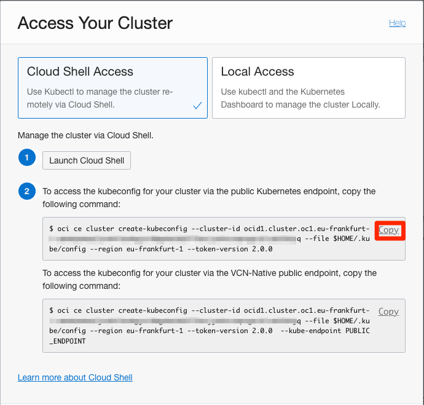
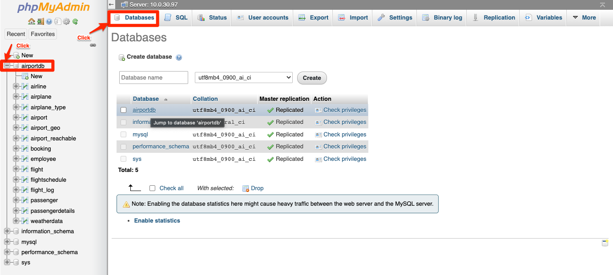

# Manage MySQL with phpMyAdmin

## Introduction

In this lab, we will deploy an open source MySQL management tool, PhpMyAdmin (https://www.phpmyadmin.net/) to OKE to manage MySQL

Estimated Time: 15 minutes

### Objectives

In this lab, you will:

* Create a kubernetes namespace for PhpMyAdmin
* Deploy PhpMyAdmin to OKE
* Manage MySQL using PhpMyAdmin

### Prerequisites (Optional)

* You have an Oracle account
* You have enough privileges to use OCI
* You have one Compute instance having <a href="https://dev.mysql.com/doc/mysql-shell/8.0/en/mysql-shell-install.html" target="\_blank">**MySQL Shell**</a> installed on it
* All previous labs successfully completed

## Task 1: Access OKE cluster 

1. Log in to **OCI** and select **Developer Services**, and **Kubernetes Clusters (OKE)** to access to your OKE cluster created


2. Click on the **oke-cluster**


3. Click on the **Access Cluster** 


4. Click on the **Access Cluster** to look for the kubectl script to access the cluster


5. Copy the kubectl script



6. On OCI Console, clik on the cloud shell to launch cloud shell


## Task 2: Deploy PhpMyAdmin to OKE

1. Download the PhpMyAdmin yaml files from

```
<copy>
wget 
</copy>
```

2. Unzip the yaml files

```
<copy>
unzip 
cd 
</copy>
```

3. Execute the kubectl commands to create a namespace

```
<copy>
kubectl create namespace phpmyadmin
</copy>
```

4. Deploy PhpMyAdmin 

```
<copy>
kubectl apply -f phpmyadmin.yaml -n phpmyadmin
</copy>
```
```
<copy>
kubectl apply -f ingress.yaml -n phpmyadmin
</copy>
```
```
<copy>
kubectl apply -f service.yaml -n phpmyadmin
</copy>
```

5. Find out the public IP of OKE Ingress Controller

```
<copy>
kubectl get all -n ingress-nginx
</copy>
```


6. Access the deployed PhpMyAdmin application




You may now **proceed to the next lab.**

## Acknowledgements
* **Author** 
			 - Ivan Ma, MySQL Solutions Engineer, MySQL JAPAC, Ryan Kuan, MySQL Cloud Engineer, MySQL APAC
* **Contributors** 
* **Last Updated By/Date** - Ryan Kuan, March 2021