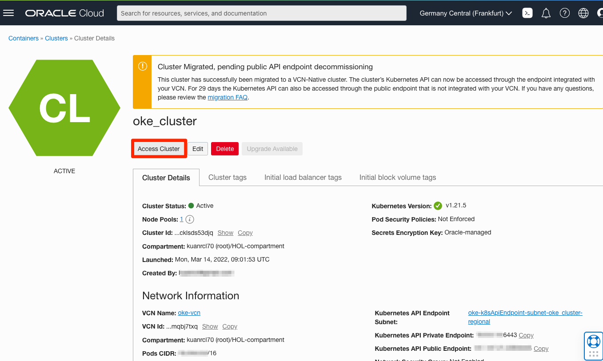
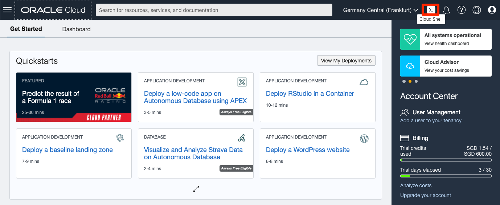

# Manage MySQL with phpMyAdmin

## Introduction

In this lab, we will deploy an open source MySQL management tool, PhpMyAdmin (https://www.phpmyadmin.net/) to OKE to manage MySQL

Estimated Time: 15 minutes

### Objectives

In this lab, you will:

* Create a kubernetes namespace for PhpMyAdmin
* Deploy PhpMyAdmin to OKE
* Manage MySQL using PhpMyAdmin

### Prerequisites (Optional)

* You have an Oracle account
* You have enough privileges to use OCI
* You have one Compute instance having <a href="https://dev.mysql.com/doc/mysql-shell/8.0/en/mysql-shell-install.html" target="\_blank">**MySQL Shell**</a> installed on it
* All previous labs successfully completed

## Task 1: Access OKE cluster 

1. Log in to **OCI** and select **Developer Services**, and **Kubernetes Clusters (OKE)** to access to your OKE cluster created

    

2. Click on the **oke-cluster**

    

3. Click on the **Access Cluster** 

    

4. Click on the **Access Cluster** to look for the kubectl script to access the cluster
    
    

5. Copy the kubectl script

    

6. On OCI Console, clik on the cloud shell to launch cloud shell

    

## Task 2: Deploy PhpMyAdmin to OKE

1. Create the phpmyadmin yaml deployment script

```
<copy>
cat <<EOF >> phpmyadmin.yaml
apiVersion: v1
kind: Pod
metadata:
  name: phpmyadmin
  labels:
    app: phpmyadmin
spec:
  containers:
    - name: phpmyadmin
      image: phpmyadmin/phpmyadmin
      env:
        - name: PMA_HOST
          value: "MYSQL_HOST"
        - name: PMA_PORT
          value: "3306"
      ports:
        - containerPort: 80
          name: phpmyadmin
---
apiVersion: v1
kind: Service
metadata:
  labels:
    app: phpmyadmin-svc
  name: phpmyadmin-svc
spec:
  ports:
  - port: 80
    targetPort: 80
  selector:
    app: phpmyadmin
EOF
</copy>
```

2. Specify your MySQL private IP address in the yaml file, replace **MYSQL_IP_ADDRESS** with your MySQL Private IP Address. For example, if your MySQL Private IP address is 10.0.30.11, then the sed command will be "sed -i -e 's/MYSQL_HOST/10.0.30.11/g' phpmyadmin.yaml"

```
<copy>
sed -i -e 's/MYSQL_HOST/<MYSQL_IP_ADDRESS>/g' phpmyadmin.yaml 
</copy>
```

3. Create a phpmyadmin namespace in oke

```
<copy>
kubectl create ns phpmyadmin
</copy>
```

4. Create the phpmyadmin service

```
<copy>
kubectl apply -f phpmyadmin.yaml -n phpmyadmin
</copy>
```

5. Create the phpmyadmin ingress service

```
<copy>
cat <<EOF | kubectl apply -n phpmyadmin -f -
apiVersion: networking.k8s.io/v1
kind: Ingress
metadata:
  name: phpmyadmin-ing
  annotations:
    nginx.ingress.kubernetes.io/rewrite-target: /$2
    nginx.ingress.kubernetes.io/app-root: /phpmyadmin/
    nginx.ingress.kubernetes.io/configuration-snippet: |
      rewrite ^/themes/(.*)$ /phpmyadmin/themes/$1 redirect;
      rewrite ^/index.php(.*)$ /phpmyadmin/index.php$1 redirect;
      rewrite ^/config/(.*)$ /phpmyadmin/config/$1 redirect;
spec:
  ingressClassName: nginx
  rules:
  - http:
      paths:
        - path: /phpmyadmin(/|$)(.*)
          pathType: Prefix
          backend:
            service:
              name: phpmyadmin-svc
              port:
                number: 80
        - path: /index.php(.*)
          pathType: Prefix
          backend:
            service:
              name: phpmyadmin-svc
              port:
                number: 80
EOF
</copy>
```

6. Find out the public IP of OKE Ingress Controller

```
<copy>
kubectl get all -n ingress-nginx
</copy>
```


7. Access the deployed PhpMyAdmin application using your browser, http:://<LOAD_BALANCER_PUBLIC_IP>/phpmyadmin

    


You may now **proceed to the next lab.**

## Acknowledgements
* **Author** 
			 - Ivan Ma, MySQL Solutions Engineer, MySQL JAPAC, Ryan Kuan, MySQL Cloud Engineer, MySQL APAC
* **Contributors** 
* **Last Updated By/Date** - Ryan Kuan, March 2021