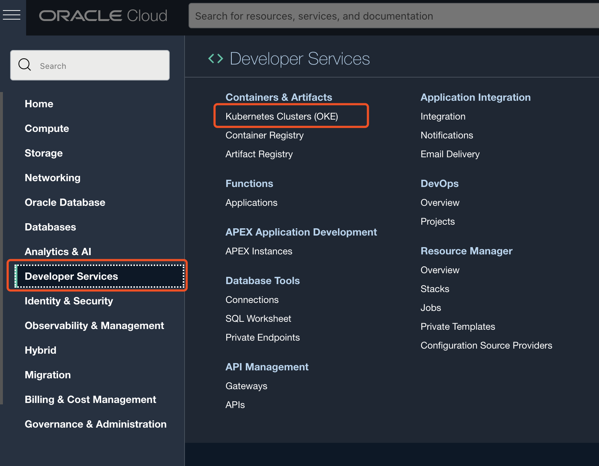
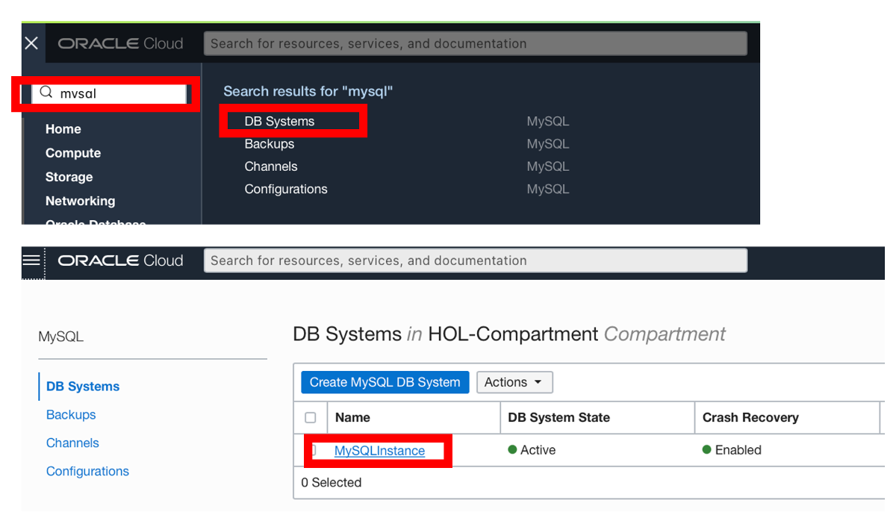
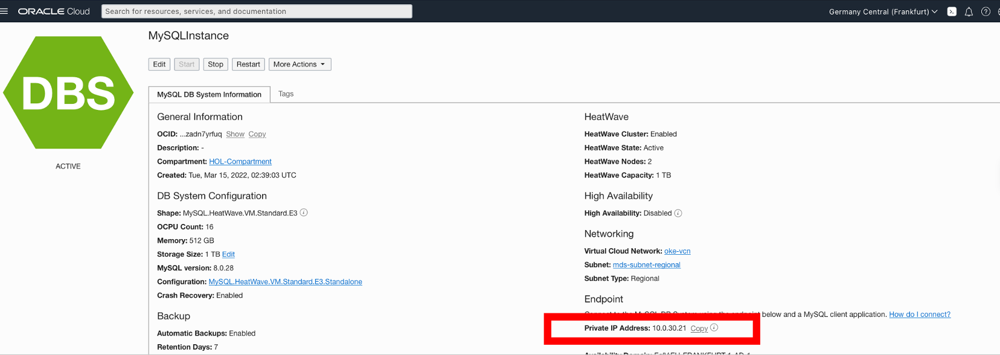
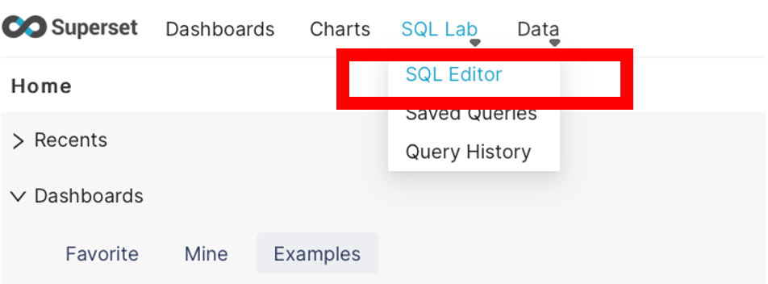
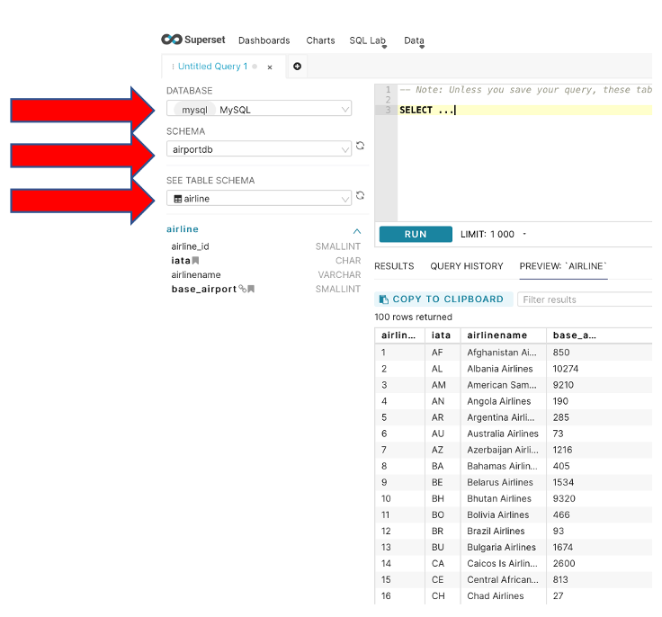

# Deploy Superset Dashboard for MySQL to OCI Kubernetes
## Introduction

**Oracle Container Engine for Kubernetes (OKE)** is an Oracle-managed container orchestration service that can reduce the time and cost to build modern cloud native applications. Unlike most other vendors, Oracle Cloud Infrastructure provides Container Engine for Kubernetes as a free service that runs on higher-performance, lower-cost compute shapes. 

In this lab, you will deploy a Superset package using Helm to **OKE**, and connect it to **MySQL**.

Estimated Time: 15 minutes

### Objectives

In this lab, you will:
* Install helm cli client and superset repo for k8s package installation
* Deploy a superset package to the OKE cluster using helm cli client
* Define MySQL Database in Superset
* Test MySQL Database connection with SQL Editor in Superset
* Create a simple Dashboard

### Prerequisites

This lab assumes you have:
* An Oracle account
* You have enough privileges to use OCI
* All previous labs successfully completed
* Resources Ready : HOL-compartment, OKE cluster, MySQL Database Service 


## Task 1: Verify OKE cluster

1. Click the **Navigation Menu** in the upper left, navigate to **Developer Services** and select **Kubernetes Cluster (OKE)**



2. Select the Compartment (e.g. HOL-Compartment) that you provisioned the OKE cluster, and verify that the status of OKE cluster 'oke_cluster' is Active


3. Click 'oke_cluster' to view the status of the OKE cluster and the worker nodes in your OKE cluster. You will deploy a PHP application to this OKE cluster soon.


## Task 2: Connect to **oke-operator** compute instance

1. Connect to the **oke-operator** compute instance again using OCI Cloud Shell

## Task 3: Deploy Application to OKE

1. Install helm cli client 'helm' to the operator VM and add superset repo.

```
curl -fsSL https://raw.githubusercontent.com/helm/helm/main/scripts/get-helm-3 |bash -
helm repo add superset https://apache.github.io/superset
```
  


2. Generate superset-custom-values.yaml (if neede, to update any specific variables) and Install superset package.
```
helm show values superset/superset > superset-custom-values.yaml

kubectl create ns superset

helm upgrade --install --values superset-custom-values.yaml superset superset/superset -n superset
```

3. Check deployment
```
helm list
kubectl get all -n superset
```


3. Disable firewalld in oke-operator COMPUTE VM (make sure you are on oke-operator)
```
sudo systemctl stop firewalld
sudo systemctl disable firewalld
```

4. Start port-forward to service/superset.  If the testing finishes, press **CTRL-C** to terminate port-forward service.

```
kubectl port-forward --address 0.0.0.0 8088:8088 service/superset -n superset
```

## Task 4 : Test Superset (note: using http://<public IP>:8088)
- Open a browser and put in the URL : http://<public IP of oke-operator VM>:8088
- login as admin / admin and click "Sign In"

- You will be landing on superset **HOME** page


## Task 5 : Adding MySQL Database Service Connection to Superset
### Identify the MySQL DB System IP Address
- Open New Browser page to OCI console
- On hamburger menu, type mysql and choose DB System.  
- Click on the link "MySQLInstance" to check the details

- Note down the IP Address for the DB System


### Add MySQL Database Connection to superset
- Select "Connect Database" from "Data" menu item on "+" icon

- Choose "MySQL" for Database connection

- Fill in the Content accordingly.   

- Click "Finish" on successful connection to the MySQL Database Service


### Testing SQL on SQL Editor from superset
- Choose **SQL Editor** from SQL Lab menu



- Select Database:"MySQL", Schema:"airportdb", Table Schema:"airline", the result is listed



