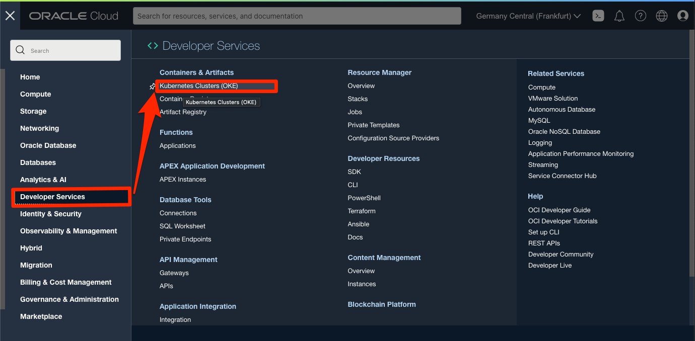
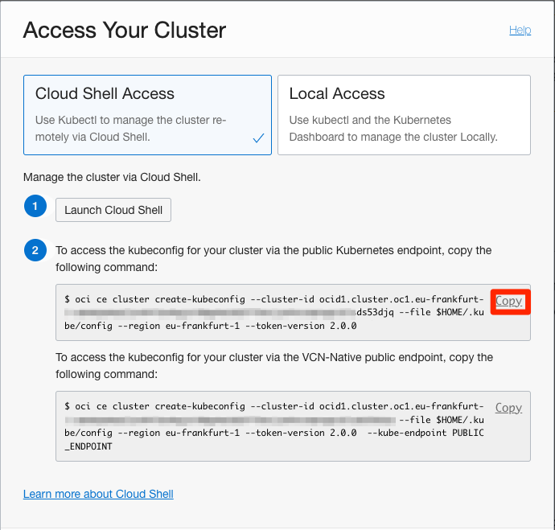
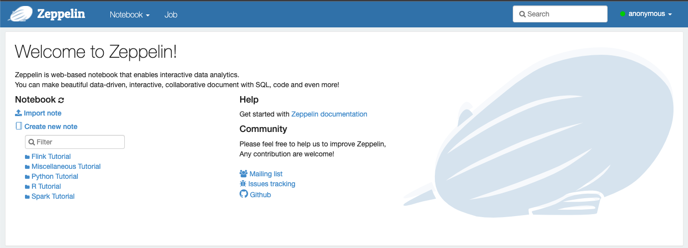
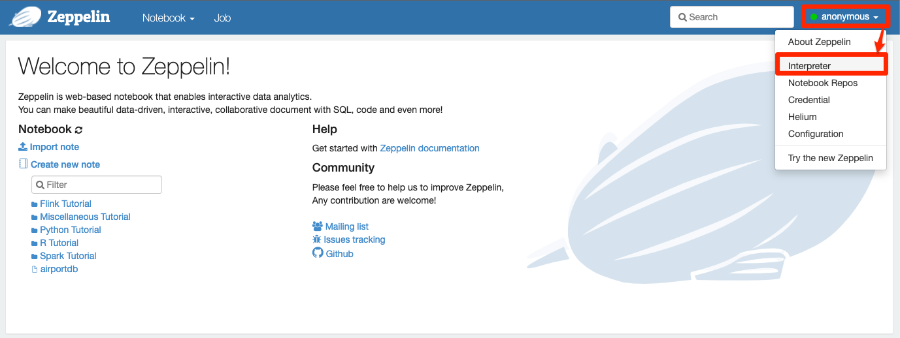
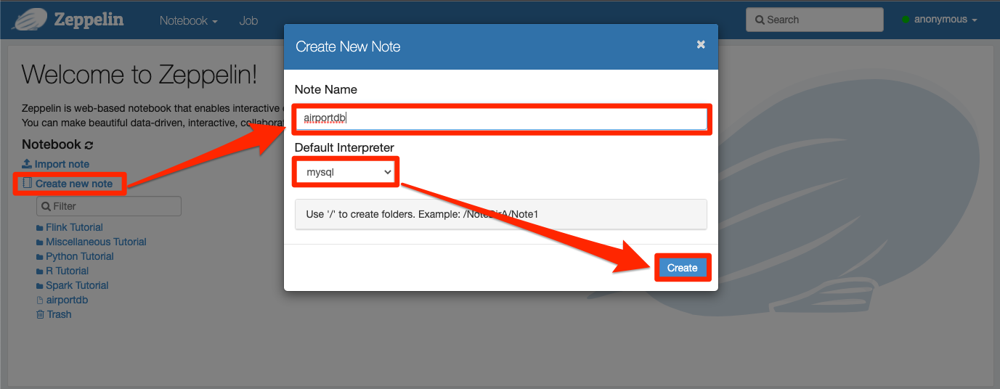

# Interactive analytics with MySQL HeatWave

## Introduction

In this lab, we will create a compartment for all the OCI resources required to host our PHP application as well as MySQL HeatWave cluster

Estimated Time: 2 minutes

### Objectives

In this lab, you will:

* Create a kubernetes namespace for Zeppelin
* Deploy Zeppelin to OKE
* Run interactive analytics using PhpMyAdmin on MySQL HeatWave

### Prerequisites (Optional)

* You have an Oracle account
* You have enough privileges to use OCI
* You have one Compute instance having <a href="https://dev.mysql.com/doc/mysql-shell/8.0/en/mysql-shell-install.html" target="\_blank">**MySQL Shell**</a> installed on it
* All previous labs successfully completed


## Task 1: Access OKE cluster 

1. Log in to **OCI** and select **Developer Services**, and **Kubernetes Clusters (OKE)** to access to your OKE cluster created



2. Click on the **oke-cluster**


3. Click on the **Access Cluster** 


4. Click on the **Access Cluster** to look for the kubectl script to access the cluster


5. Copy the kubectl script



6. On OCI Console, clik on the cloud shell to launch cloud shell


## Task 2: Deploy Zeppelin to OKE

1. Download the PhpMyAdmin yaml files from

```
<copy>
wget 
</copy>
```

2. Unzip the yaml files

```
<copy>
unzip 
cd 
</copy>
```

3. Execute the kubectl commands to create a namespace

```
<copy>
kubectl create namespace zeppelin
</copy>
```

4. Deploy Zeppelin

```
<copy>
kubectl apply -f zeppelin-server.yaml -n zeppelin
</copy>
```
```
<copy>
kubectl apply -f ingress.yaml -n zeppelin
</copy>
```
```
<copy>
kubectl apply -f service.yaml -n zeppelin
</copy>
```

5. Find out the public IP of OKE Ingress Controller

```
<copy>
kubectl get all -n ingress-nginx
</copy>
```


6. Access the deployed Zeppelin application



Task 3: Connect to MySQL HeatWave

1. Create a JDBC interpreter for MySQL HeatWave in Zeppelin. 



2. Click on **Create** to create a new JDBC driver for MySQL HeatWave. Fill up the details as indicated in the diagram
Replace the private ip address of your MySQL instance in the **JDBC URL**


3. Scroll to the bottom of the page and specify the MySQL JDBC driver


4. Create a new notebook to start connecting to MySQL HeatWave. Specify the name of the notebook, for example, **airportdb**, and select **mysql** as the JDBC interpreter, click on **Create**



5. You can now start working with MySQL HeatWave!


You may now **proceed to the next lab.**

## Acknowledgements
* **Author** 
			 - Ivan Ma, MySQL Solutions Engineer, MySQL JAPAC, Ryan Kuan, MySQL Cloud Engineer, MySQL APAC
* **Contributors** 
			 - Perside Foster, MySQL Solution Engineering 
* **Last Updated By/Date** - Ryan Kuan, March 2021