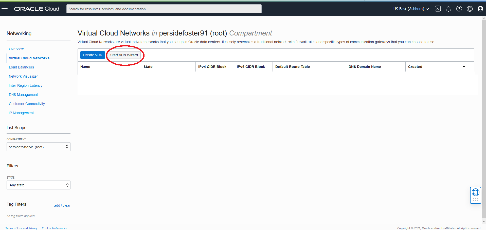
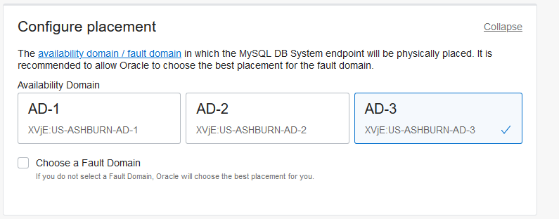
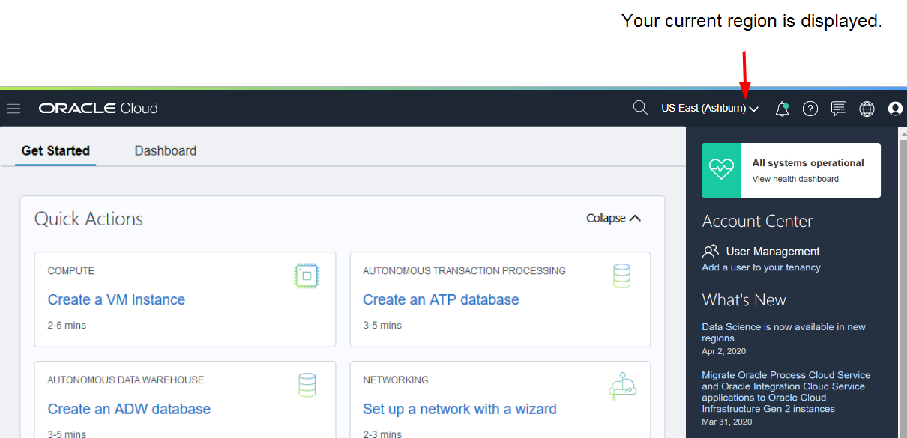
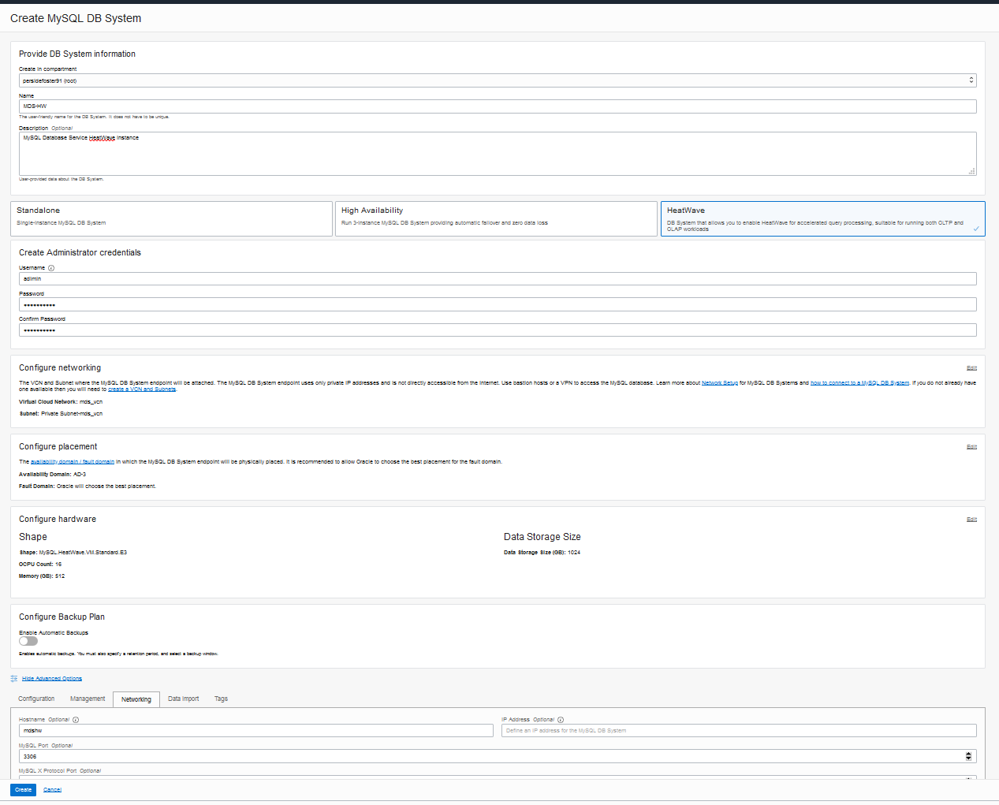
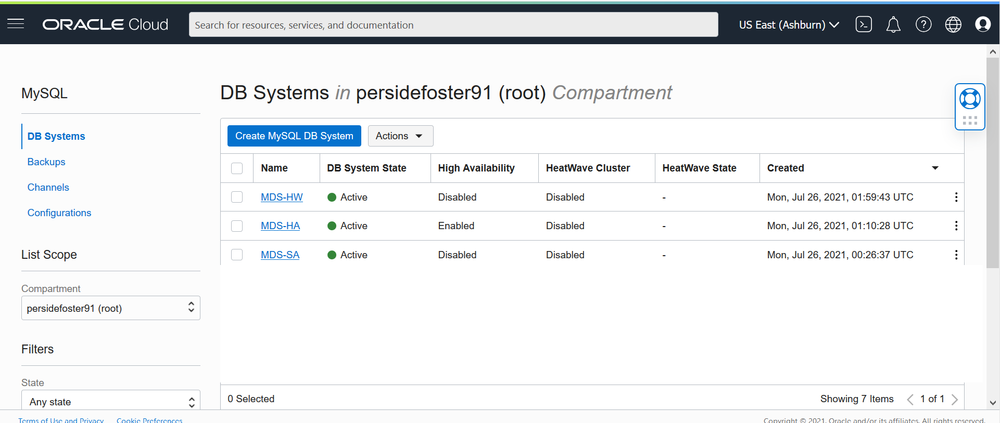
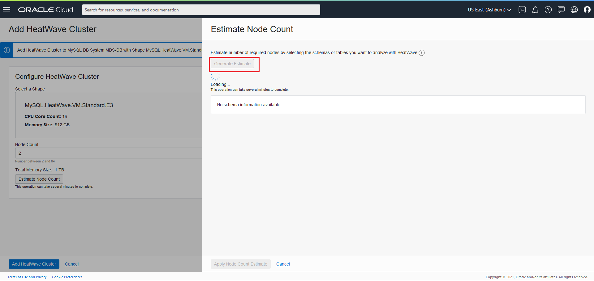
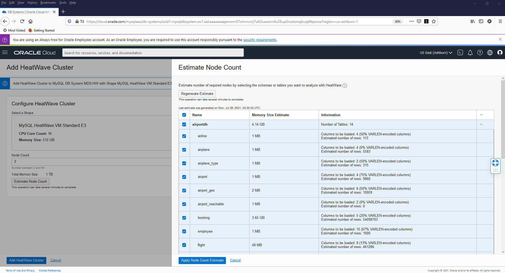

# CREATE MYSQL DATABASE SYSTEM AND HEATWAVE CLUSTER
 


## Introduction

In this lab, you will create and configure a MySQL DB System. The creation process will use a provided object storage link to create the airportdb schema and load data into the DB system.  Finally you will add a HeatWave Cluster comprise of two or more HeatWave nodes.  

Estimated Lab Time: 20 minutes

Watch the video below for a quick walk through of the lab.

[](youtube:pqjN8UpoGnj8)

### Objectives

In this lab, you will be guided through the following tasks:


- Create Virtual Cloud Network 
- Create MySQL Database for HeatWave (DB System) instance with sample data (airportdb)
- Add a HeatWave Cluster to MySQL Database System

### Prerequisites

- An Oracle Trial or Paid Cloud Account
- Some Experience with MySQL Shell


## Task 1: Create Virtual Cloud Network 

1. Navigation Menu   
        Networking  
            Virtual Cloud Networks
    

2. 'click' **Start VCN Wizard**
    

3. Select 'Create VCN with Internet Connectivity'

    'click' 'Start VCN Wizard' 
    

4. Create a VCN with Internet Connectivity 

    On Basic Information, complete the following fields:

 VCN Name: 
     ```
    <copy>MDS-VCN</copy>
    ```
 Compartment: Select  **(root)**

 Your screen should look similar to the following
    

5. Click 'Next' at the bottom of the screen 

6. Review Oracle Virtual Cloud Network (VCN), Subnets, and Gateways
         
    Click 'Create' to create the VCN
    

7. The Virtual Cloud Network creation is completing 
    
    
8. Click 'View Virtual Cloud Network' to display the created VCN
    

9. On MDS-VCN page under 'Subnets in (root) Compartment', 'click'  '**Private Subnet-MDS-VCN**' 
     

10.	On Private Subnet-MDS-VCN page under 'Security Lists',  'click'  '**Security List for Private Subnet-MDS-VCN**'
    

11.	On Security List for Private Subnet-MDS-VCN page under 'Ingress Rules', 'click' '**Add Ingress Rules**' 
    

12.	On Add Ingress Rules page under Ingress Rule 1
 
 Add an Ingress Rule with Source CIDR 
    ```
    <copy>0.0.0.0/0</copy>
    ```
 Destination Port Range 
     ```
    <copy>3306,33060</copy>
     ```
Description 
     ```
    <copy>MySQL Port Access</copy>
     ```
 Click 'Add Ingress Rule'
    

13.	On Security List for Private Subnet-MDS-VCN page, the new Ingress Rules will be shown under the Ingress Rules List
    

## Task 2: Create MySQL Database for HeatWave (DB System) instance with sample data (airportdb)

1. Go to Navigation Menu 
         Databases 
         MySQL
         DB Systems
    

2. Click 'Create MySQL DB System'
    

3. Create MySQL DB System dialog complete the fields in each section

    - Provide basic information for the DB System
    - Setup your required DB System
    - Create Administrator credentials
    - Configure Networking
    - Configure placement
    - Configure hardware
    - Exclude Backups
    - Advanced Options - Data Import
   
4. Provide basic information for the DB System:

 Select Compartment **(root)**

 Enter Name
     ```
    <copy>MDS-HW</copy>
    ```
 Enter Description 
    ```
    <copy>MySQL Database Service HeatWave instance</copy>
    ```
 
 Select **HeatWave** to specify a HeatWave DB System
    

5. Create Administrator Credentials

 Enter Username
    ```
    <copy>admin</copy>
    ```
    
 Enter Password
    ```
    <copy>Welcome#12345</copy>
    ```   
 Confirm Password
    ```
    <copy>Welcome#12345</copy>
    ```
    

6. On Configure networking, keep the default values

    Virtual Cloud Network: **MDS-VCN**
    
    Subnet: **Private Subnet-MDS-VCN (Regional)**

    

7. On Configure placement under 'Availability Domain'
   
    Select AD-3

    Do not check 'Choose a Fault Domain' for this DB System. 

    

8. On Configure hardware, keep default shape as **MySQL.HeatWave.VM.Standard.E3**

    Data Storage Size (GB) Set value to:  **100**
    
    ```
    <copy>100</copy>
    ``` 
    

9. On Configure Backups, disable 'Enable Automatic Backup'

    

10. 'click' on Show Advanced Options 


11. Select Data Import tab. 

12. Use the Image below identify your OCI Region. 

    

13. Click on your localized geographic area

    ## North America (NA)  
    **Tenancy Regions** Please select the same region that you are creating MDS in  

    <details>
    <summary>US East (Ashburn) Region - Copy and paste to PAR Source URL</summary>
    <br>
    ```
    <copy> 
    https://objectstorage.us-ashburn-1.oraclecloud.com/p/xZUH4AmYNqBa-C0o3q6hKB2ogXUzpJkBSi-IVhySxWiKHBrEHOwI9E_Lyq0rQgCE/n/idazzjlcjqzj/b/airportdb-bucket/o/airportdb/@.manifest.json 
    </copy>
    ```
    </details>

    <details>
    <summary>US West (Phoenix) Region - Copy and paste to PAR Source URL</summary>
    <br>
    ```
    <copy> 
    https://objectstorage.us-phoenix-1.oraclecloud.com/p/YStBr3efR5DEU6vJDkGMZ8f9NK-vawTf114iPirD7i3LW0_BC9mRpidzs2qTLVBB/n/idazzjlcjqzj/b/airportdb-bucket/o/airportdb/@.manifest.json
    </copy>
    ```
    </details>

    <details>
    <summary>US West (San Jose) Region - Copy and paste to PAR Source URL</summary>
    <br>
    ```
    <copy> 
    https://objectstorage.us-sanjose-1.oraclecloud.com/p/EXwPhz0h6gBUlu8gSiA9O97BB9JUoTECraqxAKGyueF1dYeW_fL2goa_d2rfeZMn/n/idazzjlcjqzj/b/airportdb-bucket/o/airportdb/@.manifest.json
    </copy>
    ```
    </details>
 
    <details>
    <summary>Canada Southeast (Montreal) Region - Copy and paste to PAR Source URL</summary>
    <br>
    ```
    <copy> 
    https://objectstorage.ca-montreal-1.oraclecloud.com/p/8TzdLjwdzm8xmvTG6nTokE1yNE4dkE2IRq2aVmvjT4IC10f7PIeryyQyC4ROpr0X/n/idazzjlcjqzj/b/airportdb-bucket/o/airportdb/@.manifest.json
    </copy>
    ```
    </details>
   
    <details>
    <summary>Canada Southeast (Toronto) Region - Copy and paste to PAR Source URL</summary>
    <br>
    ```
    <copy> 
    https://objectstorage.ca-toronto-1.oraclecloud.com/p/mnDsSyuKkSEtHn6jU44zqViMKBTUySyTpoTLdSZGZf-UO7fqKEX7uqr_z2R_mxGO/n/idazzjlcjqzj/b/airportdb-bucket/o/airportdb/@.manifest.json
    </copy>
    ```
    </details>

    ## Latin America (LAD)
    **Tenancy Regions** Please select the same region that you are creating MDS in 
    <details>
    <summary>Brazil East (Sao Paulo) Region - Copy and paste to PAR Source URL</summary>
    <br>
    ```
    <copy> 
    https://objectstorage.sa-saopaulo-1.oraclecloud.com/p/02z9LbgxbzO0L7RQvUpp51ol85tgnfJd1uSM3xGZ4CYjX9UAX2WR4ES9PH0zG-zr/n/idazzjlcjqzj/b/airportdb-bucket/o/airportdb/@.manifest.json
    </copy>
    ```
    </details>
    
    <details>
    <summary>Chile (Santiago) Region - Copy and paste to PAR Source URL</summary>
    <br>
    ```
    <copy> 
    https://objectstorage.sa-santiago-1.oraclecloud.com/p/gnhSojOHKIDtg2cO-lZSEv0yYCIksDbnqylfOxVb0-X1H4MwNatOyOtzXYD3Si0N/n/idazzjlcjqzj/b/airportdb-bucket/o/airportdb/@.manifest.json

    </copy>
    ```
    </details>
        
    <details>
    <summary>Brazil Southeast (Vinhedo) Region - Copy and paste to PAR Source URL</summary>
    <br>
    ```
    <copy> 
    https://objectstorage.sa-vinhedo-1.oraclecloud.com/p/D5_AuuxEKdqsJpeieZNCgmUtpkvOKOU5_2gMnJHtDbbJekz1dag6dBElSmW3nQ0Y/n/idazzjlcjqzj/b/airportdb-bucket/o/airportdb/@.manifest.json
    </copy>
    ```
    </details>
    ## Europe, Middle East and Africa (EMEA)
    **Tenancy Regions** Please select the same region that you are creating MDS in 

    <details>
    <summary>UK South(London) Region - Copy and paste to PAR Source URL</summary>
    <br>
    ```
    <copy> 
    https://objectstorage.uk-london-1.oraclecloud.com/p/-y7ZikQ0A7iRE1PFU3Fijt7oayomVEvUx6W4os4EVhCsru56hKlSWsNyy1Y-iYFg/n/idazzjlcjqzj/b/airportdb-bucket/o/airportdb/@.manifest.json
    </copy>
    ```
    </details>

    <details>
    <summary>Germany Central (Frankfurt) Region - Copy and paste to PAR Source URL</summary>
    <br>
    ```
    <copy> 
    https://objectstorage.eu-frankfurt-1.oraclecloud.com/p/5CiMznUnIfiUducb8J2GSB7BrsbMQA4tA27qfOoLHFgxtgi6RIBCHcP6U3hlsYpK/n/idazzjlcjqzj/b/airportdb-bucket/o/airportdb/@.manifest.json
    </copy>
    ```
    </details>

    <details>
    <summary>Switzerland North(Zurich) Region - Copy and paste to PAR Source URL</summary>
    <br>
    ```
    <copy> 
    https://objectstorage.eu-zurich-1.oraclecloud.com/p/YBRZfD1n2iAcuqvqnwRvQuozrcjvxiRl0Rvp95UnCWLg74JDzdFvP1kuCaZYF5qi/n/idazzjlcjqzj/b/airportdb-bucket/o/airportdb/@.manifest.json
    </copy>
    ```
    </details>

    <details>
    <summary>Netherlands Northwest(Amsterdam) Region - Copy and paste to PAR Source URL</summary>
    <br>
    ```
    <copy> 
    https://objectstorage.eu-amsterdam-1.oraclecloud.com/p/xr8B6l2kTzIu5OyryaSkiJo_1QU4QnH4AD_sx6PF_b21DmZBdoLwLF7c10Ot9Koe/n/idazzjlcjqzj/b/airportdb-bucket/o/airportdb/@.manifest.json   
    </copy>
    ```
    </details>

    <details>
    <summary>Saudi Arabia West(Jeddah)  Region - Copy and paste to PAR Source URL</summary>
    <br>
    ```
    <copy> 
    https://objectstorage.me-jeddah-1.oraclecloud.com/p/8YbXOPZ0GyDFb69K4BkUv7690MqhTs8pqcE4zG5zOLNeSG3j_wZfIm7DcSQn5G0n/n/idazzjlcjqzj/b/airportdb-bucket/o/airportdb/@.manifest.json    
    </copy>
    ```
    </details>

    <details>
    <summary>UAE East(Dubai) Region - Copy and paste to PAR Source URL</summary>
    <br>
    ```
    <copy> 
    https://objectstorage.me-dubai-1.oraclecloud.com/p/0xrSzhhg0bvExr9BgK-VTFAlUwJD5TaY1VB0cDGlFswagCS44raI0cg9VCypHECR/n/idazzjlcjqzj/b/airportdb-bucket/o/airportdb/@.manifest.json
    </copy>
    ```
    </details>

    <details>
    <summary>Israel 1 (Jerusalem) Region - Copy and paste to PAR Source URL</summary>
    <br>
    ```
    <copy> 
    https://objectstorage.il-jerusalem-1.oraclecloud.com/p/Smo6bw6xGzG_TIIvIXqa657dNFVFnVb-pQ4pxhumdFsWvZCf1RAQV11eUKPqxNzm/n/idazzjlcjqzj/b/airportdb-bucket/o/airportdb/@.manifest.json 
    </copy>
    ```
    </details>

    ## Asia Pacific (APAC)
    **Tenancy Regions** Please select the same region that you are creating MDS in 

    <details>
    <summary>Japan East(Tokyo) Region - Copy and paste to PAR Source URL</summary>
    <br>
    ```
    <copy> 
    https://objectstorage.ap-tokyo-1.oraclecloud.com/p/ABVB5gPbYO35Ep2C64n6xw8xKIyx-8Zuw7t7n-GS6UrjGtT8l-PNU-Xpu_gAqtwx/n/idazzjlcjqzj/b/airportdb-bucket/o/airportdb/@.manifest.json  
    </copy>
    ```
    </details>
 
    <details>
    <summary> Japan Central (Osaka) Region - Copy and paste to PAR Source URL</summary>
    <br>
    ```
    <copy>
    https://objectstorage.ap-osaka-1.oraclecloud.com/p/P9L6IfzKl2AWeu8e5Ekc9YVdR9lnvBLPkSiXe5vs9QsUsHHnYI78eba7ib-iWLnc/n/idazzjlcjqzj/b/airportdb-bucket/o/airportdb/@.manifest.json
    </copy>
    ```
    </details>
   
    <details>
    <summary>South Korea Central(Seoul) Region - Copy and paste to PAR Source URL</summary>
    <br>
    ```
    <copy>
    https://objectstorage.ap-seoul-1.oraclecloud.com/p/cWMmcups3ZFFswzB4pknzotyEvRmCOcNft1AsJxBJlaEKajKdJIVfdMI70yVz6yD/n/idazzjlcjqzj/b/airportdb-bucket/o/airportdb/@.manifest.json
    </copy>
    ```
    </details>

  
    <details>
    <summary> South Korea North (Chuncheon) Region - Copy and paste to PAR Source URL</summary>
    <br>
    ```
    <copy>
    https://objectstorage.ap-chuncheon-1.oraclecloud.com/p/VfIzozmxePRBgnozS5cWyoo1U8IJOWMJKOWV9Vkfp-r3Pq8hJeuj9GCjNxmT5ZGo/n/idazzjlcjqzj/b/airportdb-bucket/o/airportdb/@.manifest.json
    </copy>
    ```
    </details>
  
    <details>
    <summary> Australia East (Sydney) Region - Copy and paste to PAR Source URL</summary>
    <br>
    ```
    <copy>
    https://objectstorage.ap-sydney-1.oraclecloud.com/p/wOHQ85I_g0Xm5efGO1jWfk8Jg9hKQAJ7MxWTW1Qec8wLdGrYxi78qPgcdcKr92JG/n/idazzjlcjqzj/b/airportdb-bucket/o/airportdb/@.manifest.json
    </copy>
    ```
    </details>

    <details>
    <summary> Australia Southeast (Melbourne) Region - Copy and paste to PAR Source URL</summary>
    <br>
    ```
    <copy>
    https://objectstorage.ap-melbourne-1.oraclecloud.com/p/xrusIEweK7vvSuzdj6d_Oqm04l14gI-JFyHG92UHqmt9V3lADczMuOV1PnvY-jXe/n/idazzjlcjqzj/b/airportdb-bucket/o/airportdb/@.manifest.json
    </copy>
    ```
    </details>
 
    <details>
    <summary> India West (Mumbai) Region - Copy and paste to PAR Source URL</summary>
    <br>
    ```
    <copy>
    https://objectstorage.ap-mumbai-1.oraclecloud.com/p/KxPwBh70ck0suWi8o0gmLP9vWwgnMznQKL7cilv-7T1zZsAXjY4Iun6p4lARU2vl/n/idazzjlcjqzj/b/airportdb-bucket/o/airportdb/@.manifest.json
    </copy>
    ```
    </details>


    <details>
    <summary> India South (Hyderabad) Region - Copy and paste to PAR Source URL</summary>
    <br>
    ```
    <copy>
    https://objectstorage.ap-hyderabad-1.oraclecloud.com/p/HicbLKYet2Ww47WmMvPhyrT7VUnj443tOj801k44ZqOoP3VZ0H06tfRRuUQim4xK/n/idazzjlcjqzj/b/airportdb-bucket/o/airportdb/@.manifest.json 
    </copy>
    ```
    </details>
 
14. Your PAR Source URL entry should look like this:
    

15. Review **Create MySQL DB System**  Screen 

    

    
    Click the '**Create**' button

16. The New MySQL DB System will be ready to use after a few minutes 

    The state will be shown as 'Creating' during the creation
    

17. The state 'Active' indicates that the DB System is ready for use 

    On MDS-HW Page, check the MySQL Endpoint (Private IP Address) 

    

## Task 3: Add a HeatWave Cluster to MDS-HW MySQL Database System

1. Open the navigation menu  
    Databases 
    MySQL
    DB Systems
2. Choose the root Compartment. A list of DB Systems is displayed. 
    
3. In the list of DB Systems, 'click' the **MDS-HW** system. 'click' **More Action ->  Add HeatWave Cluster**.
    
4. On the “Add HeatWave Cluster” dialog, select “MySQL.HeatWave.VM.Standard.E3” shape

5. Click “Estimate Node Count” button
    
6. On the “Estimate Node Count” page, click “Generate Estimate”. This will trigger the auto
provisioning advisor to sample the data stored in InnoDB and based on machine learning
algorithm, it will predict the number of nodes needed.
    

7. Once the estimations are calculated, it shows list of database schemas in MySQL node. If you expand the schema and select different tables, you will see the estimated memory required in the Summary box, There is a Load Command (heatwave_load) generated in the text box window, which will change based on the selection of databases/tables

8. Select the airportdb schema and click “Apply Node Count Estimate” to apply the node count
    

9. Click “Add HeatWave Cluster” to create the HeatWave cluster
    
10. HeatWave creation will take about 10 minutes. From the DB display page scroll down to the Resources section. 'click' the **HeatWave** link. Your completed HeatWave Cluster Information section will look like this:
    


You may now [proceed to the next lab](#next).

## Acknowledgements
* **Author** - Perside Foster, MySQL Solution Engineering 
* **Contributors** - Mandy Pang, MySQL Principal Product Manager,  Priscila Galvao, MySQL Solution Engineering, Nick Mader, MySQL Global Channel Enablement & Strategy Manager, Frédéric Descamps, MySQL Community Manager
* **Last Updated By/Date** - Perside Foster, MySQL Solution Engineering, September 2021
