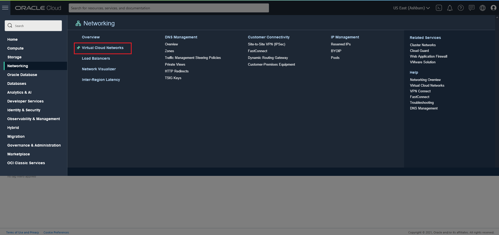
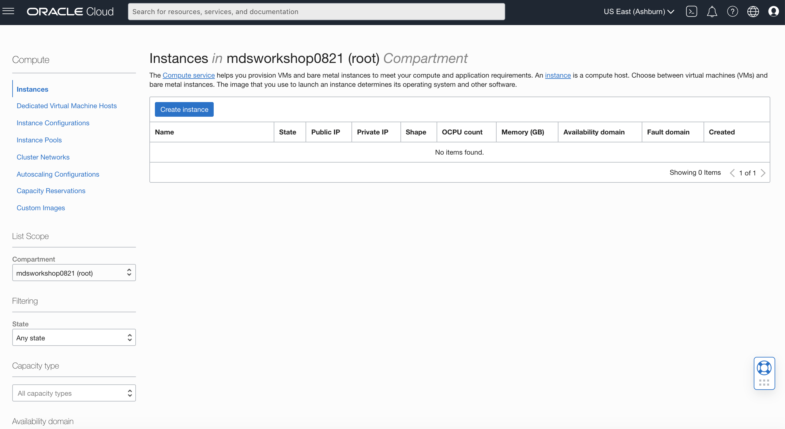
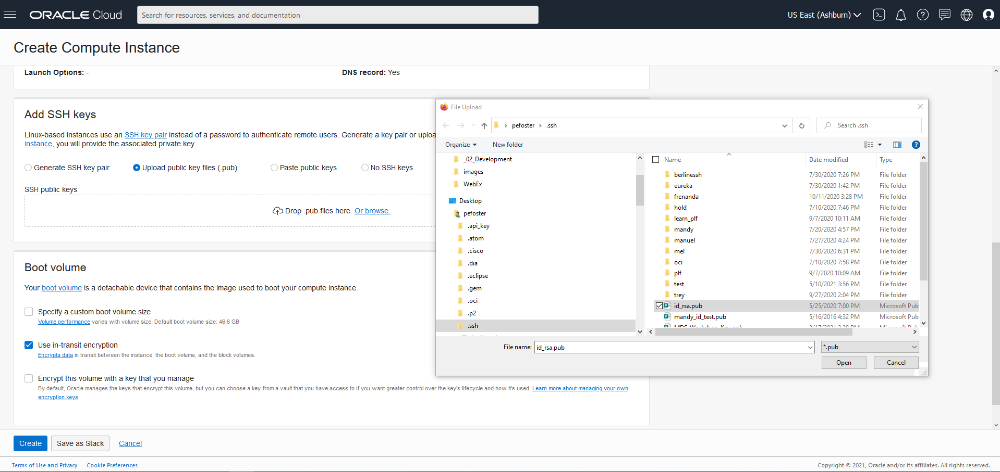
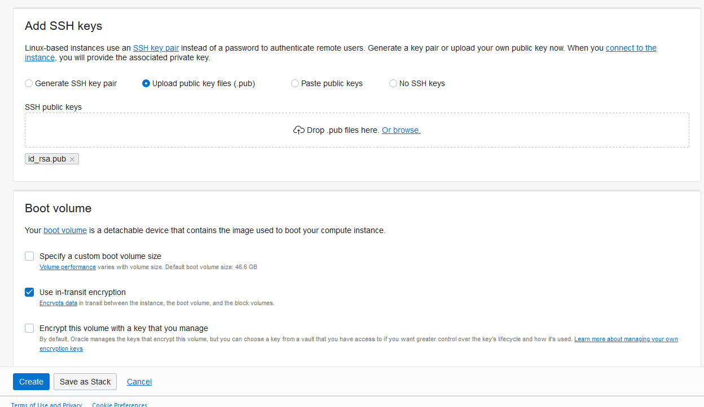
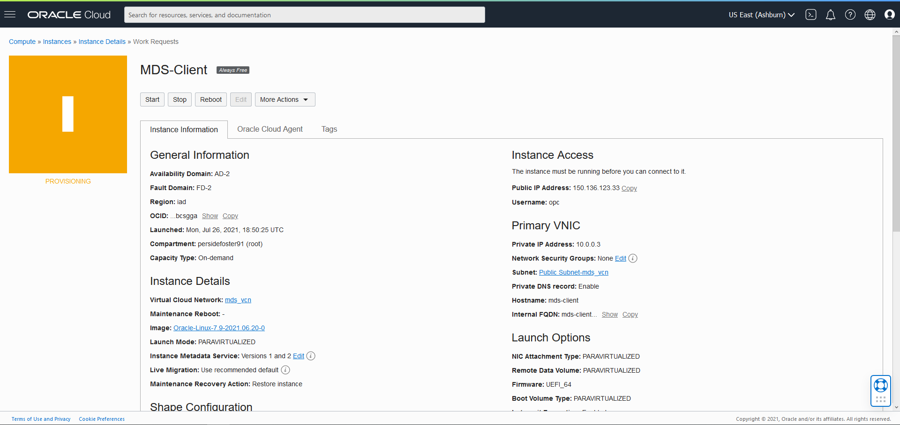
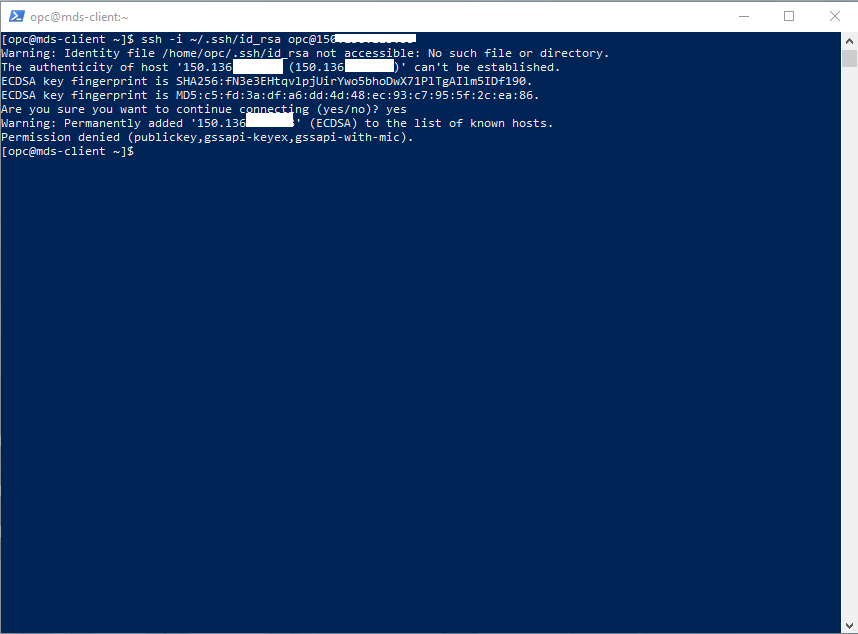
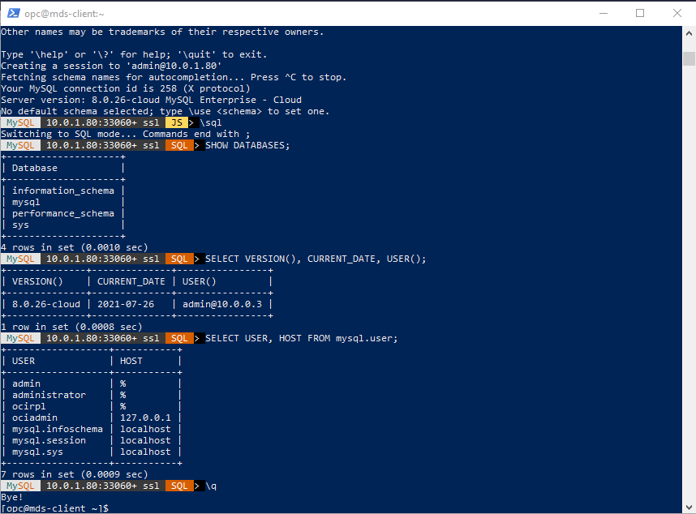
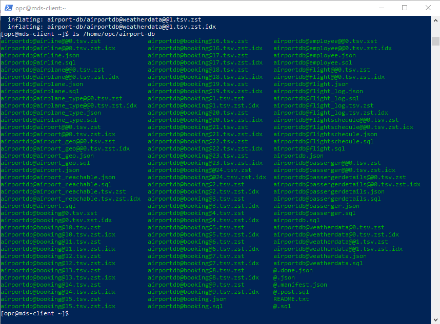
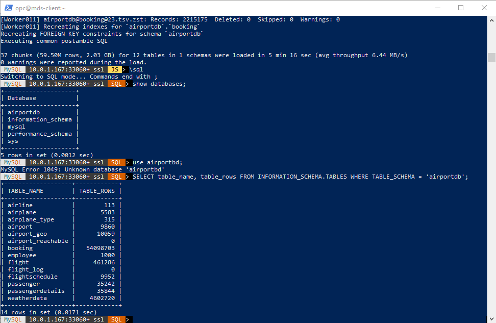

# Create and Connect to MySQL Database System
 


## Introduction

In this hands-on workshop, you will be introduced to MySQL Database Service (MDS), a powerful union between MySQL Enterprise Edition and Oracle Cloud Infrastructure. You will learn how to create and use MySQL Database Service with HeatWave in a secure Oracle Cloud Infrastructure environment.

Estimated Lab Time: 30 minutes


### Objectives

In this lab, you will be guided through the following tasks:

- Create and configure a Virtual Cloud Network (VCN) 
- Create the MySQL Database Service with HeatWave
- Create Client Linux Virtual Machine and install MySQL Shell
- Connect and use MySQL HeatWave
- Create Airportdb Database and Import Data into MySQL


### Prerequisites

- An Oracle Trial or Paid Cloud Account
- Some Experience with MySQL Shell
- Should have completed Lab 1

## Task 1: Create Virtual Cloud Network

1. Navigation Menu > Networking > Virtual Cloud Networks
    

2. Click 'Start VCN Wizard'
    

3. Select 'Create VCN with Internet Connectivity'

    Click on 'Start VCN Wizard' 
    

4. Create a VCN with Internet Connectivity 

    On Basic Information, complete the following fields:

 VCN Name: 
     ```
    <copy>MDS-VCN</copy>
    ```
 Compartment: Select  **(root)**

 Your screen should look similar to the following
    

5. Click 'Next' at the bottom of the screen 

6. Review Oracle Virtual Cloud Network (VCN), Subnets, and Gateways
         
    Click 'Create' to create the VCN
    

7. The Virtual Cloud Network creation is completing 
    
    
8. Click 'View Virtual Cloud Network' to display the created VCN
    

9. On MDS-VCN page under 'Subnets in (root) Compartment', click on '**Private Subnet-MDS-VCN**' 
     

10.	On Private Subnet-MDS-VCN page under 'Security Lists',  click on '**Security List for Private Subnet-MDS-VCN**'
    

11.	On Security List for Private Subnet-MDS-VCN page under 'Ingress Rules', click on '**Add Ingress Rules**' 
    

12.	On Add Ingress Rules page under Ingress Rule 1
 
 Add an Ingress Rule with Source CIDR 
    ```
    <copy>0.0.0.0/0</copy>
    ```
 Destination Port Range 
     ```
    <copy>3306,33060</copy>
     ```
Description 
     ```
    <copy>MySQL Port Access</copy>
     ```
 Click 'Add Ingress Rule'
    

13.	On Security List for Private Subnet-MDS-VCN page, the new Ingress Rules will be shown under the Ingress Rules List
    

## Task 2: Create a MySQL DB System - HeatWave.

1. Navigation Menu > Databases > MySQL > DB Systems
    

2. Click 'Create MySQL DB System'
    

3. Create MySQL DB System dialog complete the fields in each section

    - Provide basic information for the DB System
    - Setup your required DB System
    - Create Administrator credentials
    - Configure Networking
    - Configure placement
    - Configure hardware
    - Exlude Backups
   

4. Provide basic information for the DB System:

 Select Compartment **(root)**

 Enter Name
     ```
    <copy>MDS-HW</copy>
    ```
 Enter Description 
    ```
    <copy>MySQL Database Service HeatWave instance</copy>
    ```
 
 Select **HeatWave** to specify a HeatWave DB System
    

6. Create Administrator Credentials

 Enter Username
    ```
    <copy>admin</copy>
    ```
 Enter Password
    ```
    <copy>Welcome#12345</copy>
    ```   
 Confirm Password
    ```
    <copy>Welcome#12345</copy>
    ```
    

7. On Configure networking, keep the default values

    Virtual Cloud Network: **MDS-VCN**
    
    Subnet: **Private Subnet-MDS-VCN (Regional)**

    

8. On Configure placement under 'Availability Domain'
   
    Select AD-3

    Do not check 'Choose a Fault Domain' for this DB System. 

    

9. On Configure hardware, keep default shape as **MySQL.HeatWave.VM.Standard.E3**

    Data Storage Size (GB) Keep default value:  **1024**
    

19. On Configure Backups, disable 'Enable Automatic Backup'

20. Click on 'Show Advanced Options' 

    Select 'Networking' tab

    Enter Hostname 
       ```
    <copy>mdshw</copy>
    ```
    
    
    Click the '**Create**'
    

11. The New MySQL DB System will be ready to use after a few minutes 

    The state will be shown as 'Creating' during the creation
    

12. The state 'Active' indicates that the DB System is ready to use 

    On MDS-HW Page, check the MySQL Endpoint (Private IP Address) 

    


## Task 3: Create Client Virtual Machine

1. You will need a client machine to connect to your brand new MySQL database. To launch a Linux Compute instance, go to Navigation Menu > Compute > Instances
    

2. On Instances in **(root)** Compartment, click on 'Create Instance'
    

3. On Create Compute Instance 

 Enter Name
    ```
    <copy>MDS-Client</copy>
    ```   
4. Make sure **(root)** compartment is selected 

5. On Placement, keep the selected Availability Domain

6. On Image and Shape, keep the selected Image, Oracle Linux 7.9 

    And, keep the selected Instance Shape, VM.Standard.E2.1.Micro

        

7. On Networking, make sure '**MDS-VCN**' is selected

    'Assign a public IP address' should be set to Yes 
   
  

8. If you have not already created your SSH key, perform 'Lab 1: Create Local SSH Key'.  When you are done return to the next line (TASK 5: #9) .

9. On Add SSH keys, upload your own public key. 
  
    

10. Click '**Create**' to finish creating your Compute Instance. 

    

11. The New Virtual Machine will be ready to use after a few minutes. The state will be shown as 'Provisioning' during the creation
    

12.	The state 'Runing' indicates that the Virtual Machine is ready to use. 

    On the **MDS-Client** Instance page under 'Instance Access', **Copy and save the Public IP Address** 
    


## Task 4: Connect to MySQL Database - HeatWave

HeatWave is an add-on to MySQL Database Service. It provides a highly performant and scalable in-memory analytic processing engine optimized for Oracle Cloud Infrastructure. Customers can run HeatWave on data stored in the MySQL database without requiring ETL and without any change to the application. Applications simply access HeatWave via standard MySQL protocols, and the typical administration actions are automated, integrated and accessible via the OCI Web Console, REST API, CLI, or DevOps tools. HeatWave queries achieve orders of magnitude acceleration over the MySQL database.

1. Linux ad Mac users  use Terminal 

   Windows 10 users use Powershell


2.  From a terminal or powershell window on your local system. Connect to the Compute Instance with the SSH command. 

    Indicate the location of the private key you created earlier with **MDS-Client**. 
    
    Enter the username **opc** and the Public **IP Address**.

    Note: The **MDS-Client**  shows the  Public IP Address as mentioned on TASK 5: #11
    
    (Example: **ssh -i ~/.ssh/id_rsa opc@132.145.170...**) 


    ```
    <copy>ssh -i ~/.ssh/id_rsa opc@<your_compute_instance_ip></copy>
    ```


    

    **Install MySQL Shell on the Compute Instance**

3. You will need a MySQL client tool to connect to your new MySQL DB System from your client machine.

    Install MySQL Shell with the following command (enter y for each question)

    **[opc@…]$**

     ```
    <copy>sudo yum install –y mysql-shell</copy>
    ```
    

   **Connect to MySQL Database Service**

4. From your Compute instance, connect to MDS-HW MySQL using the MySQL Shell client tool. 
   
   The endpoint (IP Address) can be found in the MDS-HW MySQL DB System Details page, under the "Endpoint" "Private IP Address". 

    

5.  Use the following command to connect to MySQL using the MySQL Shell client tool. Be sure to add the MDS-HW private IP address at the end of the cammand. Also enter the admin user password

    (Example  **mysqlsh -uadmin -p -h10.0.1..**)

 **[opc@...]$**

    ```
    <copy>mysqlsh -uadmin -p -h 10.0.1....</copy>
    ```
    

6. On MySQL Shell, switch to SQL mode  to try out some SQL commands 

 Enter the following command at the prompt:
     ```
    <copy>\SQL</copy>
    ```
 To display a list of databases, Enter the following command at the prompt:
      ```
    <copy>SHOW DATABASES;</copy>
    ```  
     
 To display the database version, current_date, and user enter the following command at the prompt:
      ```
    <copy>SELECT VERSION(), CURRENT_DATE, USER();</copy>
    ```  
 To display MysQL user and host from user table enter the following command at the prompt:
       ```
    <copy>SELECT USER, HOST FROM mysql.user;</copy>
      ```
 Type the following command to exit MySQL:
      ```
    <copy>\q</copy>
    ```   

  **Final Sceen Shot**
    

## Task 5: Create airportdb schema and load data using MySQL Shell

1. If you are not already connected to MDS-Client then do so now

    ```
    <copy>ssh -i ~/.ssh/id_rsa opc@<your_compute_instance_ip></copy>
    ```
2. Download the airportdb sample database and unpack it. (6 minutes)

    ```
    <copy>wget https://downloads.mysql.com/docs/airport-db.zip</copy>
    ```

    ```
    <copy>unzip airport-db.zip</copy>
    ```
3. List the  airport-db directory to view the unxipped data files

    ```
    <copy>ls /home/opc/airport-db</copy>
    ```
    

4. Start MySQL Shell and connect to the MDS-HW

    ```
    <copy>mysqlsh -uadmin -p -h 10.0.1....</copy>
    ```
5. Load the airportdb database into into MDS-HW using the  MySQL Shell Dump Loading Utility (6 minutes)   

    ```
    <copy>util.loadDump("airport-db", {threads: 16, deferTableIndexes: "all", ignoreVersion: true})</copy>
    ```
6. Display the count of all records per table in airportdb 

    ```
    <copy>\sql</copy>
    ```

    ```
    <copy>SELECT table_name, table_rows FROM INFORMATION_SCHEMA.TABLES WHERE TABLE_SCHEMA = 'airportdb';</copy>
    ```
    

7.	Exit MySQL Shell

    ```
    <copy>\q</copy>
    ```


## Acknowledgements
* **Author** - Perside Foster, MySQL Solution Engineering 
* **Contributors** - Mandy Pang, MySQL Principal Product Manager,  Priscila Galvao, MySQL Solution Engineering, Nick Mader, MySQL Global Channel Enablement & Strategy Manager
* **Last Updated By/Date** - Perside Foster, MySQL Solution Engineering, September 2021
