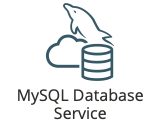
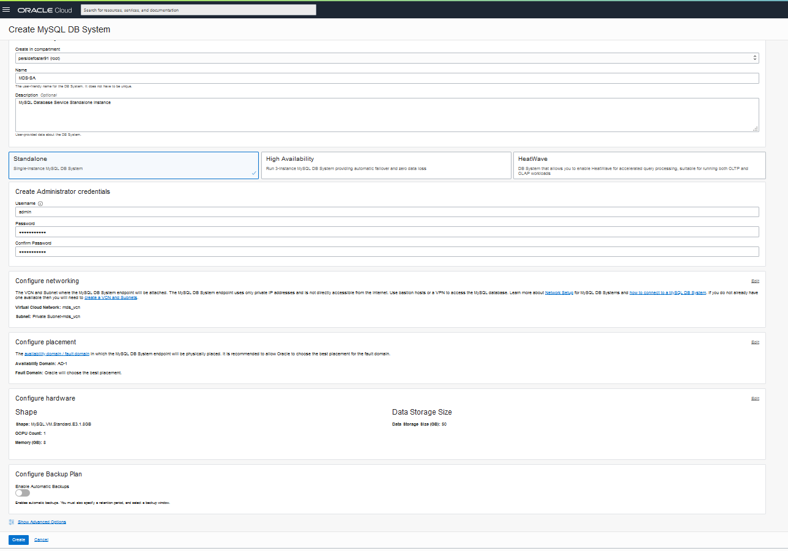

# Create and Configure Oracle MySQL Database Service
  

## Introduction

**Create your Oracle MySQL Database Service**

Set up a Standalone MySQL Database service instance: With the Standalone option, users get a single-instance MDS back-ended by resilient and secure Oracle Cloud Infrastructure Block Volumes. 

_Estimated Time:_ 10 minutes
 

### Objectives

In this lab, you will be guided through the following tasks:

- Create and configure a Standalone MySQL Database System 


### Prerequisites

* An Oracle Free Tier or Paid Cloud Account
* A web browser
* Should have completed Lab1


## Task 1: Create Standalone MySQL Database Service instance 

1. Go to Navigation Menu 
         Databases 
         MySQL
         DB Systems
    

2. Click 'Create MySQL DB System'
    

3. Create MySQL DB System dialog complete the fields in each section

    - Provide basic information for the DB System
    - Setup your required DB System
    - Create Administrator credentials
    - Configure Networking
    - Configure placement
    - Configure hardware
    - Enable Backup
   
4. Provide basic information for the DB System:

 Select Compartment **(root)**

 Enter Name
     ```
    <copy>MDS-SA</copy>
    ```
 Enter Description 
    ```
    <copy>MySQL Database Service Standalone instance</copy>
    ```
 
 Select Standalone to specify a Standalone DB System
    

5. Create Administrator Credentials

 Enter Username
    ```
    <copy>admin</copy>
    ```
    
 Enter Password
    ```
    <copy>Welcome#12345</copy>
    ```   
 Confirm Password
    ```
    <copy>Welcome#12345</copy>
    ```
    

6. On Configure networking, keep the default values

    Virtual Cloud Network: **MDS-VCN**
    
    Subnet: **Private Subnet-MDS-VCN (Regional)**

    

7. On Configure placement under 'Availability Domain'
   
    Select AD-3

    Do not check 'Choose a Fault Domain' for this DB System. 

    

8. On Configure hardware, keep default shape as **MySQL.VM.Standard.E3.1.8GB**

    Data Storage Size (GB) Set value to:  **50**
    
    ```
    <copy>50</copy>
    ``` 
    

9. On Configure Backups, keep on 'Enable Automatic Backup'

    


10. Review **Create MySQL DB System**  Screen 

    

    
    Click the '**Create**' button

11. The New MySQL DB System will be ready to use after a few minutes 

    The state will be shown as 'Creating' during the creation
    

12. The state 'Active' indicates that the DB System is ready for use 

    On MDS-HW Page, check the MySQL Endpoint (Private IP Address) 

    


You may now **proceed to the next lab**.

## Learn More

* [Setting Up the airportdb Database](https://dev.mysql.com/doc/airportdb/en/)

## Acknowledgements
* **Author** - Perside Foster, MySQL Solution Engineering 
* **Contributors** - Frédéric Descamps, MySQL Community  Manager, Orlando Gentil, Principal Training Lead and Evangelist
* **Last Updated By/Date** - Perside Foster, MySQL Solution Engineering, March 2022
