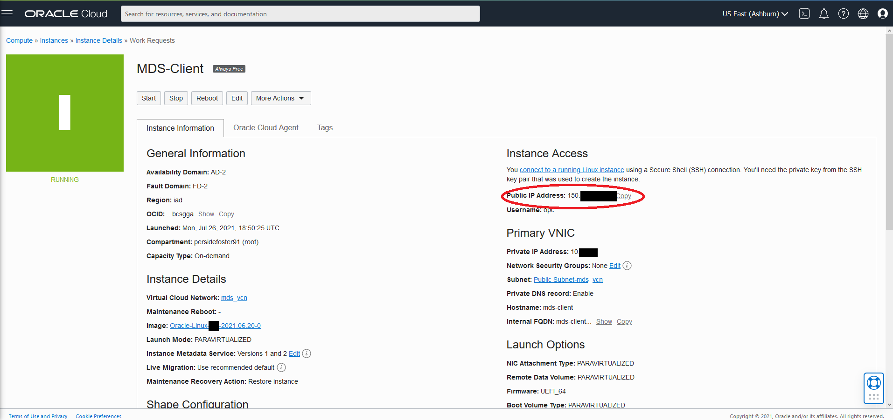
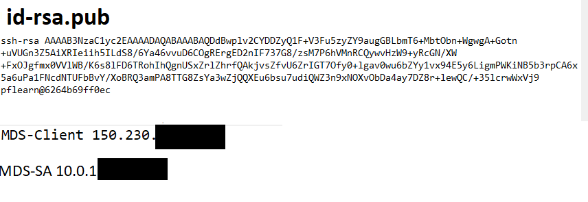
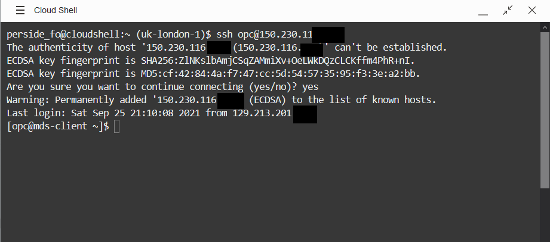

# Install Apache, PHP, and WordPress
 


## Introduction

When working in the cloud, there are often times when your servers and services are not exposed to the public internet. The Oracle Cloud Infrastructure (OCI) MySQL cloud service is an example of a service that is only accessible through private networks. Since the service is fully managed, we keep it siloed away from the internet to help protect your data from potential attacks and vulnerabilities. It’s a good practice to limit resource exposure as much as possible, but at some point, you’ll likely want to connect to those resources. That’s where Compute Instance, also known as a Bastion host, enters the picture. This Compute Instance Bastion Host is a resource that sits between the private resource and the endpoint which requires access to the private network and can act as a “jump box” to allow you to log in to the private resource through protocols like SSH.  This bastion host requires a Virtual Cloud Network and Compute Instance to connect with the MySQL DB Systems. 

Today, you will use the Compute Instance to connect from the browser to a MDS DB System

_Estimated Time:_ 20 minutes


## Objectives

In this lab, you will be guided through the following tasks:

- Install Apache
- Install PHP
- Install WordPress
- Install MySQL Shell
- Complete WordPress Installation

### Prerequisites

* An Oracle Free Tier or Paid Cloud Account
* A web browser
* Should have completed Lab4

## **TASK 1:** Intall Apache
1. Copy the public IP address of the active Compute Instance to your notepad

    - Go to Navigation Menu 
            Compute 
            Instances
    

    - Click the `MDS-Client` Compute Instance link

    
    
    - Copy `MDS-Client` plus  the `Public IP Address` to the notepad

2. Your notepad should look like the following:
     
    
3. Indicate the location of thepublic key you created earlier with **MDS-Client**. 
    
    Enter the username **opc** and the Public **IP Address**.

    Note: The **MDS-Client**  shows the  Public IP Address as mentioned on TASK 5: #11
    
    (Example: **ssh -i ~/.ssh/id_rsa opc@132.145.170...**) 

    ```
    <copy>ssh -i ~/.ssh/id_rsa opc@<your_compute_instance_ip></copy>
    ```
    

4.	Install app server

    ````
    <copy>sudo yum install httpd -y</copy>
    ````

    ````
    <copy>sudo systemctl enable httpd</copy>
    ````

    ````
    <copy>sudo systemctl restart httpd</copy>
    ````

    ````
    <copy>sudo firewall-cmd --permanent --add-port=80/tcp</copy>
    ````

    ````
    <copy>sudo firewall-cmd --reload</copy>
    ````

5.	From a browser test apache from your loacal machine using the Public IP Address of your Compute Instance

    Example: http://129.213....

## **TASK 2:** Intall PHP 

1.	Install php:

    ````
    <copy> sudo dnf module install php:7.4 -y</copy>
    ````
    ````
    <copy>sudo yum install php-cli php-mysqlnd php-zip php-gd php-mbstring php-xml php-json -y</copy>
    ````

    ````
    <copy>php -v</copy>
    ````
    ````
    <copy>php -m |grep mysql</copy>
    ````
    ````
    <copy>sudo systemctl restart httpd</copy>
    ````

2.	Create test php file (info.php)

    ````
    <copy>sudo nano /var/www/html/info.php</copy>   
    ````
3. Add the following code to the editor and save the file (ctr + o) (ctl + x)

    ````
    <copy><?php
phpinfo();
?></copy>
    ````
4. From your local machine, browse the page info.php

   Example: http://129.213.167.../info.php

## **TASK 3:** Install WordPress

1. Install WordPress required packages.

    ````
    <copy>sudo yum install -y php-mysqlnd php-zip php-gd php-mcrypt php-mbstring php-xml php-json</copy>   
    ````

    ````
    <copy>sudo systemctl restart httpd</copy>   
    ````
2. Download the latest WordPress.

    ````
    <copy>curl -O https://wordpress.org/latest.tar.gz</copy>   
    ````
3. Extract latest.tar.gz to /var/www/html (Apache document root).

    ````
    <copy>sudo tar zxf latest.tar.gz -C /var/www/html/ --strip 1</copy>   
    ````
4. Adjust ownership.

    ````
    <copy>sudo chown apache. -R /var/www/html/</copy>   
    ````
5. Create upload directory, adjust ownership.

    ````
    <copy>sudo mkdir /var/www/html/wp-content/uploads</copy>   
    ````
    
    ````
    <copy>sudo chown apache:apache /var/www/html/wp-content/uploads</copy>   
    ````
6. Adjust SE Linux.

    ````
    <copy>sudo chcon -t httpd_sys_rw_content_t /var/www/html -R</copy>   
    ````
7. Allow Apache to connect to an external database.

    ````
    <copy>sudo setsebool -P httpd_can_network_connect_db 1</copy>   
    ````

## **TASK 4:** Install MySQL Shell

1. Install MySQL Shell and setup wordpress database

    ````
    <copy>sudo yum -y install mysql-shell</copy>   
    ````

2. Connect to the MySql database service using MySQL Shell.

    ````
    <copy>mysqlsh --sql -u admin -h <MDS end point IP> </copy>   
    ````

3. Create WordPress database and user.

    ````
    <copy>create database wordpress;</copy>   
    ````

    ````
    <copy>create user wp IDENTIFIED BY 'Welcome#12345';</copy>   
    ````

    ````
    <copy>GRANT ALL PRIVILEGES ON wordpress.* To wp;</copy>   
    ````

    ````
    <copy>\quit;</copy>   
    ````
## **TASK 5:** Configure WordPress

1. From a browser access http://instance public IP/wp-admin/setup-config.php.

2. Click Let’s Go.

3. Fill the following information:
    - Database Name: database you created for WordPress
    - Username: Your database username
    - Password: Your database password
    - Database Host: MySQL Database Service IP address
    - Table Prefix: leave as is. only need to change if multiple WordPress running on the same database

4. Click Run the installation.

5. Fill the following information in the welcome screen:
    - Site Title: WordPress site title
    - Username: WordPresss admin
    - Password: WordPresss admin password
    - Your Email: your email
    - Click Install WordPress.
    - From a browser access http://instance public IP/wp-login.php and star managing your new WordPress installation.

## Acknowledgements
* **Author** - Perside Foster, MySQL Solution Engineering 
* **Contributors** - Frédéric Descamps, MySQL Community Manager, Orlando Gentil, Principal Training Lead and Evangelist
* **Last Updated By/Date** - Perside Foster, MySQL Solution Engineering, March 2022
