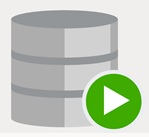

# Introduction

This is step-by-step workshop to migrate MySQL database to Oracle Autonomous Database, using Oracle SQL Developer. 

## About this Workshop

If you are considering moving your on-premise MySQL database to the cloud and in the process, also wants to migrate the database to Oracle Database (in our case Autonomous Database - ADB), this workshop will guide you how to do it easily. Following these step-by-step instructions, you can easily perform this migration using Oracle SQL Developer v 21.2. Here you can learn more about this type of migration: _Need to Migrate MySQL Database to Oracle ADB ?_ (draft)

Estimated Workshop Time: 1 hour

Oracle SQL Developer GUI - Migration Configured 

Oracle SQL Developer is a free, integrated development environment (IDE) that simplifies the development and management of Oracle Database in both traditional and Cloud deployments. SQL Developer also provides migration capability from third-party databases. If you have basic understanding of SQL and know-how of Oracle Cloud and Autonomous Database, it will be quite easy to perform this workshop. However, if you’re coming from MySQL background alone, using this workshop steps, you will still be able to complete the migration. 

### References in this Workshop

The main Oracle document for this migration can be found at the following link, which has been referenced in this post in some places. Wherever I have mentioned “From Doc”, the text is copied from following document and referenced as-is. [SQL Developer: Migrating Third-Party Databases](https://docs.oracle.com/en/database/oracle/sql-developer/21.2/rptug/migrating-third-party-databases.html)

## Objectives

In this workshop, you will learn how to:
* Download Latest Version & Install
* Create Connections for the Target (ADB) database
* Load MySQL JDBC Driver and Source Connection
* Create User for Migration Repository
* Create Migration Connection
* Create Migration Repository
* Complete Migration with the Wizard

## Prerequisites 

For this post, it is assumed that you already have following in place:

1. Source: MySQL database on-premise, with the necessary network access to target ADB instance as well as Oracle SQL Developer instance. And also database credentials to the source schemas/objects, and sample data in it, which needs to be migrated.

2. Target: ATP (Autonomous Transactions Processing) instance setup in the OCI cloud, with all the required credentials for users, schema and object creation (eg ADMIN user), along with network connectivity (VCN) between SQL Developer and MySQL and ATP database wallet file. We will use this database for Migraiton repository as well. For this workshop, you just need to have running ATP instance. You can equally run this migration on ADW (Autonomous Datawarehouse). How-to post: [Creating an Autonomous Transaction Processing (ATP) Database](https://blogs.oracle.com/weblogicserver/post/creating-an-autonomous-transaction-processing-atp-database).  Or you can follow this lab: **Prerequisites Setup - Create ADB for Target (Optional Lab)**. This lab will help you create Oracle ADB (ADW/ATP) instance for target purpose. This lab is optional, if you already have ADB instance, you can skip this lab (just make sure, your ADB - port 1522 is accessable to SQL Developer instance on-premises or OCI cloud, depending on your choice).

3. An environment, usually your laptop or another instance in OCI (Oracle Cloud Infrastructure), where you will install and run Oracle SQL Developer. We will follow windows based installation. If you want to set up in OCI instance, follow this: [create Windows instance](https://docs.oracle.com/en-us/iaas/Content/GSG/Reference/overviewworkflowforWindows.htm) and [RDP from your laptop/desktop](https://blogs.oracle.com/pcoe/post/enable-windows-instance-access-via-rdp-on-oracle-compute-cloud-service) (for remote desktop sharing). Or you can also this  lab: **Prerequisites Setup - Create Windows VM to run Oracle SQL Developer (Optional Lab)**. This lab will help you create OCI Windows instance to install later SQL Developer. If you plan to run SQL Developer from your laptop or any desktop, you can skip this lab (just make sure, your laptop/desktop has access to ADB and MySQL databases/ports)

4. All above 3 environments should have network connectivity among each other, including allowing the required ports for the respective databases (defauts: 1521 for ATP and 3306 for MySQL). Ideally, a VCN for ADB and SQL Developer instances in OCI and a VPN connectivity to MySQL on-premises. 

*Let's get Started!*

Click on the next lab in this workshop to get started.

## Learn More

Ready to learn more?
* [Need to Migrate MySQL Database to Oracle ADB ?](http://docs.oracle.com)
* Visit our documentation for the latest versions of [Autonomous Database](https://docs.oracle.com/en/cloud/paas/atp-cloud/index.html), [SQL Developer](https://docs.oracle.com/en/database/oracle/sql-developer/21.2/index.html) and [MySQL](https://dev.mysql.com/doc/)
* Try one of our [LiveLabs](https://apexapps.oracle.com/pls/apex/dbpm/r/livelabs/home?session=110185877771466)
* [SQL Developer FAQ](https://support.oracle.com/epmos/faces/DocumentDisplay?_afrLoop=170592697647624&id=2345874.1&_afrWindowMode=0&_adf.ctrl-state=u1oixgz95_4) from Oracle Support site 
* [Forum for Oracle SQL Developer](https://community.oracle.com/tech/developers/categories/sql_developer)
* [Migration Planning and Methodology](https://www.oracle.com/database/technologies/migration/mig-planning.html)
* [SQL Developer Product Page](https://www.oracle.com/database/technologies/appdev/sqldeveloper-landing.html)
* [MySQL Workbench - Database Migration](https://www.mysql.com/products/workbench/migrate/)

## Acknowledgements
* **Author** - Muhammad Shuja, Principal Cloud Solution Engineer, ODP - ANZ
* **Reviewer** - Person, Org
* **Last Updated By/Date** - Muhammad Shuja, December 2021
