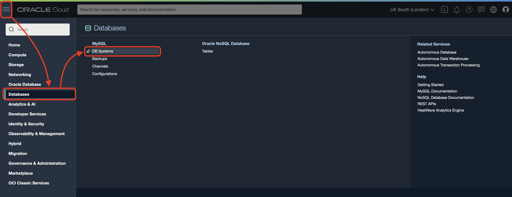
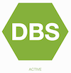
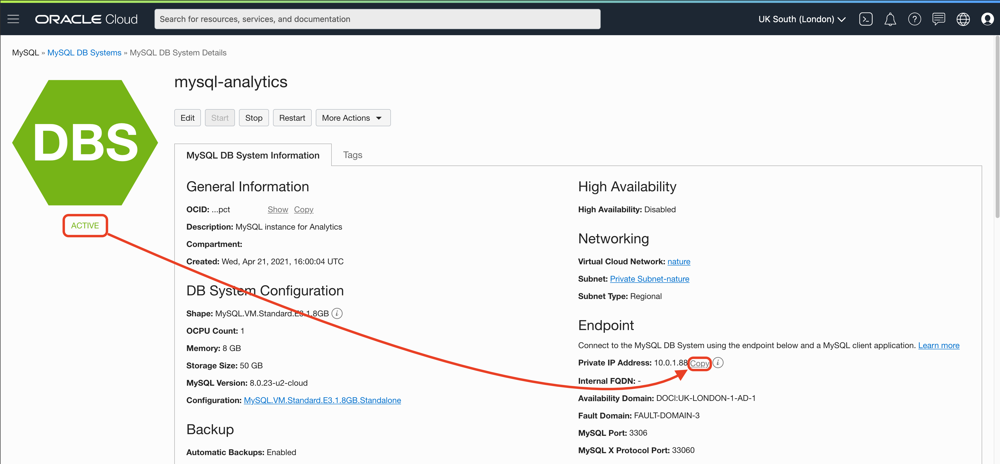
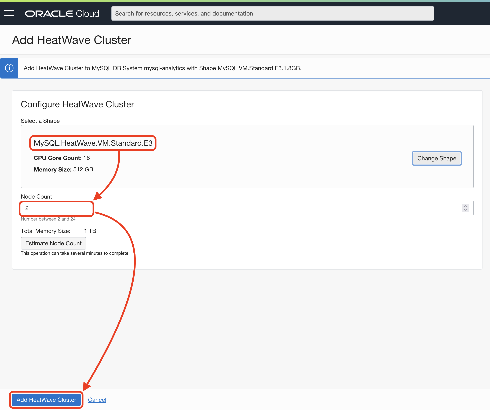
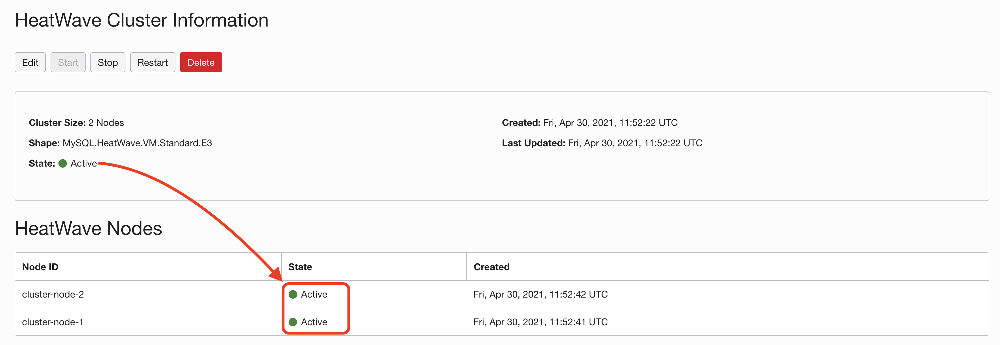

# Create MySQL Database Service


## Introduction

**MySQL Database Service** is a fully-managed Oracle Cloud Infrastructure service, developed, managed, and supported by the MySQL team in Oracle.

[](youtube:f-fVabi1tRA)
 

Estimated Lab Time: 30 minutes.

### Objectives

In this lab, you will:

- Create an instance of MySQL in Oracle Cloud.
- Connect and create the Database.
- Enable HeatWave Analytics Engine.

### Prerequisites

- All previous labs have been successfully completed.

## Task 1: Create an Instance of MySQL in the Cloud

1. Go to **Menu** > **Databases** > **DB Systems**.

   

2. Click **Create MySQL DB System**.

   Make sure your **root** compartment (or the one you want) is selected.

   

      - Name your MySQL instance: `mysql-analytics`
      - Description (optional): `MySQL instance for Analytics`

3. Between the three options, pick `HeatWave`. `Standalone` will work for the test, but it doesn't include the Analytics Engine that will improve performance for Analytics.

   For Username and password:

      - Username: `root`
      - Password: `R2d2&C3po!`
      - Confirm Password: `R2d2&C3po!`

   

4. **Network** configuration:

      - Virtual Cloud Network: `nature`
      - Subnet: `Private Subnet-nature (Regional)`

   

5. Everything else is good by **default**:

      - Configure placement: `AD-1`
      - Configure hardware: `MySQL.HeatWave.VM.Standard.E3` or Standalone (selected above) `MySQL.VM.Standard.E3.1.8GB`
      - Data Storage Size (GB): `50`
      - Configure Backups: `Enable Automatic Backups`

6. Click **Create**.

   

   The provisioning is around **10 minutes**. The icon should change to `ACTIVE` in green:

   

   

7. **Copy the private IP address** from the MySQL DB System Information page. It will look like `10.0.1.xxx`.

   

---

## Task 2: Connect and Create DB

1. Connect with **Cloud Shell** (if you close it or it is no longer active).

   

      - (If you are NOT inside the bastion host already) SSH into the bastion host: `ssh -i ~/.ssh/bastion opc@PUBLIC_IP`
      - Run MySQL Shell (replace `PRIVATE_IP` with your MDS IP value): 
         ```
         <copy>curl -L https://bit.ly/3yoHvem | mysqlsh --sql --save-passwords=always root@PRIVATE_IP</copy>
         ```
   This command will download the SQL script, and pipe the content to MySQL Shell to be executed as SQL code. We also indicate with `--save-passwords=always` to save the password securely for future uses of MySQL Shell. It can take a few minutes, be patient.

2. If the terminal asks for the **password** (`Please provide the password for 'root@PRIVATE_IP':`).

      - Type the MySQL DB password: `R2d2&C3po!`

   If there is no error on the console, everything is ready to proceed.

   

---

## Task 3: Enable HeatWave (Optional)

1. If and only if you have selected the **HeatWave** Shape `MySQL.HeatWave.VM.Standard.E3`, you should be able to **enable HeatWave Analytics Engine**.

2. Go to the **Resources Menu** > **HeatWave**.

   

3. Your HeatWave is disabled, add the HeatWave Cluster. Click **Add HeatWave Cluster**.

   

4. Leave the default values, and click **Add HeatWave Cluster**.

   

   Wait for the Cluster to be **created**.

   

5. **HeatWave** will be `Active` and the cluster nodes will be as well in `Active` state.

   

Congratulations! You are ready to go to the next Lab!

---

## **Acknowledgements**

- **Author** - Victor Martin, Technology Product Strategy Director
- **Contributors** - Priscila Iruela
- **Last Updated By/Date** - Priscila Iruela, April 2022