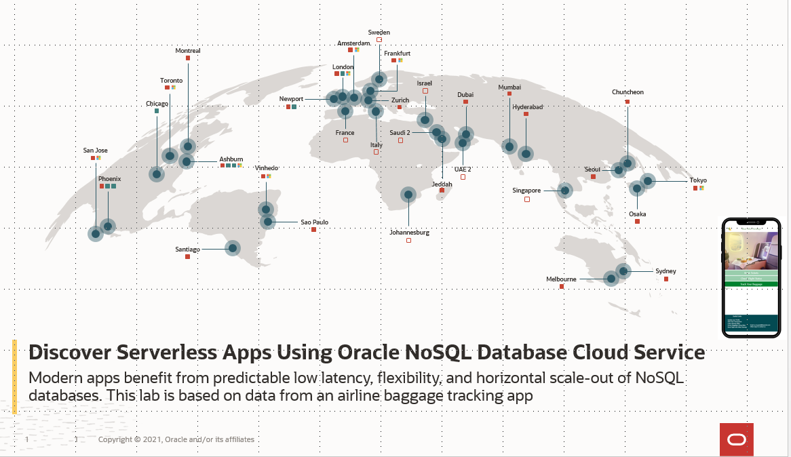
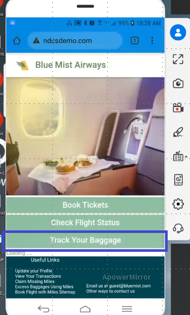
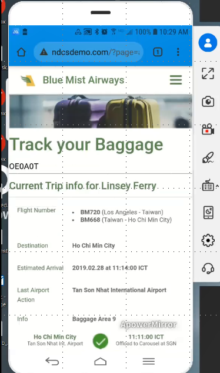
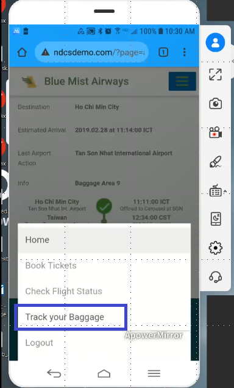
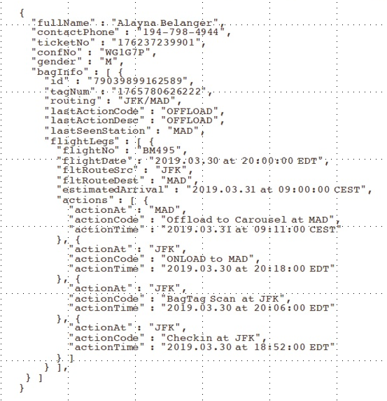
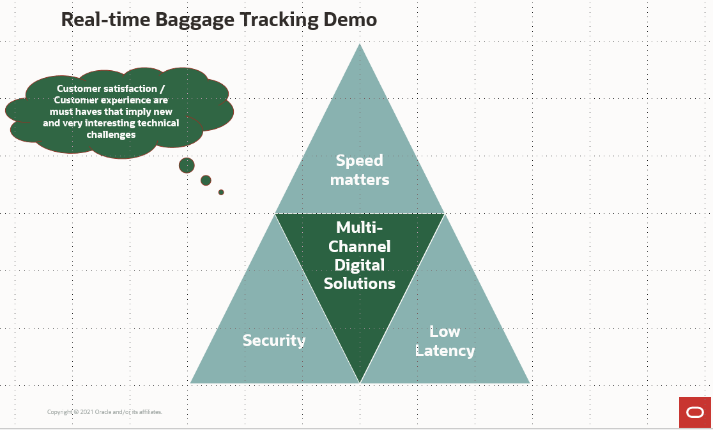

# Baggage Tracking Demo

## Introduction

This lab walks you through a live baggage tracking demo that was created by the Oracle NoSQL development team.   

Estimated Time: 7 minutes

### Serverless Logic Tier

We selected this demo because it solves real world business problems.  Many of those are listed on the slide.

  

This application is running in all the OCI regions.

  

The application behind the demo uses a three-tier architecture, representing the brains of the application. Integrating these components: an API Gateway, Streams, and Functions; in your logic tier can be revolutionary.  The features of these services allow you to build a serverless production application that is highly available, scalable, and secure. Your application can use thousands of servers, however, by leveraging this pattern you do not have to manage a single one.

In addition, by using these managed services together you gain the following benefits:
*	No operating systems to choose, secure, patch, or manage.
*	No servers to size, monitor, or scale out.
*	No risk to your cost by over-provisioning.
*	No risk to your performance by under-provisioning.

Here is a diagram of architecture behind the demo.

  

Here is an architecture diagram at the component level.

  

### Objectives

* Explore the baggage tracking demo  

### Prerequisites

*  Connection to the internet
*  Personal cellphone

## Task 1: The "Traveling User" Problem!

This particular application came to the NoSQL team from Emirates airlines.  When we thought about this for a little bit, we realized that this was a perfect use case for NoSQL.  Many airlines, like United, Delta, American are now offering real time baggage tracking.  You have to install their application, and you get close to a real time feed of where your bag is at as it moves along its journey.  This is a really good example of companies offloading queries from the operational data store.   In the Emirates case, this data was already collected in their operational database and they didn’t want to put consumer level queries on that data store.   The second thing in this example is the involvement of an active/active configuration.  You write data locally in closest data center as that bag travels, but you want to read it from anywhere.  For the best latency, you want the RFID bag scans to be immediately written to the local data center and then let the system take care of propagating that data to the other data centers in an active/active set up.   If you took a trip from the US to Europe for example, the last thing you would want to do is force all the writes back to the US.   Hundreds of bags get scanned per flight segment and you need the best possible latency.   

What are some of the goals of this application:

  - Predictable low latency
  - Scalable to your user base
  - Highly available
  - Auto-expiry of the data - baggage location data has a limited lifespan
  - Offload consumer queries from operation data store

## Task 2: Grab your Personal Cell Phone

1. In a browser window, enter ndcsdemo.com

    

  This brings you to the welcome screen for Blue Mist airways.

      

   **Note:** If you see a screen that says 'Blue Mist Employee Portal' and not 'Blue Mist Airways' then you are using a device with a larger display.  You have been taken to the employee portal.  You can look at the information there but it not line up with the rest of the screen shots in this Lab.

## Task 3: Track a Bag

1. Tap on the 'Track Your Baggage' button.

      

  After doing so, you will get random baggage information for a traveler.  Scroll through the information.  In an application from a real airlines, a variety of different information can be displayed.   

      

## Task 4: Select New Traveler

1. Tap on the 'hamburger' button on the top right, and then hit ‘Track Your Baggage’ again.  A new random traveler will be shown.

      

      

## Task 5:  Explore the JSON data record

1. The data record is a JSON document with several nested arrays.  Oracle NoSQL makes it easy to handle nested arrays.

      

## Task 6: Key takeaways

1. While this was a simple demo, it used many components that are available in OCI today.

  * Application is running live in all OCI Regions
  * Application uses OCI traffic Management for Geo-Steering to steer network requests to closest OCI region
  * OCI API gateway is used
  * UI development done with Visual Builder Cloud Service
  * Tomcat Server for REST calls
  * Data stored in Oracle NoSQL Cloud Service as JSON documents

  The benefits to customers are shown in this slide.

      

You may now **proceed to the next lab.**

## Learn More

* [About Architecting Microservices-based applications](https://docs.oracle.com/en/solutions/learn-architect-microservice/index.html)
* [Speed Matters! Why Choosing the Right Database is Critical for Best Customer Experience?](https://blogs.oracle.com/nosql/post/speed-matters-why-choosing-the-right-database-is-critical-for-best-customer-experience)
* [Oracle NoSQL Database Multi-Region](https://blogs.oracle.com/nosql/post/oracle-nosql-database-multi-region-table-part1)
* [About Security, Identity, and Compliance](https://www.oracle.com/security/)
* [Application Development](https://www.oracle.com/application-development/)

### Services

* [Oracle NoSQL Database Cloud Service page](https://www.oracle.com/database/nosql-cloud.html)
* [About Oracle NoSQL Database Cloud Service](https://docs.oracle.com/pls/topic/lookup?ctx=cloud&id=CSNSD-GUID-88373C12-018E-4628-B241-2DFCB7B16DE8)
* [About API Gateway](https://docs.oracle.com/en-us/iaas/Content/APIGateway/Concepts/apigatewayoverview.htm)
* [About Streaming](https://docs.oracle.com/en-us/iaas/Content/Streaming/Concepts/streamingoverview.htm)
* [About Connector Hub](https://docs.oracle.com/en-us/iaas/Content/service-connector-hub/overview.htm)
* [About Functions](https://docs.oracle.com/en-us/iaas/Content/Functions/Concepts/functionsoverview.htm)

## Acknowledgements
* **Author** - Dario Vega, Product Manager, NoSQL Product Management and Michael Brey, Director, NoSQL Product Development
* **Last Updated By/Date** - Michael Brey, Director, NoSQL Product Development, September 2021
