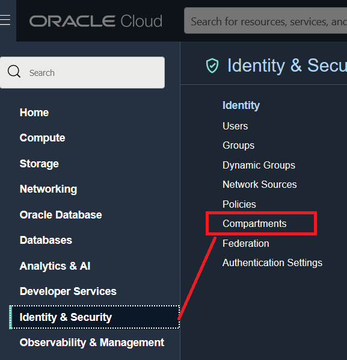
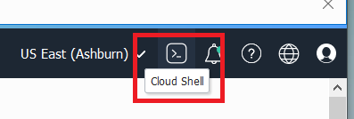

# Prepare your environment

## Introduction

This lab walks you through the steps necessary to create a proper operating environment.

Estimated Time: 5 minutes

Watch the video below for a quick walk through of the lab.

[](youtube:UqVLC1Y47hY)

### Objectives

In this lab you will:
* Create a Compartment
* Create API Key
* Download Code Bundle
* Learn about Credentials, and Policies

### Prerequisites

This lab assumes you have:

* An Oracle Free Tier, Paid Account or Green Button


## Task 1: Create a Compartment

1. Log into the Oracle Cloud Console using your tenancy. Please make note of what region you are at.

    

2. On left side drop down (left of Oracle Cloud banner), go to **Identity & Security** and then **Compartments.**

    

3. Click **Create Compartment.** This opens up a new window.

  Enter **demonosql** as compartment **Name** field, enter some text into **Description** field and press **Create Compartment** button at bottom of window. The **Parent Compartment** field will display your current parent compartment -- make sure this is your **root** compartment, whatever that is for your case. This HOL assumes the 'demonosql' compartment is a child of the root compartment.

    


## Task 2: Create an API Key For Your User

1. Top right, click your **Profile**, then **User Settings.**

  

2. Copy your OCID. Make sure to **save your OCID** for future steps. Paste it into notepad or some text file for use in Step 4.

    

3. Open the **Cloud Shell** in the top right menu. It can take about 2 minutes to get the Cloud Shell started.

    

  **Note:** This must be executed in the **Home region**. Please ensure you are in your home region. The Cloud Shell prompt shows you what region the shell is running out of.

    

4. Execute these commands in your Cloud Shell. **Replace** "YOURUSEROCID" with your OCID you copied above **before** executing.

    ````
    <copy>
    openssl genrsa -out NoSQLLabPrivateKey.pem  4096        
    openssl rsa -pubout -in NoSQLLabPrivateKey.pem -out NoSQLLabPublicKey.pem
    oci iam user api-key upload --user-id YOURUSEROCID --key-file NoSQLLabPublicKey.pem > info.json
    </copy>
    ````
    If you execute the 'oci iam' command before replacing "YOURUSEROCID" then you will get the following error:
    **"Authorization failed or requested resource not found."**   Replace "YOURUSEROCID" and try the last command again.

    If you execute the 'oci iam' command and you get this error **"ApiKeyLimitExceeded"** then you need to delete some keys you already created. Go to your user details screen, and **API Keys** to find old keys to delete.

## Task 3: Get Data and Code Bundle

In this task we will copy over a data bundle stored on object storage and place that in the Cloud Shell.

1. Execute the following in your Cloud Shell.

    ````
    <copy>
      cd $HOME
      rm -rf serverless-with-nosql-database BaggageData serverless-with-nosql-database.zip demo-lab-nosql-main
      curl https://objectstorage.us-ashburn-1.oraclecloud.com/p/PdICF4N3CtbcAB6cPe7-foLYqGGSRNqkf4mSt1gVIBhH8Wvt87PxoYQkNATywFM0/n/c4u04/b/labfiles/o/demo-lab-nosql-main.zip -o serverless-with-nosql-database.zip
      unzip serverless-with-nosql-database.zip
      mv demo-lab-nosql-main serverless-with-nosql-database
      cp ~/NoSQLLabPrivateKey.pem  ~/serverless-with-nosql-database/express-nosql
      cp ~/info.json ~/serverless-with-nosql-database/express-nosql
      cp ~/serverless-with-nosql-database/env-freetier.sh ~/serverless-with-nosql-database/env.sh
    </copy>
    ````

2. Exit from Cloud Shell


## Task 4: Understand Credentials, and Policies

**Oracle NoSQL Database Cloud Service uses Oracle Cloud Infrastructure Identity and Access Management to provide secure access to Oracle Cloud.** Oracle Cloud Infrastructure Identity and Access Management enables you to create user accounts and give users permission to inspect, read, use, or manage tables. Credentials are used for connecting your application to the service and are associated with a specific user. The credentials consist of the tenancy ID, the user ID, an API signing key, a fingerprint and optionally a passphrase for the signing key. These got created in Task 2 of this lab and are stored in the info.json file in your Cloud Shell.

The Oracle NoSQL Database SDKs allow you to provide the credentials to an application in multiple ways. The SDKs support a configuration file as well as one or more interfaces that allow direct specification of the information. You can use the SignatureProvider API to supply your credentials to NoSQL Database. Oracle NoSQL has SDKs in the following languages:  Java, Node.js, Python, Go, Spring and C#.

In this node.js snippet, we used the credential information created in Task 2 and specified the credentials directly as part of auth.iam property in the initial configuration. The tenancy ID, the user ID, an API signing key, a fingerprint are all supplied. The tenancy iD and the user ID are referred to as OCIDs.

````
       return new NoSQLClient({
            region: Region.EU_FRANKFURT_1,
			compartment:'demonosql',
            auth: {
                iam: {
                    tenantId: 'ocid1.tenancy.oc1..aaaaaaaahrs4avamaxisc...........slpsdb2d2xe2kp2q',
                    userId: 'ocid1.user.oc1..aaaaaaaaq.......co3ssybmexcu4ba',
                    fingerprint: 'e1:4f:7f:e7:b5:7c:11:38:ed:e5:9f:6d:92:bb:ae:3d',
                    privateKeyFile: 'NoSQLprivateKey.pem'
                }
            }
        });
````

  Another way to handle authentication is with Instance and Resource Principals. The Oracle NoSQL SDKs support both of them. Resource principals are primarily used when authenticating from functions. We will show you an example of using Resource Principals.

  Instance Principals is a capability in Oracle Cloud Infrastructure Identity and Access Management (IAM) that lets you make service calls from an instance. With instance principals, you don’t need to configure user credentials or rotate the credentials. Instances themselves are a principal type in IAM and are set up in IAM. You can think of them as an IAM service feature that enables instances to be authorized actors (or principals) to perform actions on service resources.

  Oracle NoSQL Database Cloud service has three different resource types, namely, nosql-tables, nosql-rows, and nosql-indexes. It also has one aggregate resource called nosql-family. Policies are created that allow a group to work in certain ways with specific types of resources such as nosql-tables in a particular compartment. All NoSQL tables belong to a defined compartment. In Task 1 of this Lab, we created the demonosql compartment and this is where we will create our tables.

  You can use **Resource Principals** to do the connection to NoSQL Cloud Service as shown below in the Node.js and Python examples instead of specifying the credentials. Once they are set up, they are simple to use because all you need to do is call the appropriate authorization constructor.

In this snippet, there are hard-coded references (for example, REGION).

**NoSQL Database Node.js SDK**
```
function createClientResource() {
  return  new NoSQLClient({
    region: Region.EU_FRANKFURT_1,
    compartment:'demonosql',
    auth: {
        iam: {
            useResourcePrincipal: true
        }
    }
  });
}
```
If you wanted to use **Instance Principals** instead of Resource Principals, then replace "useResourcePrincipal: true"  with "useInstancePrincipal: true" to switch.

**NoSQL Database Python SDK**
```
def get_handle():
     provider = borneo.iam.SignatureProvider.create_with_resource_principal()
     config = borneo.NoSQLHandleConfig('eu-frankfurt-1', provider).set_logger(None)
     return borneo.NoSQLHandle(config)
```

A similar switch can be made here to use **Instance Principals**, replace "create\_with\_resource\_principal()" with "create\_with\_instance\_principal()" and you are all set.

In the next labs we are going to be running application code and we need an instance to run that from. In Task 2 we started the Cloud Shell and we will run the application from that instance. Currently, Cloud Shell does not support Instance Principals so in those labs we will be using credentials.

You may now **proceed to the next lab.**

## Learn More

* [About Identity and Access Management](https://docs.oracle.com/en-us/iaas/Content/Identity/Concepts/overview.htm)
* [About Managing User Credentials](https://docs.oracle.com/en-us/iaas/Content/Identity/Tasks/managingcredentials.htm)
* [About Cloud Shell](https://docs.oracle.com/en-us/iaas/Content/API/Concepts/cloudshellintro.htm)


## Acknowledgements
* **Author** - Dario Vega, Product Manager, NoSQL Product Management and Michael Brey, Director, NoSQL Product Development
* **Last Updated By/Date** - Michael Brey, Director, NoSQL Product Development, September 2021
