# Setting up the Data Integration prerequisites in OCI

## Introduction

Set up these **prerequisites** before starting our Data Integration journey in Oracle Cloud Infrastructure. We'll show you how to create the required Oracle Cloud Infrastructure resources for the workshop, including uploading the source files in an Object Storage bucket and creating the necessary database objects in Autonomous Data Warehouse. Steps 3, 4 and 5 below are not prerequisites for using OCI Data Integration, but are required to complete the workshop.

**Estimated Time**: 45 minutes

### Objectives

* Create an OCI Compartment
* Create a VCN and Subnet using VCN Wizard
* Provision an Autonomous Data Warehouse and download Wallet
* Prepare the Autonomous Data Warehouse
* Create an Object Storage bucket and upload the sample data

### Prerequisites

* **Free Tier/ Paid Oracle Cloud Account**
* **OCI user** that is assigned to an **OCI group**.

*Note*: If you want to create a new OCI user or assign the user to a group, see the [Identity and Access Management workshop](https://apexapps.oracle.com/pls/apex/dbpm/r/livelabs/view-workshop?wid=624&clear=180&session=17214298097566).

## Task 1: Create an OCI Compartment

A **compartment** is a collection of cloud assets. For this workshop, we are creating a new compartment to help organize all of the Data Integration resources. However, if you already have a compartment, you can use that one for this workshop and skip this task.

A Cloud Administrator can create a compartment in your tenancy. As a Cloud Administrator, you will create a new compartment that will group all of your Data Integration resources that you will use in this workshop.

1. **Log in to the Oracle Cloud Console** as a user with administrator privileges. On the Sign In page, select your tenancy, enter your username and password, and then click **Sign In**. The Oracle Cloud Console Home page is displayed.

  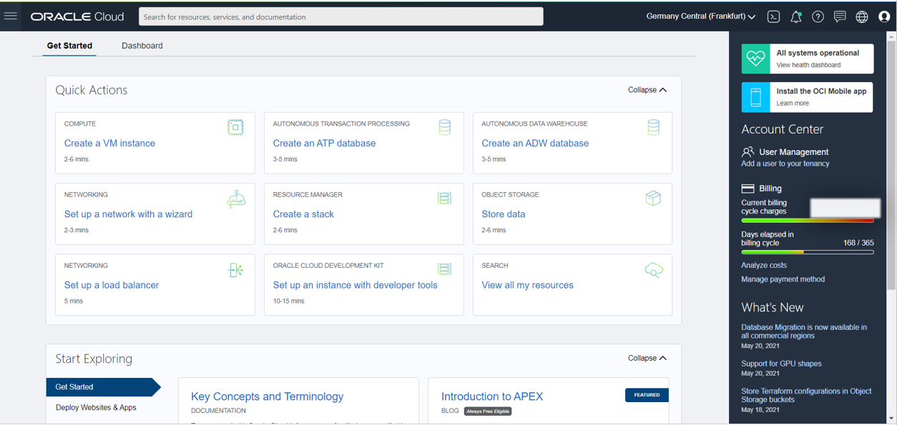

2. From the OCI console menu, select **Identity & Security**. Under Identity section, click on **Compartments**.

  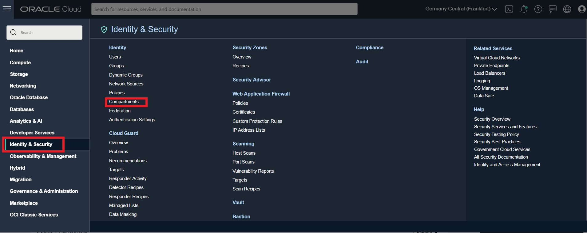

3. In the Compartments page, we have the list of our existing compartments (if any). Click on the **Create Compartment** button to create a sub-compartment.

  

4. In the **Create Compartment** dialog box:

    - Enter a **Name** for the compartment: `DI-compartment`.
    - Enter a meaningful **Description**: `Compartment for Data Integration resources`.
    - In the **Parent Compartment** drop-down list, select your parent compartment (root or any other existing compartment).
    - Then click **Create Compartment**.

    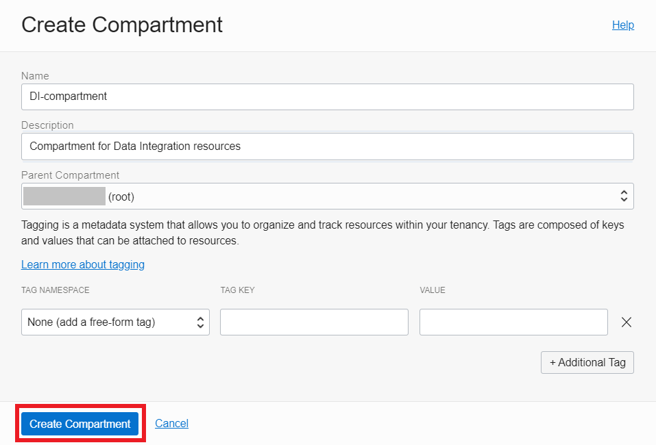

5. The Compartments page is displayed. If the newly created compartment  was created under root parent compartment, it is shown now in the list of available compartments. If you select your new **DI-compartment**, you can see the details for it.

   *Note*: If the compartment was created under another parent compartment (not root), click on the parent compartment in the list of Compartments and you should be able to see your new compartment in Child Compartments section.

   

## Task 2: Create a VCN and Subnet using VCN Wizard

You will need a **Virtual Cloud Network** (VCN) for further use in this OCI Data Integration workshop. **Oracle virtual cloud networks** provide customizable and private cloud networks in Oracle Cloud Infrastructure.

1. From the OCI console menu, click **Networking** and then select **Virtual Cloud Networks**.

  

2. On the Virtual Cloud Networks page, make sure that you are in the Data Integration compartment you have are using for data integration (`DI-compartment`). Then click **Start VCN Wizard**.

  

3. Select **VCN with Internet Connectivity**, and then click **Start VCN Wizard**.

  

4. The Configuration page of the wizard is displayed.
   In the **Basic Information** section, provide:

    - **VCN Name**: `OCI-VCN-WORKSHOP`.
    - **Compartment**: Select `DI-compartment` or the compartment you are using for data integration.

    

5. In the **Configure VCN and Subnets** section, leave all the default values and selections. Click **Next**.

  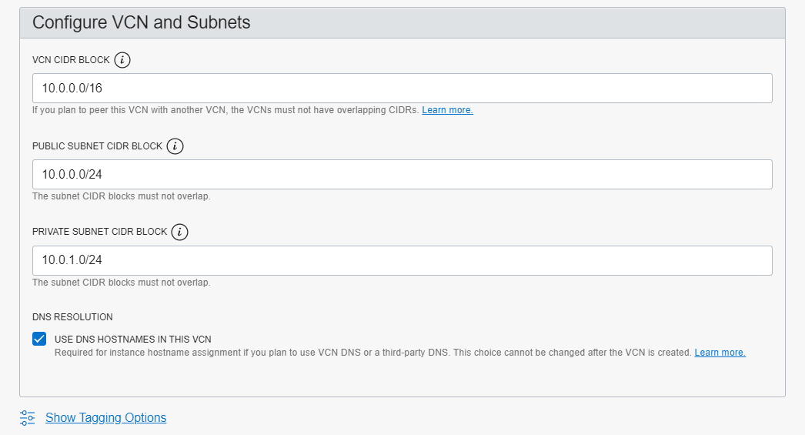

6. Review your settings to be sure they are correct and then click **Create** button.

  

7. It will take a moment to create the VCN and a progress screen will keep you aware of the process. Once you see that the VCN creation is complete, click on the **View Virtual Cloud Network** button at the bottom of the screen.

  

8. The **Virtual Cloud Network Details** page is displayed, and you can see that the VCN has a private and a public Subnet.

  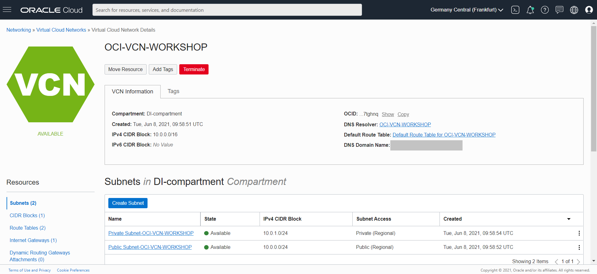

## Task 3: Provision an Autonomous Data Warehouse and download Wallet

**Autonomous Data Warehouse** (ADW) is a cloud data warehouse service that eliminates all the complexities of operating a data warehouse, securing data, and developing data-driven applications. It automates provisioning, configuring, securing, tuning, scaling, and backing up of the data warehouse.

1. From the OCI console menu, click **Oracle Database** and then select **Autonomous Data Warehouse** under Autonomous Database section.

  

2. The console shows the Autonomous Data Warehouse databases that exist, if any. Make sure that you are in the compartment that you have created for the data integration resources (`DI-compartment`). Click on **Create Autonomous Database**.

  

3. Provide basic information for the Autonomous Database:

    - Choose a **Compartment** - Select a compartment for the database from the drop-down list (`DI-compartment`).
    - **Display Name** - Enter a meaningful name for the database for display purposes. Use `ADW Workshop`.
    - **Database Name** - Use letters and numbers only, starting with a letter. Maximum length is 14 characters. Use `ADWWORKSHOP`.

   *Note*: The same database name cannot be used for multiple Autonomous Databases in your tenancy, in the same region.

   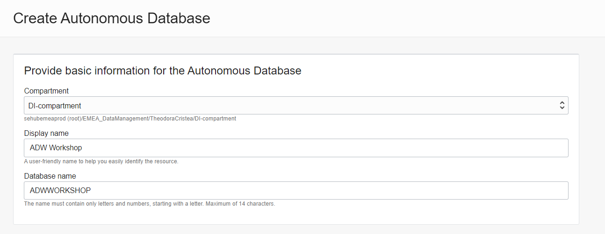

4. Select **Data Warehouse** as the workload type.

  

5. Choose **Shared Infrastructure** as the deployment type.

  

6. Configure the database:

    - **Always Free** - Leave this option unchecked.
    - **Choose database version** - Select a database version from the available versions. Leave the default version 19c.
    - **OCPU count** - Number of CPUs for your service. Specify 1 CPU.
    - **Storage (TB)** - Select your storage capacity in terabytes. Specify 1 TB of storage.
    - **Auto Scaling** - Keep auto scaling enabled, to allow the system to automatically use up to three times more CPU and IO resources to meet workload demand if needed.

  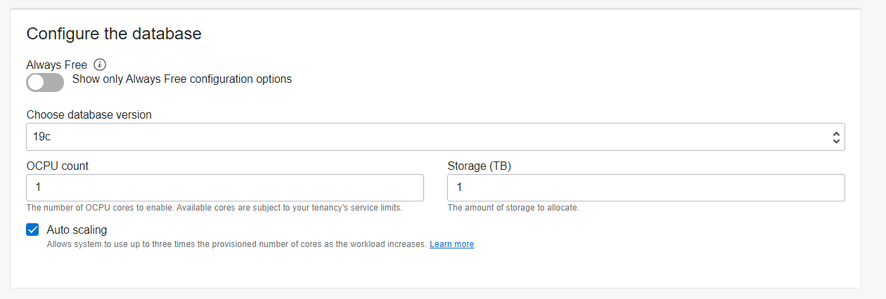

7. Create **Administrator credentials**:

    - Password and Confirm Password - Specify the password for `ADMIN` user of the service instance.

    

8. Choose **Network access**:

    - Accept the default **Allow secure access from everywhere**.

    

9. Choose a **license type**. Choose **License Included**. The two license types are:

    - Bring Your Own License (BYOL) - Select this type when your organization has existing database licenses.
    - License Included - Select this type when you want to subscribe to new database software licenses and the database cloud service.

    

10. Click **Create Autonomous Database**.

  

11. Your instance will begin provisioning. In a few minutes, the state will turn from Provisioning to **Available**. *At this point, your Autonomous Data Warehouse database is ready to use!*

  

12. Download the **Client Credentials (Wallet file)** for your Autonomous Data Warehouse.  This will be used to connect OCI Data Integration to the Autonomous Data Warehouse. From the ADW details page you are currently in, click on **DB Connection** button.

  

13. On the Database Connection page, leave the default wallet type as Instance Wallet and then click on **Download Wallet**.

  

14. In the Download Wallet dialog, enter a wallet password in the **Password** field and confirm the password in the Confirm Password field. This password protects the downloaded Client Credentials wallet. Click **Download** to save the client security credentials zip file. By default the filename is: `Wallet_databasename.zip`. You can save this file as any filename you want.

  

## Task 4: Prepare the Autonomous Data Warehouse

In this workshop, **Autonomous Data Warehouse** serves as the **target data asset** for our data integration tasks. In this step you will configure your target Autonomous Data Warehouse database in order to complete this workshop.

You will create a new user on the Autonomous Data Warehouse and will run a SQL script that will create the database objects you need for the following integration tasks.

1. From the OCI console menu, click **Oracle Database** and then select **Autonomous Data Warehouse** under Autonomous Database section.

  

2. The console shows the Autonomous Data Warehouse databases that exist. Make sure that you are in the compartment for the data integration resources (`DI-compartment`). **Click on your Autonomous Data Warehouse**, the one you created in the previous step (`ADW Workshop`).

  

3. On your Autonomous Database Details page, click on **Tools** tab.

  

4. In the Tools tab, click on **Open Database Actions** under Database Actions section.

  

5. When prompted, log in with `admin` **username** and click Next.

  

6. A new window requiring the **password** will appear. Write your password for `admin` user and then click **Sign In**.

  

7. On Database Actions page, click on **SQL tile** under Development section.

  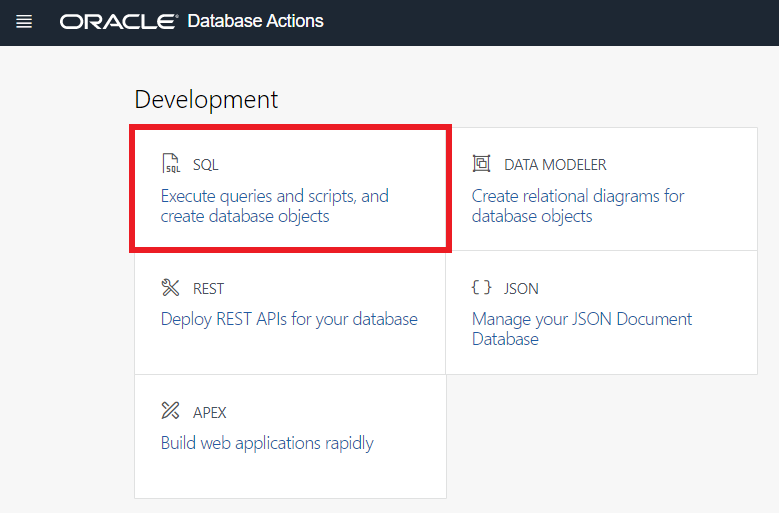

8. The SQL worksheet opens. To create the BETA user, copy and paste the following code and run it:

    ```
    <copy>create user BETA identified by "password";
    grant DWROLE to BETA;
    GRANT EXECUTE ON DBMS_CLOUD TO BETA;
    alter user BETA quota 200M on data;</copy>
    ```

   *Note*: Ensure that you enter a password in place of password. Also, make sure that the script output shows the success of the commands.

  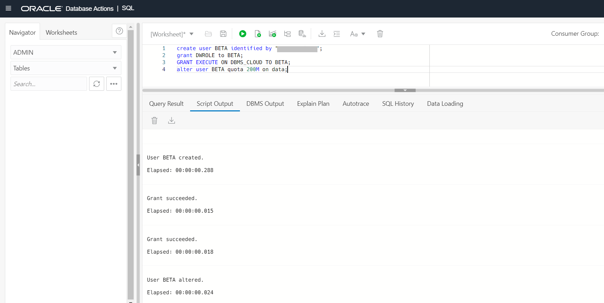

9. **Download** the zip file [OCI DI Workshop files.zip](https://objectstorage.us-ashburn-1.oraclecloud.com/p/jyHA4nclWcTaekNIdpKPq3u2gsLb00v_1mmRKDIuOEsp--D6GJWS_tMrqGmb85R2/n/c4u04/b/livelabsfiles/o/labfiles/OCI_DI_Workshop_files.zip) to your local directories. Unzip this file.

10. In the same SQL worksheet, run the **ADW\_OCIDI\_LiveLabs.sql** script from the unzipped archive from the previous step, to create the rest of the database objects that you will need later in the workshop.

   This SQL script will create tables CUSTOMERS\_TARGET, EMPLOYEES\_WEST\_MIDWEST and EMPLOYEES\_NORTHEAST\_SOUTH, which will serve as the target tables for the data integration tasks. You will also create a statistics table and a stored procedure that will write the success/error result of the data integration pipeline in this table, as well as a sequence that will be used for the primary key.

   

11. Refresh the browser and in the Navigator on the left, switch to the `BETA` schema to verify that your tables were created successfully.

  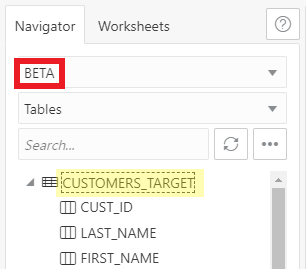

## Task 5: Create an Object Storage bucket and upload the sample data

The Oracle Cloud Infrastructure **Object Storage** service is an internet-scale, high-performance storage platform that offers reliable and cost-efficient data durability. The Object Storage service can store an unlimited amount of unstructured data of any content type, including analytic data and rich content, like images and videos. With Object Storage, you can safely and securely store or retrieve data directly from the internet or from within the cloud platform.

1. From the OCI console menu, click **Storage** and then select **Buckets** under Object Storage & Archive section.

  

2. From the Buckets page, make sure that you are in the Data Integration compartment you have created (`DI-compartment`) and then click on **Create Bucket**.

  

3. Fill out the Create Bucket dialog box:
    - **Bucket Name**: `DI-bucket`
    - **Default Storage Tier**: `Standard`
    - Leave the rest of the defaults and then click **Create**.

   *Note*: The Bucket Name should be unique within your tenancy's Object Storage namespace.

   

4. You should now see your new bucket in the **Buckets** page. Click on your bucket (`DI-bucket`).

  

5. You will upload the source files for the workshop data integration jobs in this bucket. Click on **Upload** button under Objects.

  

6. Drop or select the files **CUSTOMERS.json**, **REVENUE.csv**, **EMPLOYEES_1.csv**, **EMPLOYEES_2.csv**, **EMPLOYEES_3.csv** from your local directory where you unzipped the **OCI DI Workshop files.zip** file. Click **Upload**.

  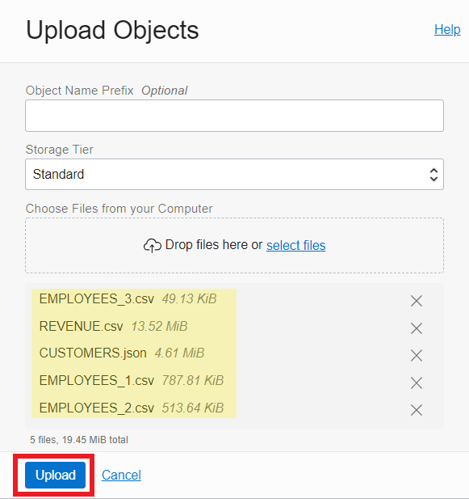

7. Once the files are uploaded, you will see the Finished state of the upload. Click **Close**.

  

8. The files are **uploaded and displayed** in the list of objects in your bucket.

  


   **Congratulations!**

## Learn More

* [Autonomous Data Warehouse](https://docs.oracle.com/en/cloud/paas/autonomous-data-warehouse-cloud/index.html)
* [Object Storage](https://docs.oracle.com/en-us/iaas/Content/Object/Concepts/objectstorageoverview.htm)
* [OCI Identity and Access Management](https://docs.oracle.com/en-us/iaas/Content/Identity/Concepts/overview.htm_)
* [Managing Groups in OCI](https://docs.oracle.com/en-us/iaas/Content/Identity/Tasks/managinggroups.htm)
* [Overview of VCNs and Subnets](https://docs.oracle.com/en-us/iaas/Content/Network/Tasks/managingVCNs_topic-Overview_of_VCNs_and_Subnets.htm#Overview)
* [Managing Compartments in OCI](https://docs.oracle.com/en-us/iaas/Content/Identity/Tasks/managingcompartments.htm)

## Acknowledgements

* **Author** - Theodora Cristea
* **Contributors** -  Aditya Duvuri, Rohit Saha
* **Last Updated By/Date** - Theodora Cristea, July 2021
