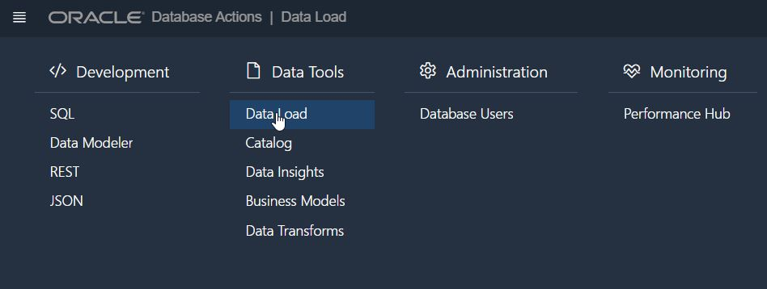
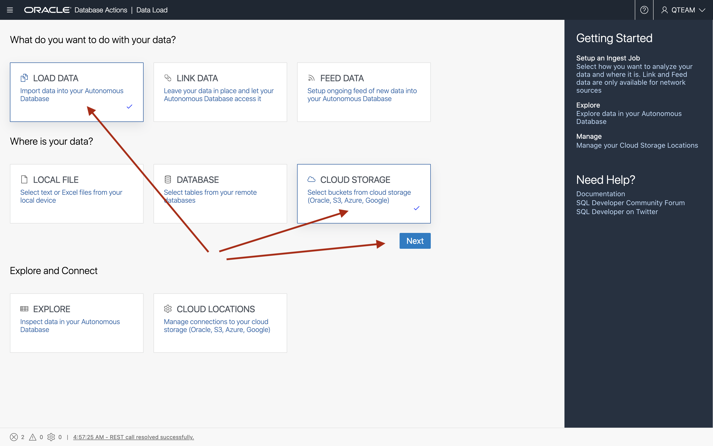
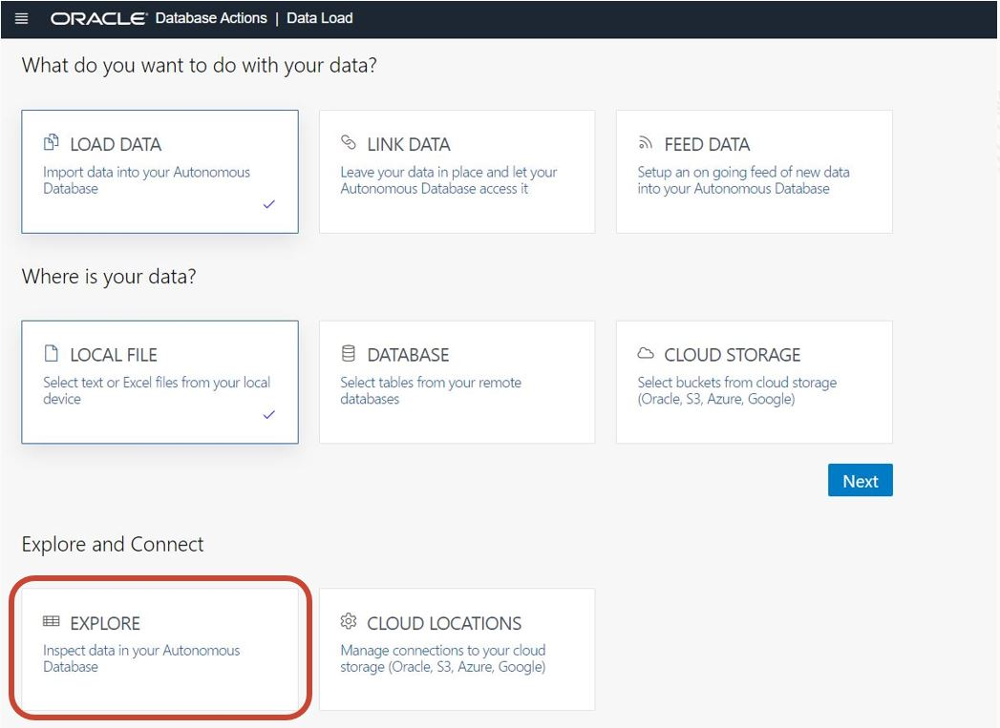
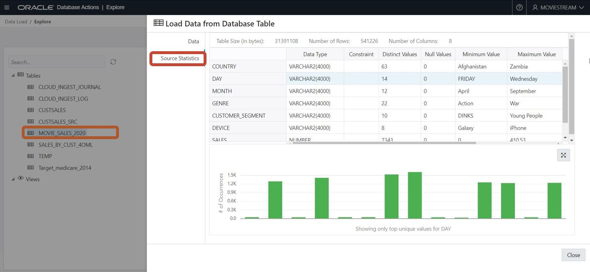


# Loading Data

## Introduction

This lab will load sample data in Autonomous Database for use with Lab 5 (Using Data Transforms).

Estimated Lab Time: 10 minutes

### Objectives

In this lab, you will:

- Load Data from Oracle Object Store to Autonomous Database

### Prerequisites

- All previous labs have been successfully completed.
- Basic familiarity of Autonomous Database

## Task 1: Load Data from Oracle Object Store to Autonomous Database

We need to load the `Movie_Sales_2020.csv` file which is stored in an Object Storage public bucket. We will set up connection to Oracle Object Store and load the file.

1. In Autonomous Database, navigate to **Data Load**.

    

2. On the Data Load main page, click the **Cloud Locations** card to define a new connection to your object store.

    

3. Click the **Add Cloud Storage** button on the upper right and define a Cloud Storage location as follows:

    | **Field** | **Value** | **Notes** |
    | --- | --- | --- |
    | Name | MOVIE_SALES | Lower case names not currently supported  |
    | Description |Movie Sales |  |
    | URI + Bucket | [https://objectstorage.uk-london-1.oraclecloud.com/n/adwc4pm/b/MovieStream/o/](https://objectstorage.uk-london-1.oraclecloud.com/n/adwc4pm/b/MovieStream/o/) |  |
    | Credential | No credential | Radio Button |

    

When you have completed these details, press **Create**.

4. Navigate back to the Data Load main page and press the two cards for **Load Data** from **Cloud Storage** and press **Next**. 

    

5. Locate the file `Movie_Sales_2020.csv` on the left of the screen. Drag this file on to the canvas on the right. 

    

6. As before, edit the properties of the data load job by pressing the pencil button. 

    

7. Review the information on the properties sheet. When you are satisfied, press the green arrow button to start the data load job. 

    

## Task 2: Inspect the Data 

1. Navigate to the Data Load main page and press the **Explore** card.

2. You'll now see the table MOVIE\_SALES\_2020 has been loaded into our Autonomous Data Warehouse. Click on this table and then click **Source Statistics** on the panel to the left of the screen. You can think of this as a UI on top of the statistics that drive the optimizer of Oracle Database. In this case this data presents a nice simple way to characterize the data we've just loaded. 

    

## Conclusion

In this section we've covered the following topics:

- Loading a CSV file from Object Store to Autonomous Database using the Data Load tool
- Reviewing the data and statistics

## Acknowledgements

- **Authors** - Jayant Mahto, ADB Product Management
- **Contributors** - Keith Laker, ADB Product Management
- **Last Updated By/Date** - Jayant Mahto, Brianna Ambler, June 2021