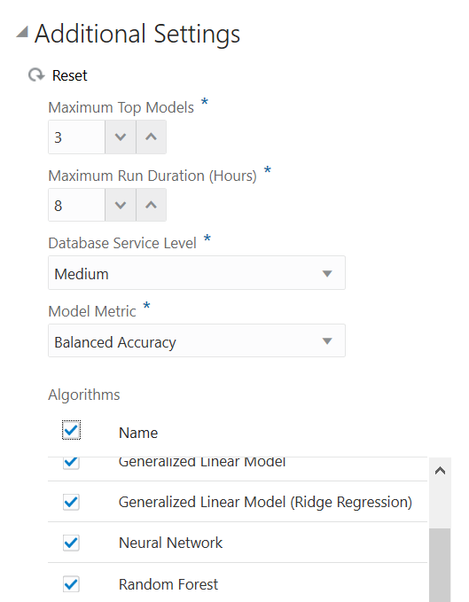
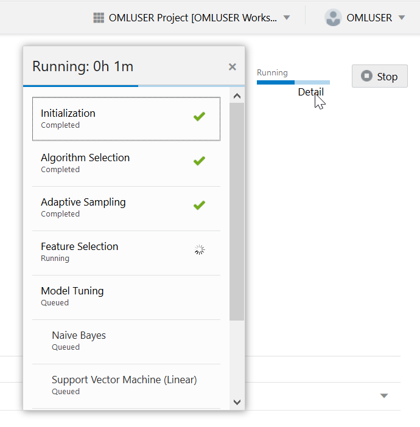
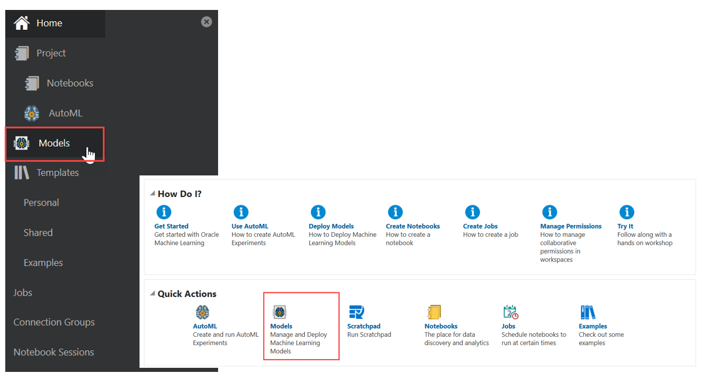
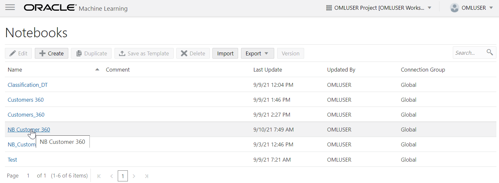
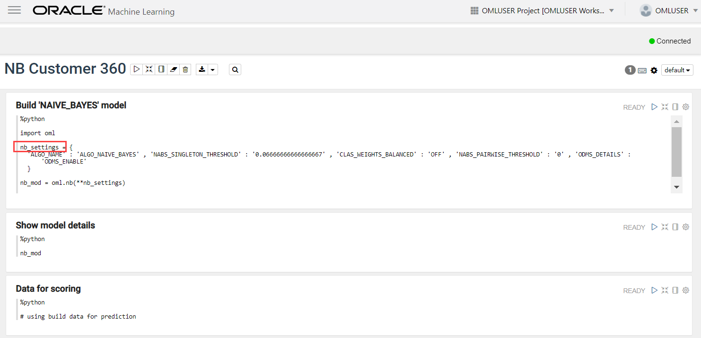

# Using Oracle Machine Learning AutoML UI

## Introduction

This lab walks you through the steps to create an AutoML experiment, edit and adjust experiment settings, view and deploy OML models.

Estimated Lab Time: 15 minutes

### About Oracle Machine Learning AutoML UI
Oracle Machine Learning AutoML UI (OML AutoML UI) is a no-code user interface supporting automated machine learning for both data scientist productivity and non-expert user access to powerful in-database algorithms. Like the OML4Py AutoML API, it accelerates machine learning projects by giving quick feedback on data set suitability for producing useful models – alleviating much of the drudgery of the machine learning process.
Oracle Machine Learning AutoML UI automates model building with minimal user input – you just have to specify the data and the target in what’s called an experiment and the tool does the rest. However, you can adjust some settings, such as the number of top models to select, the model selection metric, and even specific algorithms.
With a few clicks, you can generate editable _starter_ notebooks. These notebooks contain data selection, building the selected model – including the settings used to produce that model – and scoring and evaluation code – all in Python using OML4Py. You can build on this _generated notebook_ to apply your own domain expertise to augment the solution. Similarly, you can deploy models from OML AutoML UI as REST endpoints to Oracle Machine Learning (OML) Services in just a few clicks.

### Objectives

In this lab, you will learn how to:
* Access OML AutoML UI
* Create an experiment
* Edit and adjust experiment settings
* View the leaderboard and other settings
* Deploy models to OML Services
* View OML Models menu with deployed metadata and endpoint JSON
* Create a notebook for the top model
* View generated notebook and individual paragraphs

### Prerequisites

This lab assumes you have:
* An Oracle Machine Learning account
* All previous labs successfully completed

## Task 1: Access Oracle Machine Learning AutoML UI

To access AutoML UI, you must sign into the Oracle Machine Learning user interface, which also includes Oracle Machine Learning Notebooks, on Autonomous Database:
To sign into Oracle Machine Learning (OML) user interface from the Autonomous Database Service Console:

1. Select an Autonomous Database instance, and on the Autonomous Database details page click **Service Console**.

	

2. Click **Development**.

  

4. On the Development page click **Oracle Machine Learning Notebooks**.

	

5. Enter your username and password, and click **Sign in**. This opens the Oracle Machine Learning user interface homepage.

6. On your Oracle Machine Learning homepage, click **AutoML** in the Quick Actions section.

	

## Task 2: Create an Experiment
An Experiment can be described as a work unit that contains the definition of data source, prediction target, and prediction type along with optional settings. After an Experiment runs successfully, it presents you a list of machine learning models in the leader board. You can select any model for deployment, or use it to create a notebook based on the selected model.
When creating an Experiment, you must define the data source and the target of the experiment. To create an Experiment:

1. Click **AutoML** on your Oracle Machine Learning home page. Alternatively, you can go to the left navigation menu at the upper left corner of the page and click AutoML. The AutoML Experiments page opens.

	

2. Click **Create**. The Create Experiments page opens.

	

3. In the **Name** field, enter **Customers 360**.

	

4. In the **Comments** field, enter comments, if any.

5. In the **Data Source** field, click the search icon to open the Select Table dialog box. Select the **CUSTOMERS360** table and click **OK**.

6. In the **Predict** drop-down list, select the column **AFFINITY_CARD** from the ``CUSTOMERS360`` table. You can also type the column name and the column names are filtered for easier selection. This is the target for your prediction.

7. In the **Prediction Type** field, the prediction type is automatically selected based on target field data type and cardinality. In this lab, **Classification** is automatically selected.	The supported prediction types are:

	* Classification: For non-numeric data type, Classification is selected by default.
	* Regression: For numeric data type, Regression is selected by default.
8. In the **Case ID** field, select **CUST_ID**. For easier selection, you can also type the column name and the column names are filtered. The Case ID helps in data sampling and dataset split to make the results reproducible between experiments. It also aids in reducing randomness in the results. This is an optional field.  

### Task 2.1: Adjust Additional Settings
To adjust additional settings of this experiment:

1. Expand the **Additional Settings** section on the Experiments page, and make the following changes:

	

2. **Maximum Top Models:** Click the down arrow and set it to 3. This is the maximum number of top models to create. The default is 5 models. Fewer models built results is less time and the experiment will complete sooner.

3. **Maximum Run Duration:** This is the maximum time for which the experiment will be allowed to run. Retain the default entry 8. If you do not enter a time, then the experiment will be allowed to run up to the default, which is 8 hours am extreme upper bound.

4. **Database Service Level:** This is the database connection service level and query parallelism level. Default is **Low**. Change this to **Medium**.

	*  **High** level gives the greatest parallelism but significantly limits the number of concurrent jobs.
	*  **Medium** level enables some parallelism but allows greater concurrency for job processing.

>**Note:** Changing the database service level setting on the Always Free Tier will have no effect since there is a 1 OCPU limit. However, if you increase the OCPUs allocated to your autonomous database, then you can increase the Database Service Level to Medium or High.

5. Leave the other settings under **Additional Settings** as is, and click **Start** and then **Faster Results** to trigger the AutoML UI experiment to run.

	

	Note the following about the two options:

	* **Faster Results:** Select this option if you want to get candidate models sooner, possibly at the expense of accuracy. This option works with a smaller set of pipeline combinations and hence yields faster results.
	* **Better Accuracy:** Select this option if you want more pipeline combinations to be tried for possibly more accurate models. A pipeline is defined as an algorithm, selected data feature set, and set of algorithm hyperparameters.

> **Note:** This option works with the broader set of hyperparameter options recommended by the internal meta-learning model. Selecting Better Accuracy will take longer to run your experiment, but may provide models with more accuracy.

This completes the task of creating an experiment.

### Task 2.2 View Leader Board with Additional Metrics
When an experiment starts running, the status is displayed in a progress bar. When an experiment runs, it starts to show the results in the Leader Board. Click **Details** next to the **Stop** button to view the experiment run details, as shown in the screen shot.

The Leader Board displays the top performing models relative to the model metric selected along with the algorithm and accuracy. In this lab, you will view the additional metrics Precision, Recall, ROC AUC for the models:

1. Scroll down the Customer 360 experiments page to view the Leader Board section. The top three algorithms for this experiment are Neural Network, Naive Bayes, and  Random Forest.

	>**Note:** Only when the experiment is completed, can you perform any of these actions listed here, including metrics 	selection.

	

2. Click **Metrics**. The **Select Additional Metrics** dialog opens.

	

3. In the Select Additional Metrics dialog, click **Precision, Recall, ROC AUC**, and then click the close icon to close the dialog.

	

	The Leader Board now displays the selected metrics, as shown in the screenshot here. You can sort the rows by clicking the triangle to the right of each column name.

	

4. Click on any row in the Leader Board to enable the options - **Deploy, Rename**, and **Create Notebook**. Note that these options are greyed out if you do not click on the rows.

5. Click on the Naive Bayes model, and then click **Rename**. In the Rename Model dialog, enter `NB_Customer360` to rename the auto generated model name for Naive Bayes. Click **OK**.  	

	

6. Click **OK**. A confirmation message is displayed once the renaming is complete, and the leader board refreshes to display the renamed model.

	

5. Click on any model name to view the model details in the Model Detail dialog. Click **Prediction Impacts** and **Confusion Matrix** tab in the dialog to view the respective details, as shown in the screenshots below:

* **Prediction Impact:** Displays the importance of the attributes in terms of the target prediction of the models. In this lab, the attribute HOUSEHOLD_SIZE has the highest impact on target prediction. Move your cursor over the prediction impact chart for each attribute to view the values.

	

* **Confusion Matrix:** Characterizes the accuracy of a model, including the types of errors made. Confusion Matrix is usually computed on a test dataset and helps in assessing the model quality. Here, the Confusion Matrix results are classified into true positive (actual = predicted = 1) and true negative (actual = predicted  = 0), and false positive (actual = 0, predicted = 1) and false negative (actual = 1, predicted = 0).

	>Note: The values shown here * 100 represent percentages of the test data that correspond to each of the confusion matrix entries.

	

## Task 3: Deploy Top Model to OML Services
When you deploy a model using the OML AutoML UI, you create an Oracle Machine Learning Services endpoint for scoring. OML Services extends Oracle Machine Learning functionality to support model deployment and model lifecycle management for in-database OML models through REST APIs.

>**Note:** Through OML AutoML UI, you deploy only in-database models, and not ONNX-format models.

To deploy a model:  

1. Go to the AutoML Experiments page and click **Customer 360** to open the experiment.

2. Scroll down to the Leader Board, select the model **NB_CUSTOMER360** and click **Deploy**. The Deploy Model dialog opens.

	

	>**Note:** You can also deploy a model from the Models page. You can access the Models page from the home page and the left navigation menu.  

3. In the Deploy Models dialog, enter the following details:

	

4. In the **Name** field, the model name is displayed here by default. In this example, the name `NB_CUSTOMER360` is displayed. This is the name that you renamed in the previous step. Edit this name to change it to **NaiveBayes_CUST360**. The model name must be a unique alphanumeric name with a maximum of 50 characters.

5. In the **URI** field, enter **nb_cust360**. The URI must be alphanumeric, and the length must be max 200 characters.

6. In the **Version** field, enter **1.0**. The version must be in the format ``xx.xx`` where x is a number.

7. In the **Namespace** field, enter **DEMO**. This is the name for the model namespace. You can specify any name here to create different namespaces.

8. Click **Shared** to allow users with access to the database schema to view and deploy the model.

9. Click **OK**. After a model is successfully deployed, it is listed on the Deployments page. To go to the Deployments page, click **Models** in the left navigation menu. Alternatively, you can click **Models** on the home page.    

	

This completes the task of deploying the top model Naive Bayes to OML Services.

## Task 4: View OML Models with Deployed Metadata and JSON Endpoint

The deployed models are listed under **Deployments** on the Models page. To view the metadata of the deployed model **NaiveBayes_CUST360**:

1. To go to Deployments, click the hamburger icon  and then click  **Models** on the left navigation menu. Alternatively, you can click **Models** on the Oracle Machine Learning home page.

  

2. On the Models page, click **Deployments**.

	

2. The deployed model **NaiveBayes_CUST360** is listed along with the metadata - Shared, version, namespace, owner, deployed date and URI under **Deployments** on the Models page.

	

3. To view the metadata of the deployed model, click the name of the deployed model `NaiveBayes_CUST360`. The model metadata is listed in the **Model metadata for NaiveBayes_CUST360** dialog.

	

4. To view the endpoint JSON, click the URI `nb_cust360`. All details of the deployed model are listed in the **OPEN API Specification for NaiveBayes_CUST360** dialog, as shown in the screenshot. Scroll down to view all details of the endpoint.

	

This completes the task of viewing the metadata of the deployed model, and its endpoint.

## Task 5: Create a Notebook for the Top Model
You can create notebooks based on the top models produced in the experiment. This recreates the selected model using the same settings. This option is helpful if you want to use the code to re-create a similar machine learning model. To create a notebook:

1. Go to the AutoML page and click the Customers 360 experiment.  

2. Scroll down to the Leader Board, click on the Naive Bayes model row, and then click **Create Notebook**. The Create Notebook dialog opens.

 	

3. In the Create Notebook dialog, enter **NB Customers 360** in the **Notebook Name** field.

	

4. Click **OK**. The notebook is created and listed in the Notebooks page. The message _Notebook NB Customer 360 successfully created_ is also displayed.

			

This completes the task of creating the notebook NB Customer 360 based on the Naive Bayes model that is created by the AutoML experiment Customers 360.

## Task 6: View Generated Notebook and Individual Paragraphs
To view the generated notebook Customer 360:

1. Click the hamburger icon  to open the left navigation menu and click **Notebooks**.

2. The Notebooks page opens with all the notebooks listed in it. Click the **NB Customers 360** notebook to open it.

 	

3. The generated notebook _NB Customer 360_  opens in the notebook editor. This notebook contains the pre-generated heading _Oracle Machine Learning AutoML UI - Experiment - Generated Notebook_. Scroll down to view all the paragraphs in the notebook.

* The paragraph titled _Oracle Machine Learning AutoML UI - Experiment - Generated Notebook_ contains the experiment metadata. Click the  Run icon to run the markdown paragraph and view the metadata.

	

* The paragraph titled _Get proxy object for selected data_ contains the code to get the proxy object for the data used in the experiment, which is the Customers360 table here. The paragraph titled _Prepare Training Data_ contains the code to prepare the training data.

	

* The paragraph titled _Build Model_ contains the code to build the model. In this lab, it is the Naive Bayes model. The settings used to produce the model using AutoML are provided here in the ``nb_settings`` variable. The fourth paragraph contains the code to view the model details.

	

* The fifth paragraph contains the code to score the data, and the last paragraph to view the model quality metric.

	

This completes the task of creating a notebook based on a model and viewing the paragraphs contained in it.

## Learn More

* [About OML AutoML UI](https://docs.oracle.com/en/database/oracle/machine-learning/oml-automl-ui/index.html)
* [Blog: OML AutoML UI](https://blogs.oracle.com/machinelearning/post/introducing-oml-automl-user-interface)

## Acknowledgements
* **Author** - Moitreyee Hazarika, Principal User Assistance Developer, Database User Assistance Development
* **Contributors** -  Mark Hornick, Senior Director, Data Science and Machine Learning; Sherry LaMonica, Principal Member of Tech Staff, Advanced Analytics, Machine Learning
* **Last Updated By/Date** - Moitreyee Hazarika, November, 2021
