# Get started with Oracle Cloud Free Tier Setup

## Introduction
This lab walks you through the steps to set up your Oracle Cloud Free Tier environment that includes provisioning an Oracle Autonomous Database, and signing into Oracle Machine Learning user interface.

Estimated Lab Time: 15 minutes

### Objectives

In this lab, you will learn how to:

* Provision an Oracle Autonomous Database
* Create an Oracle Machine Learning user
* Sign into Oracle Machine Learning user interface
* Create the CUSTOMERS360 table.

	>**Note:** You will use this table in the _Using Oracle Machine Learning AutoML UI_ lab and _Using Oracle Machine Learning Services_ lab.

### Prerequisites
* Sign up for a Free Tier Oracle Cloud account.

> **Note:** You may see differences in account details (eg: Compartment Name is different in different places) as you work through the labs. This is because the workshop was developed using different accounts over time.


## Task 1: Provision an Oracle Autonomous Database

To provision an Oracle Autonomous Database:

1. Sign into your OCI account, and under the Launch Resources section, click **Create an ADW database**.

	

	 Alternatively, you may click the left navigation pane on the upper left corner, and click **Autonomous Data Warehouse** under **Oracle Database**.

	

2. From the Oracle Cloud Infrastructure console, on the Oracle Autonomous Database page choose your region and select a compartment. Click **Create Autonomous Database**. This opens the Create Autonomous Database page.

   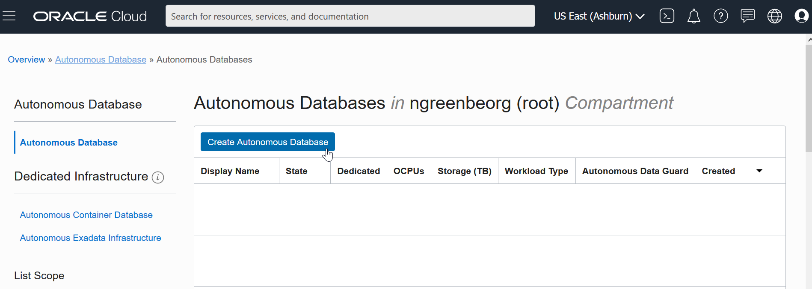

3. On the Create Autonomous Database page, provide the basic information about the database. By default, a database name and a display name for the database are provided. You can modify these names to enter a user-friendly display name for the ADB instance to easily identify the resource. The display name does not have to be unique.    

   

4. For Workload Type, click **Data Warehouse**.

	 

5. For Deployment, select **Shared Infrastructure**.

	 

6. For Database Configuration, select Always Free. For the Always Free option, the database configuration options - OCPU count, Storage, and Auto scaling are not available. You must upgrade to a paid account to avail of it.

	 >**Note:** You can create Always Free resources both in Free Tier and Paid accounts

  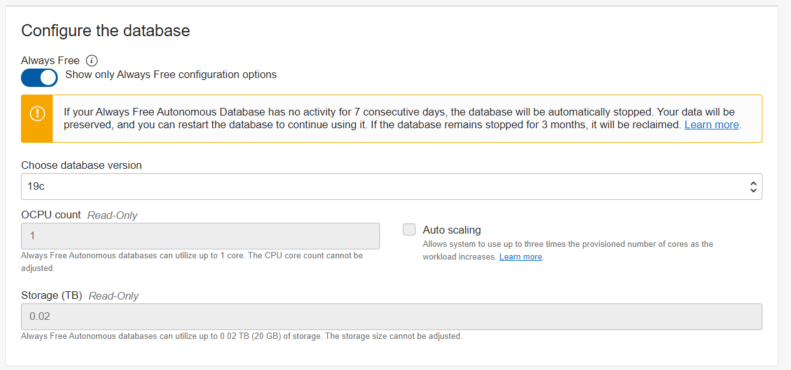

7. Create your Autonomous Database administrator credentials by providing a password. You will need these credentials to sign into this Autonomous Database instance.   

	>**Note:** The default administrator username is ADMIN.

	

8. For network access, select **Allow secure access from everywhere.**

    

9. For License, select **License Included**.

    

10. Click **Create Autonomous Database**. The Oracle Autonomous Data Warehouse instance starts provisioning. Once your Autonomous Database is created, the database details are listed with the status Available.

	  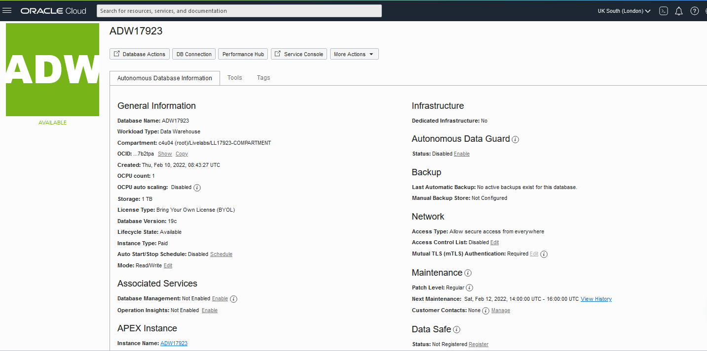

This completes the task of provisioning an Oracle Autonomous Database.

## Task 2: Create an Oracle Machine Learning user

An administrator creates a new user account and user credentials for Oracle Machine Learning in the User Management interface.

>**Note:** You must have the administrator role to access the Oracle Machine Learning User Management interface.

To create a user account:

1. Sign into your OCI account, click the hamburger on the left to open the left navigation pane, and click **Autonomous Data Warehouse**.

	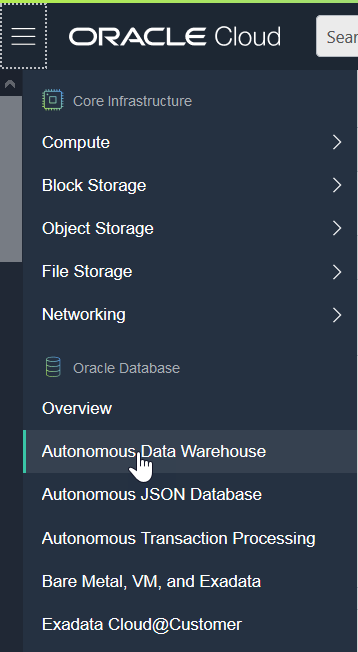


2. Click on the Autonomous Database instance.   

	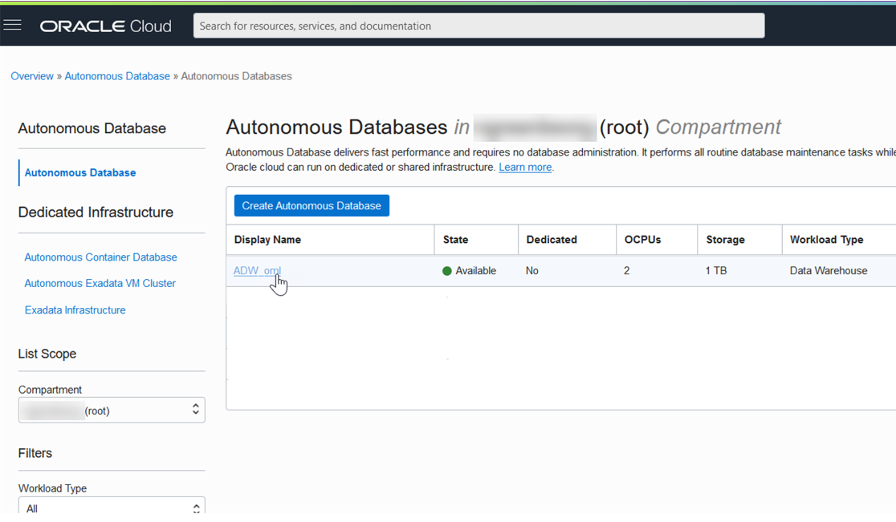


3. On the Autonomous Database Details page, click **Service Console**.

	


4. On the Service Console, click **Administration**.

	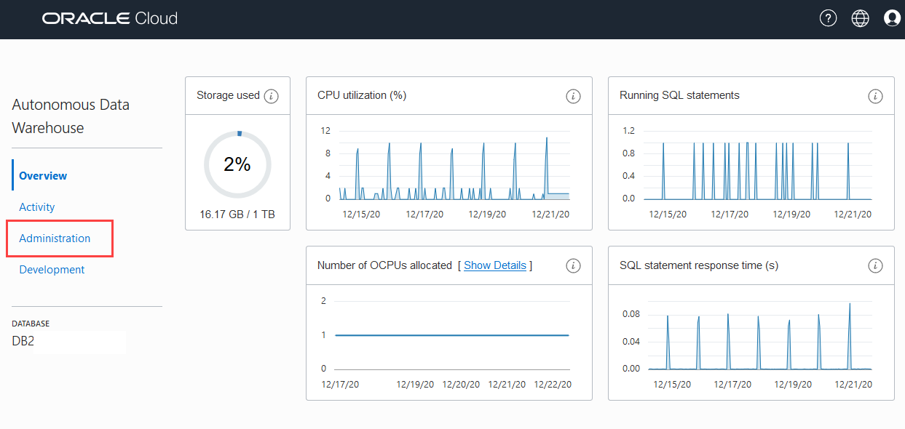


5. Click **Manage Oracle ML Users** to open the Oracle Machine Learning User Administration page.

	

6. On the Oracle Machine Learning User Administration Sign in page, enter the username and password to sign in.

	>**Note:** The username is ADMIN. The password is what is you have defined while provisioning the Autonomous Database instance.   

	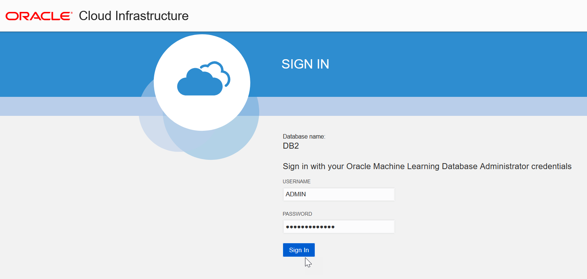

7. Click **Create** on the Oracle Machine Learning User Administration page.

	

8. On the Create User page, enter the following details to create the user:

	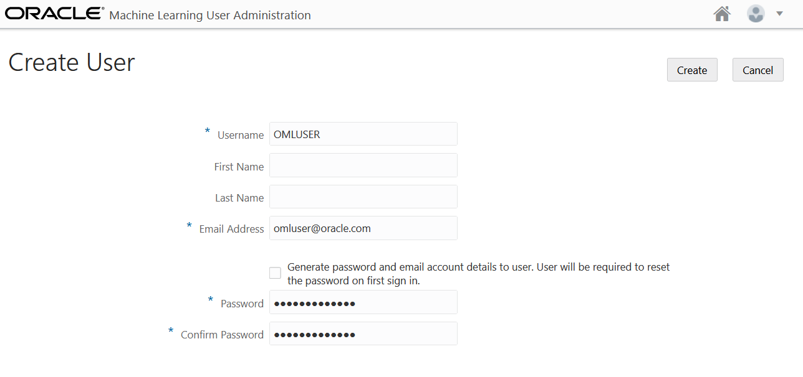

	* **Username:** Enter a username for the account. Using the username, the user will log in to an Oracle Machine Learning instance.
	* **First Name:** Enter the first name of the user.
	* **Last Name:**  Enter the first name of the user.
	* **Email Address:** Enter the email ID of the user.
	* Deselect the option **Generate password and email account details to user. User will be required to reset the password on first sign in**. This option auto generates a temporary password and sends an email with the account credentials to the user. If you select this option, you need not define the password in the **Password** and **Confirm Password** fields, as these two fields are disabled.
	* **Password:** Enter a password for the user.
		>**Note:** This option is disabled if you select the **Generate password...** option to auto generate a temporary password for the user.

	* **Confirm Password:** Enter the password to confirm the value that you entered in the **Password** field. By doing so, you create the password for the user. The user can change the password when first Signing in.

8. Click **Create**. After the user is created, it is listed on the Oracle Machine Learning User Administration page. This completes the task of creating an Oracle Machine Learning user.

	 

	 > **Note:** Click on the home icon on the top right corner of the Oracle Machine Learning User Administration page to open the Oracle Machine Learning Notebooks home page.


## Task 3: Sign into Oracle Machine Learning

A notebook is a web-based interface for data analysis, data discovery, data visualization, and collaboration. You create and run notebooks in Oracle Machine Learning user interface. You can access Oracle Machine Learning user interface from Autonomous Database.

1. From the tab on your browser with your ADW instance, click **Service Console**, then select **Development** on the left.

	


2. Click **Oracle Machine Learning Notebooks User Interface.**

	 

3. Enter your user credentials and click **Sign in**.

	>**Note:** The credential is what you have defined while creating the Oracle Machine Learning user.

	

  This opens the Oracle Machine Learning user interface home page.

	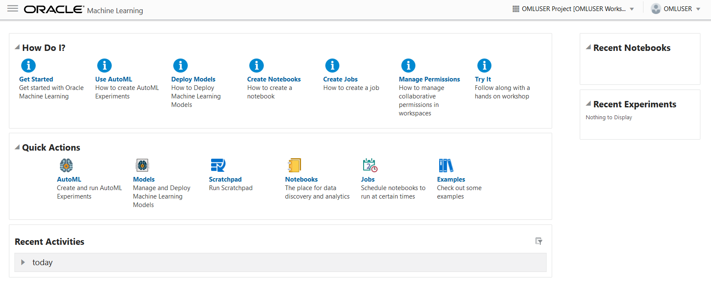


This completes the task of signing into Oracle Machine Learning user interface.

## Task 4: Create the CUSTOMERS360 table

In this step, you will create the table ``CUSTOMERS60`` by using the Scratchpad. The Scratchpad is a one-click access to a notebook for running SQL statements, PL/SQL scripts, and Python scripts. The Scratchpad is available on the Oracle Machine Learning Notebooks home page. After you run your scripts, the Scratchpad is automatically saved as a notebook by the default name _Scratchpad_ in the Notebooks page. You can access it later in the Notebooks page. You will learn more about notebooks in Lab 1.

>**Note:** You will be using the table CUSTOMERS360 in the _Using Oracle Machine Learning AutoML UI_ lab and _Using Oracle Machine Learning Services_ lab.

To create the table:

1. On the Oracle Machine Learning home page, click **Scratchpad**. The Scratchpad opens.

	


2. By default, the Scratchpad opens with three paragraphs: `%sql` (SQL), `%script` (PL/SQL), and `%python` (Python). Here, you will use the SQL paragraph to run a SQL statement to create the CUSTOMER360 table. On the SQL paragraph, click after the `%sql` tag, and press enter.

	

3. In the SQL paragraph, enter the following script and click the Run icon :

    ```
    <copy>
		CREATE TABLE CUSTOMERS360 AS
              (SELECT a.CUST_ID, a.CUST_GENDER, a.CUST_MARITAL_STATUS,
                 a.CUST_YEAR_OF_BIRTH, a.CUST_INCOME_LEVEL, a.CUST_CREDIT_LIMIT,
                 b.EDUCATION, b.AFFINITY_CARD,
                 b.HOUSEHOLD_SIZE, b.OCCUPATION, b.YRS_RESIDENCE, b.Y_BOX_GAMES
           FROM SH.CUSTOMERS a, SH.SUPPLEMENTARY_DEMOGRAPHICS b
           WHERE a.CUST_ID = b.CUST_ID);
		</copy>
    ```

	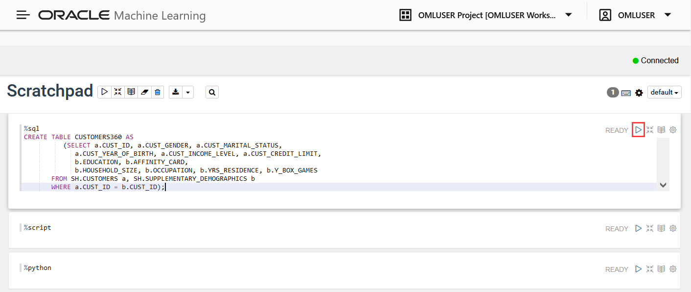

	After the script runs successfully, the status changes to `FINISHED`, as shown in the screenshot.

	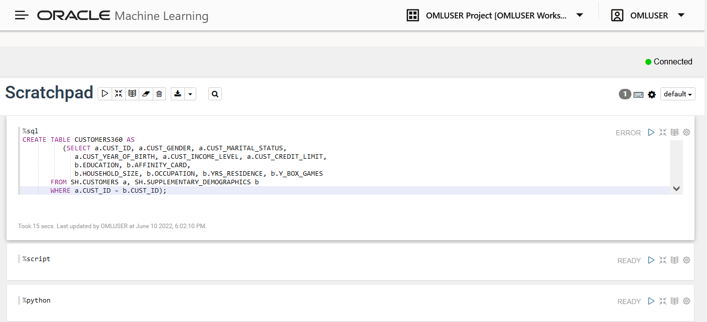

6. In the next paragraph, edit the paragraph tag to change it to `sql`, run the following statement to view the data:

	```
		<copy>
		select * from CUSTOMERS360
			where rownum < 10;
		 </copy>
	 ```


	

This completes the task of creating the CUSTOMERS360 table.

You may now proceed to the next lab.

## Learn More

* [Get Started with Oracle Machine Learning for Python](https://docs.oracle.com/en/database/oracle/machine-learning/oml4py/1/mlpug/get-started-with-oml4py.html#GUID-B45A76E6-CE48-4E49-B803-D25CA44B09ED)
* [Oracle Machine Learning Notebooks](https://docs.oracle.com/en/database/oracle/machine-learning/oml-notebooks/)

## Acknowledgements
* **Author** - Moitreyee Hazarika, Principal User Assistance Developer, Database User Assistance Development
* **Contributors** -  Mark Hornick, Senior Director, Data Science and Machine Learning; Marcos Arancibia Coddou, Product Manager, Oracle Data Science; Sherry LaMonica, Principal Member of Tech Staff, Advanced Analytics, Machine Learning
* **Last Updated By/Date** - Moitreyee Hazarika, February 2022
