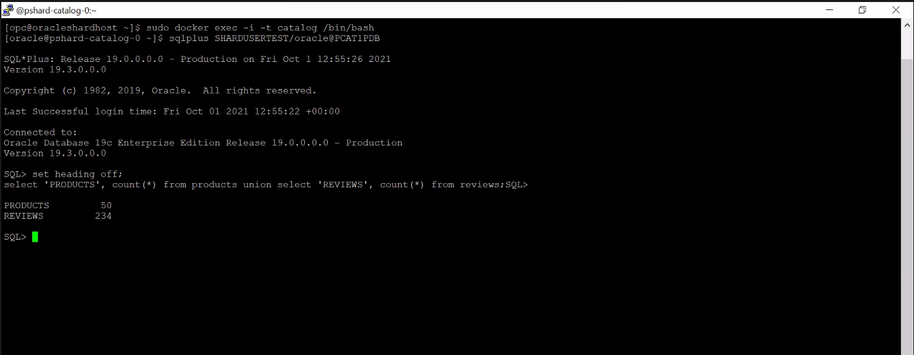
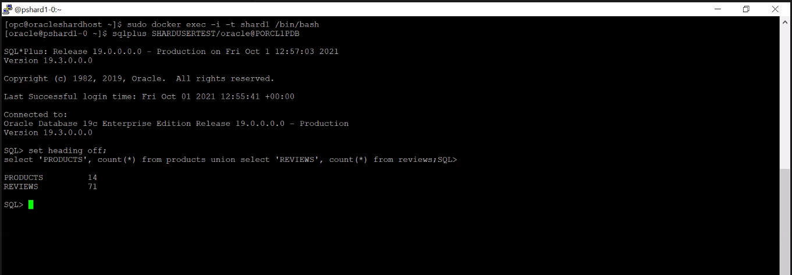

# Exploring Sharding Topology

## Introduction   
Docker is a set of platform-as-a-service products that use OS-level virtualization to deliver software in packages called containers. Docker containers are used to deploy the Oracle Sharding topology and the eShop application.

In this workshop, we attempt to use minimal resources to show the demonstration, and in the process we chose a single compute instance to install all of the Oracle Sharding components and the eShop application as containers.

You can find more details at [Oracle Sharding on Docker](https://github.com/oracle/db-sharding/tree/master/docker-based-sharding-deployment)


*Estimated Lab Time*: 20 Minutes

   

As shown in the diagram above, the sharded database is deployed as multiple containers all running within the same Compute VM.


### Objectives
In this lab, you will:
* Explore Sharding environment.
* Understand Sharding architecture and its components.

### Prerequisites
This lab assumes you have:
- A Free Tier, Paid or LiveLabs Oracle Cloud account
- You have completed:
    - Lab: Prepare Setup (*Free-tier* and *Paid Tenants* only)
    - Lab: Environment Setup
    - Lab: Initialize Environment


## Task 1: Check for containers in your VM

1. Open a terminal window and execute below as **opc** user.

    ```
    <copy>
    sudo docker ps -a
    </copy>
    ```

     

## Task 2: Connect to Shard director

A **shard director** is a specific implementation of a global service manager that acts as a regional listener for clients that connect to a sharded database. The director maintains a current topology map of the sharded database. Based on the sharding key passed during a connection request, the director routes the connections to the appropriate shard. The key capabilities of shard directors are as follows.

-	Maintain runtime data about sharded database configuration and availability of shards.
-	Measure network latency between its own and other regions.
-	Act as a regional listener for clients to connect to a sharded database.
-	Manage global services.
-	Perform connection load balancing

**Global Data Services Control Utility (GDSCTL):**  GDSCTL is a command-line interface used to configure the sharded database topology. You can connect to the shard director (global services manager) server and run the following GDSCTL commands to validate the Oracle Sharding environment.

For more details check [GDSCTL with Oracle Sharding] (https://docs.oracle.com/en/database/oracle/oracle-database/19/shard/oracle-sharding-reference1.html#GUID-15553DBF-2D49-4A2B-B49D-5770414ED2A3)

1. Run in the terminal as **opc** user and connect to the shard directory server.
    ```
    <copy>
    sudo docker exec -i -t gsm1 /bin/bash
    </copy>
    ```

    

2. Verify sharding topology using the  **CONFIG** command.

    ```
    <copy>
    gdsctl config database
    </copy>
    ```

    

3. Lists all of the database shards and the chunks that they contain.

    ```
    <copy>
    gdsctl config chunks
    </copy>
    ```

    

4. Display information about all table families in the sharded database.

    ```
    <copy>
    gdsctl config table family
    </copy>
    ```

    

5. Show all the services in the user's Global Data Services pool.

    ```
    <copy>
    gdsctl config service
    </copy>
    ```

    

6. Check  for DDL statements execution status.

    ```
    <copy>
    gdsctl show ddl
    </copy>
    ```

    

7. Check list of CDBs in the catalog.

    ```
    <copy>
    gdsctl config cdb
    </copy>
    ```
    

## Task 3: Connect to Catalog

**Shard Catalog:** The shard catalog is a special-purpose Oracle Database that is a persistent store for sharded database configuration data and plays a key role in centralized management of a sharded database. All configuration changes, such as adding and removing shards and global services, are initiated on the shard catalog. All DDLs in a sharded database are executed by connecting to the shard catalog.

The shard catalog also contains the master copy of all duplicated tables in a sharded database. The shard catalog uses materialized views to automatically replicate changes to duplicated tables in all shards. The shard catalog database also acts as a query coordinator used to process multi-shard queries and queries that do not specify a sharding key.

A shard catalog serves following purposes.

-	Serves as an administrative server for entire sharded database
-	Stores a gold copy of the database schema
-	Manages multi-shard queries with a multi-shard query coordinator
-	Stores a gold copy of duplicated table data

For more details see [Oracle Sharding documentation] (https://docs.oracle.com/en/database/oracle/oracle-database/19/shard/oracle-sharding-architecture-and-concepts1.html#GUID-5D5E33CA-0770-4659-8D1F-888DA552366B)

1. Run in the terminal as **opc** user and connect to the shard catalog server.

    ```
    <copy>
    sudo docker exec -i -t catalog /bin/bash
    </copy>
    ```

    

2. Connect to the shard schema in catalog server.

    ```
    <copy>
    sqlplus SHARDUSERTEST/oracle@PCAT1PDB
    </copy>
    ```

3. Check core pre-loaded shard tables in shard schema.

    ```
    <copy>
    set pagesize 300;
    set linesize 300;
    col OBJECT_NAME for a30;
    col Sharding for a30;
    select OBJECT_NAME,SHARDED as Sharding from user_objects where SHARDED='Y' and OBJECT_NAME in ('PRODUCTS','REVIEWS','CUSTOMER','CART');
    </copy>
    ```

4. Check the row count on the Product & Review shard tables.

     ```
    <copy>
    set heading off;
    select 'PRODUCT', count(*) from products union select 'REVIEWS', count(*) from reviews;
    </copy>
    ```

   

## Task 4: Connect to Shard 1 Database

**Sharded Database and Shards** Each shard in the sharded database is an independent Oracle Database instance that hosts a subset of a sharded database's data. Shared storage is not required across the shards.

Shards can be hosted anywhere an Oracle database can be hosted. Oracle Sharding supports all of the deployment choices for a shard that you would expect with a single instance or clustered Oracle Database, including on-premises, any cloud platform, Oracle Exadata Database Machine, virtual machines, and so on.

For more details see [Oracle Sharding documentation] (https://docs.oracle.com/en/database/oracle/oracle-database/19/shard/oracle-sharding-architecture-and-concepts1.html#GUID-AD61049F-4A94-4298-A8CD-8F2536399CAD)

1.  Run in the terminal as **opc** user and connect to the shard1 DB.

    ```
    <copy>
    sudo docker exec -i -t shard1 /bin/bash
    </copy>
    ```

2. Connect to the shard schema in one of the shard database.

    ```
    <copy>
    sqlplus SHARDUSERTEST/oracle@PORCL1PDB
    </copy>
    ```

3. Check core pre-loaded shard tables in shard schema.

    ```
    <copy>
   set pagesize 300;
   set linesize 300;
   col OBJECT_NAME for a30;
   col Sharding for a30;
   select OBJECT_NAME,SHARDED as Sharding from user_objects where SHARDED='Y' and OBJECT_NAME in ('PRODUCTS','REVIEWS','CUSTOMER','CART');
    </copy>
    ```

4. Check the row count for the Product & Review shard tables in one of the shard database.

    ```
    <copy>
    set heading off;
    select 'PRODUCT', count(*) from products union select 'REVIEWS', count(*) from reviews;
    </copy>
    ```

    

   You can find the difference in the row count between the shard catalog and the shard-database (porcl1cdb\_porcl1pdb, porcl2cdb\_porcl2pdb, porcl3cdb\_porcl3pdb).

## **Appendix 1**: Sharding Overview & Architecture

**Oracle Sharding** is a feature of Oracle Database that lets you automatically distribute and replicate data across a pool of Oracle databases that share no hardware or software. Oracle Sharding provides the best features and capabilities of mature RDBMS and NoSQL databases.

  

**Core Components of the Oracle Sharding Architecture**

1. **Partitions, Tablespaces and Chunks:** Distribution of partitions across shards is achieved by creating partitions in tablespaces that reside on different shards.

2. **Tablespace Sets:** Oracle Sharding creates and manages tablespaces as a unit called a TABLESPACE SET.

3. **Sharding Methods:** The following topics discuss sharding methods supported by Oracle Sharding, how to choose a method, and how to use subpartitioning.

4. **Sharded Database Schema Objects:** To obtain the benefits of sharding, the schema of a sharded database should be designed in a way that maximizes the number of database requests executed on a single shard. The following topics define and illustrate the schema objects that form a sharded database to inform your design.

For more details see [Oracle Sharding documentation] (https://docs.oracle.com/en/database/oracle/oracle-database/19/shard/oracle-sharding-architecture-and-concepts1.html#GUID-9DC0048A-2D6E-4759-BA80-10F8855E6871)

**Oracle Sharding Components**

1. **Shard Director:** Shard directors are network listeners that enable high performance connection routing based on a sharding key.

2. **Global Service:** A global service is a database service that is use to access data in a sharded database.

3. **Shard Catalog:** A shard catalog is an Oracle Database that supports automated shard deployment, centralized management of a sharded database, and multi-shard queries.

4. **Sharded Database and Shards:** A sharded database is a collection of shards.


**Sharded database schema objects**

To obtain the benefits of sharding, the schema of a sharded database should be designed in a way that maximizes the number of database requests executed on a single shard. The following topics define and illustrate the schema objects that form a sharded database to inform your design.

**Sharded Tables:** A database table is split up across the shards, so that each shard contains the table with the same columns, but a different subset of rows. A table split up in this manner is called a sharded table.

**Sharded Table Family:** A sharded table family is a set of tables that are sharded in the same way. Often there is a parent-child relationship between database tables with a referential constraint in a child table (foreign key) referring to the primary key of the parent table.

**Duplicated Tables:** In Oracle Sharding a table with the same contents in each shard is called a duplicated table.

**Non-Table Objects Created on All Shards:** In addition to duplicated tables, other schema objects, such as users, roles, views, indexes, synonyms, functions, procedures, and packages, and non-schema database objects, such as tablespaces, tablespace sets, directories, and contexts, can be created on all shards.

Click [here] (https://github.com/alexkovuru/Oracle-Shard-Schema-Design/blob/main/Shard_Schema_Design.txt) for more details.


## **Appendix 2**: Sharding Methods

The following topics discuss sharding methods supported by Oracle Sharding, how to choose a method, and how to use subpartitioning.

- **System-Managed Sharding:** System-managed sharding is a sharding method which does not require the user to specify mapping of data to shards. Data is automatically distributed across shards using partitioning by consistent hash. The partitioning algorithm evenly and randomly distributes data across shards.

- **User-Defined Sharding:** User-defined sharding lets you explicitly specify the mapping of data to individual shards. It is used when, because of performance, regulatory, or other reasons, certain data needs to be stored on a particular shard, and the administrator needs to have full control over moving data between shards.

- **Composite Sharding:** The composite sharding method allows you to create multiple shardspaces for different subsets of data in a table partitioned by consistent hash. A shardspace is set of shards that store data that corresponds to a range or list of key values.

- **Using Subpartitions with Sharding:** Because Oracle Sharding is based on table partitioning, all of the subpartitioning methods provided by Oracle Database are also supported for sharding.

In this demonstration, we choose the **system-managed sharding.**

For more details see [Oracle sharding documentation] (https://docs.oracle.com/en/database/oracle/oracle-database/19/shard/sharding-overview.html#GUID-3427DEDA-39E8-4E92-9A47-D0C65A240223)

Below are Sample sharded table DDLs:

 ```
    CREATE SHARDED TABLE "CUSTOMER_AUTH"
	( "USER_ID" NUMBER NOT NULL ENABLE,
	"EMAIL" VARCHAR2(200 BYTE) NOT NULL ENABLE,
	"PASSWORD" VARCHAR2(100 BYTE) NOT NULL ENABLE,
	PRIMARY KEY ("USER_ID")
	)
    TABLESPACE SET TTTSP_SET_1   PARTITION BY CONSISTENT HASH (USER_ID) PARTITIONS AUTO;
```

```
    CREATE SHARDED TABLE "PRODUCTS"
       ( "SKU" VARCHAR2(255 BYTE) NOT NULL ENABLE,
         "JSON_TEXT" CLOB,
          CHECK ("JSON_TEXT" is json strict) ENABLE,
          PRIMARY KEY ("SKU")
      ) TABLESPACE SET TTTSP_SET_2 PARTITION BY CONSISTENT HASH (SKU) PARTITIONS AUTO;
 ```

You may now [proceed to the next lab](#next).

## Learn More

- [Oracle Sharding Documentation] (https://docs.oracle.com/en/database/oracle/oracle-database/19/shard/sharding-overview.html#GUID-0F39B1FB-DCF9-4C8A-A2EA-88705B90C5BF)

## Acknowledgements
* **Authors** - Shailesh Dwivedi, Database Sharding PM , Vice President
* **Contributors** - Balasubramanian Ramamoorthy, Alex Kovuru, Nishant Kaushik, Ashish Kumar, Priya Dhuriya, Richard Delval, Param Saini,Jyoti Verma, Virginia Beecher, Rodrigo Fuentes
* **Last Updated By/Date** - Priya Dhuriya, Staff Solution Engineer - July 2021
