# Creating the Application

## Introduction

You will get started by creating a skeleton application and you will add to it in each lab until you have built a full application that allows you to create and manage a personal list of movies you have watched or want to watch.

You will also need to sign up for an account on The Movie Database and obtain an API Key. A TMDB API Key is required for this tutorial, as authentication is needed to get data from The Movie Database API.

Estimated Lab Time: 5 minutes

### Objectives
In this lab, you will:  
- Create a new application.  
- Edit the appearance and theme of your application.  
- Run your application.  
- Sign up for a TMDB API key.

## Task 1: Connecting to your Oracle Cloud Database

1. Log in to the Oracle Cloud at <a href="https://cloud.oracle.com">cloud.oracle.com</a>. Cloud Account Name is howarduniversity. Click "Next".
2. Click on "Direct Sign-In" and enter your Cloud Account email and password.

    

3. Once you are logged in, you are taken to the cloud services dashboard where you can see all the services available to you. Click the navigation menu in the upper left to show top level navigation choices.

    


4. Click **Autonomous Data Warehouse**.

    

5. From the Compartment drop down on the left side of the page, expand howarduniversity->spring2022->student1xx and select you student number.

    

6. Click on the database you created in lab 1
   
    
    
## Task 2: Setting Up APEX

After you are connected and clicked on your database, we need to set up APEX and create a database user for the database application we will use for it. Until now we have been using the ADMIN account to use the database, but in real world deployments you would never do that but instead create a different account.

1. Scroll down to where it says “APEX Instance” and click on the link right next to “Instance Name”, which should be your database name.

    

2. This will take you to the APEX page. Click on “Launch APEX”. This step, or some of the following steps may take a few minutes and your screen may remain blank. Don’t worry.

    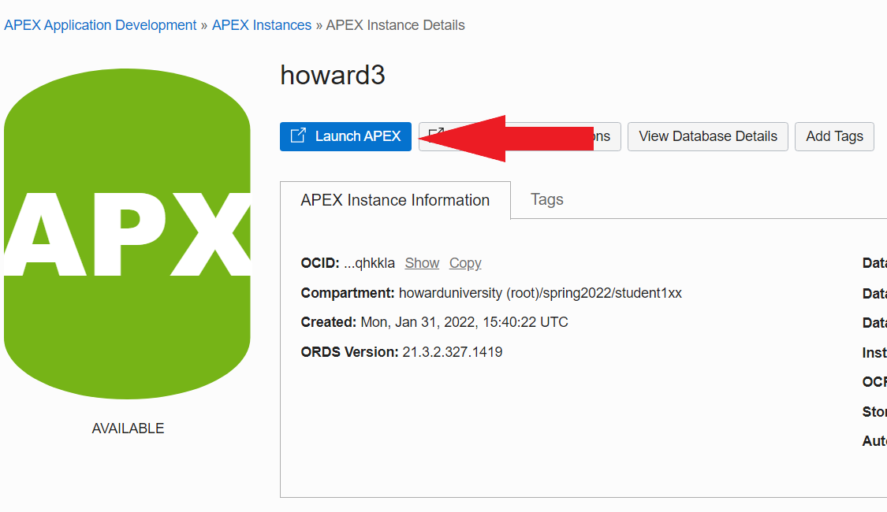

3. When done the APEX “Administration Services” window will appear. Here you need to type the Password that you used to create your database in Lab 1.

    

4. You will be re-directed to the APEX Welcome page. Click on “Create Workspace”.
   
    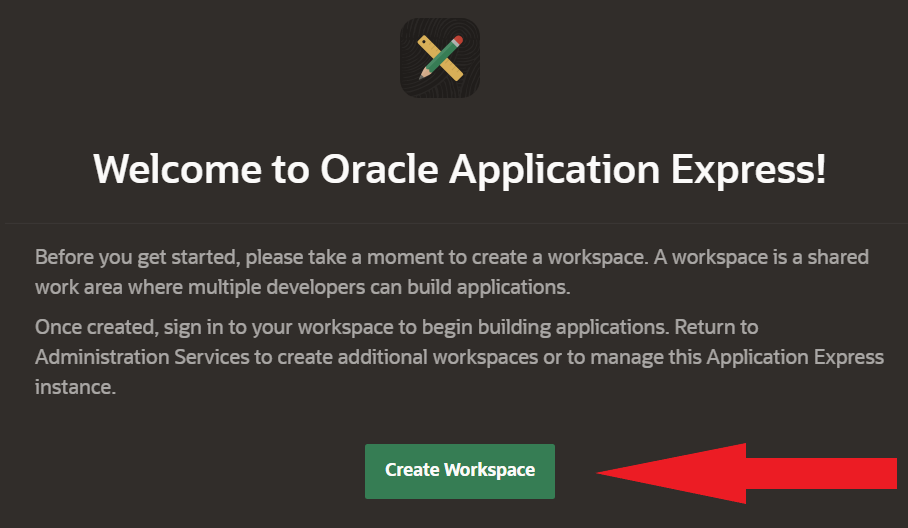

5. This is where you will create a new database user. 
    - <b>Database User:</b> make the database user your name so it will be easier for you to remember.
    - <b>Password:</b> For the password field pick a new password, I suggest you use the same password you just used in the previous step (your database ADMIN user password), to make it easier to remember all passwords.
    - <b>Workspace Name:</b> Use the same name as what you are using for the <b>Database User</b>.
  
  Click “Create Workspace”

    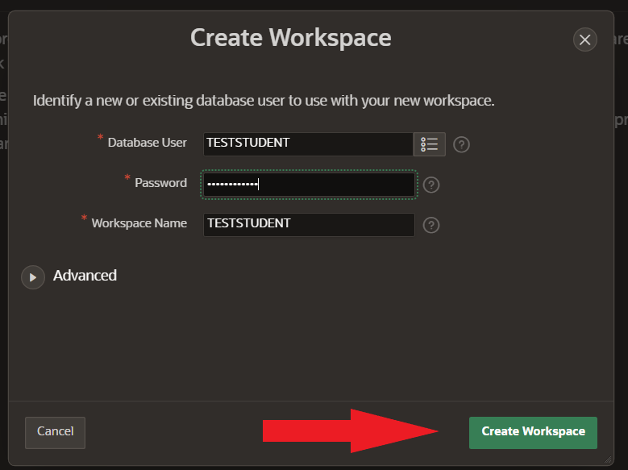

6. Once the workspace is created you will be placed in the main APEX development page.

    

7. At this point we need to log off APEX from the ADMIN account we are currently connected as, and log back on as the new user we just created. You probably will see a warning on to top of your page indicating you need to do this. To log-off click on top right icon that says “admin internal” and click on “Sign out”.

    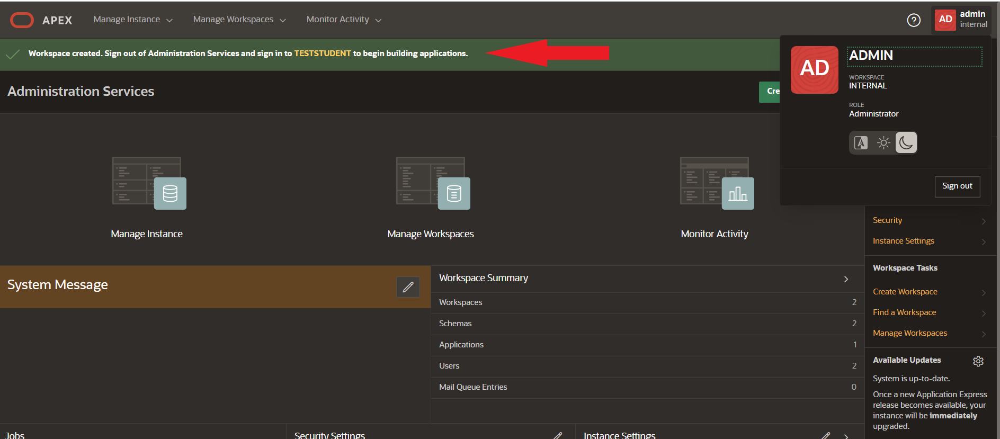

8. You will see the signed out successfully pop-up, click on “Return to Sign In Page”.

    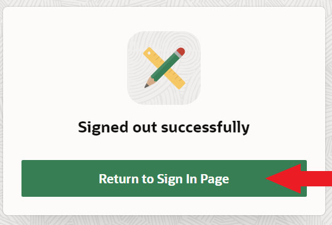

9. This will take you to the APEX sign-in page. Use the information you just used to create the new account above to log in.

    

10. You are logged in to APEX and ready to develop your first application!

    


## Task 3: Creating the App

1. If you have not already logged into your Oracle APEX workspace, sign in using the workspace name, email, and password you signed up with.

    

2. At the top left of your workspace, click **App Builder**.

    

3. On the App Builder page, click the **Create** button.

    

4. Click **New Application**.

    

Naming and Enhancing the Appearance of the App

1. In the Create Application wizard, set the Name to **Movies Watchlist**.

2. Click the expand button next to Appearance.

    

    * Select the **Vita-Dark theme**.

    * Click **Choose new icon**.

        - Select the red color swatch and the smiley face icon.

        - Click **Set Application Icon**.

    * Click **Save Changes**.
    
    

3. In the Pages section of the Create Application wizard, click the **Edit** button next to Home.

    

    * In the dialog, set Page Name: **My Watchlist**

    * Click the **Set Icon** button.

        - In the Select Icon dialog, search for **film**.

        - Click the film icon that has the play button in the middle.

    * Click **Save Changes**.

    

4. Click **Create Application** to create your app and go to the application home page.

    

Running the App

1. On your application home page, click **Run Application**.

    

2. On the sign in page that opens in a new tab in your browser, enter your username and password that you used to sign in to your workspace.

3. Click **Sign In**.

    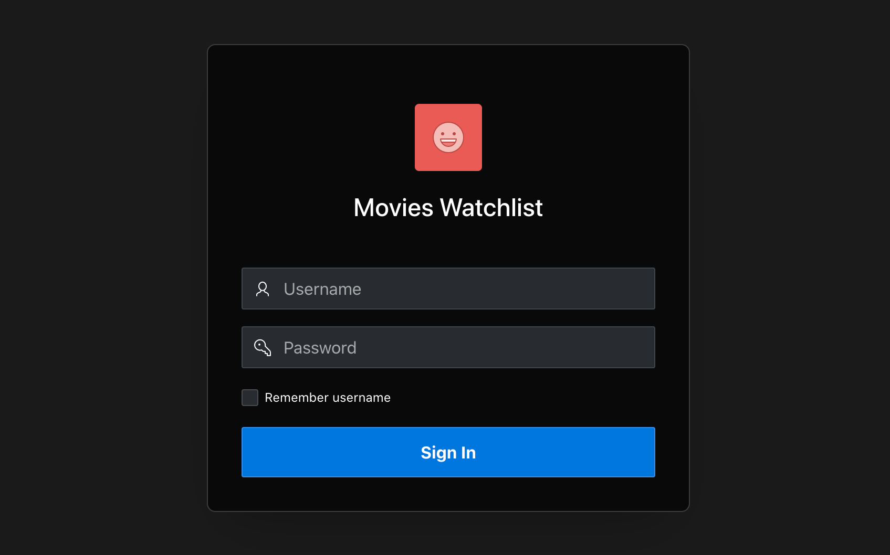

Updating the Theme of the App

1. In the tab that your app is running in, you will see a grey toolbar at the bottom of the page. This is your development toolbar that allows you to edit regions in your application user interface (UI) directly in the tab it's running in.  
*Note: If you do not see the grey developer toolbar, mouse over the bottom of your browser window to make it display. End users who log directly into the app will not see this toolbar.*

2. In the dev toolbar, click on **Customize** and then click **Theme Roller**.

    

3. Within the Theme Roller, you can modify many different aspects of the application UI. You will use it right now to update the color scheme.

4. Click on **Global Colors** to expand the dropdown.

    * Copy the HEX color code: **C74634**

    * Click on the color swatch next to **Primary Accent** and paste the HEX code in the Hex text box.

    

    * Click on the color swatch next to **Body Accent** and paste the HEX code **312D2A** in the Hex text box.

    * The other color swatches automatically updated to variations of the Header Accent color.

    * Click **Save As**.

    * Style Name: **Movies - Dark**

    * Click **Save**.

    * Close the Theme Roller window.

    

5. You have now updated the color scheme of your app.

Signing up for a TMDB API Key

1. Go to [The Movie Database (TMDB)](https://www.themoviedb.org/signup) to sign up for a free account.

2. Once registered, follow the [Getting Started](https://developers.themoviedb.org/3/getting-started/introduction) instructions on TMDB Developer site. You will need to enter some of your app and contact information:

    

3. After you have received your API Key, copy it and store it somewhere where you will be able to easily access it.

4. Make a sample API request to get the details of a single movie using your new API Key:

    - Go to the [TMDB Movie Details](https://developers.themoviedb.org/3/movies/get-movie-details) page.

    - Click on the **Try it out** tab.

    

    - Under **Variables**, click the box next to **api_key** and paste your API key.

    - Under **Path Params**, click the box next to **movie_id** and type 505.

    - Click the bright pink **Send Request** button.  
      *Note: If the Send Request button does not work, copy the link next to the button, paste it in a new browser tab and hit enter/return.*

    

    - Now you can explore the data that gets returned when requesting the details for a single movie.  

5. You can also go back to the **Definition** tab (next to Try it out) and scroll to the **Responses** section at bottom of the page to further explore the type of data that gets returned. Under Responses, Schema will show you the object fields and data types, while Example will give you example data without having to make a request like you did above.

## Task 4: Creating REST Data Sources

This task will walk you through how to set up REST Data Sources that will be used to get movie data from TMDB API. You will use these REST sources in later tasks to build out the movie search functionality.  Make sure you have easy access to your API key that you signed up for in the Introduction steps, as you will need it to build out the REST sources.

In this lab, you will:  
- Create a REST data source for The Movie Database Popular Movies.  
- Create a REST data source for The Movie Database Search Movies.

Creating a Popular Movies REST Data Source

The first REST source you will create is the Popular Movies source because it is the simplest to implement and a good way to introduce the process of creating REST data sources. From there, you will implement a couple more REST sources, with each being a little more complicated than the last. You are creating the Popular Movies data source because you will need to display these when a user has not yet searched for a movie.

1. In the App Builder tab in your browser, click **Shared Components** in the middle of your Application home.

    

2. In the Data Sources section at the bottom of the page, click on **REST Data Sources**.

    

3. Click **Create** at the top right of the page.

    

4. Select **From Scratch** and click **Next**.

    

5. Name: **Popular Movies**

6. URL Endpoint: **https://api.themoviedb.org/3/movie/popular?api\_key=API\_KEY&language=en-US&page=1**  
*Note: Make sure to replace API\_KEY with the API code you get from TMDB API*

7. Click **Next**.

    

8. Oracle APEX automatically divides the URL into the Base Path and Service URL Path. However, you want these to be slightly different than what APEX chose so that the Base Path is consistent across all the REST sources you make. Adjust the Base and Service URLs to the following:

    * Base URL: **https://api.themoviedb.org/3/**

    * Service URL Path: **movie/popular?api\_key=API\_KEY&language=en-US&page=1**  
    *Note: Make sure you have replaced API\_KEY with the API code you get from TMDB API and that there are no spaces in your URL endpoint.*

9. Click **Next** again.

    

10. Leave Pagination Type set to No Pagination and click **Next**.

11. Click **Discover**.

    * APEX makes a call to the TMDB API and finds the popular movies data to parse into columns that you will be able to use as your data source when building your app.

    * You should now be able to view and scroll through a preview of the table of data that has been generated. 

12. Click **Create REST Data Source**.

    

Editing The REST Source Data Profile 

You have now created your new data source, but you are going to update it to improve the data you get from Popular Movies. One of the columns you get back from the TMDB Popular Movies API is POSTER\_PATH. It includes the unique poster identifier needed to grab the poster image for a movie. However, it does not contain the full URL, which means that if you want to use POSTER\_PATH, you have to manually add the first part of the URL when using it on the front end. Instead of having to add that each time you want to use the poster path, you can edit the Data Profile for Popular Movies and add a column derived from POSTER\_PATH that contains the entire URL so that later you can access it directly.

1. In the REST Source Name column of the REST Data Sources page, click on your **Popular Movies** source.

2. Click on the **Data Profile** tab within the REST Data Source page.

3. Within the Data Profile tab, you can see that there are 13 visible columns for Popular Movies. You can edit the data profile to add, remove, and edit columns, which will adjust the data that gets returned from the data source.

4. Click the **Edit Data Profile** button.

    

    * On the Data Profile dialog page, click the **Add Column** button.

        - Name: **POSTER_URL**

        - Visible: **on**

        - Column Type: **SQL Expression**

        - SQL Expression: **CONCAT('https://image.tmdb.org/t/p/w500', POSTER_PATH)**

            + This SQL Expression concatenates a string that contains the secure base URL and image size with the POSTER_PATH column that gets returned with the Popular Movies data. The base URL and image size come from [TMDB Configuration API](https://developers.themoviedb.org/3/configuration/get-api-configuration).

        - Click **Create**.

        

    * Click **Apply Changes** to save and close the Edit Data Profile dialog.

5. Click **Apply Changes** at the top of the REST Data Source page.

Creating a Search Movies REST Data Source

The process to create the Search Movies source is similar to the process for the Popular Movies source, but you will use a plug-in to assist with setting it up. Plug-ins are ready-to-use components created by other APEX developers that enable you to extend your APEX applications with custom functionality. A plug-in can be useful for creating REST data sources that return multiple pages of results. For example, when you make a request to TMDB search movies API, you must also include the page number within that request, and you can only get one page at a time with individual API calls. There is a REST data sources plug-in to work around this problem, which allows you to make one API request and get all results from all the pages.

1. [Click here](./files/web_source_type_fixedpagesize.sql) to download the plug-in.  

2. In your App Builder, return to your Movies Watchlist application home by clicking the Application XXXXX link under the APEX toolbar.

    

3. Click **Export/Import**.

    

    * Click **Import**.

    * Click on the Drag and Drop region to open the file selector.

        - In your Downloads folder, select the **web\_source\_type\_fixedpagesize.sql** file.

        - Click **Open**.

    * File Type: **Plug-in**

    * Click **Next**.

    

    * Click **Next**.

    * Click **Install Plug-in**.

    * You should finish on the Plug-ins page within the Shared Components of your Application and see your imported plug-in. You can now create your Search Movies REST source with this plugin.

4. Navigate to the Shared Components page by clicking the **Shared Components** link in the page path below the APEX toolbar.

    

5. Under Data Sources, click on **REST Data Sources**.

6. Click **Create**. 

    * Select **From Scratch** and click **Next**.

    * REST Data Source Type: **Fixed Page Size Plug-In for api.themoviedb.org [Plug-in]**

    * Name: **Search Movies**

    * URL Endpoint: **https://api.themoviedb.org/3/search/movie?api\_key=API\_KEY&language=en-US&query=harry%20potter&page=1&include\_adult=false**  
    *Note: Make sure to replace API\_KEY with the API code you get from TMDB API and that there are no spaces in your URL endpoint.*

    * Click **Next**.

    

    * When you set up the Popular Movies REST data source, you created a remote server for TMDB API. APEX recognizes that remote server based on the Search Movies URL and automatically splits the URL into the correct Base URL and Service URL paths. Click **Next** again.

    * Authentication Required: **on**

    * Authentication Type: **URL Query String**

    * Name: **api_key**

    * Value: *Insert your unique API key here.*

    * Click **Discover**.

    

    * You should be able to view a preview of the table of data that has been generated.

    * Click **Create REST Data Source**.  

    

7. Return to [Task 4](#Task4:EditingTheRESTSourceDataProfile) and follow the same steps for the Search Movies source to edit the data profile and create a POSTER_URL column.

## Task 5: Creating the Movie Search Page

You will create and set up the Movie Search page in this lab so that you can view popular movies and search for a movie of your choice. The search functionality must be built out first in order to be able to create a watchlist even though the My Watchlist page is the home page of the application. You will need to first create a button on the home page that links to the Movie Search page. On the Movie Search page you will create regions that display the data from the REST data sources you created in the previous lab, and you will implement a search bar that lets you search for movies.

In this task, you will:  
- Add a button to link the Movie Search page to the Movie Watchlist page.  
- Create a new page.  
- Link the Popular Movies REST data source to the new page.  
- Link the Search Movies REST data source to the new page.  
- Set up search functionality to allow a user to search for a movie.

Creating the Add a Movie Button

You will need to create a button on the first page of the application before you can create the Movie Search page, so that you have a way to open up the page when you want to search for movies.

1. Return to the Movies Watchlist application home and click on page **1 - My Watchlist**.

    

2. The Page Designer in APEX is broken up into a few different panes: the rendering pane on the left, the layout pane in the middle, and the properties pane on the right. In the rendering pane on the left, click on the **Movies Watchlist** region in the Breadcrumbs Bar position.

    * In the properties panel on the right, set the Title: **My Watchlist** 

3. Right click on the My Watchlist region in the rendering pane and select **Create Button**.  

    

## Task 6: Creating the Movie Details Page

In this task, you will set up a new REST data source called Movie Details, that retrieves the details of a single movie. After the data source has been set up, you will create a new page that displays those movie details when a user clicks on a movie from the Movie Search page.

In this task, you will:  
- Set up the Movie Details REST Data Source.  
- Create a new page, Movie Details.  
- Use the Movie Details REST source to display data on the Movie Details page.  
- Connect the Movie Details page to the Movie Search page.

Creating the Movie Details REST Data Source

While the process for setting up the Movie Details REST source is similar to the Popular and Search Movies sources, it is a little more involved, because you have to define the response structure as well as specify variables to be able to query for any movie.

1. Just like you did for Popular Movies and Search Movies, click on **Shared Components**. 

    

2. Under Data Sources, click on **REST Data Sources**.

3. On the REST Data Sources page, click **Create**. 

    * In the wizard dialog, select **From Scratch**.

    * Click **Next**.

    * Name: **Movie Details**

    * URL Endpoint: **https://api.themoviedb.org/3/movie/:movie_id**

        - At the end of the URL Endpoint, you are creating a bind variable, :movie_id, using the : syntax. This is what will allow you to pass in any value for the movie ID so that you can get the details for any movie. To learn more about bind variables, see the Resources section at the end of this lab.

    * Click somewhere within the Create REST Data Source dialog to unfocus from the URL Endpoint. APEX will display a URL Parameter line, where you can set the :movie_id parameter value.

    * Value: **505**

    * Click **Next**.

    

    * Just like the Search Movies source, APEX automatically divides the URL Endpoint into the Remote Server and Service URL Path. Click **Next** again.

    * Leave Pagination Type set to No Pagination and click **Next**.

    * On the Authentication step, you will set up authentication with your API key.

        - Authentication Type: **URL Query String**

        - Name: **api_key**

        - Value: *Insert your unique API key here.*

    * Click on the **Advanced** button at the bottom of the dialog.

    

    * Within the Advanced page, you can set up additional parameters and define what the response should look like. You should see your movie_id URL Pattern variable as a parameter, so the only thing you have to do is define the response.

    * Type a single period **.** in the **Row Selector (leave empty for auto-detection)** text field and hit Enter/Return.
    
        - This instructs APEX to use the root of the JSON object that gets returned from TMDB Movie Details API. To learn more, see the Resources section at the end of this lab.

    * For the Returns parameter, select **Single Row**.

        - Typically, APEX looks for a table with multiple rows of data. However, since you are getting data for a singular movie, there will be only a single row of data.

    * Click **Discover**.

    

    * In the next page, you should see a table with one row of data containing the details for the movie with ID 505.

    * Click **Create REST Data Source**.

    

4. On the REST Data Sources page, click on Movie Details.

5. In Task 4, you added a new column to the data profile for the full poster URL. You will now do the same thing for Movie Details, but you will add 2 visible columns:

    * **POSTER\_URL**: CONCAT('https://image.tmdb.org/t/p/w500', POSTER\_PATH)

    * **BACKDROP\_URL**:  CONCAT('https://image.tmdb.org/t/p/w500', BACKDROP\_PATH)

6. Follow the instructions in <a href="?lab=creating-rest-sources#Task2:EditingTheRESTSourceDataProfile" target="_blank">Task 4, Step 2</a> to add the BACKDROP\_URL and POSTER\_URL columns.

Creating the Movie Details Page

Just like you did for the Movie Search page, you will create a new page and set a couple page properties before connecting the Movie Details REST source to the page.

1. Go to your Movies Watchlist Application home.

2. Click the **Create Page** button.

    * Click **Blank Page**.

    

    * Set Name: **Movie Details**

    * Select Page Mode: **Modal Dialog**

    * Click **Next**.

    

    * Click **Next**.

    * Click **Finish**.

    * You should now be on page 3, the **Movie Details** page.

    

3. Make sure **Page 3: Movie Details** is selected in the rendering tree.

4. Within the Appearance property group, open the **Template Options** dialog. 

5. Select **Stretch to Fit Window**.

6. Click **Ok**.

    

Connecting the Movie Details REST Source to Page

When you set up the Movie Details API, you created the movie_id parameter. You can link that parameter to a page item that contains the movie id, which will allow you to call the details for whatever movie you select from the Movie Search page.

1. In the Movie Details page, right click on the Content Body region and select **Create Region**.

    * Title: **Movie**

    * Type: **Form**

    * Under the **Source** section:

        - Location: **REST Source**

        - REST Source: **Movie Details**

    * Once you select the source, you can see in the rendering pane that an item has been created for each data column under the Movie form region.

    

2. Click on the **P3\_ID** column under the Movie region.

    * Scroll down to **Source** and switch Primary Key to **on**.

    

3. If you look at the Movie region, there is also a **Parameters** section in addition to the Items section. This is similar to the Searched Movies region on the Movie Search page. When you click the dropdown next to Parameters, you can see **movie_id**, which is the parameter you set up earlier in the Movie Details REST Data Source.

4. Click on the **movie_id** parameter.

    * Change the Value → Type to **Item**.

    * Set Item to **P3_ID**.

5. Click the **Save** button in the top right corner to save your changes.

    

Connecting the Movie Details Page to Movie Search Page

You want to be able to view the details of any movie you click on in your Movie Search page. You can link the Movie Details page to the Movie Search page like you did when setting up the Movie Search page and Add a Movie button. However, in order to get the details for the specific movie you clicked on, you have to pass the movie id from the search page to the details page.

1. Navigate to page **2: Movie Search** by entering 2 in the Page Finder in the Page Designer toolbar and clicking Go.

    

2. On the Movie Search page, you can see in the rendering pane that both Popular Movies and Searched Movies have an **Actions** section underneath them.

3. Right click on **Actions** underneath Popular Movies and select **Create Action**.

    

    * Identification → Type: **Full Card**

    * The Link section is where you can connect page 3 to page 2 by redirecting the user to a new page, similar to how a user gets to the Movie Search page from the Home page.

    * Click on **No Link Defined** next to Target to open the Link Builder dialog.

        - Page: **3**

        - You also need to set an ID item that will get passed to the Movie Details dialog so that the Movie Details page knows the ID of the movie that was clicked on.

        - Under Set Items, enter **P3_ID** as the Name.

        - Value: **&ID.**  
        	*Note: You can also use the buttons next to the name and value fields to browse items that you can pass values to. Notice that the options for Name all come from the Movie Details page (P3), because that is the item you want to set. The options for Value are the columns from the Movie Search data source because this is the what you are getting from page 2 and passing to page 3.*

        - Click **Ok**.

    

4. Right click on Actions under the Searched Movies region and select **Create Action**.

    * Type: **Full Card**

    * In the Link property group, click on **Target**.

        - Page: **3**

        - Name: **P3_ID**

        - Value: **&ID.**

        - Click **Ok**.

    

5. Click **Save**.

6. Refresh the page where your application is running.

7. Test the Movie Details page by clicking the **Add a Movie** button to open the Movie Search page.

8. Click on the movie of choice to see the details.

    

## Task 7: Creating Users and Watchlist Tables

Up to this point, most of the work has revolved around implementing REST data sources and creating pages to use that data on. In this lab, you will create and start to use local tables to store user and movie data. You will also add an application item and process, which will capture and store a user email and ID, as well as some of the movie details. This is what allows multiple users to have their own watchlist.

In this task, you will:  
- Set up the movie_users and watchlist tables using Quick SQL.  
- Create an application process and item for storing user information.

Creating the Movie Users Table

The first table you need to create is the movie\_users table. It is very simple, but it needs to be created before the watchlist table so that you can access the user ID. The watchlist table has a foreign key, user\_id, that will link it to the movie\_users table and allow different users to have their own unique lists.

1. In the Page Designer tab in your browser, click the dropdown next to SQL Workshop in the top navigation bar, hover over Utilities, and select **Quick SQL**. 

    

2. Copy the code below and paste into the first line of the code editor:

    ```
    <copy>
    movie_users
        id /pk
        username /unique
    ```

3. Click the **Generate SQL** button at the top of the pane. 

    

4. Click **Settings** on the top right of the Quick SQL toolbar. 

    * Scroll down to Additional Columns and check **Audit columns**.

    * This will automatically add the Created, Created\_By, Updated, and Updated\_By columns to the table.

    * Click **Save Changes**.

    

5. Click **Save SQL Script**. 

6. Script Name: **Create movie users**

7. Click **Save Script**.

    

8. Click the **Review and Run** button.

9. Click **Run**, then **Run Now**. 

    * You should see a success page with 2 statements successfully processed.

    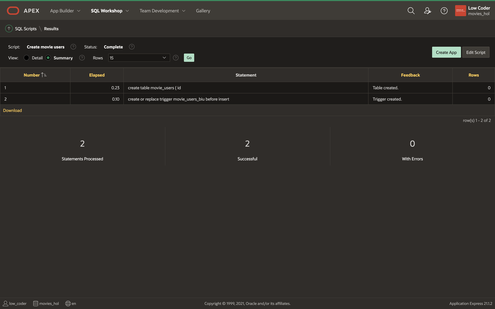

10. Now you will add an Application ID and Application Process, which will capture a user's email when they log in and assign them an ID so that you can keep track of their unique watchlist.

Creating the Application Item and Process

To store data within the movie\_users database, you will use an application process. The process grabs the user email when they log in and if they are a new user, it adds them to a local table, assigning them an ID. The ID of the current user is also stored in the application item, which will be needed when a user adds, removes, or updates items in their watchlist.

1. Click on **App Builder** in the top APEX toolbar.

    

2. Click on your Movies Watchlist app.

3. Click on **Shared Components**.

4. In the Application Logic section of the page, click **Application Items**.

    

5. Click **Create**.

    * Set Name: **USER_ID**

    * Click **Create Application Item**.

    

6. Go back to Shared Components and click on **Application Processes**.

    

7. Click **Create**.

    * Name: **Add User**

    * Point: **After Authentication**

    * Click **Next**.

    

    * Copy and paste the following code into the Code editor box in the Source section:

    ```
    <copy>
    -- create movie user ID
    -- query movie_users table to check for existing user
    -- if yes, return PK as user_id
    -- if no, add new user to movie_users
    declare
        l_user_id number;
    begin
        select id into l_user_id from movie_users where username = :APP_USER;
        
        :USER_ID := l_user_id;
        
        exception
            when no_data_found then
            insert into movie_users 
                    (username)
                values 
                    (:APP_USER)
                returning 
                    id into :USER_ID;
    end;
    ```

    * Click **Next**.

    

    * Click **Create Process**.

8. You have now set up an application item that keeps track of the current user's ID and added a process to store a user in the movie\_users table.

9. To initialize the user id for your movies app, you will need to sign out of your app in the tab in your browser where your app is running and sign back in.

10. On the My Watchlist page of your app, click the button at the top right of the screen where your username is displayed and click Sign Out.

    

11. Now, sign back in and your new application process will run and store your user ID in the movie\_users table and the USER\_ID application item.

    

12. Next, you'll set up a new table using Quick SQL to store all of a user's movies that they add to their list.

Creating the Watchlist Table

Finally, you will need a table to store some basic movie information in addition to the user information. This is what will display and be the source for the My Watchlist page.

1. In the toolbar at the top of your APEX workspace, click the dropdown next to SQL Workshop, hover over Utilities, and select **Quick SQL**.

2. Copy the code below and paste it into the Quick SQL pane to replace the previous Quick SQL code:

    ```
    <copy>
    watchlist
        id /pk
        movie_id
        user_id /fk movie_users
        watched_yn
        watched date
        title
        poster_url
        release_date
        runtime num
        vote_average num
        /unique movie_id, user_id
    ```

	* Note the /unique directive in the last line of the Quick SQL code. In the movie\_users table, you created a unique key by using the /unique directive for the username column. This prevents the same user from getting put into the table more than once by making sure the username is always unique. In the watchlist table, the unique key actually comes from two different columns: movie\_id and user\_id. A single user cannot add the same movie to the watchlist table more than once. Unique keys are extremely helpful when it comes to maintaining the integrity of the data in your local tables.

3. Click the **Generate SQL** button at the top of the pane.

    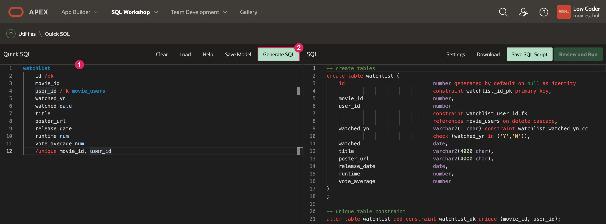

4. Just like you did for the movie\_users table, click Settings and select **Audit columns**. 

5. Click **Save Changes**.

    

6. Click **Save SQL Script**.

    * Set Name: **Create watchlist** 

    * Click **Save Script**.

    

7. Click **Review and Run**.

8. Click **Run**.

9. Click **Run Now**. You should see 3 statements executed successfully.

    

10. The watchlist table has now been created. When a user clicks the Add to Watchlist button in the Movie Details dialog, the SQL action will capture the movie and user data and store it in this table so that you can access it later to build out our Watchlist on the front end.

11. Now you will set up your Back, Add, Remove, and Mark Watched buttons.

## Task 8: Implementing Movie Details Buttons and Movie Search Badges

In the previous task, you did the backend work to set up tables and application items. In this lab, you will be creating Add, Remove, Watched, and Back buttons that will control the flow between the Movie Search and Movie Details page, as well as the data stored in the watchlist table. You will also add a badge to the Cards on the Movie Search page to have a visual cue for movies that a user has already marked as added or watched.

In this task, you will:  
- Implement an Add button that inserts a movie into the watchlist table.  
- Implement a Remove button that deletes a movie from the watchlist table.  
- Implement a Watched button that marks a movie as watched in your watchlist table.  
- Implement a Back button that takes you back to the Movie Search page.  
- Use badges on the Movie Search page to display what movies have been marked as added or watched.

Creating the Movie Details Buttons

1. Click on **App Builder** in the top APEX toolbar.

    

2. Click on your **Movies Watchlist** app.

3. Click on the **Movie Details** page (page 3).

4. In the rendering pane, right click on Dialog Header and select **Create Region**.

5. Set the following properties:

    * Identification → Title: **Buttons Bar**

    * Appearance → Template: **Buttons Container**

    * Appearance → Template Options:

        - Style: **Remove UI Decoration**

    

6. Right click the Buttons Bar region and select **Create Button**.

    * Identification → Button Name: **BACK**

    * Layout → Position: **Previous**

    * Appearance → Button Template: **Text with Icon**

    * Appearance → Template Options:

        - Style: **Remove UI Decoration**

        - Icon Position: **Left**

        - Click **Ok** to close the dialog.

    * Appearance → Icon: **fa-chevron-left**

    

7. Right click the Buttons Bar region and select **Create Button**.

    * Identification → Button Name: **ADD\_TO\_WATCHLIST**

    * Layout → Position: **Next**

    * Appearance → Hot: **on**

    

8. Right click the Buttons Bar region and select **Create Button**.

    * Identification → Button Name: **REMOVE\_FROM\_WATCHLIST**

    * Layout → Position: **Next**

    

9. Right click the Buttons Bar region and select **Create Button**.

    * Identification → Button Name: **MARK\_WATCHED**

    * Identification → Label: **I've Watched This**

    * Layout → Position: **Next**

    * Appearance → Hot: **on**

    

Implementing Button Actions

Now that you have made the 4 buttons, it's time to connect actions to them. You first will connect each button to a database action so that APEX knows what SQL commands will be used for each. Then, you will need to implement those actions using a process for each button. You will also use a branch to redirect the user back to the previous page once the process is complete.

1. In the rendering pane, click on the **BACK** button and scroll down to the Behavior section.

    * Action: **Redirect to Page in this Application**

    * Click the button next to Target to open the Link Builder → Target dialog.

        - Page: **2**

        - Click **Ok**.

    

2. Click on **ADD\_TO\_WATCHLIST**.

    * Scroll down to Behavior and set Database Action to **SQL INSERT action**.

    

3. Click on **REMOVE\_FROM\_WATCHLIST**.

    * Set Database Action to **SQL DELETE action**.

4. Click on **MARK\_WATCHED**.

    * Set Database Action to **SQL UPDATE action**.

5. At the top of the rendering pane, click the **Processing** tab (the two looping arrows).

    

6. Right click on Processing and select **Create Process**.

    * Identification → Name: **Add to watchlist**

    * Copy the following code and paste it into the PL/SQL code box in the Source property group:

		```
	    <copy>
	    insert into watchlist
			(
				movie_id,
				user_id,
				watched_yn,
				title,
				poster_url,
				release_date,
				runtime,
				vote_average
			)
		values
			(
				:P3_ID,
				:USER_ID,
				'N',
				:P3_TITLE,
				:P3_POSTER_URL,
				:P3_RELEASE_DATE,
				:P3_RUNTIME,
				:P3_VOTE_AVERAGE
			);
	    ```

    * Server-side Condition → When Button Pressed: **ADD\_TO\_WATCHLIST**

    

7. Right click on Processing and select **Create Process**.

    * Identification → Name: **Remove from watchlist**

    * Copy the following code and paste it into the PL/SQL code box in the Source property group:

		```
	    <copy>
	    delete from watchlist 
		 where movie_id = :P3_ID 
		   and user_id = :USER_ID;
	    ```

    * Server-side Condition → When Button Pressed: **REMOVE\_FROM\_WATCHLIST**

8. Right click on Processing and select **Create Process**.

    * Identification → Name: **Update watchlist**

    * Copy the following code and paste it into the PL/SQL code box in the Source property group:

		```
	    <copy>
	    update watchlist
		   set watched_yn = 'Y',
			   watched = SYSDATE
		 where movie_id = :P3_ID
		   and user_id = :USER_ID;
	    ```

    * Server-side Condition → When Button Pressed: **MARK\_WATCHED**

9. Finally, you will add a branch that runs after processing to redirect the user to the previous page, regardless of which button they pressed.

10. In the processing pane on the left, right click on After Processing and select **Create Branch**.

    * Identification → Name: **Redirect to previous page**

    * Click on **Target** to open the Link Builder

        - Page: **&P3\_PREVIOUS\_PAGE\_ID.**

        - The item P3\_PREVIOUS\_PAGE\_ID contains the page number of the page you were on before the Movie Details page. This is to return to whichever page the user was on previously when any of the buttons on the Movie Details page get clicked. However, you still need to set up the Previous Page ID item, so you will do that now.

        - Click **Ok**.

11. Click the **Rendering** tab at the top of the left pane. 

    

12. Right click on the Movie region and select **Create Page Item**.

    * Name: **P3\_PREVIOUS\_PAGE\_ID**

13. Click **Save**.

14. Navigate to Page 2 in your application builder. 

    

15. Click on the **Full Card** action under the Popular Movies region.

    * In the Link properties group, click on **Target**. 

    * Under Set Items, add an item: 

        - Name: **P3\_PREVIOUS\_PAGE\_ID**

        - Value: **2**

        - Click **Ok**.

    

18. Follow Step 15 again for the Searched Movies Full Card action.

19. Click **Save**.

Adding Server-Side Conditions to Buttons

At this point, all of the buttons on the Movie Details page display at all times, regardless of whether or not you've already added a movie to your list or marked something as watched. You should really only show the Remove or Watched buttons if a movie exists in the watchlist table, meaning the user has added it. Similarly, you should only display the Added button if a user has not yet added a movie to the the watchlist table.

To accomplish this, you are going to use Server-Side Conditions, like you did for the Popular Movies and Searched Movies regions on page 2. You will also add a condition for the Back button, so that it only displays if the previous page is the Movie Search page.

1. In the application builder tab in your browser, navigate to page 3, Movie Details, and click on the **ADD\_TO\_WATCHLIST** button.

2. Type **server** into the search field at the top of the properties pane to find the **Server-side Condition** property group. Click the pin button to keep the filtered property group even when you move to other components, and then set the following properties:

    * Type: **No Rows returned**

    * SQL Query:

	    ```
	    <copy>
	    select null
	      from watchlist
	     where movie_id = :P3_ID
	       and user_id = :USER_ID
	    ```

        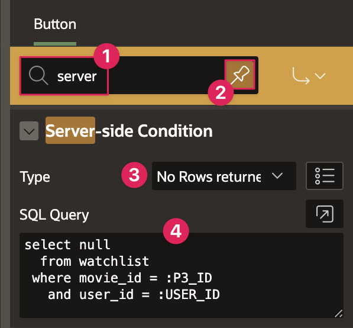

3. Click on the **REMOVE\_FROM\_WATCHLIST** button.

4. Set the following Server-side Condition properties:

    * Type: **Rows returned**

    * SQL Query:

	    ```
	    <copy>
	    select null
	      from watchlist
	     where movie_id = :P3_ID
	       and user_id = :USER_ID
	    ```

        

5. Click on the **MARK\_WATCHED** button.

6. Set the following Server-side Condition properties:

    * Type: **Rows returned**

    * SQL Query:

	    ```
	    <copy>
	    select null
	      from watchlist
	     where movie_id =:P3_ID
	       and user_id = :USER_ID
	       and watched_yn = 'N'
	    ```

        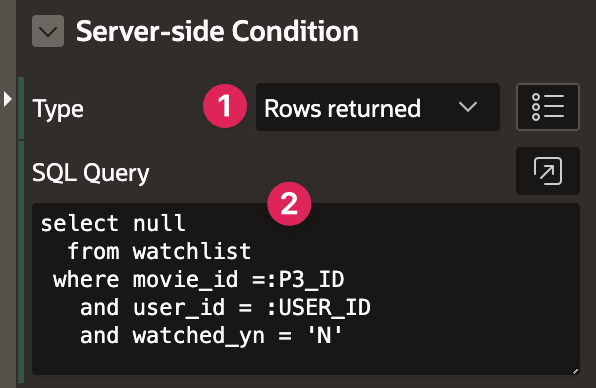

7. Click on the **BACK** button.

8. Set the following Server-side Condition properties.

    * Type: **Item = Value**

    * Item: **P3\_PREVIOUS\_PAGE\_ID**

    * Value: **2**

    
    
9. Click the pin button in the search field at the top of the properties pane to display all property groups when you navigate to a new page component.

9. Click **Save**.

10. Before you test the buttons, you will add badges to the Movie Search page so that you have a visual cue of what has been added and marked as watched.

Adding Badges to Movie Search Cards

Before you test the buttons you just implemented, you will add badges to the Movie Search page so that you have a visual cue of what has been added and marked as watched. You can extend the Popular and Search Movies data that gets returned from the REST data source by checking the WATCHLIST table to find movies with a matching ID to the displayed movies on the search page.

1. Navigate to page 2 in your Movies Watchlist application and click on the **Popular Movies** region.

    * Scroll down to the Local Post Processing property group and set Type: **SQL Query**

    * Replace the existing SQL Query with the query below:

        ```
        <copy>
        select ads.id,
               ads.adult,
               ads.title,
               ads.video,
               ads.overview,
               ads.popularity,
               ads.vote_count,
               ads.poster_path,
               ads.release_date,
               ads.vote_average,
               ads.backdrop_path,
               ads.original_title,
               ads.original_language,
               ads.poster_url,
               case when w.watched_yn = 'Y' then 'Watched'
                    when w.watched_yn = 'N' then 'Added'
                    end as badge_label,
               case when w.watched_yn = 'N' then 'u-success'
                    end as badge_color
          from #APEX$SOURCE_DATA# ads
        LEFT OUTER JOIN
            -- doing inline select to limit rows to current user
            (select * from watchlist where user_id = :USER_ID) w
            ON w.movie_id = ads.ID
        ```

        - The above code extends the Popular Movies data that gets returned from the REST data source by joining the REST data source with the watchlist table to add two columns: BADGE\_LABEL and BADGE\_COLOR. For the BADGE\_LABEL column, each movie in the Popular Movies list has the value 'Watched' (movies in the WATCHLIST table that are marked as Watched), 'Added' (movies in the WATCHLIST table that are not marked as Watched), or NULL (movies that are not in the WATCHLIST table). Similarly, the BADGE\_COLOR list contains values 'u-success' or NULL, based on whether or not a movie is in the WATCHLIST table and not marked as Watched.

        

    * Click on the **Attributes** tab.

    * Icon and Badge → Badge Column: **BADGE\_LABEL**

    * Icon and Badge → Badge CSS Classes: **&BADGE\_COLOR.**

    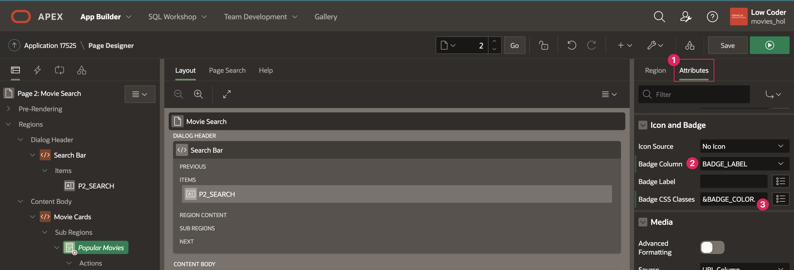

2. Now that you have set up badges on the Popular Movies region, return to the beginning of step 1 and follow the same steps for Searched Movies.

3. Save your changes and refresh the tab where your app is running. Now you can play around with the Movie Search and Movie Details page and test out adding, removing, and marking items as watched.

    * From the Movie Search page, select a movie and you will see the Back and Add to Watchlist buttons.

    

    * Click the Add to Watchlist button and you will be redirected back to the Movie Search page where you will see the Added label on the movie you added.

    

    * Click on the movie you just added to your watchlist, and you will see the Back, Remove From Watchlist, and I've Watched This buttons.

    

    * Click the I've Watched This button and you will be redirected back to the Movie Search page where you will see the Watched label on the movie you just marked as watched.

    
    
4. In the Development Bar at the bottom of the page, click **Application XXXXX** to return to the application builder.

