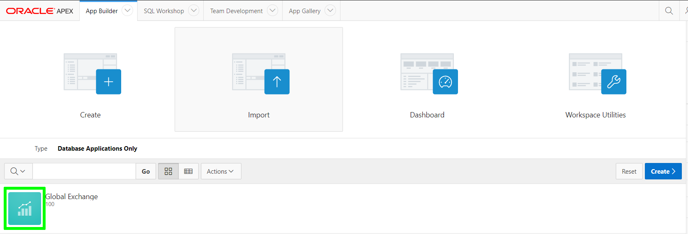
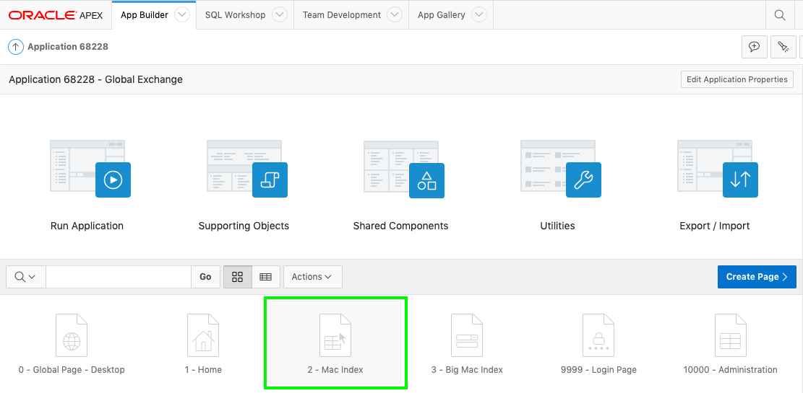
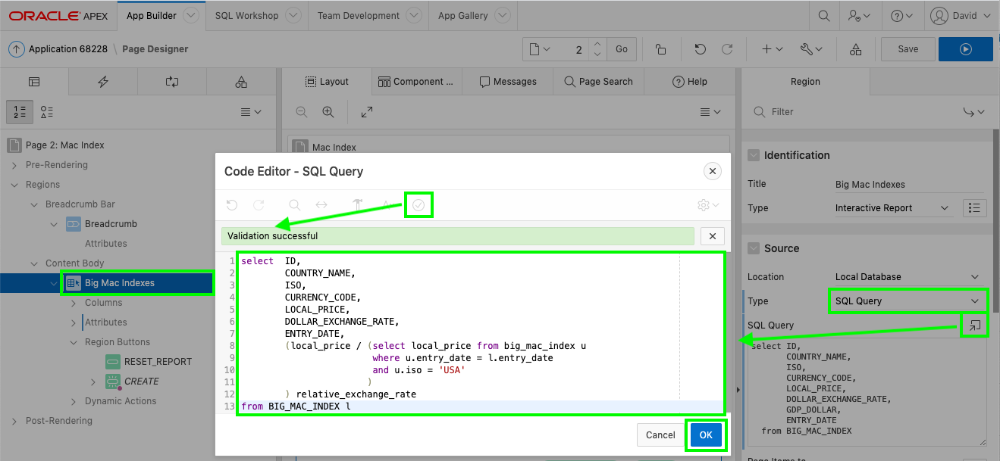
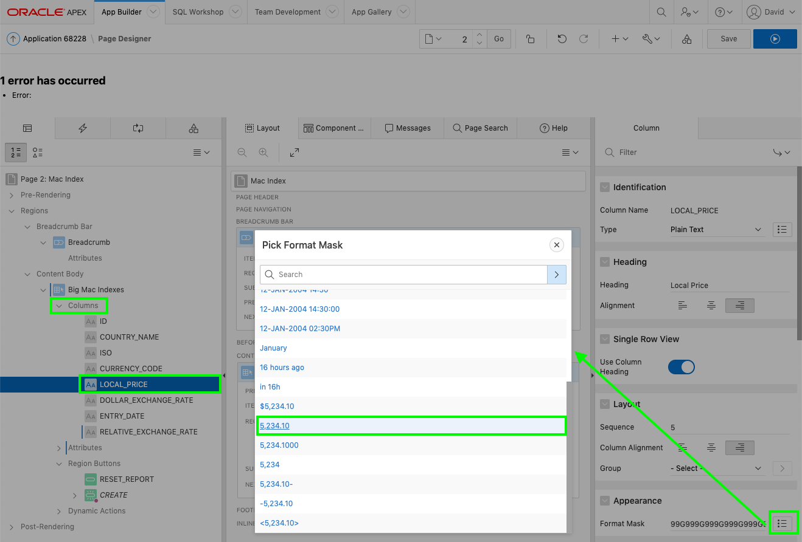
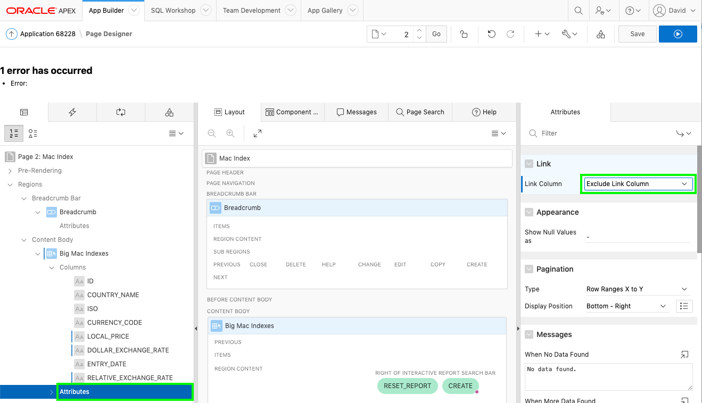
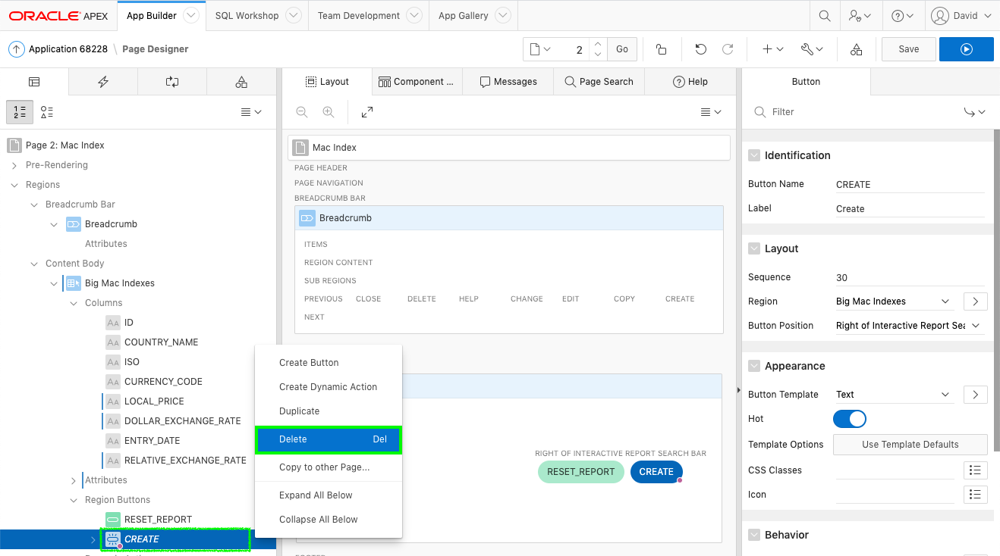
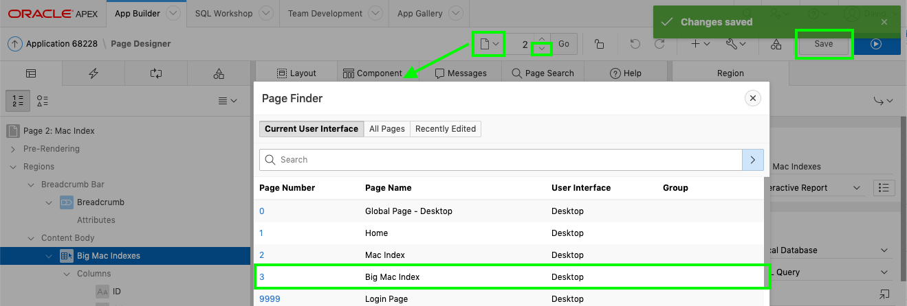
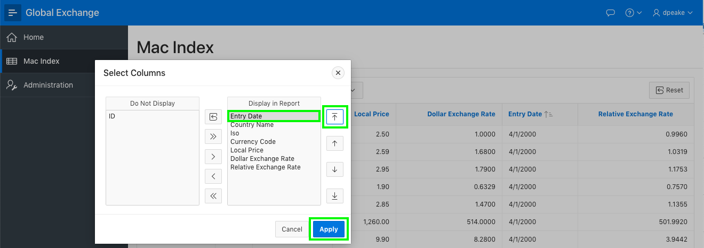
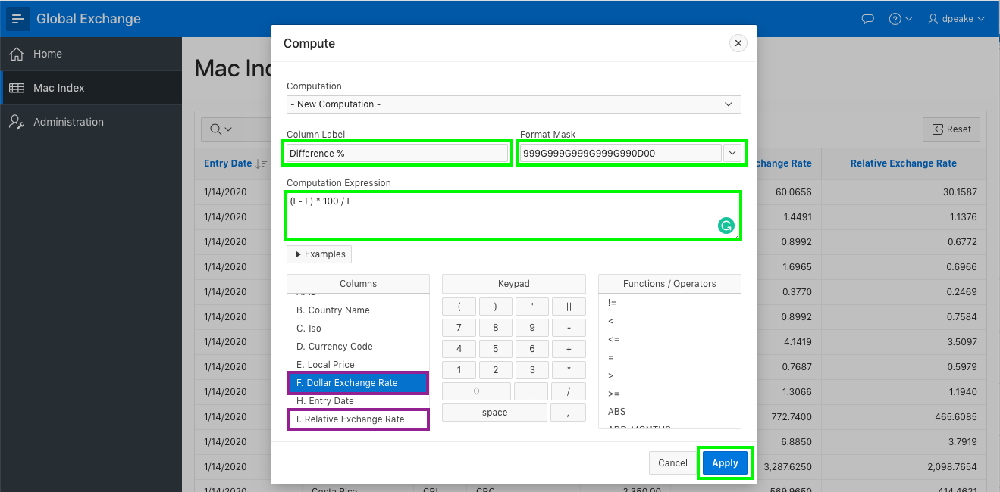
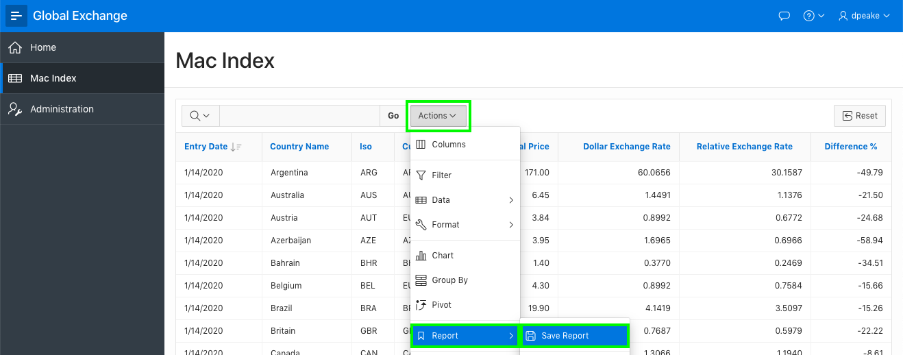

# Improving the Report

## Introduction

In this lab, you will learn how to manipulate an Interactive Report to improve the data displayed and make it easier for users to analyze the data.

### Background Information
Now you have data loaded into the BIG\_MAC\_INDEX table you can start reviewing the local price of a McDonalds Big Mac and the exchange rate with the US Dollar.

For any given country, if you divide the Local Price of a Big Mac by the Local Price of a Big Mac in the US, for the same time period, you can calculate the relative exchange rates between the countries based on the Big Mac prices.

If you then subtract the Dollar Exchange Rate from the relative exchange rate, and divide by the Dollar Exchange Rate, then you can determine if the currency is overvalued (positive) or undervalued (negative), against the US Dollar.

While this is not an exact determination of if a currency is overvalued or undervalued against the US Dollar, it is a good approximation using a product which is generally available in most
countries.

## Task 1: Update the Report Query
When the application was generated it utilized the standard table columns. By converting it to a SQL Query and updating the SQL you can include the relative exchange rate to make it easier for people to review the data.

1. From Object Browser, in the APEX Builder Toolbar, click **App Builder**, and then select **Database Applications**.  

    

2. In the list of applications, click **Global Exchange**.

    

3. From the app home page, click **2 – Mac Index**, which will take you to Page Designer and load Page 2, the report page.

    

4. Within Page Designer, in the Rendering tree (left pane), under Content Body, click **Big Mac Indexes** (This is the report region).

    In the Property Editor (right pane), enter the following:
    - Source > Type - select **SQL Query**
    - Source > SQL Query - click the **Code Editor** icon, and cut and paste the following

        ```
        <copy>select  ID,
                COUNTRY_NAME,
                ISO,
                CURRENCY_CODE,
                LOCAL_PRICE,
                DOLLAR_EXCHANGE_RATE,
                ENTRY_DATE,
                (local_price / (select local_price from big_mac_index u
                                where u.entry_date = l.entry_date
                                and u.iso = 'USA'
                               )
                ) relative_exchange_rate
        from BIG_MAC_INDEX l</copy>
        ```

    Click **Validate** – Validation Successful will be displayed.   
    Click **OK**.

    

    *Note: The _gdp\_dollar_ column was removed as it is not needed. The inner select is used to get the US price for the same date, in order to calculate the relative exchange rate.*

## Task 2: Update the Report Columns
Individual report columns need a better format mask to properly display the data.

1. In the Rendering tree (left pane), click **Columns**.
    Within the list of columns, click **LOCAL_PRICE**.

    In the Property Editor (right pane), click the select icon for Appearance > Format Mask.
    In the Pick Format Mask dialog, select **5,234.10**.

    

2. In the Rendering tree (left pane), within the list of columns, click **DOLLAR\_EXCHANGE_RATE**.

    In the Property Editor (right pane), click the select icon for Appearance > Format Mask.
    In the Pick Format Mask dialog, select **5,234.1000**.

3. In the Rendering tree (left pane), within the list of columns, click **RELATIVE\_EXCHANGE_RATE**.

    In the Property Editor (right pane), click the select icon for Appearance > Format Mask.
    In the Pick Format Mask dialog, select **5,234.1000**.


## Task 3: Remove Data Entry Components
Given the data is obtained from an external source (The Economist REST API) users of the application should not update or delete existing records, and should not create new records.

1. Remove the edit icon so end users cannot update or delete records.

    In the Rendering tree (left pane), under Columns, click **Attributes**.
    In the Property Editor (right pane), for Link > Link Column, select **Exclude Link Column**.

    

2. Remove the Create button so end users cannot add new records.

    In the Rendering tree (left pane), under Region Buttons, right-click **CREATE**, and select **Delete (Del)**.

    

3. It is best, but not mandatory, to remove the Big Mac Index form page altogether.     
    Before moving to Page 3 it is necessary to save the changes you made on Page 2.

    In the Page Designer toolbar, with Page 2 selected, click **Save**.     
    In the Page Designer toolbar, use the page selector, or down arrow, to navigate to **Page 3 - Big Mac Index**.

    

4. On Page 3: Big Mac Index, in the Page Designer toolbar, click **Utilities** (wrench), and then select **Delete Page**.

    

5. On the Confirm Page Delete page, click **Permanently Delete Page**.

    *Note: Page Designer will return to displaying Page 1: Home.*

## Task 4: Resequence the Report Columns
To resequence the order in which the columns are displayed you need to run the report, and then rearrange the column order in the runtime environment.

1. In the Page Designer Toolbar, click **Save and Run**.

2. In the runtime environment, click **Actions**, then click **Columns**.

    

3. In the Select Columns Dialog, select **Entry Date**, and then click **Top**.

    Click **Apply**.

    

## Task 5: Add a Computation
Rather than adding an additional column to the SQL Query for the region, it is also possible to define computational columns from the runtime environment.

The report contains the Dollar Exchange Rate and Relative Exchange Rate columns. If you subtract the Dollar Exchange Rate from the Relative Exchange Rate and then divide that by the Dollar Exchange Rate, you can calculate the valuation of the currency. It is best to display this as a percentage by multiplying the result by 100.

1. In the runtime environment, click **Actions**, select **Data**, then click **Compute**.

    

2. In the Compute dialog, enter the following:
    - Column Label - enter **Difference %**
    - Format Mask - select **5,234.10**
    - Computation Expression - enter the following
    ```
    <copy>(I - F) * 100 / F</copy>
    ```

    Click **Apply**.

    

    *Note: F references Dollar Exchange Rate and I references Relative Exchange Rate as listed under Columns.*

## Task 6: Save the Report
Currently the changes you have made in the runtime environment can only be seen by you. Further, if you were to log out of the runtime environment and log back in your changes would be lost. In order for everyone to see the revised report you need to save the report as the "Primary" report.

1. In the runtime environment, click **Actions**, select **Report**, then click **Save Report**.

    

2.  In the Save Report dialog, for Save (Only displayed for developers), select **As Default Report Settings**.

    

3. In the Save Default Report dialog, click **Apply**.     

    

## **Summary**
This completes Lab 4. In this lab you learnt how to utilize a SQL query as the basis for a report, how to improve how columns are displayed, remove unwanted page elements, manipulate the report layout, and then save it for everyone to utilize. [Click here to navigate to Lab 5](?lab=lab-5-adding-chart).

## **Acknowledgements**

 - **Author** -  David Peake, Consulting Member of Technical Staff
 - **Contributors** - Jaden McElvey, Technical Lead - Oracle LiveLabs Intern
 - **Last Updated By/Date** - Tom McGinn, Database Cloud Services, Product Management, June 2020

