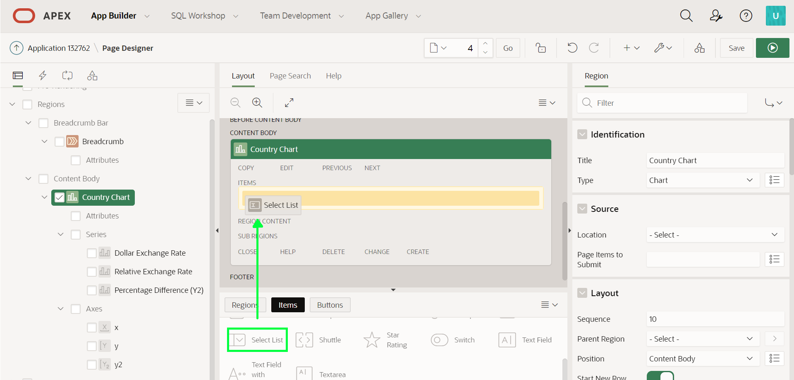
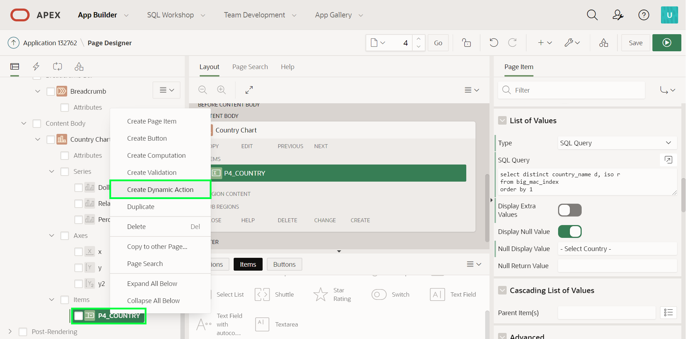
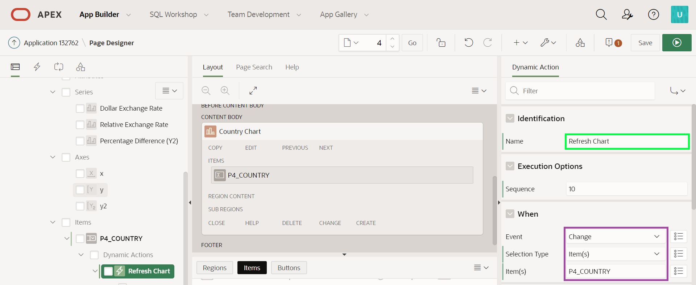
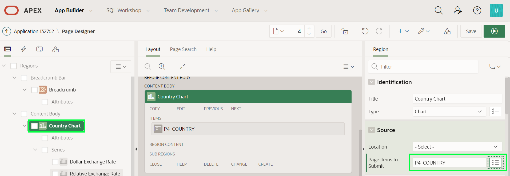

# Adding Chart Criteria

## Introduction

In this lab, you will learn how to add an item to a page, utilize the page item in chart series, and define client-side interactivity.

Estimated Time: 5 minutes

### Background Information
The chart currently has the ISO code for Australia (AUS) hardcoded. By adding a select list with a list of the countries, and then modifying the chart series to utilize this page item you can easily make it easy to review the exchange rate history for any country.

To refresh the chart whenever the country in the select list is changed, you need to utilize a Dynamic Action. A Dynamic Action defines client-side interactivity, and based on a specific action(change in the select list), performs specified functions (refresh), on specified elements (chart region).

In order for the chart to properly utilize the updated value in the select list, then it is necessary to submit that page item when rendering the chart.

## Task 1: Add a Page Item

1. From the Runtime environment, in the Developer Toolbar (bottom of the screen), click **Edit Page X**.

2. Within Page Designer, in the Gallery (center pane, below Layout), click **Country Chart**, click **Items**.
    Click **Select List** and hold the mouse down.
    Drag the item up until it is in the Items section within the Country Chart region.
    Once the Items section expands and the dark yellow box appears, drop the item (release the mouse).

    *Note: Make sure that you drag the select list into the Country Chart region.*

    

3. In the Property Editor (right panel), update the following.
    - **Identification > Name:** enter **P4_COUNTRY**
    - **List of Values > Type:** select **SQL Query**
    - **List of Values > SQL Query:** cut and paste the following.

      ```
      <copy>select distinct country_name d, iso r  
      from big_mac_index  
      order by 1</copy>
      ```

     - **List of Values > Display Extra Values:** click **No**
     - **List of Values > Null Display Value:** enter **Select Country -**

    
    

## Task 2: Add a Dynamic Action
In order for the chart to be refreshed when a country is selected from the new item a Dynamic Action must be defined.

1. In the Rendering tree (left pane), right click on **P4_COUNTRY**, select **Create Dynamic Action**.

    

2. In the Property Editor (right pane), for Identification > Name, enter **Refresh Chart**.

    

3. In the Rendering tree (left pane), under Dynamic Actions > True, click **Show**.

    In the Property Editor (right pane), enter the following.

    - **Identification > Action:** select **Refresh**
    - **Affected Elements > Selection Type:** select **Region**
    - **Affected Elements > Region:** select **Country Chart**

    

## Task 3: Update the Chart
Currently, all three chart series have the country hard-coded. To ensure the value from the item can be used it must be set in session state. Rather than doing this in each series you can set it once for the chart. Once the item is in session state then it can be utilized in the where condition within each chart series.

1. In the Rendering tree (left pane), under Content Body, click **Country Chart**.

    In the Property Editor (right pane), for Source > Page Items to Submit, select **P4\_COUNTRY**.

    

2. In the Rendering tree (left pane), under Series, click **Dollar Exchange Rate**.

    In the Property Editor (right pane), for Source > SQL Query, replace **'AUS'** with **:P4\_COUNTRY**.

    

3. In the Rendering tree (left pane), under Series, click **Relative Exchange Rate**.
    In the Property Editor (right pane), for Source > SQL Query, replace **'AUS'** with :**P4\_COUNTRY**.

4. In the Rendering tree (left pane), under Series, click **Percentage Difference**.
    In the Property Editor (right pane), for Source > SQL Query, replace **'AUS'** with :**P4\_COUNTRY**.

## Task 4: Improve the Chart Page

1. In Page Designer, within the Toolbar, click **Save and Run**.
2. In the Runtime environment, select different Countries.

    

3. Reviewing the runtime environment the region name should be hidden. This can be done from the runtime environment using Live Template Options.

    In the runtime environment, within the Developer Toolbar, click **Quick Edit**.
    Move the mouse up until a blue outline surrounds the chart.
    Click the **Wrench** in the top right corner of the chart region.

    

4. In the Live Templates Options dialog, for Header, select **Hidden but accessible**.  
    *Note: If an end user is using assistive technology then the region name will be announced.*

    Click **Save**.

    

5. In the Runtime environment, select different Countries.

    

## **Summary**
This completes Lab 6 and the workshop. In this lab you learned how to create items, define Dynamic Actions, and refresh regions based on user input fields.

## **Learn More** - Useful Links

- [APEX on Autonomous](https://apex.oracle.com/autonomous)
- [APEX Collateral](https://apex.oracle.com)
- [Tutorials](https://apex.oracle.com/en/learn/tutorials)
- [Community](https://apex.oracle.com/community)
- [External Site + Slack](http://apex.world)

## **Acknowledgements**

 - **Author** -  Salim Hlayel, Principle Product Manager
 - **Contributors** - Jaden McElvey, Technical Lead - Oracle LiveLabs Intern
 - **Last Updated By/Date** - Tom McGinn, Database Innovations Architect, Product Management, July 2020

