# Implement the Watchlist Page

## Introduction
Now that you have implemented functionality to find movies and add them to a list, you can use page 1 to view that list, search it, and modify it. In this lab, you will be setting up the My Watchlist page to display each movie in the watchlist table and filter the list, which is the final piece of base functionality you will need to complete this app.

Estimated Lab Time: 20 minutes

### Objectives
In this lab, you will:  
- Create cards to display watchlist movies.  
- Connect the Movie Details page to open details directly from the Watchlist.  
- Add search facets to filter through movies.  
- Add a search bar to directly search for movies.

### Prerequisites
- Completion of workshop through Lab 6

## Task 1: Create the Watchlist Cards
So far, you have only added a button in the Breadcrumb Bar region of page 1. You will start to flesh out the page by first adding a Cards region on the main page so that users can view their personal list of movies. It will be similar to the Cards regions on the Movie Search page, but these cards will be formatted a little differently and the source will not be a REST data source.

1. Navigate to page 1 of your Movies Watchlist application.

2. Right click on Body in the rendering tree and select **Create Region**.

3. Set the following properties for the new region:

    * Title: **Watchlist**

    * Type: **Cards**

    * Source → Type: **SQL Query**

    * Copy the code below and paste it into the SQL Query code box:

        ```
        <copy>
        select id,
               movie_id,
               user_id,
               watched_yn,
               watched,
               case when watched_yn = 'Y' then 'Watched' end as WATCHED_LABEL,
               case when watched_yn = 'Y'
                    then 'Marked as watched ' || apex_util.get_since(watched)
                    else 'Added to watchlist ' || apex_util.get_since(created)
                    end as movie_status,
               title,
               poster_url,
               release_date,
               to_char(release_date, 'YYYY') as release_year,
               floor( to_char(release_date, 'YYYY') / 10) * 10 as decade,
               runtime,
               vote_average,
               created,
               to_char(created, 'MM/YYYY') as created_on,
               created_by,
               updated,
               updated_by
          from watchlist
         where user_id = :USER_ID
        ```

    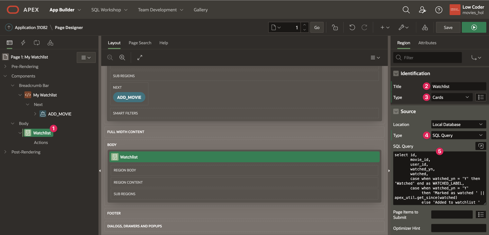

4. Go to the Attributes tab of your new Watchlist region to customize your Watchlist cards.

    * Appearance → Layout: **Horizontal (Row)**

    * Card → Primary Key Column 1: **ID**

    * Title → Column: **TITLE**

    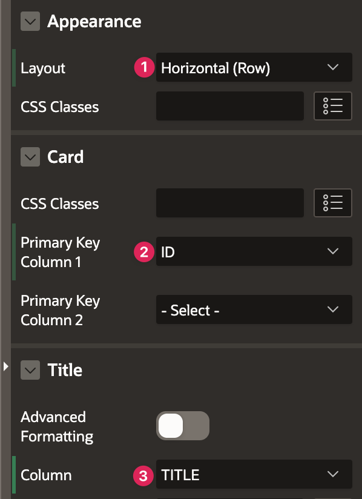

    * Body → Advanced Formatting: **on**

    * Body → HTML Expression:

        ```
        <copy>
        Release Year: &RELEASE_YEAR.
        &lt;br>
        Rating: &VOTE_AVERAGE.
        ```

    * Secondary Body → Column: **MOVIE\_STATUS**

    * Icon and Badge → Badge Column: **WATCHED\_LABEL**

    * Media → Source: **URL Column**

    * Media → URL: **POSTER\_URL**

    

## Task 2: Connect the Watchlist to the Movie Details Page
In this step, you are going to connect the My Watchlist page to the Movie Details page to allow a user to view details for any movie on the list, as well as remove a movie from their list or mark a movie as "Watched" without having to go through the Movie Search.

1. In the rendering pane, right click on the Actions section underneath the Watchlist region and select **Create Action**.

    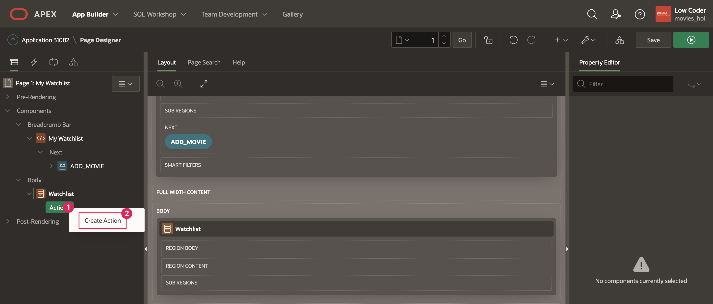

2. Set the following properties:

    * Identification → Type: **Full Card**

    * Click on the Link → Target field to open the link builder.

        - Page: **3**

        - Set Items:

            + Name: **P3\_ID**

            + Value: **&MOVIE\_ID.**

            + Name: **P3\_PREVIOUS\_PAGE\_ID**

            + Value: **1**

        - Click **Ok**.
    
3. Save and run the page.

    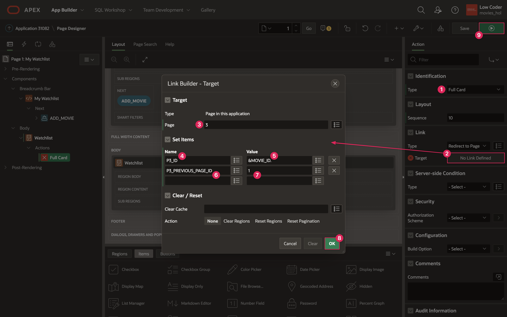

4. On the tab where the app is running, click on a movie in your watchlist. The Movie Details dialog will pop up with information about that specific movie. Note that you are able to remove a movie or mark it as watched, but you cannot add the movie because it is already in your list. Additionally, there is no back button because you are going to the Movie Details page from the Watchlist page (page 1) instead of the Movie Search page (page 2).  
*Note: If you have not added any movies to your watch list, the page will say "No data found." Make sure to add movies to your watch list so that you can view them on the Watchlist page!*

    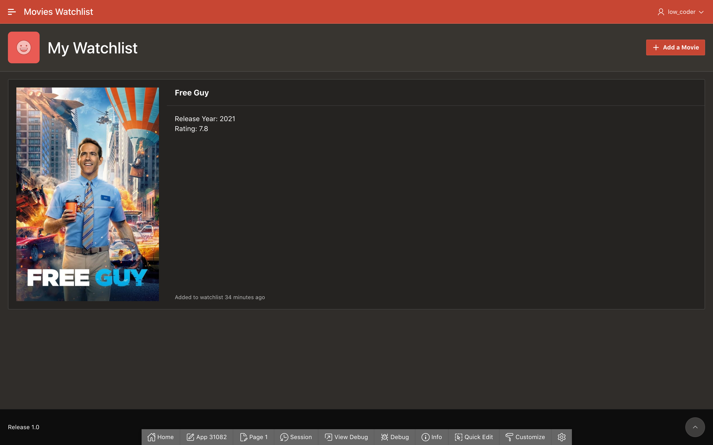

## Task 3: Add the Faceted Search
The next step is allowing a user to filter through movies in their watchlist to make it easier for users to explore their movie list and find movies they could watch based on specific criteria. You'll do this by using a Faceted Search to create facets for columns we can filter the movie list with.

1. In the Page Designer tab in your browser, right click on the Body region and select **Create Region**.

2. Set the following properties:

    * Identification → Title: **Filter**

    * Identification → Type: **Faceted Search**

    * Source → Filtered Region: **Watchlist**

    * Appearance → Template: **Blank with Attributes**

    

3. If you look at the layout pane in the Page Designer, the faceted search Filter region is underneath the Watchlist region. That is not a very convenient place and it would be better if the faceted search was sitting on the left side of the Watchlist region so users have easy access. You can change the page template to open up new positions on the page that the Filter region can go in, one of which is the Left Column.

4. At the top of the the Rendering Pane, click on **Page 1: My Watchlist**.

5. Scroll down to the **Appearance** property group.

    * Set Page Template to **Left Side Column**. 

    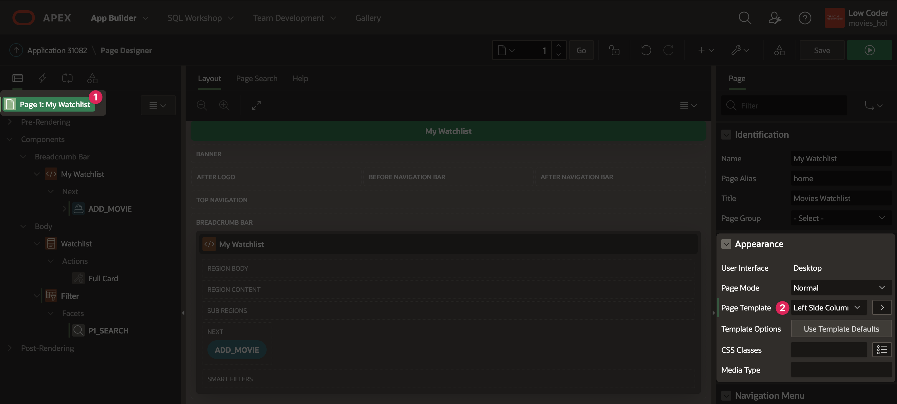

6. Click on the Filter region and set:

    * Layout → Position: **Left Column**

    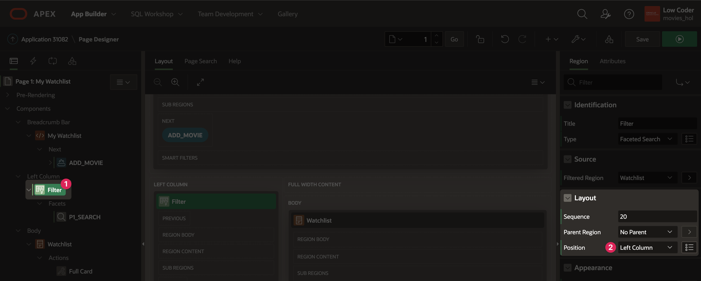

7. Notice that the facet **P1_SEARCH** was automatically created with the Faceted Search region.

    * Click on P1_SEARCH and set Source → Database Column(s) to **TITLE**

    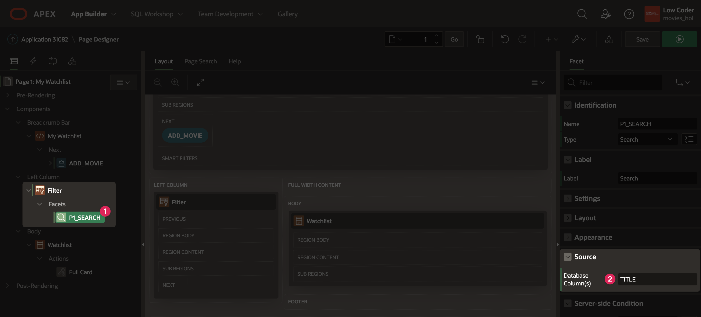

8. Right click on the Facets section under the Filter region and select **Create Facet**.

    * Identification → Name: **P1\_WATCHED\_YN**

    * Label: **Watched**

    * List of Values → Type: **Static Values**

    * Click on the box next to List of Values → Static Values to manually set up the display values that you will use for this facet. 

        - Under Values:

            + Display Value: **Yes**, Return Value: **Y**

            + Display Value: **No**, Return Value: **N**

        - Sort → Sort at Runtime: **off** 

        - Click **Ok**.

    

    * List Entries → Show Chart: **off**

    * Advanced → Collapsible: **off**

    * Oracle APEX auto-fills the Source based on the facet name.

9. You are going to add three more facets to allow a user to filter by release decade, runtime, and rating, using the DECADE, RUNTIME, and VOTE\_AVERAGE columns. The DECADE column was created within the Watchlist Source SQL select statement as a simpler date column to filter movies by instead of RELEASE\_DATE.

10. Create a new facet within the Filter region and set the following properties:

    * Identification → Name: **P1\_DECADE**

    * List of Values → Type: **Distinct Values**

    * List Entries → Sort By Top Counts: **off**

    * List Entries → Show Chart: **off**

    * Advanced → Collapsible: **off**

    * Source → Data Type: **Number**  
	   *Note: Again, Source auto-filled based on the Name of the facet. However, the data type did not change, so you have to manually change it to match the type of data you are getting in the DECADE column.*

    

11. Create another new facet within the Filter region and set the following properties:

    * Identification → Name: **P1\_RUNTIME**

    * Identification → Type: **Range**

    * Settings → Select Multiple: **on**

    * List of Values → Type: **Static Values**

    * Click on the box next to Static Values to manually set up the display values that you will use for this facet.

        - Under Values:

            + Display Value: **Over 3 hours**, Return Value: **180|**

            + Display Value: **2 to 3 hours**, Return Value: **120|180**

            + Display Value: **90 minutes to 2 hours**, Return Value: **90|120**

            + Display Value: **Less than 90 minutes**, Return Value: **|90**  
            *Note: The | syntax is used to define a range of return values. To learn more, see the Resources section at the end of this lab.*

        - Sort → Sort at Runtime: **off** 

        - Click **Ok**.

    

    * List Entries → Show Chart: **off**

    * Advanced → Collapsible: **off**

    * Source → Data Type: **Number**

12. Create the final facet within the Filter region and set the following properties:

    * Identification → Name: **P1\_VOTE\_AVERAGE**

    * Identification → Type: **Range**

    * Label: **Rating**

    * Settings → Select Multiple: **on**

    * List of Values → Type: **Static Values**

    * Click on the box next to Static Values to manually set up the display values that you will use for this facet.

        - Under Values:

            + Display Value: **Excellent**, Return Value: **8|**

            + Display Value: **Great**, Return Value: **6|8**

            + Display Value: **Fine**, Return Value: **4|6**

            + Display Value: **Bad**, Return Value: **|4**

        - Sort → Sort at Runtime: **off** 

        - Click **Ok**.

    

    * List Entries → Show Chart: **off**

    * Advanced → Collapsible: **off**

    * Source → Data Type: **Number**

## Task 4: Add a Sort By Item
In addition to the Faceted Search, it would be helpful for there to be a "Sort By" feature that allows users to reorder their list of movies a few different ways.

1. Right click on the Watchlist region in the rendering pane and select **Create Page Item**.

    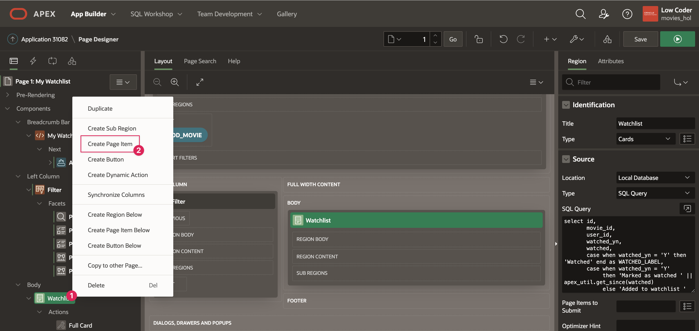

2. Set the following properties:

    * Name: **P1\_SORT\_BY**

    * Type: **Select List**

    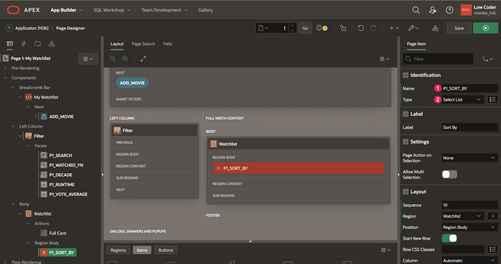

    * List of Values → Type: **Static Values**

    * Within the List of Values → Static Values dialog:

        + Display Value: **Title**, Return Value: **TITLE**

        + Display Value: **Rating**, Return Value: **RATING**

        + Display Value: **Date Added**, Return Value: **RECENT**

        + Sort → Sort at Runtime: **off**

        + Click **Ok**.

    * List of Values → Display Null Value: **off**

    * Advanced → Warn on Unsaved Changes: **Ignore**

    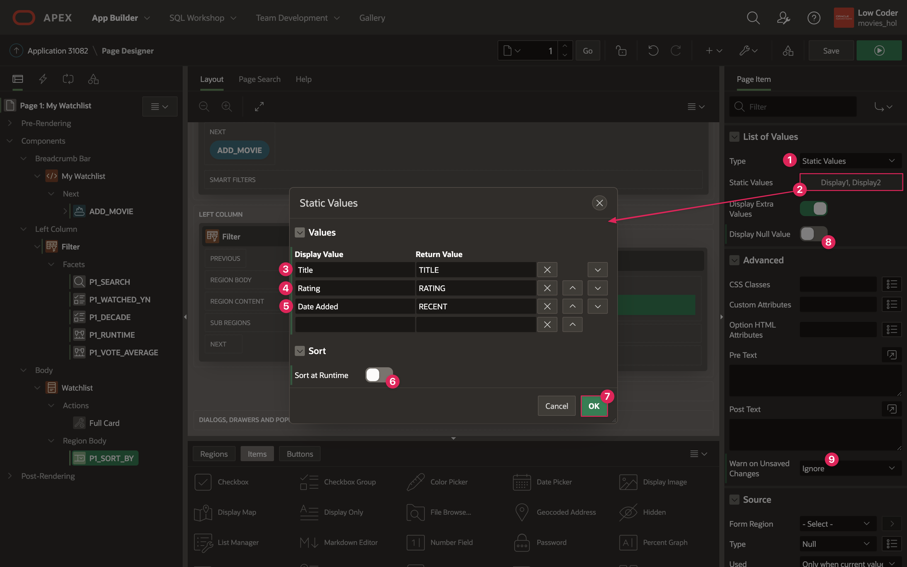

3. At this point, the sort item has been created but is not connected to anything else on the page.

4. To connect the P1\_SORT\_BY item, you will have to update the SQL query that is used for the Watchlist region source.

5. Click on the **Watchlist** region.

    * In SQL, you can sort data using the `order by` keywords. This means that when the results from the SQL query are received, they are rearranged to be in order based on the given column in the watchlist table.

    * You want the value of the Sort By page item to define what order by is, so you will update the SQL command to check for the value of P1\_SORT\_BY, and then use that to order by the associated watchlist column.

    * Copy the below code and paste it on the next blank line in the **SQL Query** code editor under Source:  

		```
		<copy>
		order by case when :P1_SORT_BY = 'TITLE'  then title else null end,
		         case when :P1_SORT_BY = 'RECENT' then created else null end desc,
		         case when :P1_SORT_BY = 'RATING' then vote_average else null end desc
		```
    * Source → Page Items to Submit: **P1\_SORT\_BY**

    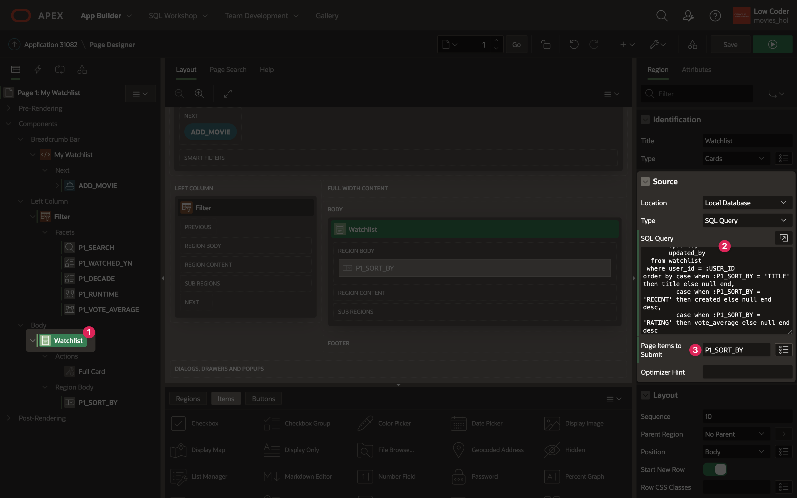

6. The final step for P1\_SORT\_BY is to add a Dynamic Action that refreshes the Watchlist region.

7. In the rendering pane, right click on P1\_SORT\_BY and select **Create Dynamic Action**.

    * Name: **Refresh Watchlist**

8. Click on the **Show** action highlighted in red, underneath your new Refresh Watchlist Dynamic Action.

    * Action: **Refresh**

    * Selection Type: **Region**

    * Region: **Watchlist**

    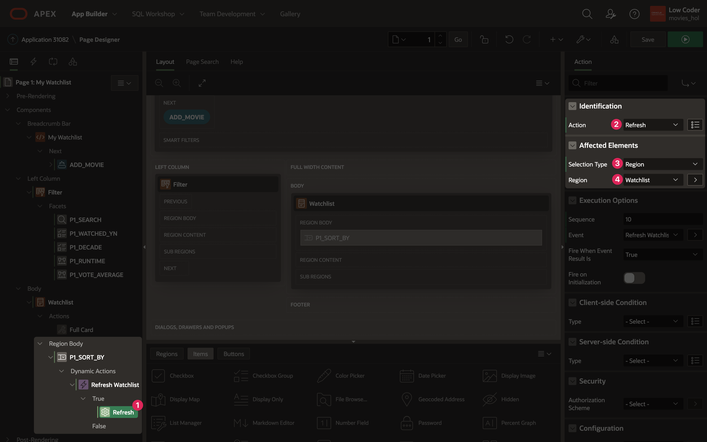

9. Save and run the page to test out your app.

    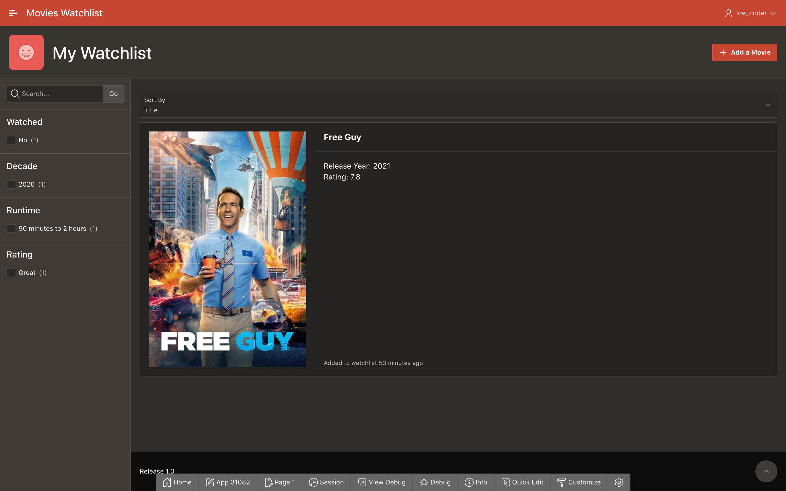

You now know how to filter data using a Faceted Search and sort data with a select list. You may now **proceed to the next lab**.

## Resources

- [Intro to Faceted Search](https://www.youtube.com/watch?v=xsA9SCFHDDI)  

- **Range Facet Syntax:** When implementing the static list of values for the Range facet in the Faceted Search region in this lab, you use the | symbol to help define the return value for each item in the static list. The | character represents a range of values that the movies in the Watchlist will be filtered on.

    For example, when setting up the P1_RUNTIME facet, the first value in the list is "Over 3 hours" and has a return value of 180|. Because you are defining a facet that represents a range, the return value 180| means that you are searching for all movies that have a runtime in the range of 180 or higher.
    
    The second value in the P1_RUNTIME list is "2 to 3 hours," which has the return value 120|180. Here, the | symbol represents all the values between 120 and 180, meaning that when this option is selected, you will get all movies with a runtime of anything between 120 and 180.

## Stuck? Download the Application Here
Stuck on a step or struggling with the lab? You can download a copy of the Movies Watchlist application through Lab 7 and follow the instructions below to import it into your Oracle APEX workspace.

- [Click here](./files/lab7.sql) to download a copy of the app at the end of Lab 7.

- You can import Lab 7 to your APEX workspace by clicking **Import** in the App Builder home page and following the wizard steps.

- When the install wizard prompts you for Credentials, follow the instructions in the <a href="?lab=creating-movie-details-page#Stuck?DownloadtheApplicationHere" target="_blank">Stuck?</a> section of Lab 4 to update the API key for the Movie Details REST source.

- Follow the instructions in the <a href="?lab=creating-movie-search-page#Stuck?DownloadtheApplicationHere" target="_blank">Stuck?</a> section of Lab 3 to update the Popular and Search Movies API keys.

## Acknowledgments

- **Author** - Paige Hanssen
- **Additional Contributors** - Kay Jasanya, Shakeeb Rahman, Steve Muench, Monica Godoy, Eli Feuerstein, Carlos Maciel, Dalia Vazquez
- **Last Updated By/Date** - Paige Hanssen, November 2021