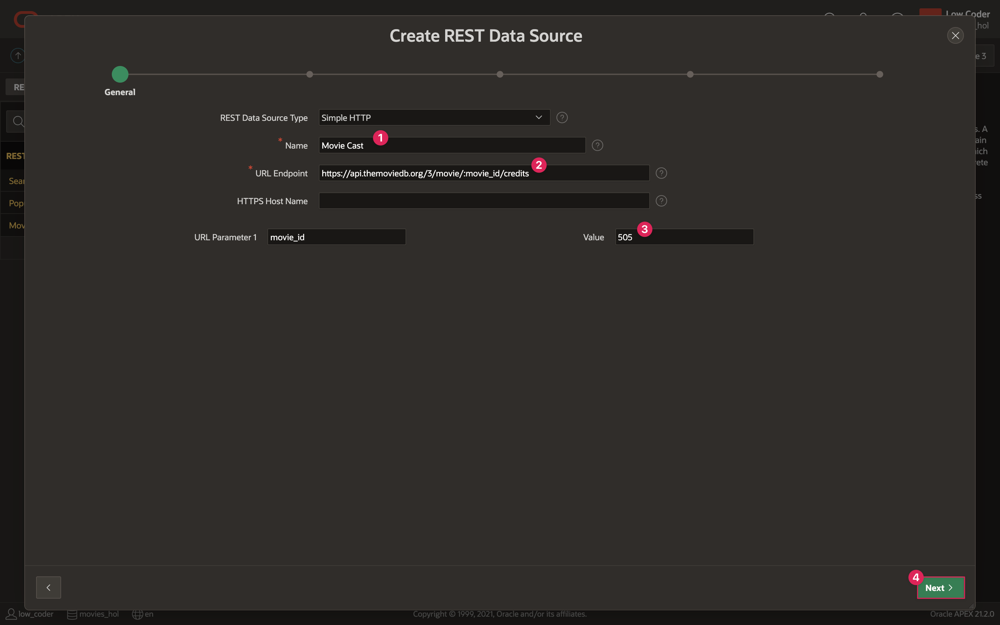
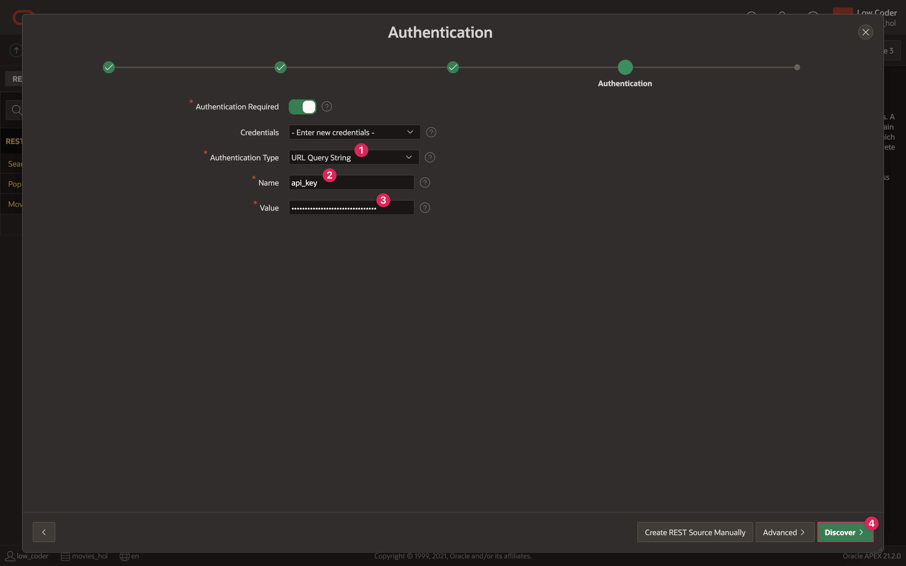
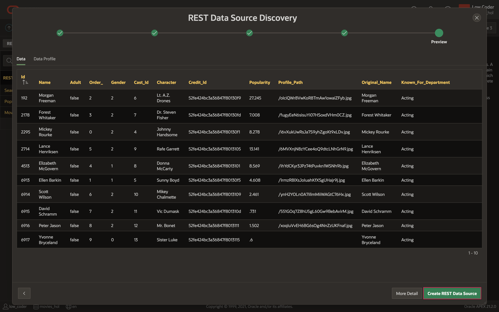
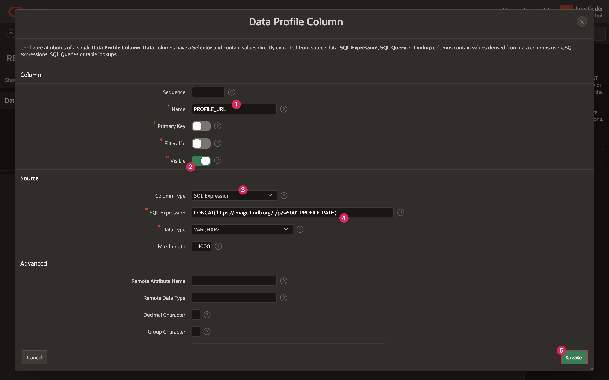

# Adding Cast List to Movie Details Page (Optional)

## Introduction
In Lab 8, you enhanced the Movie Details page by redesigning the UI and making the movie details more user friendly. This next lab is optional, but it would be fun and informative if a user were able to see not only the basic details of a movie but also the cast when they open the Movie Details page. The steps are very similar to most of the work you have already done, but Lab 9 will walk you through creating the Cast REST data source and adding Cast Cards to your Movie Details page.

Estimated Lab Time: 10 minutes

### Objectives
In this lab, you will:  
- Add a new REST data source.  
- Use the new data source to add to the Movie Details page.

## Task 1: Adding the Cast REST Data Source
The first thing you will need to do is add a new REST data source that will allow you to pull the cast list for a specific movie from the TMDB API. This will be similar to the Movie Details API in that you will need a variable within your URL endpoint. Make sure you have your REST API key available because you will need it in this step.

1. In the Page Designer tab in your browser, click on the **Shared Components** icon in top right corner to the left of the Save button.

    

2. Click on **REST Data Sources** in the Data Sources section.

3. Click **Create**.

    * Create REST Data Source: **From Scratch**

    * Click **Next**.

    * Name: **Movie Cast**

    * URL Endpoint: **https://api.themoviedb.org/3/movie/:movie\_id/credits**

    * Value: **505**

    * Click **Next**.

    

    * APEX automatically divides the URL Endpoint into the Remote Server and Service URL Path so you do not need to change anything. Click **Next** again.

    * Leave Pagination Type set to No Pagination and click **Next**.
    
    * Authentication Type: **URL Query String**

    * Name: **api\_key**

    * Value: *Insert your unique API key here.*

    * Click **Discover**.

    
    
    * On the next page of the Create wizard, you should see a table with rows of actors and their data.

    * Click **Create REST Data Source**.

    
    
4. Just like you did for the other REST Sources, you will add a new visible SQL Expression column to the Data Profile. Instead of adding a URL column for POSTER\_PATH or BACKDROP\_PATH, you will add **PROFILE\_URL** using the SQL Expression **CONCAT('https://image.tmdb.org/t/p/w500', PROFILE_PATH)**, which will contain the links to the cast members' photos.

    

5. Follow the steps in <a href="?lab=creating-rest-sources#Task2:EditingTheRESTSourceDataProfile" target="_blank">Lab 2, Task 2</a> to add a column to the Movie Cast data source.

## Task 2: Adding the Cast Region to Movie Details Page
You can now use your Movie Cast REST data source on the Movie Details page to bring everything together.

1. Navigate back to the Movie Details page of your Movies Watchlist application.

2. Right click on Content Body in the rendering pane and select **Create Region**.

    * Title: **Cast**

    * Type: **Cards**

    * Source → Location: **REST Source**

    * Source → REST Source: **Movie Cast**

    * Appearance → Template: **Content Block**

    * Appearance → open the Template Options dialog:

        - Region Title: **Small**

        - Click **Ok**.

        

3. Click on the Attributes tab and set the following:

    * Appearance → Grid Columns: **5 Columns**

    * Card → Primary Key Column 1: **ID**

    * Title Column: **CHARACTER**

    * Subtitle → Column: **NAME**

    * Media → Source: **URL Column**

    * Media → URL Column: **PROFILE\_URL**

    * Media → Position: **First**

    * Media → Appearance: **Square**

    * Media → Sizing: **Cover**

    * Pagination → Type: **Page**

    * Pagination → Cards per Page: **10**

    

4. Under the Cast region in the rendering pane, expand the **Parameters** dropdown.

5. Click on **movie\_id**.

6. Set the following properties:

    * Type: **Item**

    * Item: **P3\_ID**

7. Click **Save**.

8. Refresh the tab where your app is running and click on a movie either from your Watchlist or from the Movie Search to view the updated Movie Details page.

    

## Resources

- [REST Data Sources Documentation](https://docs.oracle.com/en/database/oracle/application-express/21.1/htmdb/managing-REST-data-sources.html#GUID-93D7A596-03A9-48AF-9FC9-6538BCC25DED)  

- [Cards Documentation](https://docs.oracle.com/en/database/oracle/application-express/21.1/htmdb/managing-cards.html#GUID-0F5699C1-D198-4951-9E9C-175F6D79936B)  

## Stuck? Download the Application Here
Stuck on a step or struggling with the lab? You can download a copy of the Movies Watchlist application through Lab 9 and follow the instructions below to import it into your Oracle APEX workspace.

- [Click here](./files/lab9.sql) to download a copy of the app at the end of Lab 9.

- You can import Lab 9 to your APEX workspace by clicking **Import** in the App Builder home page and following the wizard steps.

- When you are prompted by the Install wizard for Credentials, follow the instructions in the <a href="?lab=creating-movie-details-page#Resources" target="_blank">Resources</a> section of Lab 4 to provide credentials for the Movie Cast REST data source as well as the Movie Details source (if necessary).

- Follow the instructions in the <a href="?lab=creating-rest-sources#Stuck?DownloadtheApplicationHere" target="_blank">Stuck?</a> section of Lab 2 to update the Popular and Search Movies API keys.