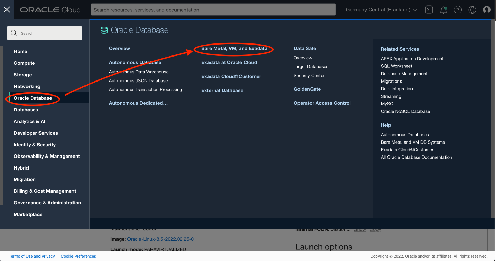
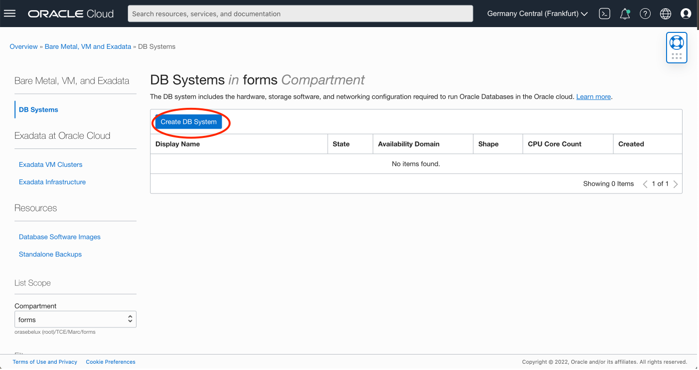
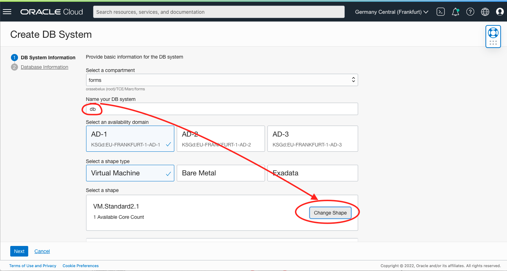
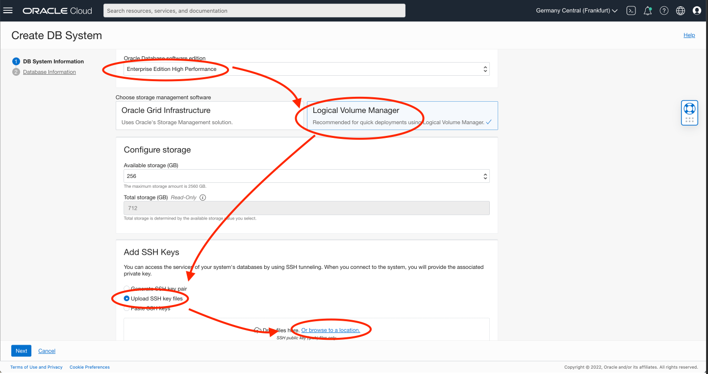
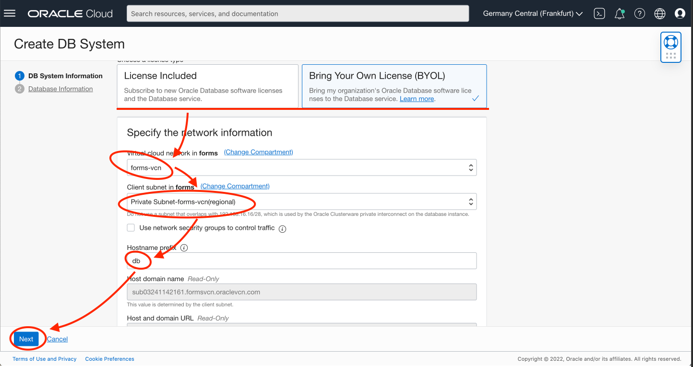
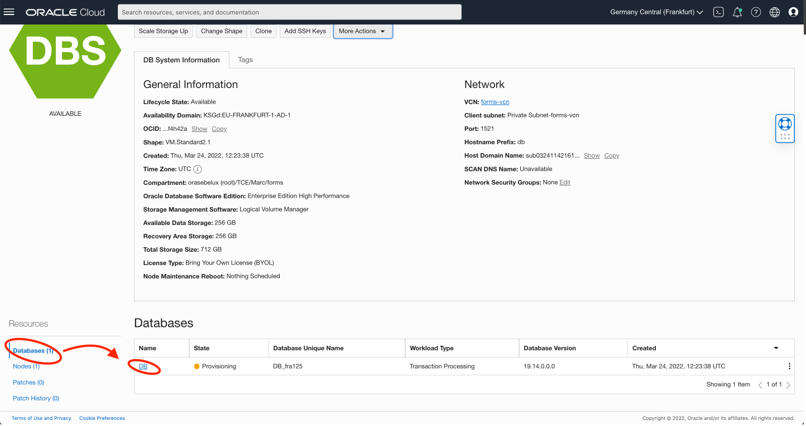
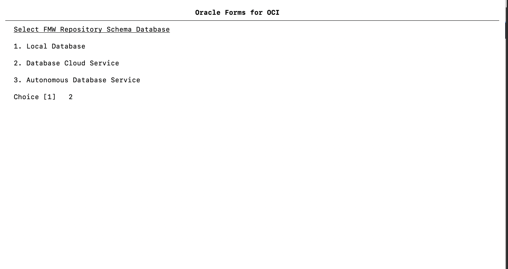
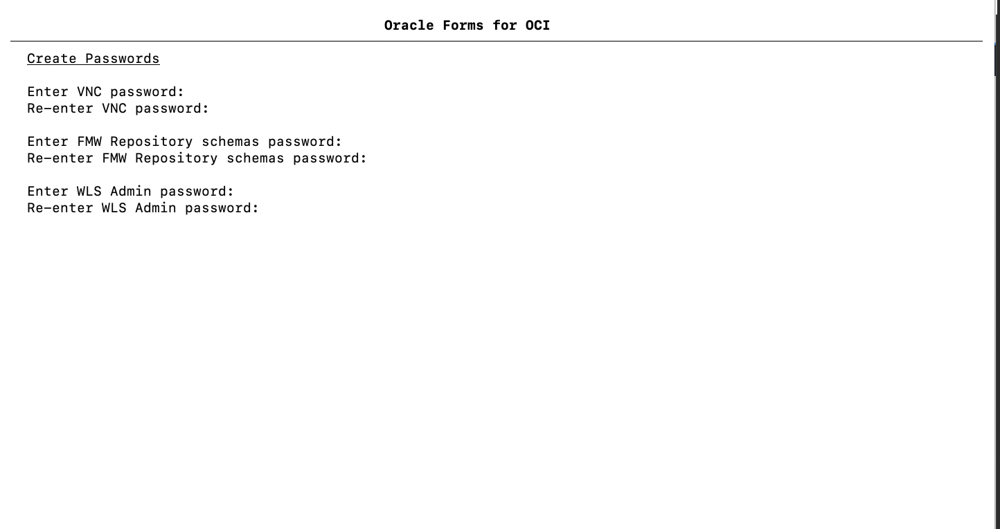

# Option 2: Database Cloud Service

## Introduction

Estimated Time: 15 minutes

### Objectives

In this lab, you will: 
- Install the database
- Run the forms configuration

## Task 1: Install Database Cloud Service

For a production database, it is better to use Database Cloud Service.
This is what we will install here. 

1. Go to the Oracle Cloud home page. In the Hamburger menu, look for **Oracle Database**. Then **Bare Metal, VM and Exadata**

   

2. Click **Create DB System**

   

3. Then in
- Name your DB system: **db** (for ex)
- Change Shape and choose the one that you need (Ex: VM.Standard2.1 )

   

4.. Further in the wizard

- Oracle Database software edition: Choose the version that you need (Ex: Enterprise High Perfomance)
- Choose storage management software: **Logical Volume Manager**
- SSH key: add the public ssh key that you got from the bastion (##1##)

   

- Choose your licence (Ex: Bring Your Own Licence)
- Virtual cloud network **forms-vcn**
- Client subnet: **Private Subnet-forms-vcn**
- Click **Next**

   

5.. On the second tab,

- Database name: **DB**
- Password: **LiveLab__123** (for ex)
- Confirm Password: **LiveLab__123** (for ex)
- Click **Create DB System**

   

You can execute the Task 2 before that the database is created. You will need it for step 3 only.

6.. Get the connection details of the database.
    Go to the database node. Then DB

   

- Click **DB Connection**
- And the easy connection string (##DB\_EASY##)
- Then copy the long connection string (##DB\_LONG##)

   

## Task 2: Start Forms Configuration 

The Forms and Database should be started. Let's provision the installation.

1. SSH to the Forms Server

Ideally, you should SSH to you Forms Server from your laptop.

There are several way to do this. For this tutorial, we will use a Bastion.
But note that it is a lot easier on a day to day like to use a VPN or Fastconnect. 

```
# Add the key to ssh-agent
ssh-add &lt;ssh-private-key&gt;
# Connect via the bastion
ssh -J opc@&lt;bastion-ip&gt; opc@&lt;Forms Private IP&gt;

Ex:
ssh-add ssh-key-2022-03-21.key
ssh -J opc@130.131.132.133 opc@10.0.1.130
```

2. The provisioning will start. 

## Task 3: Configure Forms with Database Cloud Service

1. Choose Dabase Cloud Service **2**

   

2. Enter the followin:
- Enter the DBCS Sys Password: **LiveLab__123**
- Enter the DBCS PDB Name: **db\_pdb1**
  = the name of the db + "_pdb1"
- Enter the DBCS long connect string:  see ##DB\_LONG##. Take care to replace with the service name by db_pdb1

```
(DESCRIPTION=(CONNECT_TIMEOUT=5)(TRANSPORT_CONNECT_TIMEOUT=3)(RETRY_COUNT=3)(ADDRESS_LIST=(LOAD_BALANCE=on)(ADDRESS=(PROTOCOL=TCP)(HOST=10.0.0.197)(PORT=1521)))(CONNECT_DATA=(SERVICE_NAME=DB_fra125.subnet03211405.vcn03211405.oraclevcn.com)))

to 

(DESCRIPTION=(CONNECT_TIMEOUT=5)(TRANSPORT_CONNECT_TIMEOUT=3)(RETRY_COUNT=3)(ADDRESS_LIST=(LOAD_BALANCE=on)(ADDRESS=(PROTOCOL=TCP)(HOST=10.0.0.197)(PORT=1521)))(CONNECT_DATA=(SERVICE_NAME=db_pdb1.subnet03211405.vcn03211405.oraclevcn.com)))
```

- Enter the DBCS easy connect string: see ##DB\_EASY##

```
Ex: db.subnet03211405.vcn03211405.oraclevcn.com:1521/DB_fra125.subnet03211405.vcn03211405.oraclevcn.com
```

   

2. Enter the passwords. By example:
- Vnc Password: **LiveLab1**
- FMW Repository Schema password: **LiveLab__123**
- WLS Admin password: **LiveLab1**

   

3.. Run the installation

Wait that the installation finishes. It takes about 10 mins.

## Learn More

* [Forms on OCI](https://docs.oracle.com/en/middleware/developer-tools/forms/12.2.1.4/forms-oci/index.html)

## Acknowledgements
* Marc Gueury - Application Development EMEA
* Last Updated - March 2022
