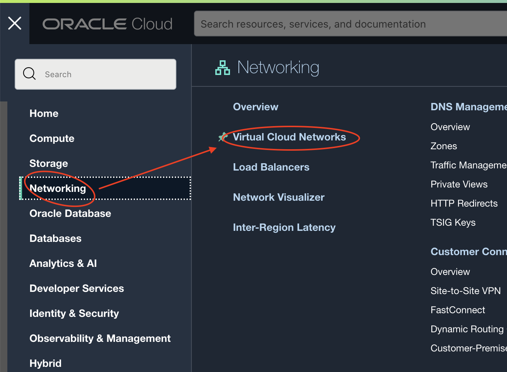
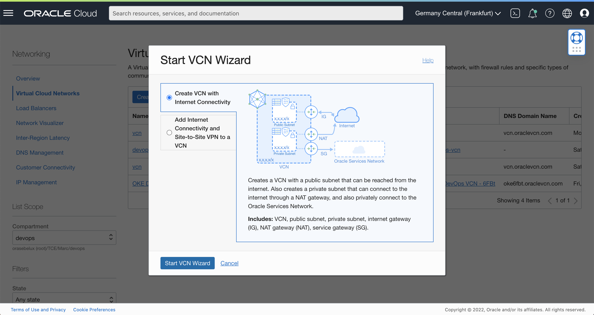
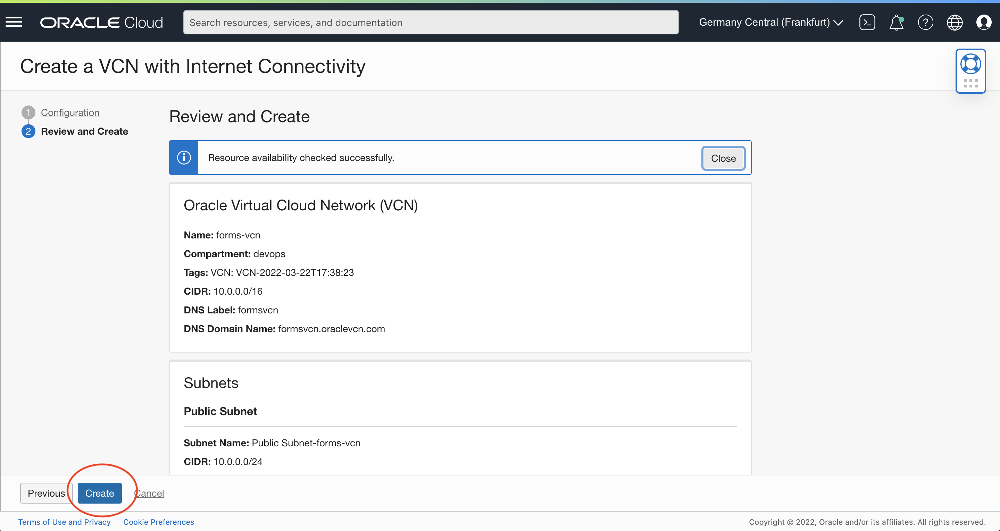
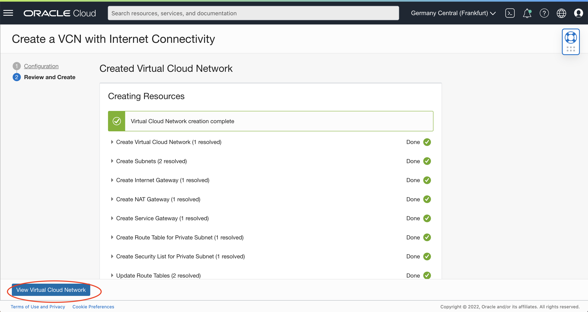
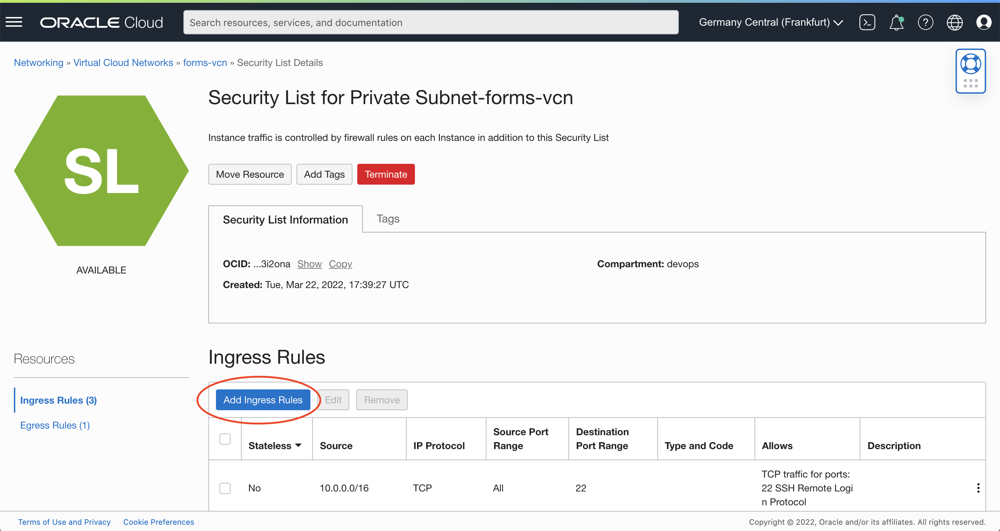
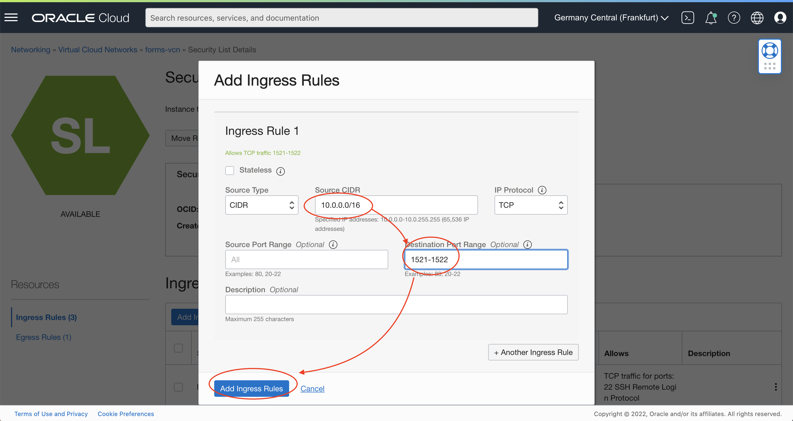
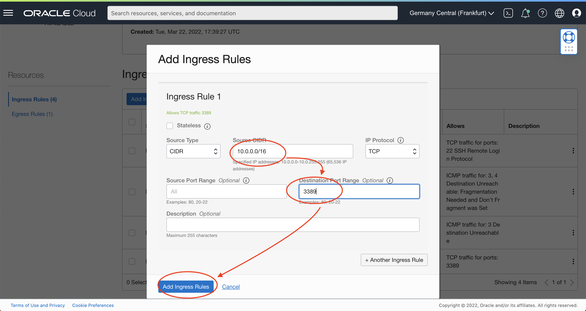
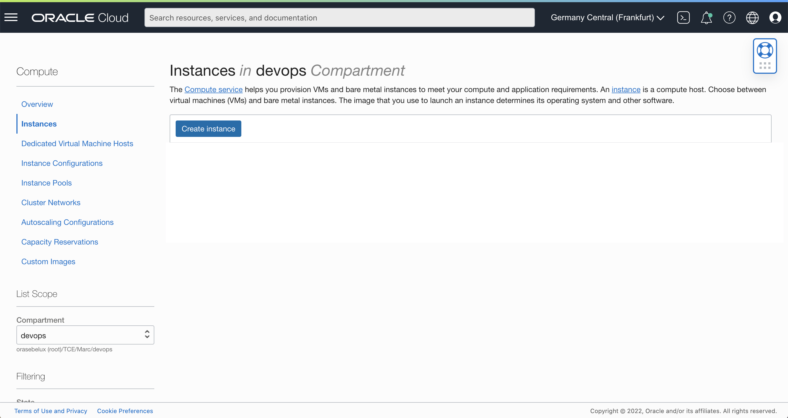
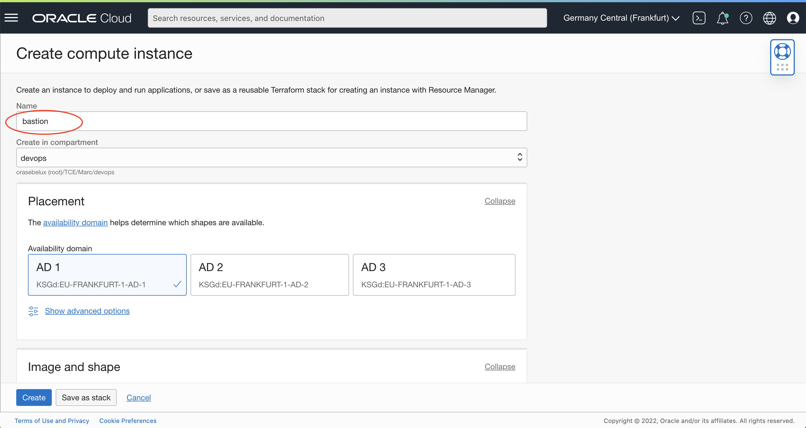
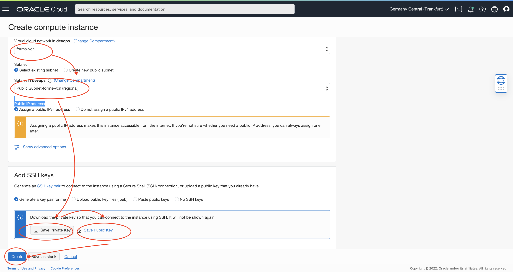

# Configure the Network #

## Introduction

In this lab, you will create a Virtual Cloud Network (VCN) and related network resources. A VCN is similar to your own on premise enterprise network.  In the Oracle Cloud, the network is software defined and virtual. This makes for very fast creation, but still providing high performance, and complete security. 

Estimated Time: 10 minutes

### Objective

* Create virtual cloud network

### Prerequisites

* Access to an Oracle Cloud Tenant

## Task 1: Create the VCN ##

In this step, you will create a VCN with the quick start wizard. This will create all the related network resources including a public subnet, private subnet, internet gateway, NAT gateway, Service gateway, default security lists, and default route rules and table.

We are taking the quick option, but there is also a custom option to create resources individually.

1. Select the cloud services hamburger menu on the top left corner and select Networking

    

2. Select **Virtual Cloud Networks**

3. (Optional) Select your Compartment

4. Click **Start VCN Wizard**

  

5. Enter a unique name for your VCN. Ex: **forms-vcn**

 

6. Check the VCN CIDR block of 10.0.0.0/16.  Note: The CIDR Block is the range of IP addresses that can be used.

7. Click **Next** 

  

8. Then **Create**

  

  A summary is displayed. 

9. Click **View Virtual Cloud Network**

## Task 2: Security List for Database or Forms Builder on Windows ##

You need to run these steps to:
- connect your Forms Server to a database listener in a VM or Autonomous. 
- (optional) connect a Forms Builder on Windows to the other servers

You should be in the details of the Virtual Cloud Network.

1. Click **Security List**

2. Choose the **Security List Form Private Subnet-forms-vcn**

   

3. Add a rule for the Oracle Database listener. Click **Add Ingress Rule**

   

- In Source CIDR, type **10.0.0.0/16**
- In Destination port, **1521-1522**
- Then Click **Add Ingress Rules.**

4.. Add a rule for Windows Remote Desktop. Click a second time **Add Ingress Rule**

   

- In Source CIDR, type **10.0.0.0/16**
- In Destination port, **3389**
- Then Click **Add Ingress Rules.**

## Task 3: Install a Bastion   ##

1. In the Hamburger menu, choose **Compute / Instance**
2. Then click **Create Instance**

   

3. In the name, type **bastion**

   

4. In the network, check that :
- VCN: **forms-vcn**
- Subnet: **Public subnet for forms-vcn**
- Save the public and private SSH keys (##1##)
- Click **Create**

5.. Get the Public IP

   

Write it down. (##2##)

## Acknowledgements ##

- **Author** - Marc Gueury - Application Development EMEA 
- March 2022
