# Install Forms Builder on Windows

## Introduction

Install a Forms Builder to develop the Forms.

Estimated Time: 20 minutes

### About Forms Builder
Forms Builder allows to modify the Forms and to compile them. To get the same look and feel during development and runtime. The Forms Builder running on Windows works better. We will install it.

### Objectives

In this lab, you will:
* Install a Windows machine 
* Install Forms Builder on it
* Connect to your database.

### Prerequisites 

This lab assumes you have:
* All previous labs successfully completed
* Runned the optional **Lab 1: Configure the Network - Task 2: Security List for Database or Forms Builder on Windows**, you have to add security list rules to open 
    - the port 1521-1522 (Oracle Database listener) 
    - and 3389 (Remote Desktop).

## Task 1: Install a Windows Machine

Let's create a Windows Machine

1. Again, go to Hamburger/ Compute / Instance
2. Click **Create Instance**
3. For the name, **windows**

 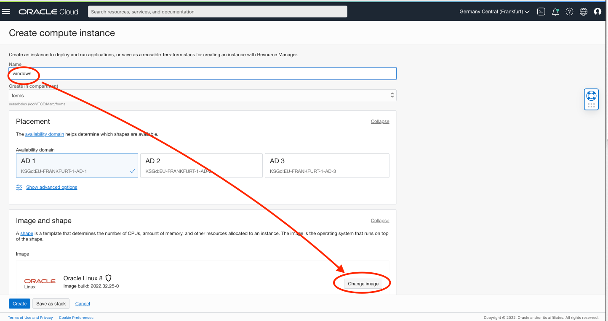

4. Click **Change Image**. Then choose **Windows**

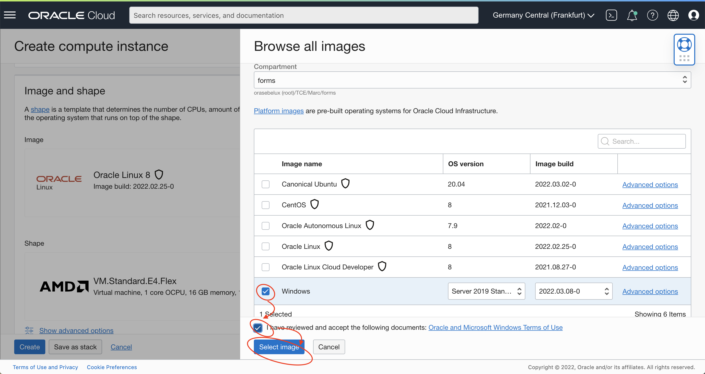

5. Then:
- VCN: **forms-vcn**
- Subnet: **Private subnet for forms-vcn**
- Click Create

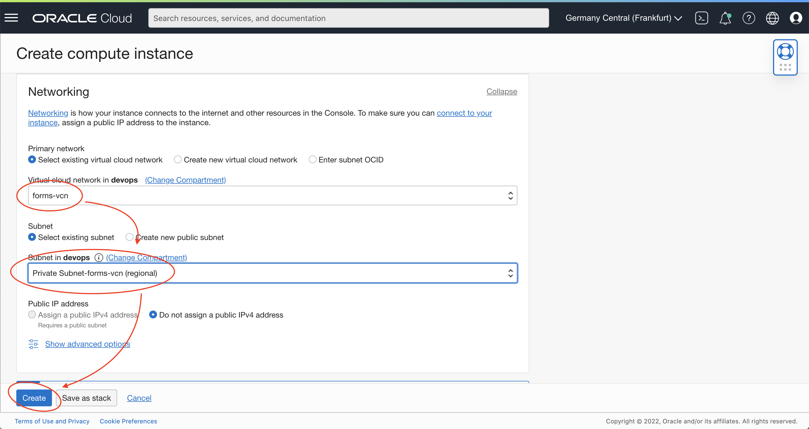, 

6. Get the Private IP address (##4##) And the original password (##5##)

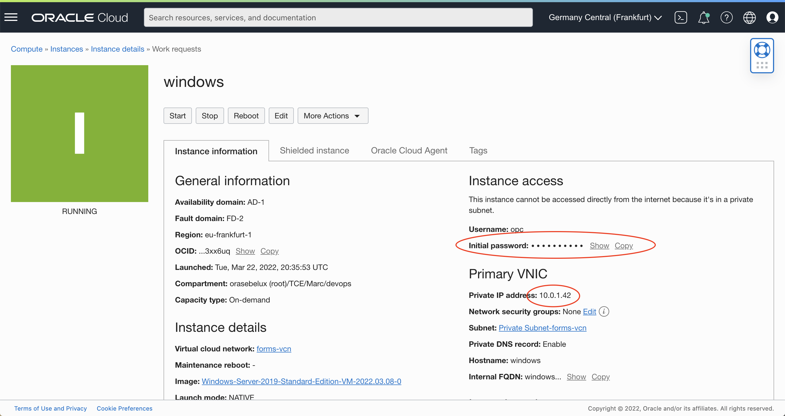

## Task 2: Connect to the Windows Machine

You can connect to the Windows machine via Remote Desktop. It is available on all operating systems. 
Remote Desktop run on the port 3389. 

1. Download and run it. 
2. SSH to the bastion by forwarding the port of the Windows machine.

Since we are using a Bastion, we need to forward the port 3389 to your computer. 
It is not needed if you use a VPN or Fastconnect.

```
ssh opc@&lt;Bastion Public IP&gt -L3389:&lt;Windows Private IP&gt;:3389

ex:
ssh opc@130.131.232.133 -L3389:10.0.1.42:3389
```
Keep the SSH session opened.


3. Connect with Remote Desktop to the machine: localhost

4. Enter the password (##5##). Take care:
- About the keyboard settings on Windows (see screenshot)
- Verify with the eye if the password is correct.


5. You will then need to reset the password. Same take care:
- About the keyboard settings on Windows
- Verify with the eye if the password is correct.

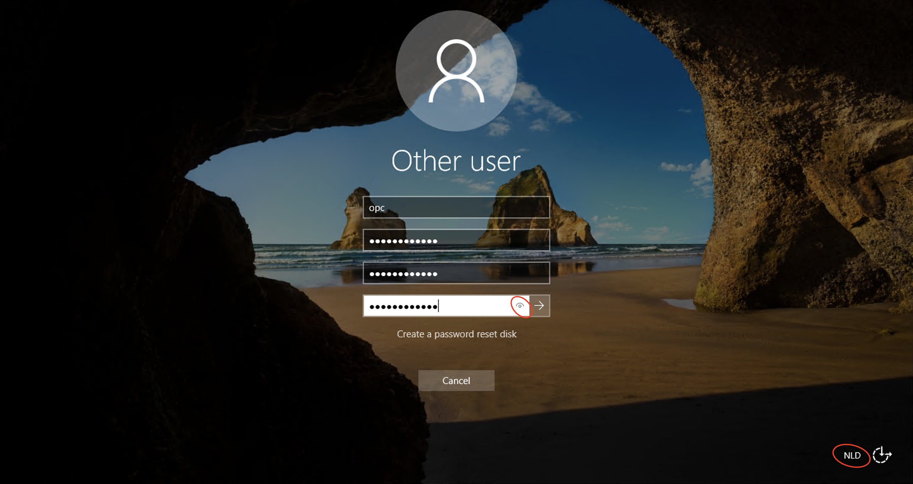

6. When logged in Windows. Maybe install another browser than Internet Explorer... Internet Explorer is quite touchy and ask to add all internet URLs in 
- Start Internet Explorer
- Settings 
- Tab Security
- Trusted Sites
- Add Sites. For example, add https://www.mozilla.org, https://download-installer.cdn.mozilla.net
- Then https://www.mozilla.org and download Firefox for example.

   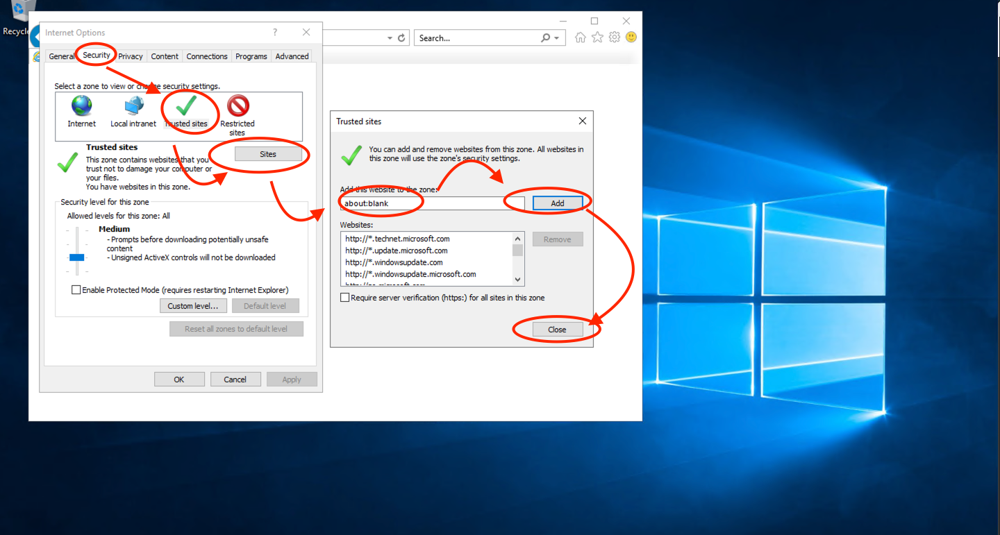

## Task 3: Requirements

It is always interesting to check the requirement before to install the software. See [here](https://docs.oracle.com/en/middleware/fusion-middleware/12.2.1.4/sysrs/system-requirements-and-specifications.html#GUID-CB8C7C04-C8BD-4F9F-8ACF-F735FB6BD871).  

You need to install the MS VC libraries in order to ensure that all components/tools in the installation work correctly.

- Install Visual Studio 2012 (VC++ 11.0) Update 4 : 
[https://docs.microsoft.com/en-us/cpp/windows/latest-supported-vc-redist?view=msvc-170](https://docs.microsoft.com/en-us/cpp/windows/latest-supported-vc-redist?view=msvc-170)  

## Task 4: Install Forms Builder on Windows

1. Download the software.

Go to https://www.oracle.com/middleware/technologies/forms/downloads.html

Then download the Forms Builder software. It is a zip file of about 2GB.

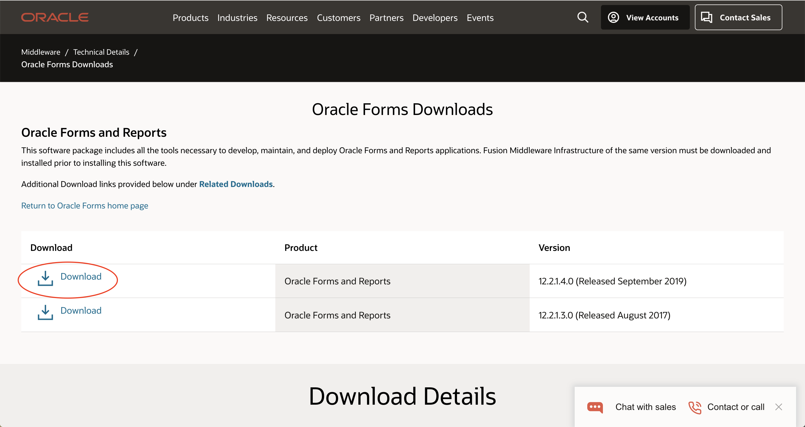, 

You will need to login to download from Edelivery


Then Start the Download Manager

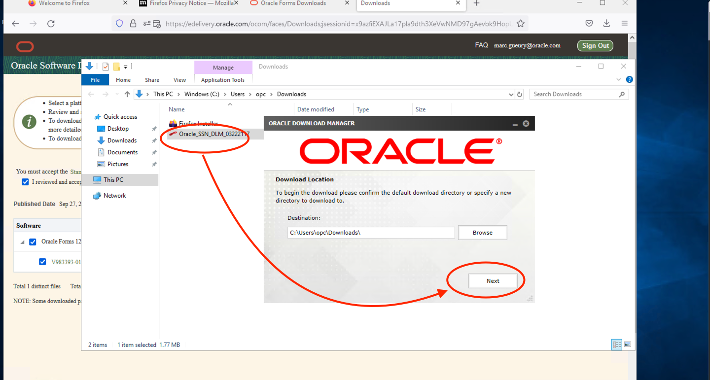

When the download is completed, unzip the file.

2. Right click on the installer executable. And **Run as administrator**

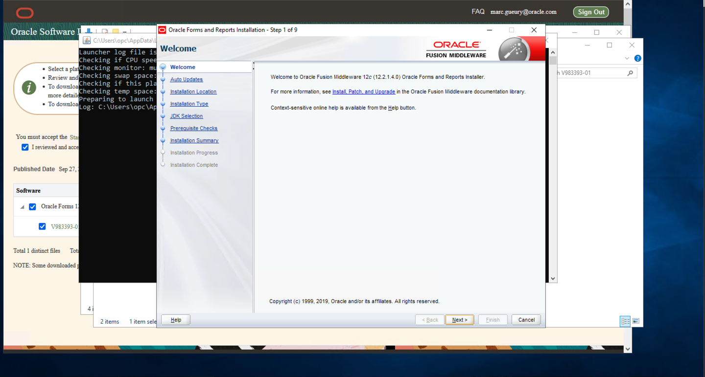

Follow the wizard
- Welcome: Next
- Auto-update: Next
- Oracle Home (keep default C:\Oracle\Middleware\Oracle_Home): Next
- Installation Type (Forms Builder): Next
- JDK home: C:\Oracle\Middleware\Oracle\_Home\oracle_common\jdk 
- Then Next
- There will be a warning. Skip. Install.

- Installation Progress: Next
- Installation Complete:
- **DO NOT CLICK FINISH**. Else you will need to rerun the Forms Builder Config [manually](https://docs.oracle.com/middleware/1221/formsandreports/install-fnr/install.htm#FRINS394).
- But check **Automatically Launch Forms Builder Configuration Wizard**
- In the Forms Builder instance: choose a directory like: C:\Oracle\Middleware\forms1

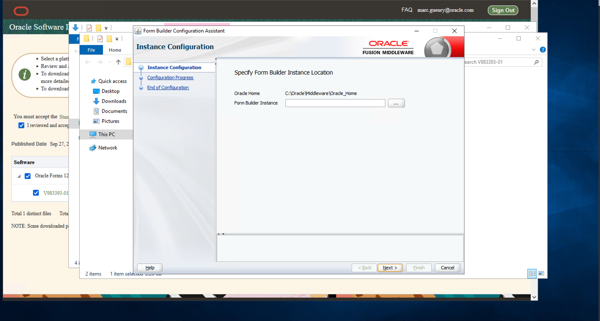

- Then Next / Finish.

## Task 5: Test Forms Builder

1. If you want to access the local database on the Forms Server. 
1. Before to start. Copy the tnsnames.ora from your Linux environment from /u01/oracle/middleware/user\_projects/domains/base\_domain/config/fmwconfig in C:\Oracle\Middleware\forms1

- Copy the SSH private key on the Windows machine.
- Start CMD.EXE on Windows in Administator mode. Then run this command:

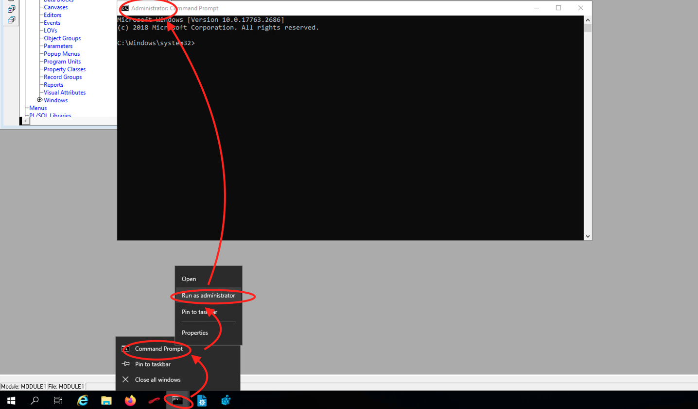

```
# Copy the tnsadmin.ora file
scp -i &lt;ssh private key&gt; opc@&lt;Forms Private IP&gt;:/u01/oracle/middleware/user_projects/domains/base_domain/config/fmwconfig/tnsnames.ora C:\Oracle\Middleware\forms1

# If you use the Local DB of the Forms Server. Open the port in the Linux Firewall.
ssh -i &lt;ssh private key&gt; opc@&lt;Forms Private IP&gt;
sudo firewall-cmd --zone=public --add-port=1521/tcp --permanent
exit

Ex:
scp -i ssh-key-2022-03-21.key opc@10.0.1.130:/u01/oracle/middleware/user_projects/domains/base_domain/config/fmwconfig/tnsnames.ora C:\Oracle\Middleware\forms1

ssh -i ssh-key-2022-03-21.key opc@10.0.1.130
sudo firewall-cmd --zone=public --add-port=1521/tcp --permanent
exit
```

2. Start Forms Builder

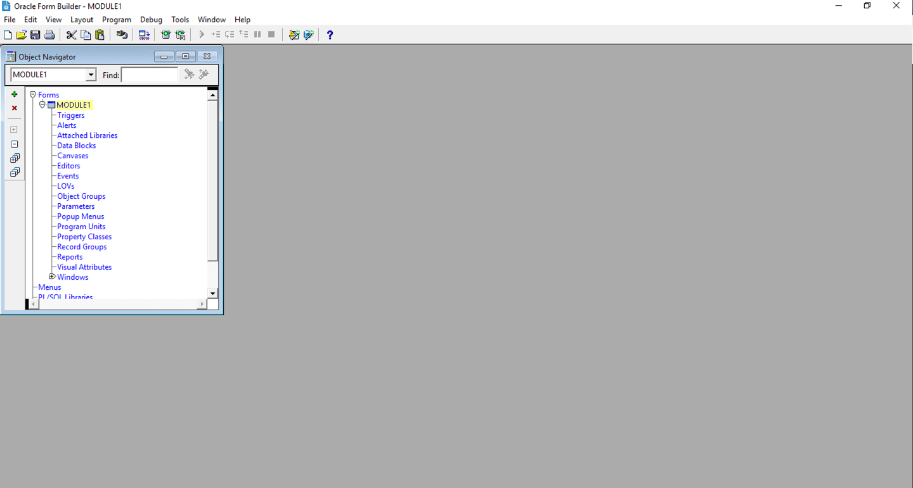


## Learn More

* [Forms Documentation](https://docs.oracle.com/en/middleware/developer-tools/forms/12.2.1.4/index.html)
* [Forms Builder Wizard](https://docs.oracle.com/middleware/1221/formsandreports/install-fnr/install.htm#CIHGBBEH)
* [Windows Requirements](https://docs.oracle.com/en/middleware/fusion-middleware/12.2.1.4/sysrs/system-requirements-and-specifications.html#GUID-CB8C7C04-C8BD-4F9F-8ACF-F735FB6BD871)

## Acknowledgements
* Marc Gueury - Application Development EMEA
* Michael Ferrante - Senior Principal Product Manager
* Last Updated - March 2022


