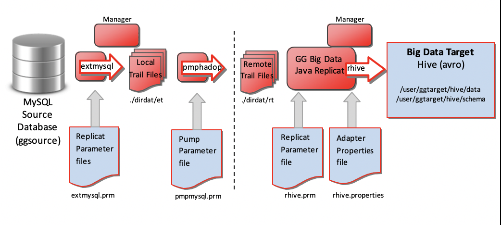
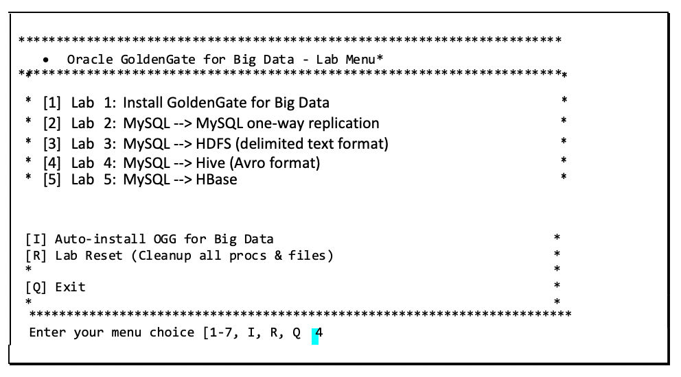

# Lab 4 -  MySQL --> Hive (Avro format)
Aug 6, 2020

Lab Architecture

## Before You Begin

su - ggadmin
password: Data1Integration1 or oracle

### Introduction
In this lab we will load data in MySQL database ‘ggsource’, GG extract process ‘extmysql’ will capture the changes from MySQL’s binary logs and wrote them to the local trail file. The pump process ‘pmphadop’ will route the data from the local trail (on the source) to the remote trail (on the target). The replicat
process ‘rhive’ will read the trail file, create the Hive tables, write the data and the schema files (avsc) to the HDFS target directory for Hive: /user/ggtarget/hive/data/* and /user/ggtarget/hive/schema/*

### Objectives
- GoldenGate replication from **MySQL to Hive**

### Time to Complete
Approximately 60 minutes

## Before You Begin
For the Lab terminal session:

use ggadmin to log into your new Lab4

------

### Task 1: Setting up the Environment For MySQL.
    
If already at a Unix prompt, you can access the Lab Menu by typing the alias ‘labmenu’

The following Lab Menu will be displayed, select R to reset the lab environment, then option 4

The above step will copy the GoldenGate configuration files to the GG Home directories, under ./dirprm. The workshop facilitator will review the content of each of these files to understand how GoldenGate is being configured.

1)	view /u01/gg4mysql/dirprm/create_mysql_to_hadoop_gg_procs.oby
2)	Optionally view these files, same as in previous lab:
/u01/gg4mysql/dirprm/mgr.prm
/u01/gg4mysql/dirprm/extmysql.prm
/u01/gg4mysql/dirprm/pmpmysql.prm
3)	view /u01/gg4hadoop123010/dirprm/create_hive_replicat.oby
4)	view /u01/gg4hadoop123010/dirprm/rhive.prm
5)	view /u01/gg4hadoop123010/dirprm/rhive.properties

First we will start the GG manager process on both the source and target. Start 2 putty sessions, connect to ggadmin/oracle (then click Q to get to a prompt). Keep these sessions open for the rest of this lab.

In the first session, go to the GG Home for MySQL, and start the manager process. You can either cd to the directory, or call the alias ggmysql:

In the second session, go to the GG Home for Hadoop, and start the manager process. You can either cd to the directory, or call the alias gghadoop:

In the GG for MySQL ggsci session, we will create and start the GG extract process:

Now that the source side is setup, let’s configure GG on the target side (Hive Avro format).

In the GG for Hadoop session, you’ll need to modify the Hive properties by removing the ‘---‘ from the highlighted values:

Now create and start the Hive replicat process:

Now that GG processes have been created and started on both the source and target, let’s take a look at what’s in the Hive directories (schema & data) – they should be empty. Then we’ll load some data on
the MySQL database ‘ggsource’ and GG will extract and write it to the Hive target. GG will create a subdirectory for each table in the base directory /user/ggtarget/hive/data.

Start a new session, connect to ggadmin/oracle (then click Q to get to a prompt):

There should be several .avro files in the data directory, and 3 .avsc files in the schema directory. You will notice that a new directory has been created for each table in the data directory.

Starting with GG version 12.2.0.1.1, GG automatically creates the Hive tables with .avsc schema file. Let’s take a look at the contents of the tables:

Also take a look at the Avro schema files created by GG, it’s created in the ./dirdef directory in the GG Home for Hadoop:

In summary, we loaded data in MySQL database ‘ggsource’, GG extract process ‘extmysql’ captured the changes from the MySQL binary logs and wrote them to the local trail file. The pump process
‘pmphadop’ routed the data from the local trail (on the source) to the remote trail (on the target). The replicat process ‘rhive’ read the remote trail files, created the Hive tables, wrote the data and the schema files (avsc) to the HDFS target directory for Hive: /user/ggtarget/hive/data/* and
/user/ggtarget/hive/schema

You can also see the files that are created in the Hive directory in HDFS:

Click on File Browser (Manage HDFS) > Navigate to /user/ggtarget/hive… Take a look at the .avro and the schema .avsc files:

Let’s confirm that GG replicated the data that it captured. In a GG Home for Hadoop session:

# End of Lab 4.

## Optional Only if VNC is available

You can also see the Hive data created by GG from Hue:

Open a Browser window> http://127.0.0.1:8888/ Login to Hue: cloudera/cloudera

1-	Click on Query Editor, Hive
2-	Pull down on Database selection, and select ggtarget2hive_avro
3-	Then hover the mouse over the emp table, and click the ‘preview sample data’ –small grey icon Hue screens:

## Acknowledgements

 - ** Authors ** - Brian Elliott
 - ** Contributors ** - Brian Elliott
 - ** Team ** - Data Integration Team
 - ** Last Updated By ** - Brian Elliott
 - ** Expiration Date ** – July 2021

