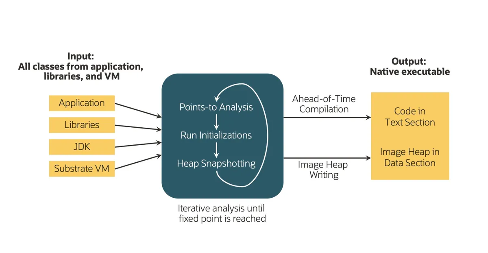
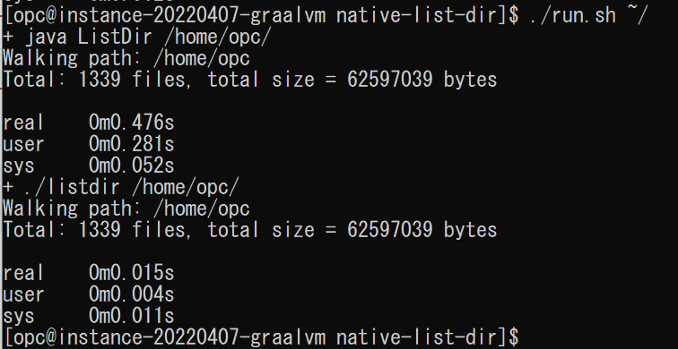

# Native Image

## 概要

この演習では、通常のJavaクラスをネイティブコンパイルした上、従来のJIT方式とネイティブ形式の実行時パフォーマンスを比較します。  
Graalコンパイラには、進化したJITコンパイラ機能に並び、ネイティブな実行ファイル(native image)を生成するAOT（Ahead-Of-Time)コンパイラ機能を持ち合わせています。Javaバイトコード（Javaクラス）を実行しながらコンパイルするJITモードとは異なり、AOTモードでは実行前のビルド時に、Javaバイトコードを静的解析をした上コンパイルされます。ネイティブな実行ファイルを生成するプロセスの中で、主に以下の作業が行われます。
* ポインタ解析（Points-to analysis）:　AOTコンパイラが、実行時に到達可能なクラス、メソッド、フィールド、依存ライブラリ、必要なJDKクラスを判別して、ネイティブ実行ファイルに格納します。
* ビルド時初期化（Initializations at build time）： ビルド時クラスを初期化し、実行時のオーバーヘッドを軽減します。
* ヒープスナップショット（Heap snapshotting）： 初期化オブジェクト、到達可能なオブジェクトをJVMヒープ上に事前に書き込みすることによって、実行時スピードを大幅に高めます。



*所要時間: 10分*

### ■目標
* GraalVMのAOTコンパイラでJavaクラスをネイティブ実行ファイル(naitve image)に変換
* JavaアプリケーションをJITモードとネイティブモードでそれぞれ実行し、パフォーマンスを比較

### ■前提条件

* 演習１「GraalVM Enterprise Editionのインストール」を実施済みであること

## Task 1: サンプルアプリケーションの導入

このサンプルはJava Stream APIを利用して、指定したディレクトリー配下のすべてのファイルを集計して、その数とファイルサイズの合計を表示するプログラムです。同じプログラムをJITモードとネイティブモードの両方で実行し、所要時間を比較します。

1. 演習１の中でGitHubよりダウンロードしたGraalVM Demosサンプルアプリケーションを利用します。  
サンプルソースをダウンロードしたフォルダー配下の"native-list-dir"フォルダーに移動してください。

    ```
    <copy>cd graalvm-demos</copy>
    ```
       
    ```
    <copy>cd native-list-dir</copy>
    ```

2. サンプルコードの中身を確認します。

   エディターでサンプルソースコードの内容を確認します。
    ```
    <copy>nano /graalvm-demos/native-list-dir/ListDir.java</copy>
    ```  
       
    ```
    import java.io.File;
    import java.nio.file.Files;
    import java.nio.file.Path;
    import java.nio.file.Paths;
    import java.util.stream.Stream;

    public class ListDir {
      public static void main(String[] args) throws java.io.IOException {
        String root = ".";
        if(args.length > 0) {
                root = args[0];
        }
        System.out.println("Walking path: " + Paths.get(root));
        long[] size = {0};
        long[] count = {0};
        try (Stream<Path> paths = Files.walk(Paths.get(root))) {
                paths.filter(Files::isRegularFile).forEach((Path p) -> {
                        File f = p.toFile();
                        size[0] += f.length();
                        count[0] += 1;
                });
        }
        System.out.println("Total: " + count[0] + " files, total size = " + size[0] + " bytes");
      }
    }
    ```

## Task 2: サンプルアプリケーションのビルドおよび実行

1. ソースコードをビルドします。

    ```
    <copy>cd native-list-dir</copy>
    ```
    ListDir.javaをコンパイルします。  

    ```
    <copy>javac ListDir.java</copy>
    ```
    生成されたJavaクラス"ListDir.class"に対してnative imageの生成を実施します。

    ```
    <copy>native-image ListDir</copy>
    ```

2. JITモードでJavaクラスを実行し、その実行時間を計測します。javaコマンドの引数に任意のディレクトリーのパスを渡します。例えば、ログインユーザーのホームディレクトリー配下のファイルを集計する場合、以下のコマンドを実行します。
    ```
    <copy>time java ListDir ~/.</copy>
    ```

3. ネイティブモードで実行し、実行時間を計測します。
    ```
    <copy>time ./listdir ~/.</copy>
    ```

4. 二つのモードで順番に実行するシェルで両者のパフォーマンスを比較します。  

    ```
    <copy>./run.sh ~/.</copy>
    ```
    


## Acknowledgements

- **Created By/Date** - Jun Suzuki, Java Global Business Unit, April 2022
- **Contributors** - 
- **Last Updated By/Date** - Jun Suzuki, April 2022
