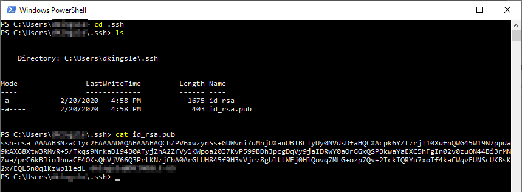
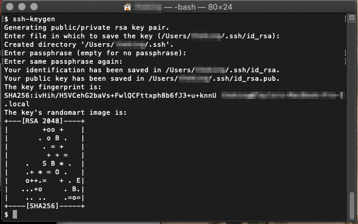
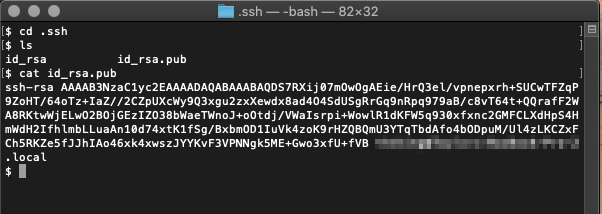
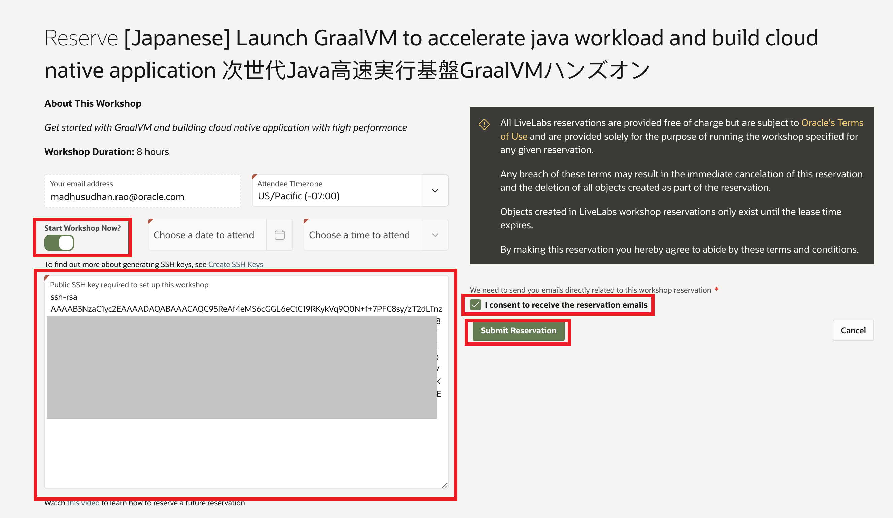
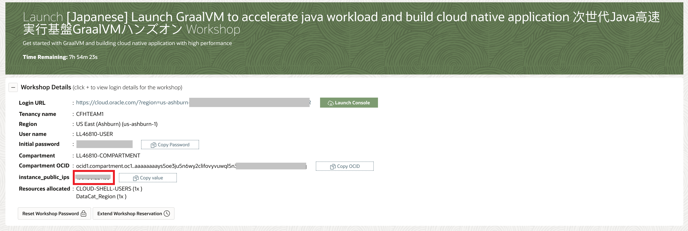

# 事前準備


このハンズオンを実施するためには有効なOracleアカウント（OCIアカウントではありません）が必要です。Oracleアカウントを使用して演習環境のリソースの予約を行い、またその他OracleサポートやOracle一般公開コンテンツにアクセスすることができます。

既にOracleアカウントをお持ちの場合、下記Task2へ移動してください。  

既に事前にリソース予約済みの場合、この章をスキップし、次の章「ハンズオン概要」へ移動してください。
##   
   

## Task 1: Oracleアカウントの作成

Oracleアカウントは以下二つのステップで作成できます。

1. [oracle.com](https://www.oracle.com)へアクセスし、 *View Account*をクリックして *Create an Account*を選択します。

  

2. フォーム内容を入力し、 *Create Account*をクリックします。

  


## Task 2: SSHキー・ペアの生成

このハンズオンでは参加者のPCから演習環境（OCIインスタンス）に対してSSH接続を行った上、環境構築やアプリケーション開発のコマンドを発行します。そのため、事前にクライアントPC側でSSHキー・ペア（公開キー、秘密キー）を生成する必要があります。以下はクライアントPCの種類ごとにSSHキー・ペアーの生成手順です。

■ Windows 10

早期ビルドを除けば、Windows 10はSSHキー生成機能"ssh-keygen"を備えています。

1.  **Powershell** コマンドウィンドウを開きます。スタート->サーチフィールドに*powershell*を入力することで、"Windows Powershell"アプリケーションを検索できます。

    

2.  ターミナルウィンドウに ```ssh-keygen``` を入力します。その際、コマンドが実行されるディレクトリーを確認しておいてください。通常SSHキーはこのディレクトリー*C:¥Users¥<ユーザ名>*の.ssh配下に生成されます。

    ```
    <copy>ssh-keygen</copy>
    ```

3.  Enterキーを押下します。すべてのメッセージに対して、デフォルト値のまま（パスフレーズなし）でEnterを押下して進みます。

    

4.  *C:¥Users¥<ユーザ名>*配下に以下のコマンドでSSHキー・ペアが正常に生成されることを確認します。

    ```
    <copy>cd .ssh</copy>
    ```

    ```
    <copy>ls</copy>
    ```

    ```
    <copy>cat id_rsa.pub</copy>
    ```

    

    *private key* `id_rsa` を決して他人にシェアしないでください。 *public key* `id_rsa.pub`のみシェア、コピーしてください。後の手順でワークショップの予約ページに*public key* `id_rsa.pub`の内容を貼り付ける必要があります。その場合、Notepad, Wordpadなどのテキストエディターで`id_rsa.pub`を開き、内容をコピーしてください。

    *Note: MS Word のようなリッチテキストエディターを使用しないでください。*

    

    * [Click here for more details on PowerShell for Windows](https://docs.microsoft.com/en-us/powershell/)
    * [Click here for more details on OpenSSH Key Management for Windows](https://docs.microsoft.com/en-us/windows-server/administration/openssh/openssh_keymanagement)


■MacOS

1.  If you don't already have a shortcut to the terminal application for MacOS, you can find it in the **Applications** > **Utilities** menu or (Shift+Command+U) on your keyboard.

2.  Start up **Terminal** and type in the command ```ssh-keygen```. ssh-keygen will ask you where to save the key, accept the default of the .ssh folder in your home directory by pressing Enter. File name will be ```id_rsa``` or whatever you choose to name your key. Press Enter twice for no passphrase. Remember the directory where you saved your key (~/.ssh), you will need to reference it later when you create your instance.

    ````
    <copy>ssh-keygen</copy>
    ````

    


3.  Type the following commands in the terminal window to verify that the public and private keys were created.  And to copy the contents of the public key for use in creating your instance in the OCI dialog.

    ```
    <copy>cd .ssh</copy>
    ```

    ```
    <copy>ls</copy>
    ```

    ```
    <copy>cat id_rsa.pub</copy>
    ```

    

    Note in the output that there are two files, a *private key:* ```id_rsa``` and a *public key:* ```id_rsa.pub```. Keep the private key safe and don't share its content with anyone. The public key will be needed for various activities and can be uploaded to certain systems as well as copied and pasted to facilitate secure communications in the cloud.

4.  If you're ready to create an instance, copy the contents and paste when prompted for the SSH key. Make sure that you remove any hard returns that may have been added when copying.

    

[Click for the MacOS Terminal User Guide](https://support.apple.com/guide/terminal/welcome/mac)

■Linux

1. Open a terminal window and type in the ```ssh-keygen``` command.   There are a few command line options for the ssh-keygen utility; however, for quick and dirty key creation for lab use, no options are necessary.    Type ```ssh-keygen --help``` in your terminal window to see all the possible options.   For now, just run the command by itself.

    ```
    <copy>ssh-keygen</copy>
    ```
2. You should run this command from your home directory.  In this case as the user-id ```opc```.   The dialog will default to a hidden directory, ```~/.ssh```.  If you don't already have keys created, accept the default file name ```id_rsa``` by hitting the Enter key.   Press the Enter key two more times to create a key with no passphrase.   The best practice in a production environment would be to use a secure passphrase; however, we don't need to bother with these practice labs.

    

    The dialog will indicate that the key pair has been saved in the ```/home/username/.ssh``` directory and is now ready for use.

3.  Change to the ```.ssh``` directory, list and examine your keys.

    ```
    <copy>cd .ssh</copy>
    ```
    ```
    <copy>ls</copy>
    ```

    

    Note in the output that there are two files, a *private key:* ```id_rsa``` and a *public key:* ```id_rsa.pub```. Keep the private key safe and don't share its contents with anyone. The public key will be needed for various activities and can be uploaded to certain systems as well as copied and pasted to facilitate secure communications in the cloud.

4.  Use the Linux ```cat``` command to list the contents of ```id_rsa.pub```.

    ```
    <copy>cat id_rsa.pub</copy>
    ```

    

5.  In some labs you will be asked to upload or copy (rcp) the public key to an instance in order to facilitate communications. So remember where the file is kept. Other labs will ask for the 'contents' of the key to be pasted into various dialog boxes to facilitate secure connections. Use the ```cat``` command and copy/paste the information from the key starting at the word "ssh-rsa" and copy everything up to the final character in the line. In the example below, you would copy from "ssh-rsa ... " and to exactly after "... -01". Copy the key contents exactly, capturing space after the key characters may render your key invalid.

    

    You have created a public/private SSH key pair and can utilize it in any of the Oracle OCI labs that require an SSH key.

    In case you're interested, click [here](https://www.ssh.com/ssh/key) for more details on SSH, a short tutorial on initiating a connection from a Linux instance with the SSH keys we just created.


## Task 3: ハンズオンワークショップリソースの予約

1. [LiveLabs 2.0](http://bit.ly/golivelabs) へナビゲートし、「次世代Java高速実行基盤GraalVMハンズオン」のトップページにある「Run On Livelabs Sandbox」をクリックします。
　

2. Oracleアカウントログイン画面より事前に作成したユーザ名、パスワードを入力してログインします。
　

 > **Note:** Oracleアカウント未作成の場合、画面下部の「Create Account」をクリックし、Task1の手順に従ってOracleアカウントを作成してください。

3. ハンズオンの予約画面にて、Task2で作成した*public key* `id_rsa.pub`をnotepadなどのテキストエディターで開き、中身をコピーして、*Public SSH key required to set up this workshop*ウィンドウに貼り付けます。「Start Workshop Now?」がオンになっていることを確認し、「I consent to recieve reservation emails」をチェックし、「Submit Reservation」をクリックします。
　
   
   これによりクラウド上のハンズオン用環境のプロビジョニングが開始されます。次の画面より「View your reservation」をクリックして、プロビジョニング状況を確認します。
　
  
> **Note:** プロビジョニング中、計3通のステータス確認メールが登録のメールアドレス宛に届きます。

4. プロビジョニング完了のステータスに変わりましたら、「Launch workshop」をクリックします。
　

5. プロビジョニング済みのインスタンスの情報を確認し、パブリックIPアドレスは後の演習でSSH接続時必要になりますので、手元にメモをしておいてください。

  

*以上でハンズオンの事前準備が完了しましたので、次の章「ハンズオン概要」に進めてください。*

## Acknowledgements

- **Created By/Date** - Jun Suzuki, Java Global Business Unit, April 2022
- **Contributors** - 
- **Last Updated By/Date** - Jun Suzuki, April 2022
