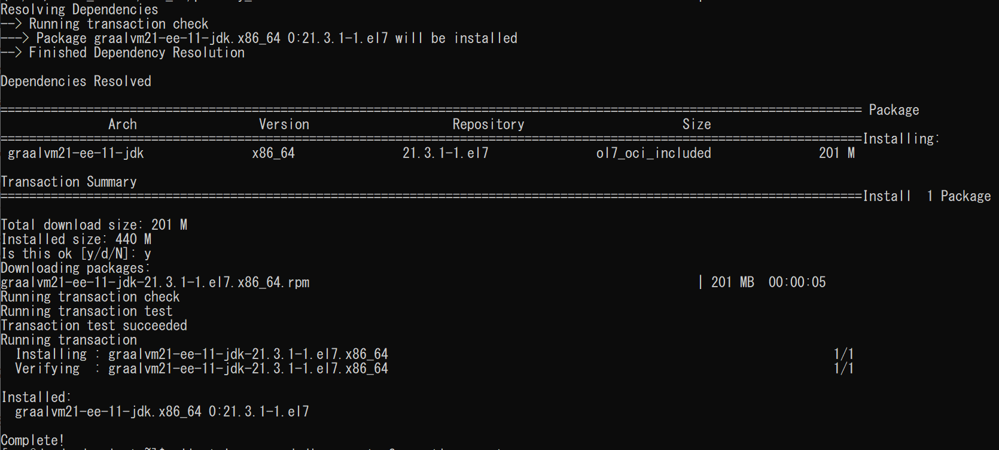

# GraalVMのインストール

## 概要

この演習では、OCI上に事前にプロビジョニング済みの演習用インスタンスにSSH接続を行い、GraalVM Enterprise Editionをインストールします。

*所要時間: 10分*

### ■目標
* GraalVM Enterprise Edtion をOracle Linux7.9上にインストール
* GraalVMのNative Image機能をインストール
* 開発用にMaven、Git、Dockerをインストール

### ■前提条件

* 「事前準備」の手順を完了し、OCI上演習専用のインスタンスが作成済みであること
* クライアントPC上SSHキー・ペアが事前に生成済みであること

## Task 1: SSH接続よりインスタンスへアクセス
以下の手順はWindows10を前提にしていますが、MacOSとLinuxの場合もそれに準ずる手順となります。

1. コマンドプロンプトを立ち上げ、SSHキーを保存してある*C:¥Users¥<ユーザ名>￥.ssh*配下に移動します。以下のコマンドを用いて演習用インスタンスに対してopcユーザ名でアクセスします。

    ``` 
    <copy>ssh -i <your-private-key-file> opc@<x.x.x.x></copy>
        
    ```
    

    > **Note:** 
    事前準備の章に沿った手順でSSHキーを作成した場合、your-private-key-fileは*id_rsa*になります。x.x.x.xは接続先インスタンスのIPです。  
    SSH接続を確立する際の確認メッセージが表示されたら、yesと入力してください。
   
    For Linux:
    > **Note:** SSHキーをアクセス権を限定する必要があります。   
    例：chmod 600 ./your-private-key-file


## Task 2: GraalVM Enterprise Edition 21.3をインストール

1. 以下のコマンドを入力します。導入するかどうかの確認に対して、yesと入力してインストールを開始します。

    ```
    <copy>sudo yum install graalvm21-ee-11-jdk</copy>
    ```
    

    インストールが正常終了の場合*Complete!*のメッセージが表示されます。


2. 以下のコマンドを入力します。GraalVMのクラスパスを設定します。

    ```
    <copy>echo "export JAVA_HOME=/usr/lib64/graalvm/graalvm21-ee-java11" >> ~/.bashrc</copy>
    ```

    ```
    <copy>echo 'export PATH=$JAVA_HOME/bin:$PATH' >> ~/.bashrc</copy>
    ```

    ```
    <copy>source ~/.bashrc</copy>
    ```

    以下のコマンドでインストールしたGraalVMのバージョンを確認します。
    ```
    <copy>java -version</copy>
    ```
    以下の出力メッセージよりGraalVMのバージョンを確認します。
    ```
    [opc@devdaydemoinst ~]$ java -version
    java version "11.0.14" 2022-01-18 LTS
    Java(TM) SE Runtime Environment GraalVM EE 21.3.1 (build 11.0.14+8-LTS-jvmci-21.3-b07)
    Java HotSpot(TM) 64-Bit Server VM GraalVM EE 21.3.1 (build 11.0.14+8-LTS-jvmci-21.3-b07, mixed mode, sharing)
    ```
   
3. 以下のコマンドを入力し、native imageを導入します。

    ```
    <copy>sudo yum install graalvm21-ee-11-native-image</copy>
    ```
    

    以下のコマンドで導入したnative imageのバージョンを確認します。
    ```
    <copy>native-image --version</copy>
    ```
    以下の出力メッセージよりnative imageのバージョンを確認します。
    ```
    [opc@devdaydemoinst ~]$ native-image --version
    GraalVM 21.3.1 Java 11 EE (Java Version 11.0.14+8-LTS-jvmci-21.3-b07)
    ```

## Task 3: 演習用に必要なその他ソフトをインストール

1. Mavenのインストール   
    以降の演習でJavaアプリケーションをビルドするため、Mavenを導入します。以下のコマンドを実行します。導入時の確認メッセージに対して、yesと入力してインストールを開始します。

    ```
    <copy>sudo yum install maven</copy>
    ```

    *Complete!*　のメッセージを確認し、Mavenが正常に導入されることを確認します。

2. gitのインストール  
    以降の演習でGitHubよりサンプルソースコードをダウンロードする必要がありますので、gitを導入します。以下のコマンドを実行します。導入時の確認メッセージに対して、yesと入力してインストールを開始します。

    ```
    <copy>sudo yum install git</copy>
    ```

    *Complete!*　のメッセージを確認し、gitが正常に導入されることを確認します。

3. Dockerのインストール。  
    以降の演習でJavaアプリケーションをコンテナ化する作業があるため、Dockerを導入します。以下のコマンドを実行します。導入時の確認メッセージに対して、yesと入力してインストールを開始します。

    ```
    <copy>sudo yum install docker-engine</copy>
    ```

    *Complete!*　のメッセージを確認し、Dockerが正常に導入されることを確認します。
    
    以下のコマンドでDockerを起動します。
    ```
    <copy>sudo systemctl enable docker</copy>
    ```
    ```
    <copy>sudo systemctl start docker</copy>
    ```

    以下のコマンドで導入されたDockerのバージョンを確認します。
    ```
    <copy>sudo docker version</copy>
    ```

以上で本演習のタスクがすべて完了しました。次の演習に進めてください。
## Learn More

*参考リンク*
* [GraalVM Enterprise product page](https://www.oracle.com/java/graalvm/)
* [GraalVM Enterprise product page(日本語)](https://www.oracle.com/jp/java/graalvm/)
* [GraalVM Enterprise downloads page](https://www.oracle.com/downloads/graalvm-downloads.html)
* [GraalVM Enterprise マニュアル](https://docs.oracle.com/en/graalvm/enterprise/21/docs/reference-manual/)
* [GraalVM Enterprise マニュアル(日本語)](https://docs.oracle.com/cd/F44923_01/index.html)
* [GraalVM Enterprise Blog](https://blogs.oracle.com/java/category/j-graalvm-technology)

## Acknowledgements

- **Created By/Date** - Jun Suzuki, Java Global Business Unit, April 2022
- **Contributors** - 
- **Last Updated By/Date** - Jun Suzuki, April 2022
