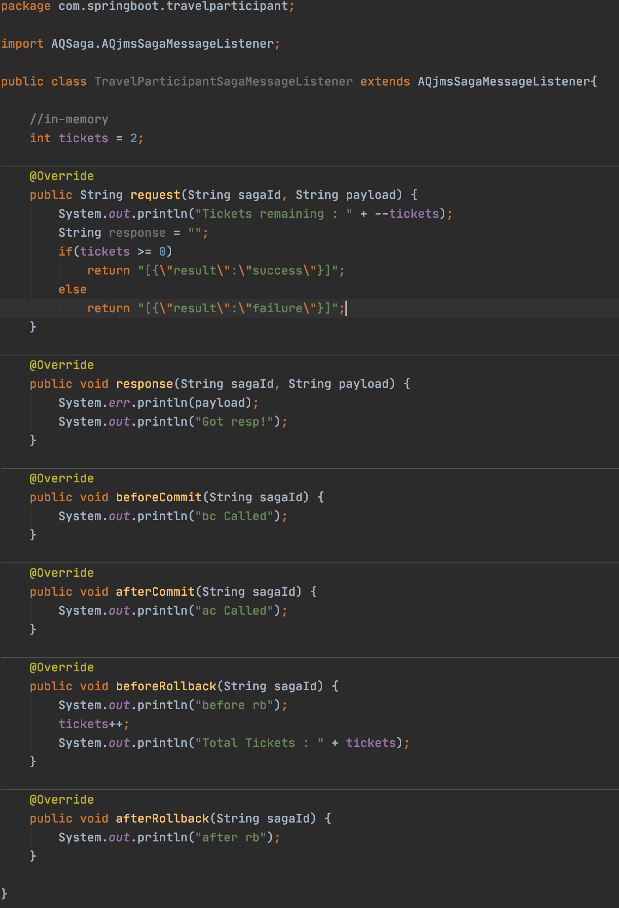

## Use Oracle Database Sagas with Java Microservices

## Introduction

This lab will show you how to use Oracle Database Sagas with Java Microservices

   

Estimated Time:  10 minutes


### Objectives

-   Add Java saga participants
-   Test sagas 

### Prerequisites

* An Oracle Cloud paid account or free trial in a region with Oracle database 21c available. To sign up for a trial account with $300 in credits for 30 days, click [Sign Up](http://oracle.com/cloud/free).
* The OKE cluster and the Autonomous Transaction Processing databases that you created in Lab 1

### Objectives

-   Understand the concepts of Oracle Database Sagas with Java Microservices

### Prerequisites

- This lab presumes you have already completed the setup lab.

## Task 1: Add and start Java Participants

1.    Enter the Cloud Shell and cd to the `travelagency-springboot` directory which should be at the following location.

        ```
        <copy>
            cd ~/microservices-datadriven/travelbooking/travelagency-springboot
        </copy>
        ```


2.    Issue the following command.

        ```
        <copy>
            java -jar target/travelagency-springboot-0.1.0.jar
        </copy>
        ```


   
   
   
   
   


## Task 2: Test Enroll/Enlist and Complete/Commit


1. Notice src and Complete/Commit path and make curl request .
        ```
        <copy>
            curl http://LB_ADDRESS/travelagency/book
        </copy>
        ```
   Copy the Saga Id in the response.

2. Notice saga state, inventory count, and logs.

    ```
    <copy>select id, initiator, coordinator, owner, begin_time, status from saga$;
    </copy>
    ```

3. Make curl request to commit.

    ```
    <copy>
        curl http://LB_ADDRESS/travelagency/commit?sagaId=[sagaid]
    </copy>
    ```

4. Notice saga state, inventory count, and logs.


    ```
    <copy>select id, initiator, coordinator, owner, begin_time, status from saga</copy>
    ```


## Task 3: Test Enroll/Enlist and Compensate/Rollback


1. Notice src and Complete/Commit path and make curl request .
        ```
        <copy>
            curl http://LB_ADDRESS/travelagency/book
        </copy>
        ```
   Copy the Saga Id in the response.

2. Notice saga state, inventory count, and logs.

    ```
    <copy>select id, initiator, coordinator, owner, begin_time, status from saga$;
    </copy>
    ```

3. Make curl request to rollback.

    ```
    <copy>
        curl http://LB_ADDRESS/travelagency/rollback?sagaId=[sagaid]
    </copy>
    ```

4. Notice saga state, inventory count, and logs.


    ```
    <copy>select id, initiator, coordinator, owner, begin_time, status from saga</copy>
    ```


You may now proceed to the next lab.

## Acknowledgements
* **Author** - Paul Parkinson, Architect and Developer Evangelist
* **Last Updated By/Date** - Paul Parkinson, December 2021
