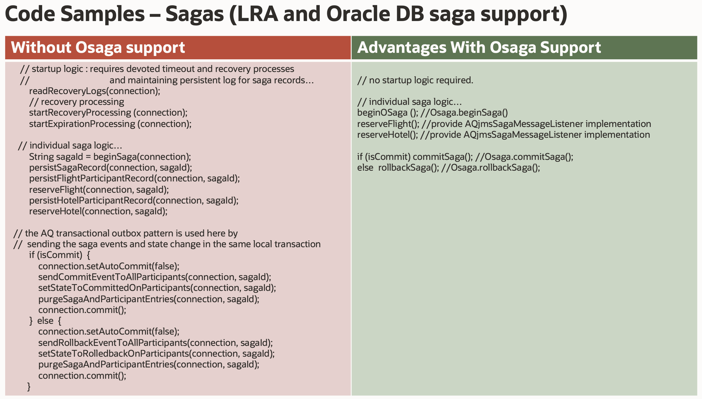

## Use Oracle Database Sagas with Java Microservices

## Introduction

This lab will show you how to use Oracle Database Sagas with Java Microservices.

The following shows a side by side comparison of the work required by the developer when not using Oracle Database Saga support contrasted with taking advantage of the support.

   

Estimated Time:  10 minutes

### Objectives

-   Add Java saga participants
-   Test sagas 

### Prerequisites

* An Oracle Cloud paid account or free trial in a region with Oracle database 21c available. To sign up for a trial account with $300 in credits for 30 days, click [Sign Up](http://oracle.com/cloud/free).
* The OKE cluster and the Autonomous Transaction Processing databases that you created in Lab 1

### Objectives

-   Understand the concepts of Oracle Database Sagas with Java Microservices

### Prerequisites

- This lab presumes you have already completed the setup lab.

## Task 1: Add and start Java Participants (FlightJava, HotelJava, and CarJava)
       
1. Notice the AQjmsSagaMessageListener interface and implementation for/of the TravelParticipantApplication.java

   
   
   
   
   
   
2.    Enter the Cloud Shell and cd to the `travelagency-java` directory which should be at the following location.

        ```
        <copy>cd ~/microservices-datadriven/travelbooking/travelparticipant-java</copy>
        ```

3.    Issue the following command.

        ```
        <copy>mvn clean install; java -jar target/travelparticipant.jar</copy>
        ```

      This will build and start a travel participant java service.

4.    You will be prompted for the following.
        - database password (the one you used when creating the participant/`sagadb2` PDB)
        - TNS_ADMIN (accept the default)
        - participant type (FlightJava, HotelJava, or CarJava).

5.    You will then be asked whether the one-time setup call `add_participant` is needed for the participant type you selected. 
If this is the first time you have started this participant type then select 'y', otherwise simply hit enter to use the default ('n')

6.    The output should look like the following.


7.   The participant is now running and listening for messages for the saga.

8.   Repeat these steps for any of the other participant types (FlightJava, HotelJava, or CarJava)you didn't select. 

     You can have as few or as many participants as you like in the saga. 
     For example, you can just have a HotelJava participant for simplicity.
    
     If you do have more than one participant, it is convenient to open a new browser tab and Cloud Shell for each.


## Task 2: Add and start Java TravelAgency Initiatory/Participant

1.    Enter the Cloud Shell and cd to the `travelagency-springboot` directory which should be at the following location.

        ```
        <copy>cd ~/microservices-datadriven/travelbooking/travelagency-java</copy>
        ```


2.    Issue the following command.

        ```
        <copy>mvn clean install; java -jar target/travelagency.jar</copy>
        ```


        ```
        <copy>mvn clean install; java -jar target/travelagency-springboot-0.1.0.jar</copy>
        ```
3. Notice the AQjmsSagaMessageListener interface and implementation 

   
   
   
   
   


## Task 2: Test Enroll/Enlist and Complete/Commit


1. Notice src and Complete/Commit path and make curl request .
        ```
        <copy>
            curl http://LB_ADDRESS/travelagency/book
        </copy>
        ```
   Copy the Saga Id in the response.

2. Notice saga state, inventory count, and logs.

    ```
    <copy>select id, initiator, coordinator, owner, begin_time, status from saga$;
    </copy>
    ```

3. Make curl request to commit.

    ```
    <copy>
        curl http://LB_ADDRESS/travelagency/commit?sagaId=[sagaid]
    </copy>
    ```

4. Notice saga state, inventory count, and logs.


    ```
    <copy>select id, initiator, coordinator, owner, begin_time, status from saga</copy>
    ```


## Task 3: Test Enroll/Enlist and Compensate/Rollback


1. Notice src and Complete/Commit path and make curl request .
        ```
        <copy>
            curl http://LB_ADDRESS/travelagency/book
        </copy>
        ```
   Copy the Saga Id in the response.

2. Notice saga state, inventory count, and logs.

    ```
    <copy>select id, initiator, coordinator, owner, begin_time, status from saga$;
    </copy>
    ```

3. Make curl request to rollback.

    ```
    <copy>
        curl http://LB_ADDRESS/travelagency/rollback?sagaId=[sagaid]
    </copy>
    ```

4. Notice saga state, inventory count, and logs.


    ```
    <copy>select id, initiator, coordinator, owner, begin_time, status from saga</copy>
    ```


You may now proceed to the next lab.

## Acknowledgements
* **Author** - Paul Parkinson, Architect and Developer Evangelist
* **Last Updated By/Date** - Paul Parkinson, December 2021
