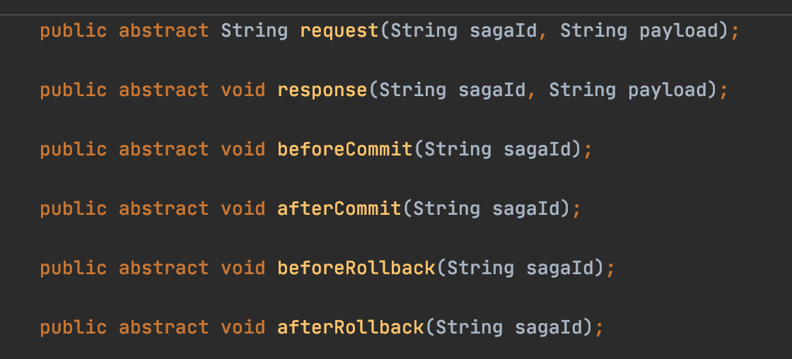

# Use Oracle Database Sagas with Java Microservices

## Introduction

This lab will show you how to use Oracle Database Sagas with Java Microservices.

The following shows a side by side comparison of the work required by the developer when not using Oracle Database Saga support contrasted with taking advantage of the support.

   

Estimated Time:  15 minutes

### Objectives

-   Test sagas with Java participants

### Prerequisites

* An Oracle Cloud paid account or free trial in a region with Oracle database 21c available. To sign up for a trial account with $300 in credits for 30 days, click [Sign Up](http://oracle.com/cloud/free).

### Objectives

-   Understand the concepts of Oracle Database Sagas with Java Microservices

### Prerequisites

- This lab presumes you have already completed the setup lab.

## Task 1: Add and start Java Participants (FlightJava, HotelJava, and CarJava)
       
1. Notice [AQjmsSagaMessageListener.java](https://github.com/oracle/microservices-datadriven/blob/main/travelbooking/osaga-java-api/src/main/java/AQSaga/AQjmsSagaMessageListener.java)  interface and the implementation of it in 
[TravelParticipantApplication.java](https://github.com/oracle/microservices-datadriven/blob/main/travelbooking/travelparticipant-java/src/main/java/osaga/travelagency/TravelParticipantApplication.java) 

   
   
   
   
   
   
2.    Enter the Cloud Shell, and issue the following command to build the travel participant Java service.

        ```
        <copy>cd ~/microservices-datadriven/travelbooking/travelparticipant-java; mvn clean install</copy>
        ```

3.    Issue the following command to run the travel participant Java service.

        ```
        <copy>cd ~/microservices-datadriven/travelbooking/travelparticipant-java; java -jar target/travelparticipant.jar</copy>
        ```

      This will build and start a travel participant java service.

4.    You will be prompted for the following.
        - database password (the one you used when creating the participant/`sagadb2` PDB)
        - TNS_ADMIN (accept the default)
        - participant type (FlightJava, HotelJava, or CarJava).

5.    You will then be asked whether the one-time setup call `add_participant` is needed for the participant type you selected. 
If this is the first time you have started this participant type then select 'y', otherwise simply hit enter to use the default ('n')

6.    The output should look like the following.

   
   
7.   The participant is now running and listening for messages for the saga.

   
   
8.   Repeat steps 3 and 4 for any of the other participant types (FlightJava, HotelJava, or CarJava) you didn't select. 

     You can have as few or as many participants as you like in the saga. 
     For example, you can just have a HotelJava participant for simplicity.
    
     If you do have more than one participant, it is convenient to open a new browser tab and Cloud Shell for each.
   
## Task 2: Add and start Java TravelAgency Initiatory/Participant

1.    Notice use of the OSaga API and the  [AQjmsSagaMessageListener.java](https://github.com/oracle/microservices-datadriven/blob/main/travelbooking/osaga-java-api/src/main/java/AQSaga/AQjmsSagaMessageListener.java) interface and implementation in 
[TravelAgencyApplication.java](https://github.com/oracle/microservices-datadriven/blob/main/travelbooking/travelagency-java/src/main/java/osaga/travelagency/TravelAgencyApplication.java)

2.    Enter the Cloud Shell, and issue the following command to build the TravelAgency Java service.

        ```
        <copy>cd ~/microservices-datadriven/travelbooking/travelagency-java; mvn clean install</copy>
        ```
      You should see a successful build.
      
      

3.    Issue the following command to run the TravelAgency Java service.

        ```
        <copy>cd ~/microservices-datadriven/travelbooking/travelagency-java; java -jar target/travelagency.jar</copy>
        ```

4.    You will be prompted for the following.
        - database password (the one you used when creating the participant/`sagadb2` PDB)
        - TNS_ADMIN (accept the default)

5.    You will then be asked whether the one-time setup call `add_participant` is needed for `TravelAgencyJava`. 
      If this is the first time you have started the `TravelAgencyJava` then select 'y', otherwise simply hit enter to use the default ('n')
      
      

## Task 3: Conduct saga rollback test

1.    The TravelAgency is now running and listening for messages for sagas and has begun a new saga.  

      You will be prompted as to which participants you would like to add/enroll. Select 'y' for those participants you started in Task 1.
   
      
   
2.    Once you have selected, you will see the enroll call(s) beging made on the TravelAgency.
      
      
 
3.    You will then see the corresponding calls on the participant(s) and a `Tickets remaining` log message indicating the reservation has been made (inventory reduced).
      
 
4.    You will then see the resultant response from the participants to/on the TravelAgency.
      
 
5.    Once responses from all participants have been recieved, you will be prompted to `c`/commit or `r`/rollback the saga. Choose the default of rollback.  

      You will see the successful rollback call made on the saga.
      
 
6.    You will then see the resultant afterRollback call made on the participant(s) MessageListener callback which results in the compensation of ticket/inventory level back to it's original value.
      

## Task 4: Conduct saga commit test

1.    You will be prompted to start another saga on the TravelAgency. Select 'y' and repeat the steps in Task 3 but issue a rollback instead of a commit.
   
      

      Notice the successful commit outcome and that the ticket/inventory count is reduced as expected.
      
You may now **proceed to the next lab.**..

## Acknowledgements
* **Author** - Paul Parkinson, Architect and Developer Evangelist
* **Last Updated By/Date** - Paul Parkinson, December 2021
