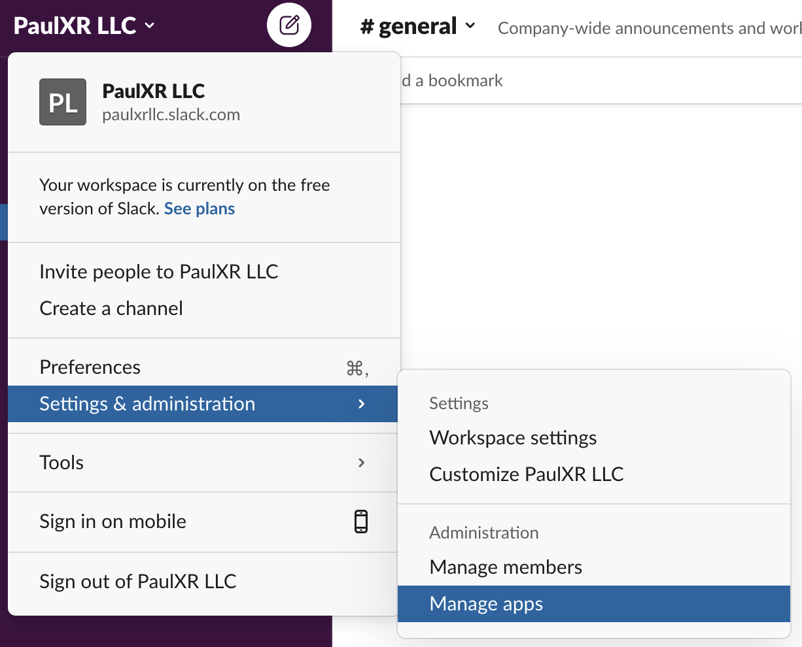
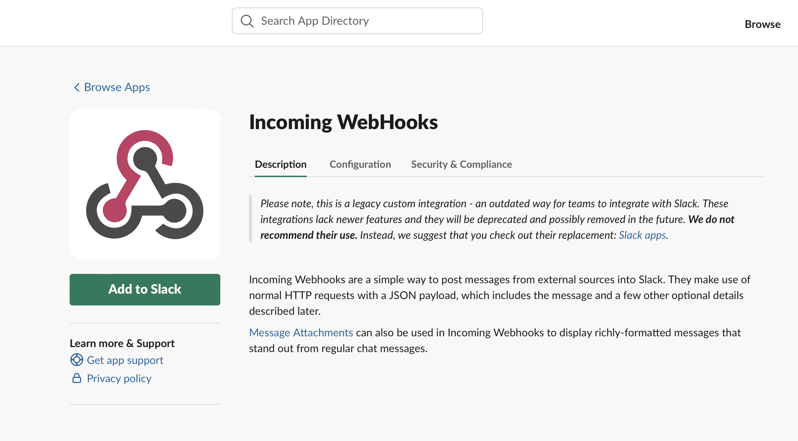
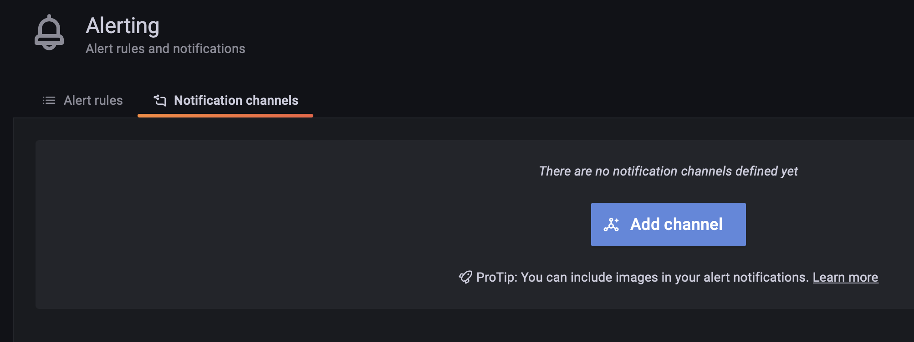
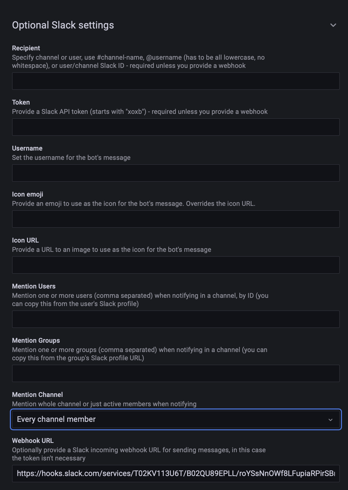
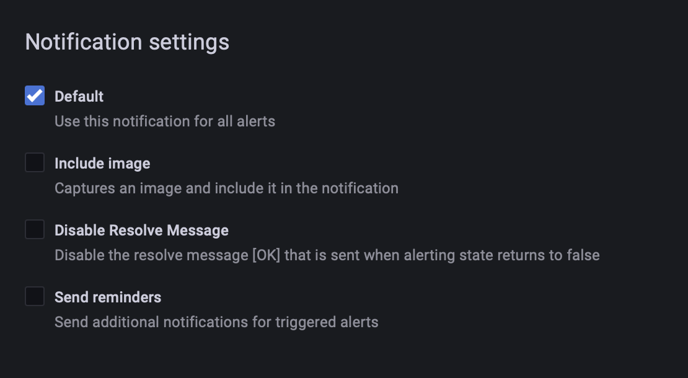
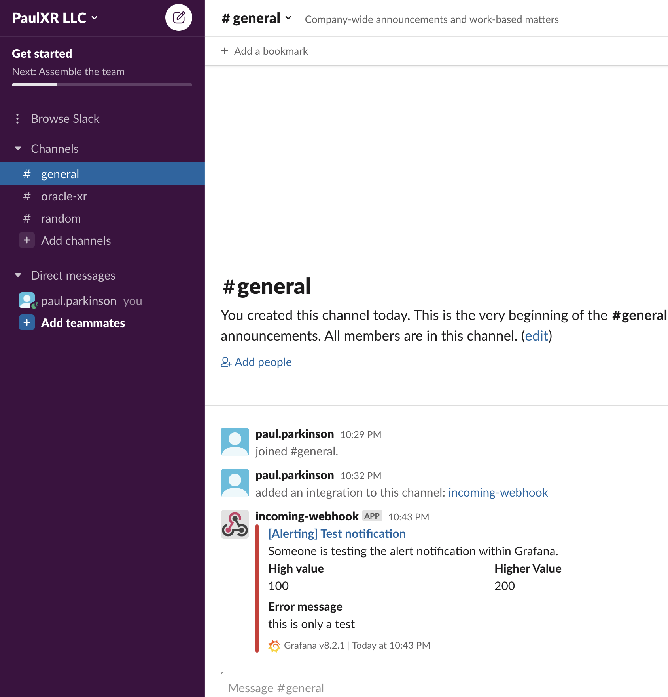

# Configure Alert Channel

## Introduction

This lab will show you how to setup alert channels in order to be notified when certain monitoring criteria are hit.
The lab will describe how to setup Slack to receive these notifications though the concept is the same for other channel types such as 
Prometheus Alert Manager, Email, etc.

Estimated lab Time - 10 minutes
  
## Task 1: Create a Slack account and obtain the Webhook for it.

*The following flow is essentially the same as that found  in the Grafana docs found 
    [here](https://grafana.com/blog/2020/02/25/step-by-step-guide-to-setting-up-prometheus-alertmanager-with-slack-pagerduty-and-gmail/). 
    
1. If you do not have admin privileges on a Slack workspace, create a workspace using the simple directions found [here](https://slack.com/create#email).  The following are some screen shot examples of the process.

     
     
     
     

2.  Obtain the Webhook URL from Slack.

     In Slack, select the `Settings & administration` menu and `Manage apps`.

     

     Search for `Incoming WebHooks` and select it.

     
     
     Click the `Add To Slack` button
     
     
     
     Select `#general` from the `Post to Channel` drop down and click the `Add incoming WebHooks integration` button
     
     
     
     Copy the `Webhook URL` 
     
     
     

## Task 2: Configure Alert Channel for Slack notifications

1. Add a Slack Notification channel in Grafana and configure it with the webhook URL.

   Select the alarm bell icon on the left-hand side of Grafana and select `Notification channels` under the `Alerting` menu.

     

   Click `Add Channel`

     
     
   Name the channel, select `Slack` from the dropdown 
   
     
     
   Select `Optional Slack Settings` and then select `Every Channel Member` from the `Mention Channel` dropdown, and paste the Webhook URL in the appropriate textfield. 
   
     
     
   Under `Notification Settings` select `Default` checkbox and click the `Save` button
   
     

2. Test Slack alert channel.

      Click the `Test` button and notice `Test notification sent` message in Grafana and the notification message sent to Slack.
      
     
     
     

    
Proceed to the next lab.

## Acknowledgements
* **Author** - Paul Parkinson, Architect and Developer Advocate
* **Last Updated By/Date** - Paul Parkinson, August 2021
