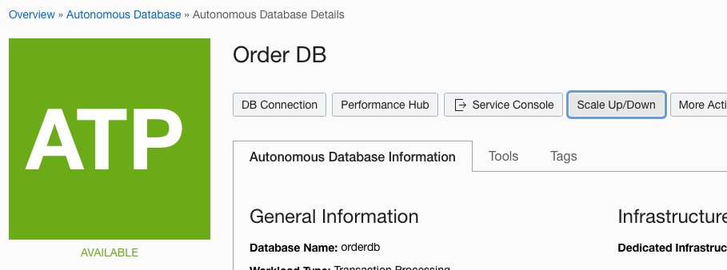
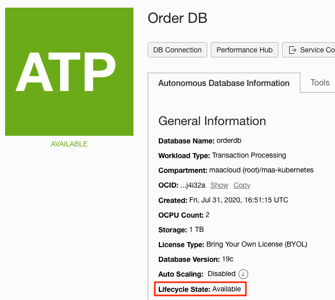
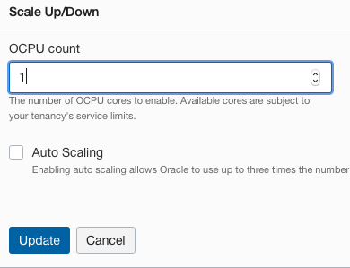

# Diagnosability and Debugging Use Case

## Introduction

This lab will show you how...

Estimated lab Time - 5 minutes

  -   ...
  
## Task 1: Notice perf metrics and create Alert for response time threshold

1. Create Alert in Grafana with Slack alert channel set up in earlier lab.

    ```
    <copy>cd $GRABDISH_HOME/observability;./install.sh</copy>
    ```


## Task 2:  Install a load testing tool and start an external load balancer for the Order service

1. Start an external load balancer for the order service.

    ```
    <copy>cd $GRABDISH_HOME/order-helidon; kubectl create -f ext-order-ingress.yaml -n msdataworkshop</copy>
    ```

    Check the ext-order LoadBalancer service and make note of the external IP address. This may take a few minutes to start.

    ```
    <copy>services</copy>
    ```

    

    Set the LB environment variable to the external IP address of the ext-order service. Replace 123.123.123.123 in the following command with the external IP address.

    ```
    <copy>export LB='123.123.123.123'</copy>
    ```

<if type="multicloud-freetier">
+ `export LB=$(kubectl get gateway msdataworkshop-order-helidon-appconf-gw -n msdataworkshop -o jsonpath='{.spec.servers[0].hosts[0]}')`
</if>

2. Install a load testing tool.  

    You can use any web load testing tool to drive load. Here is an example of how to install the k6 tool ((licensed under AGPL v3). Or, you can use artillery and the script for that is also provided below. To see the scaling impacts we prefer doing this lab with k6.

	```
	<copy>cd $GRABDISH_HOME/k6; wget https://github.com/loadimpact/k6/releases/download/v0.27.0/k6-v0.27.0-linux64.tar.gz; tar -xzf k6-v0.27.0-linux64.tar.gz; ln k6-v0.27.0-linux64/k6 k6</copy>
	```

	

	(Alternatively) To install artillery:

	```
	<copy>cd $GRABDISH_HOME/artillery; npm install artillery@1.6</copy>
	```
 
## Task 3: Load test 

1.  Execute a load test using the load testing tool you have installed.  

    Here is an example using k6:

    ```
    <copy>cd $GRABDISH_HOME/k6; ./test.sh</copy>
    ```

    Note the request rate. This is the number of http requests per second that were processed.

    

    (Or) Using artillery:

    ```
    <copy>cd $GRABDISH_HOME/artillery; ./test.sh</copy>
    ```


## Task 4: Notice metrics and Slack message from alert

1. Identify the EXTERNAL-IP address of the Grafana LoadBalancer by executing the following command:

       ```
       <copy>services</copy>
       ```

     

     Note, 

## Task 5: Scale the database tier and load test again

1. To scale the Order DB Autonomous Transaction Processing database to **2 OCPUs**, click the navigation icon in the top-left corner of the Console and go to Autonomous Transaction Processing.

	

2. Click **Scale Up/Down** and enter 2 in the OCPU field. Click **Update**.

   

   

3. Wait until the scaling has completed (Lifecycle State: Available).

   

4. Execute the load test again.

   For example:

    ```
    <copy>cd $GRABDISH_HOME/k6; ./test.sh</copy>
    ```

   Note the request rate.  Throughput has increased.

   

   (Or) Using artillery:

    ```
    <copy>cd $GRABDISH_HOME/artillery; ./test.sh</copy>
    ```


## Task 6: Notice metrics and Slack message from alert that response time is acceptable again

1. Identify the EXTERNAL-IP address of the Grafana LoadBalancer by executing the following command:

     


## Task 7: Scale down the database 

1. To scale the Order database down to **1 OCPUs**, click the hamburger icon in the top-left corner of the Console and go to Autonomous Transaction Processing.

	

2. Click **Scale Up/Down** and enter 1 in the OCPU field. Click **Update**.

   

   


## Acknowledgements
* **Author** - Paul Parkinson, Architect and Developer Advocate
* **Last Updated By/Date** - Paul Parkinson, August 2021
