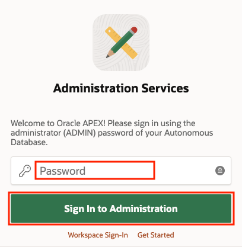
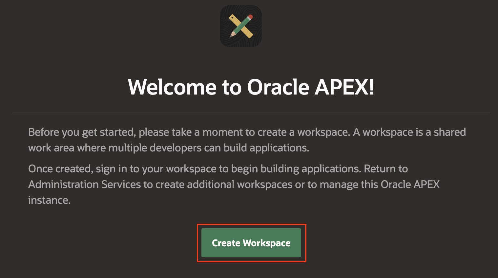
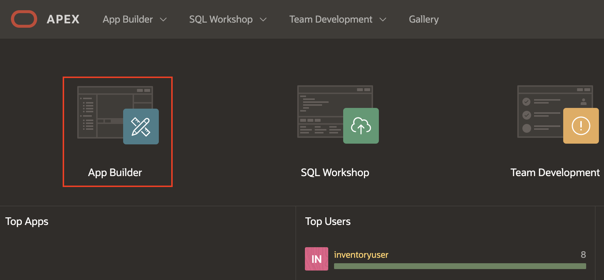
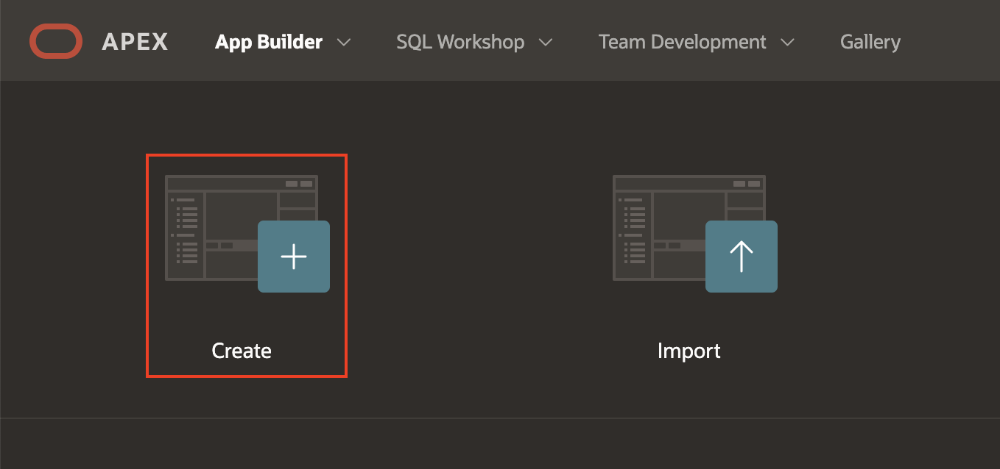
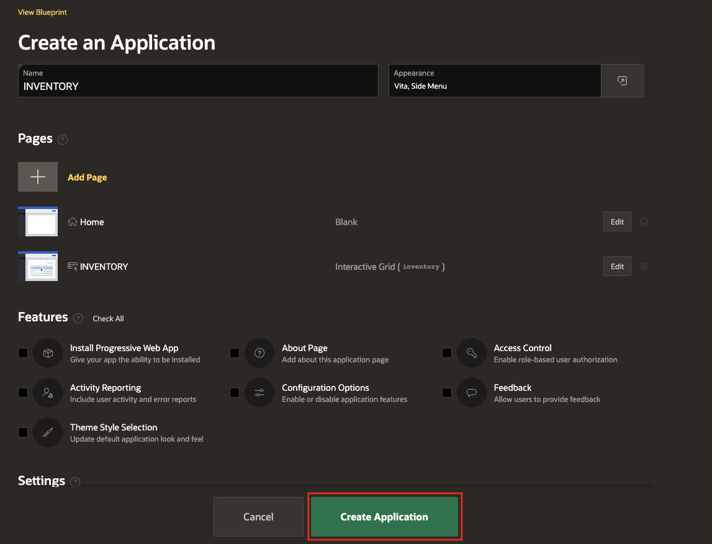

# Create an APEX app to view and update the data

## Overview

This lab will show you how to create an APEX application that will allow you to view and update the microservice data.

Estimated Time: 10 minutes

Watch the video below for a quick walk through of the lab.

### Objectives

* Create an APEX workspace in the Oracle Autonomous database
* Create an APEX app based on the inventory table

### Prerequisites

* The Oracle Autonomous Transaction Processing database named DB2 (created in Lab 1)

## Task 1: Create a New Workspace in APEX

When you first access APEX you will need to log in as an APEX instance administrator to create a workspace. A workspace is a logical domain where you define APEX applications. Each workspace is linked to one or more database schemas (database users) which are used to store the database objects, such as tables, views, packages, and more.

1. Navigate to the Oracle Autonomous Transaction Processing database instance named DB2 (Display Name), containing the inventory schema, created in Lab 1. Click the **Tools** tab and then the **Open APEX** button.

    

2. Enter the password for the Administration Services and click **Sign In to Administration**. The password should match the one you used when creating the Oracle Autonomous Transaction Processing instance.

    

3. Click **Create Workspace**.

    

4. Set **Database User** to **INVENTORYUSER** and then click **Create Workspace**.

    

5. After the workspace has been created, click the **INVENTORYUSER** link in the success message. This will log you out of APEX administration so that you can log into your new workspace.

    

6. Enter the password you used when creating the database during setup, check the **Remember workspace and username** checkbox, and then click **Sign In**.

    

    You have successfully created an APEX workspace where you can begin creating applications.

7. Click the **Set APEX Account Password** button.

    

8. Enter your **Email Address** and a new password.

    

## Task 2: Create a New APEX App Based on the Inventory Table

In this task, you will create a new APEX app based on the inventory table.

1. Click the **App Builder** button.

    

2. Click the **Create** button.

    

3. Click the **New Application** button.

    

4. Enter **INVENTORY** for the application name and click the **Add page** button.

    

5. Click the **Interactive Page** button.

    

6. Enter **INVENTORY** for the page name and select the **INVENTORY** table.

    

7. Click the **Create Application** button.

    

8. Click the **Run Application** button.

    

9. Enter the password that you entered in Task 1 step 8.

    

10. Click the **INVENTORY** page.

    

11. The INVENTORY table data will be displayed and can be edited.

    

12. Now that you've logged into the application, take a few moments to explore what you get out of the box. Of course, this is just the starting point for a real app, but it's not bad for not having written any lines of code!

You may now proceed to the next lab.

## Learn More

* Ask for help and connect with developers on the [Oracle DB Microservices Slack Channel](https://bit.ly/oracle-db-microservices-help-slack)  
Search for and join the `oracle-db-microservices` channel.

## Acknowledgements
* **Author** - Paul Parkinson, Developer Evangelist
               Richard Exley, Consulting Member of Technical Staff, Oracle MAA and Exadata
* **Adapted for Cloud by** - Nenad Jovicic, Enterprise Strategist, North America Technology Enterprise Architect Solution Engineering Team
* **Documentation** - Lisa Jamen, User Assistance Developer - Helidon
* **Contributors** - Jaden McElvey, Technical Lead - Oracle LiveLabs Intern
* **Last Updated By/Date** - Irina Granat, March 2022
