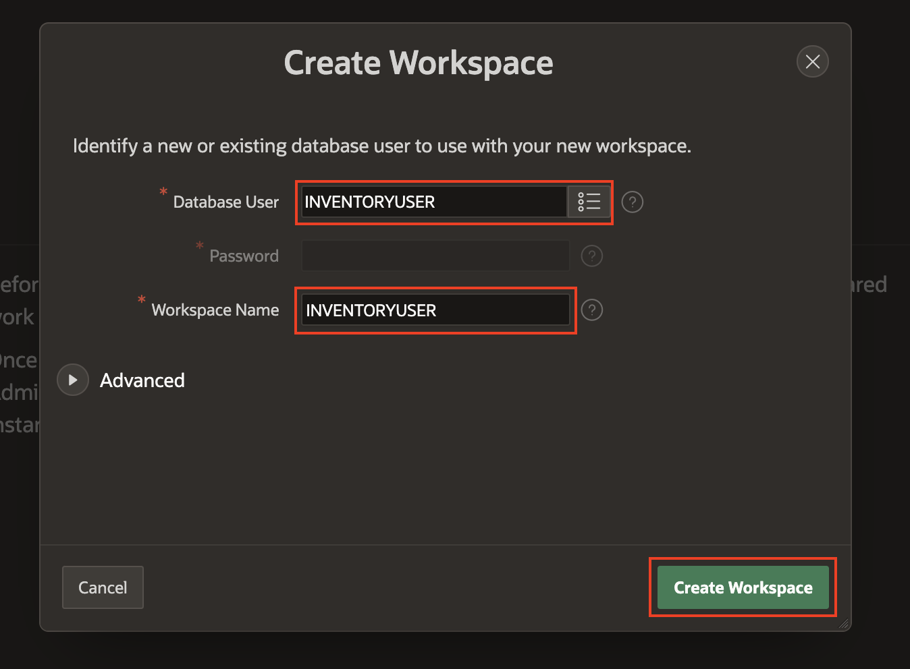
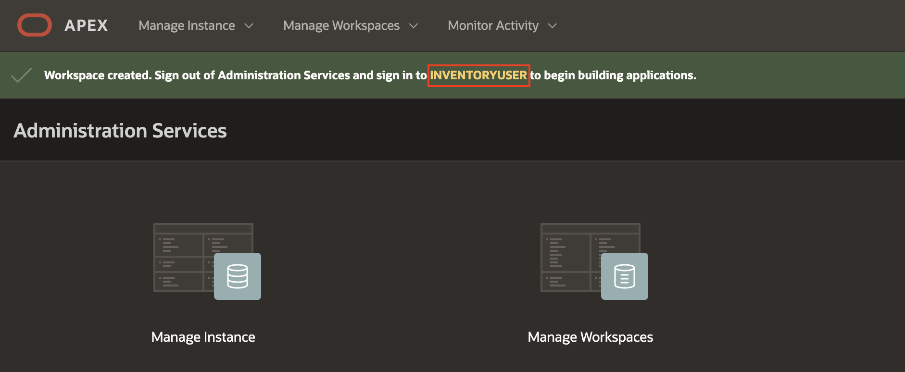

# Create an APEX App to Make Sense of the Data

## Overview

This lab will show you how to create an APEX application that will help make sense of the type of data being collected by the microservices created in the previous labs.

Estimated Lab Time - 10 minutes

Quick walk through on how to create an APEX application that will help make sense of the type of data being collected by the microservices created in the previous labs.

### Objectives

* Create an APEX workspace in ATP
* Create an APEX app based on the inventory table

### Prerequisites

* An ATP database (created in Lab 1)

## Task 1: Create a new workspace in APEX

When you first access APEX you will need to log in as an APEX instance administrator to create a workspace. A workspace is a logical domain where you define APEX applications. Each workspace is associated with one or more database schemas (database users) which are used to store the database objects, such as tables, views, packages, and more. These database objects are generally what APEX applications are built on top of.

1. Navigate to the ATP Database instance named INVENTORYDB (Display Name) created in Lab 1. Click the **Tools** tab and then the **Open APEX** button.

    

2. Enter the password for the Administration Services and click **Sign In to Administration**. The password should match the one you used when creating the ATP instance.

    

3. Click **Create Workspace**.

   

4. Set **Database User** to **INVENTORYUSER** and then click **Create Workspace**.

    

5. After the workspace is created, click the **INVENTORYUSER** link in the success message. This will log you out of APEX administration so that you can log into your new workspace.

    

    6. Enter the password you used when creating the database during setup, check the **Remember workspace and username** checkbox, and then click **Sign In**.

        

    You have successfully created an APEX workspace where you can begin creating applications.

7. Click the **Set APEX Account Password** button.

    

8. Enter your **Email Address** and a new password.

## Task 2: Create a new APEX App Based on the Inventory Table

In this task, you will create a new APEX app based on the inventory table.

1. Click the **App Builder** button.

2. Click the **Create** button.

3. Click the **New Application** button.

4. Enter **INVENTORY** for the appliation name and click the **Add page** button.

5. Click the **Interactive Page** button.

6. Enter **INVENTORY** for the page name and select the **INVENTORY** table.

7. Click the **Create Application** button.

8. Click the **Run Application** button.

9. Enter the password that you entered in Task 1 step 8.

10. Click the **INVENTORY** page.

11. The INVENTORY table data is displayed and can be edited.

12. Now that you've logged into the application, take a few moments to explore what you get out of the box. Of course, this is just the starting point for a real app, but it's not bad for not having written any lines of code!

## Acknowledgements
* **Author** - Paul Parkinson, Developer Evangelist
               Richard Exley, Consulting Member of Technical Staff, Oracle MAA and Exadata
* **Adapted for Cloud by** - Nenad Jovicic, Enterprise Strategist, North America Technology Enterprise Architect Solution Engineering Team
* **Documentation** - Lisa Jamen, User Assistance Developer - Helidon
* **Contributors** - Jaden McElvey, Technical Lead - Oracle LiveLabs Intern
* **Last Updated By/Date** - Tom McGinn, June 2020
