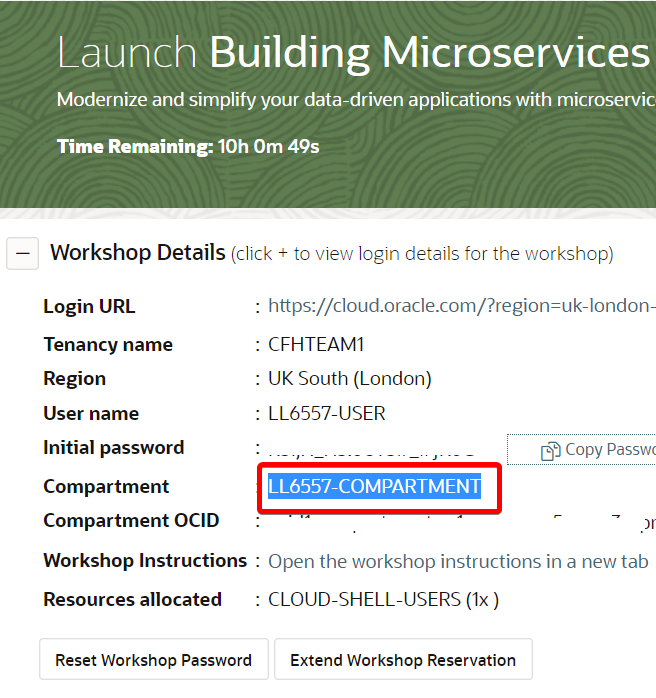
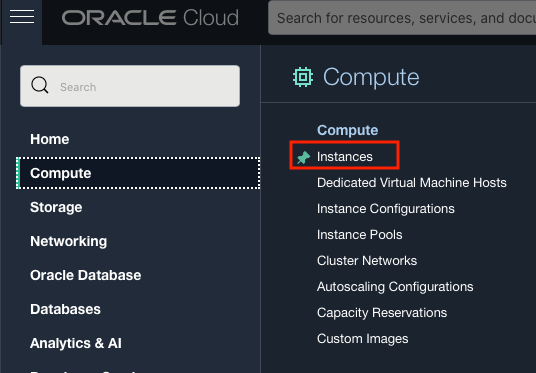
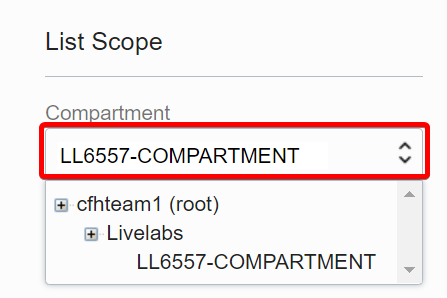
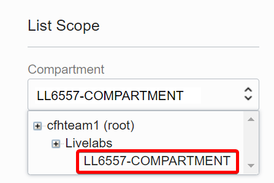
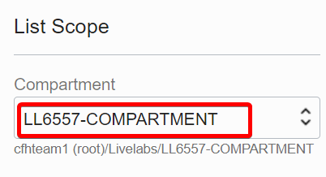
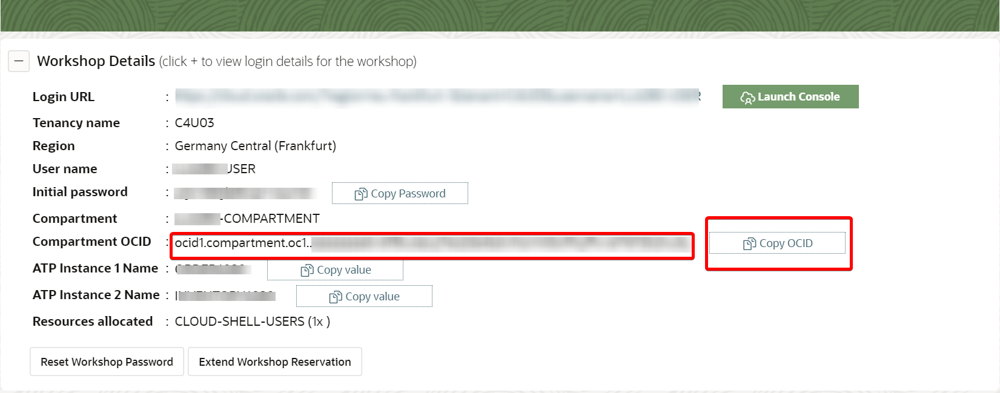
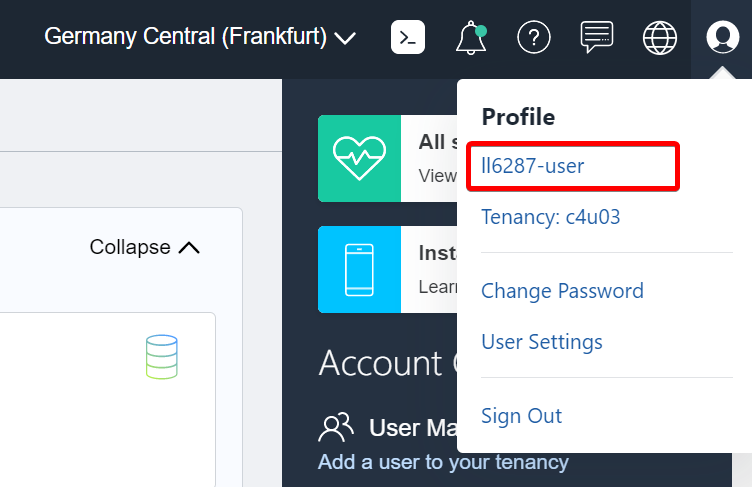
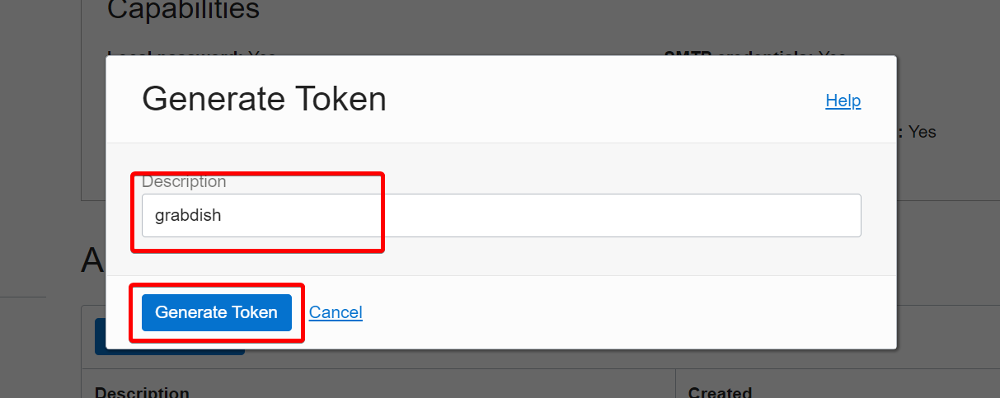
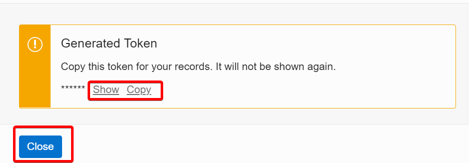

# Setup

## Introduction

In this lab we will provision and setup the resources to execute microservices in your environment.

Estimates Lab Time - 20 minutes

### Objectives

* Clone the setup and microservices code
* Execute setup

## Task 1: Select Your Compartment

Your own Oracle Cloud Infrastructure compartment for running this workshop has been assigned to you. The name of the compartment appears on the Launch page.

1. Copy the compartment name (not OCID) from the workshop reservation page.

   

2. Select the navigation menu from the top left corner of the Oracle Cloud Console and navigate to the Instances page in the Compute section.

   

3. Search for compartment using the compartment name from step#1 in the "Compartment" field under "List Scope".

   

4. Select your compartment name from the drop down list.

   

   

## Task 2: Launch the Cloud Shell

Cloud Shell is a small virtual machine running a "bash" shell which you access through the Oracle Cloud Console. Cloud Shell comes with a pre-authenticated command line interface connected to the tenancy. It also provides up-to-date tools and utilities.

1. Click the Cloud Shell icon in the top-right corner of the Console.

   

   NOTE: Cloud Shell uses websockets to communicate between your browser and the service. If your browser has websockets disabled or uses a corporate proxy that has websockets disabled you will see an error message ("An unexpected error occurred") when attempting to start Cloud Shell from the console. You also can change the browser cookies settings for a specific site to allow the traffic from *.oracle.com

## Task 3: Make a Clone of the Workshop Setup Script and Source Code

1. To work with the application code, you need to make a clone from the GitHub repository using the following command.  

    ```
    <copy>git clone -b 22.2.1 --single-branch https://github.com/oracle/microservices-datadriven.git
    </copy>
    ```

   You should now see the directory `microservices-datadriven` in the current directory.

## Task 4: Start the Setup

1. Execute the following sequence of commands to start the setup.  

  ```
  <copy>
  source microservices-datadriven/workshops/dcms-oci/source.env
  setup
  </copy>
  ```

#   Note, cloud shell may disconnect after a period of inactivity. If that happens, you may reconnect and then run the same command again to resume.

   The setup process will typically take around 20 minutes to complete.  

2. The setup will ask for you to enter your Compartment OCID. This is included in the workshop reservation page console.

   

3. The setup will ask you to enter an Auth Token so that docker can log in to the Oracle Cloud Infrastructure Registry. Please follow these steps to create an Auth Token.

  a. Locate your menu bar and click the person icon at the far upper right. From the drop-down menu, select your user's name.

   

  b. On the left side of the page, click Auth Tokens and click Generate Token.

   

  c. Enter "grabdish" in the description field and click Generate Token.

   

   The new Auth Token will be displayed.

  d. Click Copy to copy the Auth Token to the clipboard.

   

  e. Paste the Auth Token when requested by Setup. **Note**: The token is not displayed. Press Enter after pasting the token.

  f. Click Close to close the Generate Token dialog.

4. The setup will ask you to enter an Admin password for the databases. For simplicity, the same password will be used for both the Order and Inventory databases.

Database passwords must be 12 to 30 characters and contain at least one uppercase letter, one lowercase letter, and one number. The password cannot contain the double quote (") character or the word "admin".

**Note**: The passwords typed are not displayed.

5. The setup will also ask you to enter a UI password that is used to enter the microservice frontend user interface. Make a note of the password as you will need it later. The UI password must be 8 to 30 characters.

## Task 5: Complete the Setup

The setup will provide a summary of the setup status as it proceeds. Once everything has completed you will see the message: **SETUP COMPLETED**.

While the background setup jobs are running you can monitor their progress with the following command.

```
<copy>
ps -ef
</copy>
```

Their log files are located in the $GRABDISH_LOG directory.

```
<copy>
ls -al $GRABDISH_LOG
</copy>
```

Once the setup has completed you are ready to [move on to Lab 2](#next).

Note, builds may continue to run even after the setup has completed. The status of the builds can be monitored with this command:

```
<copy>
status
</copy>
```

Note, Cloud Shell sessions have a maximum length of 24 hours, and time out after 20 minutes of inactivity.

## Acknowledgements

* **Authors** - Paul Parkinson, Dev Lead for Data and Transaction Processing, Oracle Microservices Platform, Helidon; Richard Exley, Consulting Member of Technical Staff, Oracle MAA and Exadata; Irina Granat, Consulting Member of Technical Staff, Oracle MAA and Exadata

* **Adapted for Cloud by** - Nenad Jovicic, Enterprise Strategist, North America Technology Enterprise Architect Solution Engineering Team
* **Documentation** - Lisa Jamen, User Assistance Developer - Helidon
* **Contributors** - Jaden McElvey, Technical Lead - Oracle LiveLabs Intern
* **Last Updated By/Date** - Richard Exley, April 2021
