# Data-centric microservices walkthrough with Helidon MP

## Introduction

This lab will show you how to deploy the microservices on your Kubernetes cluster, walk through the functionality and explain how it works.

Estimated Time: 10 minutes

Quick walk through on how to deploy the microservices on your Kubernetes cluster.

[](youtube:8gMmjbXSR68)

### Objectives

-   Deploy and access the microservices
-   Learn how they work

### Prerequisites

* An Oracle Cloud paid account or free trial. To sign up for a trial account with $300 in credits for 30 days, click [Sign Up](http://oracle.com/cloud/free).
* The OKE cluster and the Autonomous Transaction Processing databases that you created in Lab 1

## Task 1: Deploy all the Microservices and the FrontEnd UI

1.  Run the deploy script. This will create the deployment and pod for all the java images in the OKE cluster `msdataworkshop` namespace:

    ```
    <copy>cd $GRABDISH_HOME;./deploy.sh</copy>
    ```

   

2.  Once successfully created, verify deployment pods are running:

    ```
    <copy>kubectl get pods --all-namespaces</copy>
    ```

  

  Or, you can execute the `pods` shortcut command:

3. Verify the **ingress-nginx-controller** load balancer service is running, and write down the external IP address.

    ```
    <copy>kubectl get services --all-namespaces</copy>
    ```

    


  Or, you can execute the `services` shortcut command.

## Task 2: Access the FrontEnd UI

You are ready to access the frontend page. Open a new browser tab and enter the external IP URL:

`https://<EXTERNAL-IP>`

Note that for convenience a self-signed certificate is used to secure this https address and so it is likely you will be prompted by the browser to allow access.

You will be prompted to authenticate to access the Front End microservices. The user is `grabdish` and the password is the one you entered in Lab 1.

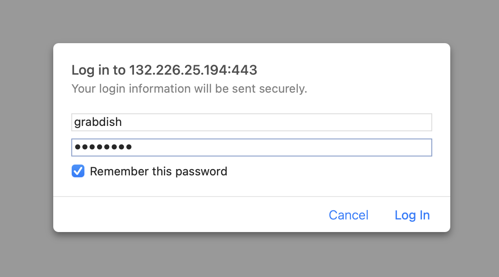

You should then see the Front End home page. You've now accessed your first microservice of the lab!

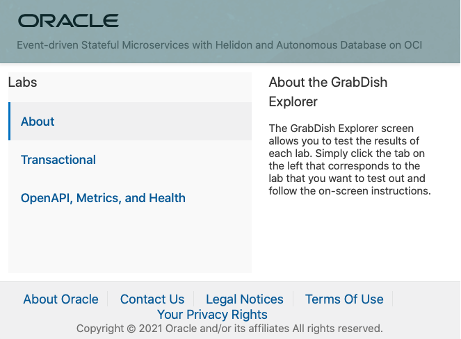

We created a self-signed certificate to protect the frontend-helidon service. This certificate will not be recognized by your browser and so a warning is displayed. It will be necessary to instruct the browser to trust this site to display the frontend. In a production implementation a certificate that is officially signed by a certificate authority should be used.

## Task 3: Verify the Order and Inventory Functionality of GrabDish store

1. Click **Transactional** under **Labs**.

   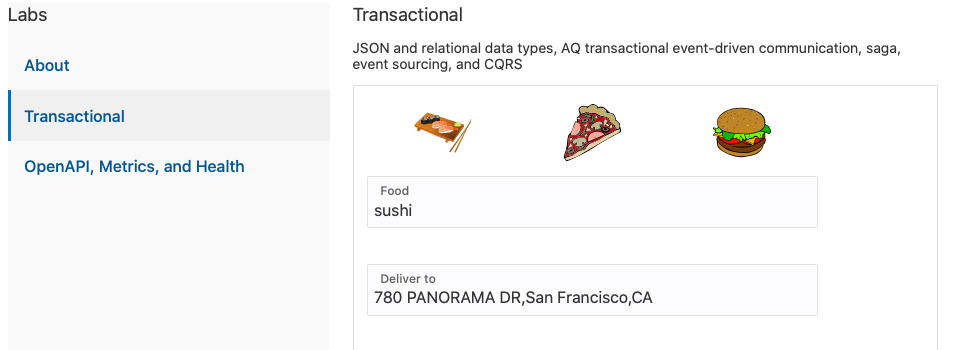

3. Check the inventory of a given item such as sushi, by typing `sushi`
    in the `food` field and clicking **Get Inventory**. You should see the inventory
    count result 0.

   

4. (Optional) If for any reason you see a different count, click **Remove Inventory** to bring back the count to 0.

5. Let’s try to place an order for sushi by clicking **Place Order**.

   

6. To check the status of the order, click **Show Order**. You should see a failed
    order status.

   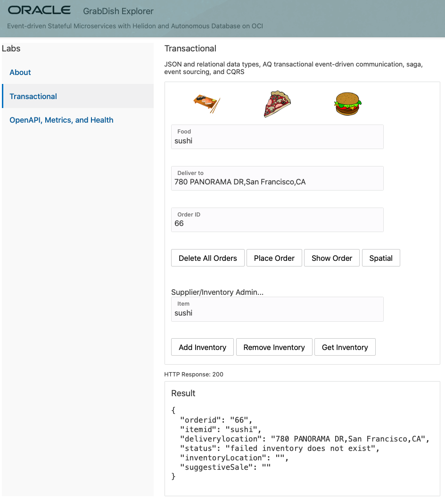

   This is expected, because the inventory count for sushi was 0.

7. Click **Add Inventory** to add the sushi in the inventory. You
    should see the outcome being an incremental increase by 1.

   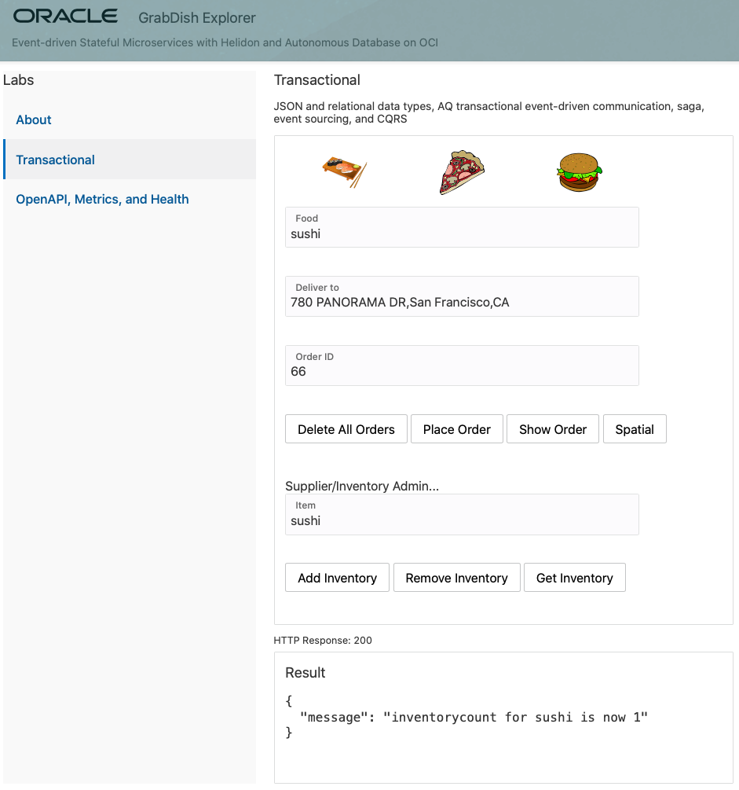

8. Go ahead and place another order by increasing the order ID by 1 (67) and then clicking **Place Order**. Next click **Show Order** to check the order status.

   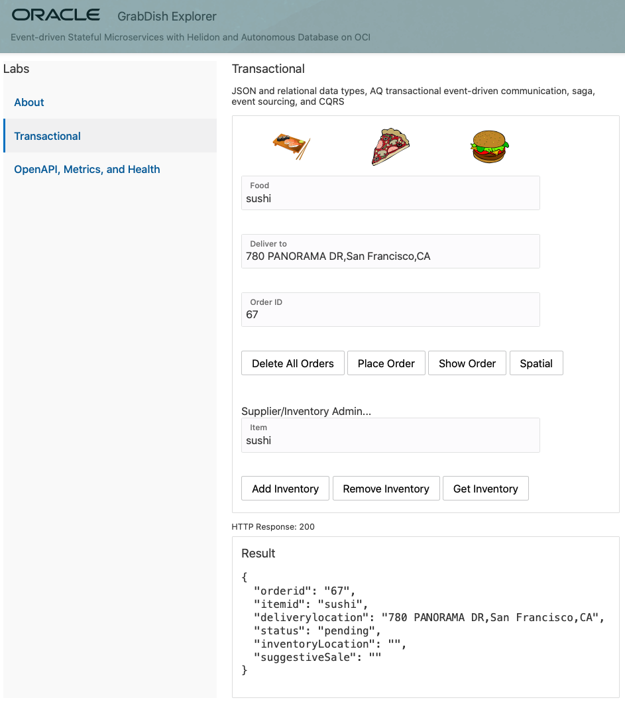

   

   The order should have been successfully placed, which is shown by the order status showing success.


Although this might look like a basic transactional mechanic, the difference in the microservices environment is that it’s not using a two-phase XA commit, and therefore not using distributed locks. In a microservices environment with potential latency in the network, service failures during the communication phase or delays in long running activities, an application shouldn’t have locking across the services. Instead, the pattern that is used is called the saga pattern, which instead of defining commits and rollbacks, allows each service to perform its own local transaction and publish an event. The other services listen to that event and perform the next local transaction.

In this architecture, there is a frontend service which mimics some mobile app requests for placing orders. The frontend service is communicating with the order service to place an order. The order service is then inserting the order into the order database, while also sending a message describing that order. This approach is called the event sourcing pattern, which due to its decoupled non-locking nature is prominently used in microservices. The event sourcing pattern entails sending an event message for every work or any data manipulation that was conducted. In this example, while the order was inserted in the order database, an event message was also created in the Advanced Queue of the Oracle database.

Implementing the messaging queue inside the Oracle database provides a unique capability of performing the event sourcing actions (manipulating data and sending an event message) atomically within the same transaction. The benefit of this approach is that it provides a guaranteed once delivery, and it doesn’t require writing additional application logic to handle possible duplicate message deliveries, as it would be the case with solutions using separate datastores and event messaging platforms.

In this example, once the order was inserted into the Oracle database, an event message was also sent to the interested parties, which in this case is the inventory service. The inventory service receives the message and checks the inventory database, modifies the inventory if necessary, and sends back a message if the inventory exists or not. The inventory message is picked up by the order service which based on the outcome message, sends back to the frontend a successful or failed order status.

This approach fits the microservices model, because the inventory service doesn’t have any REST endpoints, and instead it purely uses messaging. The services do not talk directly to each other, as each service is isolated and accesses its datastore, while the only communication path is through the messaging queue.

This architecture is tied with the Command Query Responsibility Segregation (CQRS) pattern, meaning that the command and query operations use different methods. In our example the command was to insert an order into the database, while the query on the order is receiving events from different interested parties and putting them together (from suggestive sales, inventory, etc). Instead of actually going to suggestive sales service or inventory service to get the necessary information, the service is receiving events.

Let’s look at the Java source code to understand how Advanced Queuing and Oracle database work together.

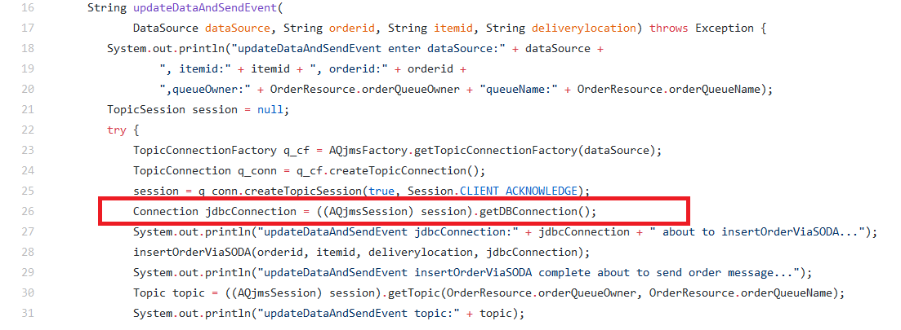

What is unique to Oracle and Advanced Queuing is that a JDBC connection can be invoked from an AQ JMS session. Therefore we are using this JMS session to send and receive messages, while the JDBC connection is used to manipulate the datastore. This mechanism allows for both the JMS session and JDBC connection to exist within same atomic local transaction.

## Task 4: Verify Spatial Functionality

1. Click **Spatial** on the **Transactional** tab

   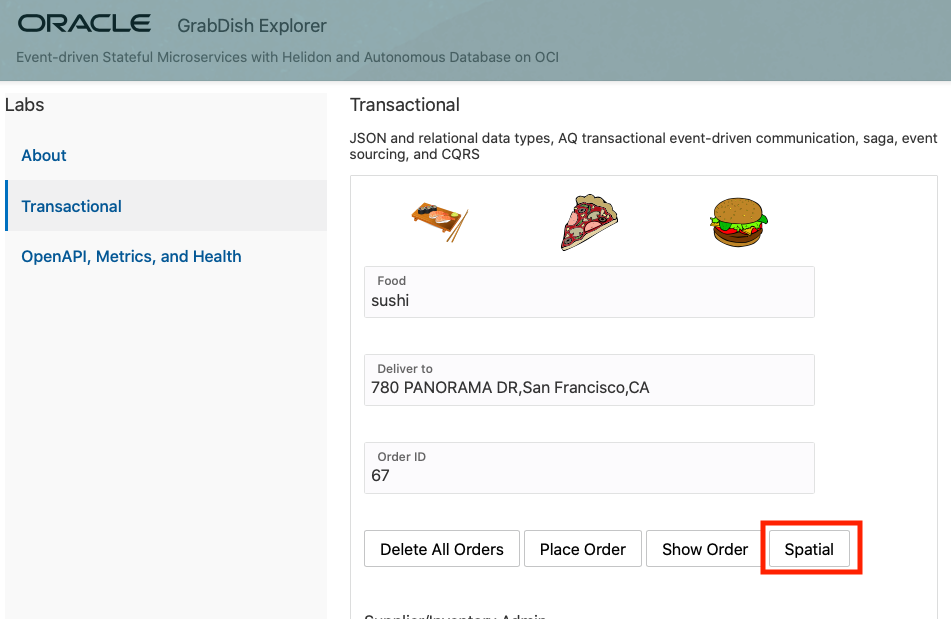

2. Check **Show me the Fusion** menu to make your choices for the Fusion Cuisine

   

3. Click the plus sign to add Makizushi, Miso Soup, Yakitori and Tempura to your order and click **Ready to Order**.

   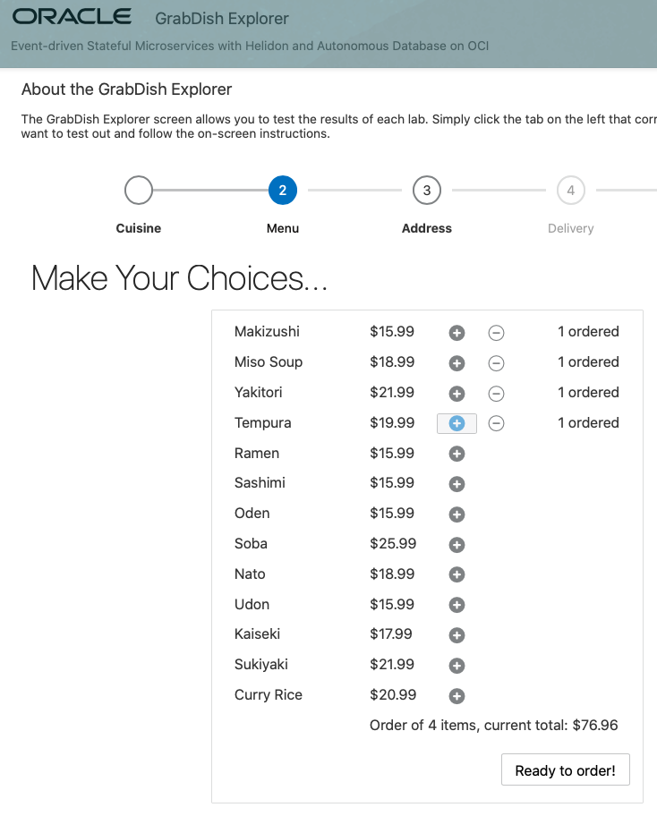

4. Click **Deliver here** to deliver your order to the address provided on the screen

   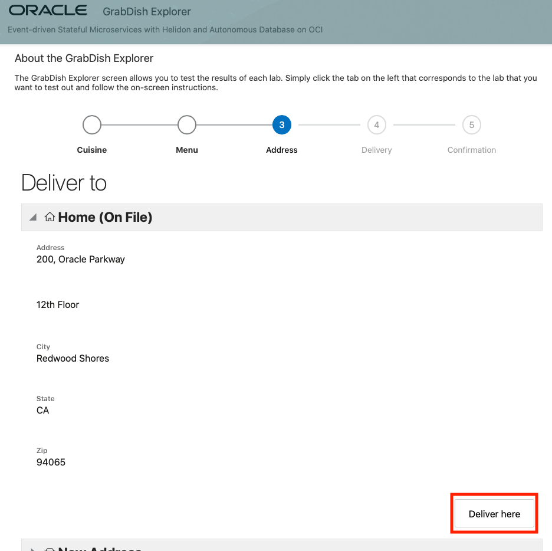

5. Your order is being fulfilled and will be delivered through the fastest route.

   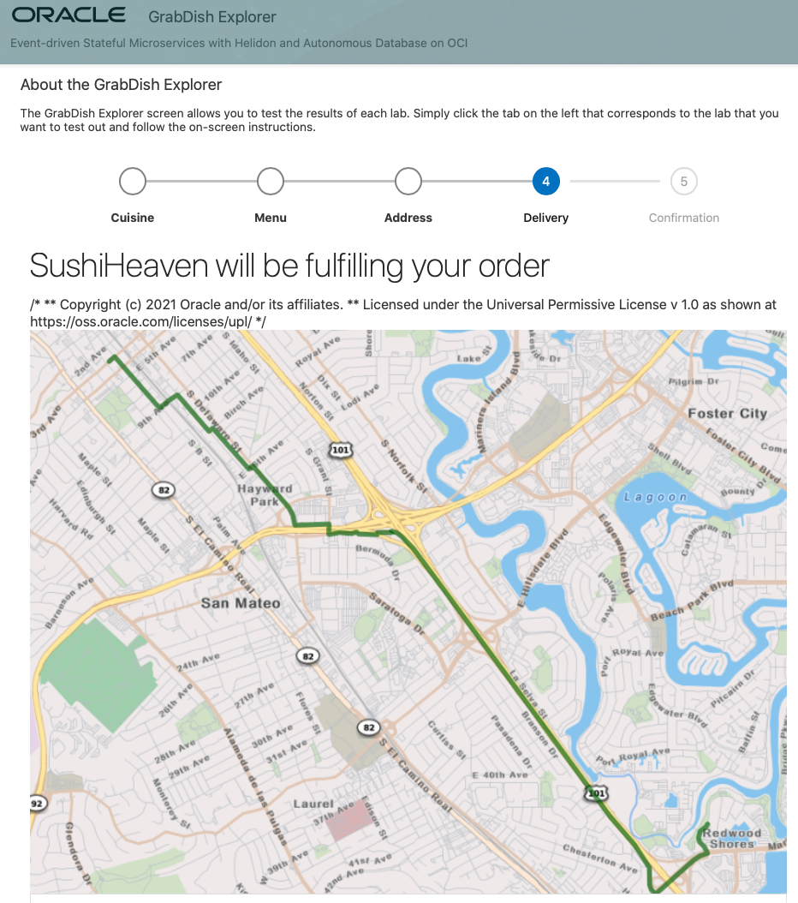

6. Go to the other tab on your browser to view the `Transactional` screen.

   

This demo demonstrates how geocoding (the set of latitude and longitude coordinates of a physical address) can be used to derive coordinates from addresses and how routing information can be plotted between those coordinates.
Oracle JET web component <oj-spatial-map> provides access to mapping from an Oracle Maps Cloud Service and it is being used in this demo for initializing a map canvas object (an instance of the Mapbox GL JS API's Map class). The map canvas automatically displays a map background (aka "basemap") served from the Oracle Maps Cloud Service. This web component allows mapping to be integrated simply into Oracle JET and Oracle Visual Builder applications, backed by the full power of Oracle Maps Cloud Service including geocoding, route-finding and multiple layer capabilities for data overlay. The Oracle Maps Cloud Service (maps.oracle.com or eLocation) is a full Location Based Portal. It provides mapping, geocoding and routing capabilities similar to those provided by many popular commercial online mapping services.

## Task 5: Verify AI Food and Wine Pairing Functionality

1. Deploy the foodwinepairing-python service using the following command.

    ```
    <copy>cd $GRABDISH_HOME/foodwinepairing-python;./deploy.sh</copy>
    ```
   
2.  Verify the foodwinepairing-python pod is running:

    ```
    <copy>kubectl get pods --all-namespaces</copy>
    ```

3. Redeploy inventory-helidon passing true to `./deploy.sh` using the following command. This will change the `isSuggestiveSaleAIEnabled` value in inventory-helidon-deployment.yaml to true and redeploy.                                                                                         
  
    ```
    <copy>cd $GRABDISH_HOME/inventory-helidon;./deploy.sh true</copy>
    ```
  
4.  Verify the new inventory-helidon pod is running:

    ```
    <copy>kubectl get pods --all-namespaces</copy>
    ```
    

5. Add inventory if necessary and place another order.  You should see that there is now a wine suggesting for you food order.

   

Food wine pairing is used to recommend the suitable wines for the food which is ordered by the user. Here we train a Word2vec model for both Wine dataset and Food reviews using Gensim. The input{food item} is passed through the Word2Vec model to get the wine recommendations. Top 4 wines are given for the display. We used nltk library for data normalization{sentence tokenization, word tokenization, removing punctuation and removing stopwords,stemming, etc} and scikit-learn for tf-idf computations. By considering the aroma and non-aroma factors, the wine recommendations are suggested.

## Task 6: Show Metrics

1. Notice @Timed and @Counted annotations on placeOrder method of $GRABDISH_HOME/order-helidon/src/main/java/io/helidon/data/examples/OrderResource.java

   


2. Click **Tracing, Metrics, and Health**

   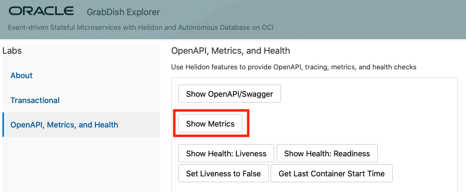

3. Click **Show Metrics** and notice the long string of metrics (including those from placeOrder timed and counted) in prometheus format.

   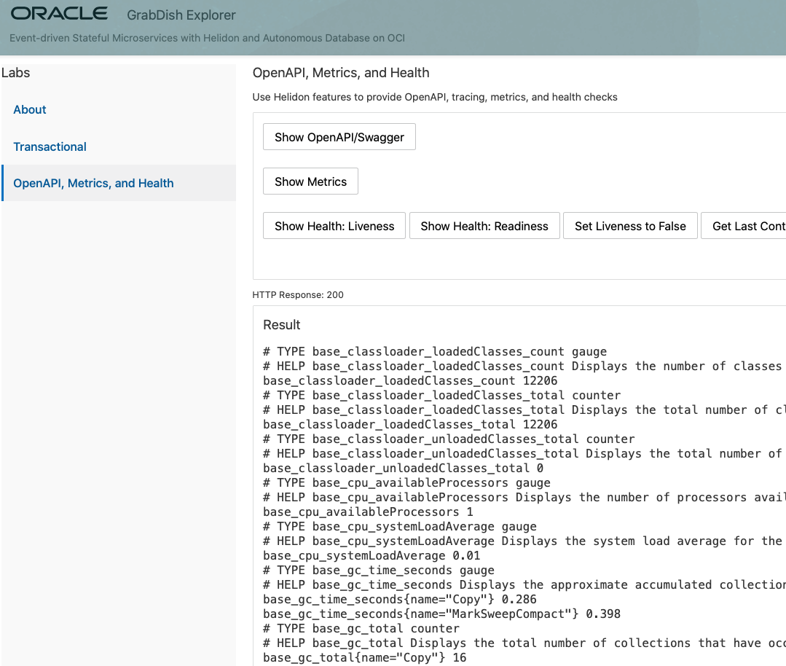

## Task 7: Verify Health

1. Oracle Cloud Infrastructure Container Engine for Kubernetes (OKE) provides health probes which check a given    container for its liveness (checking if the pod is up or down) and readiness (checking if the pod is ready to take
requests or not). In this STEP you will see how the probes pick up the health that the Helidon microservice advertises. Click **Tracing, Metrics, and Health** and click **Show Health: Liveness**

   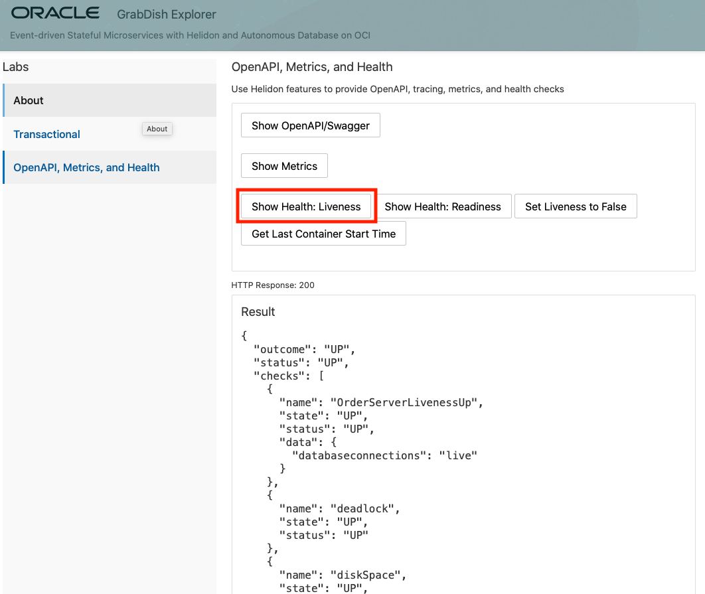

2. Notice health check class at `$GRABDISH_HOME/order-helidon/src/main/java/io/helidon/data/examples/OrderServiceLivenessHealthCheck.java` and how the liveness method is being calculated.

    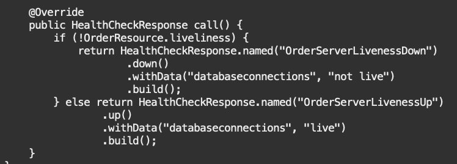

3. Notice liveness probe specified in `$GRABDISH_HOME/order-helidon/order-helidon-deployment.yaml` The `livenessProbe` can be set up with different criteria, such as reading from a file or an HTTP GET request. In this example the OKE health probe will use HTTP GET to check the /health/live and /health/ready addresses every 3 seconds, to see the liveness and readiness of the service.

   

4. To observe how OKE will manage the pods, the microservice has been created with the possibility to set up the liveliness to “false”. Click **Get Last Container Start Time** and note the time the container started.

   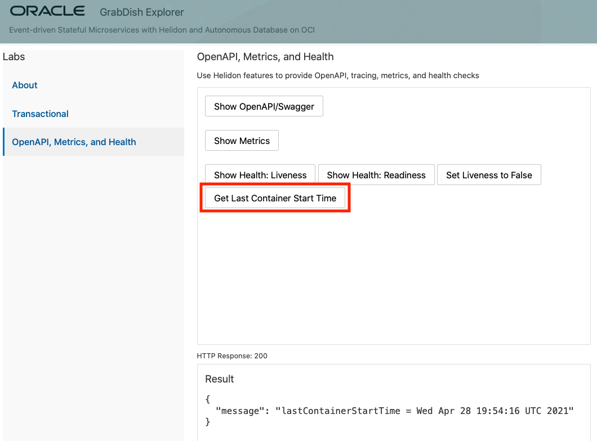

5. Click **Set Liveness to False** . This will cause the Helidon Health Check to report false for liveness which will result in OKE restarting the pod/microservice

   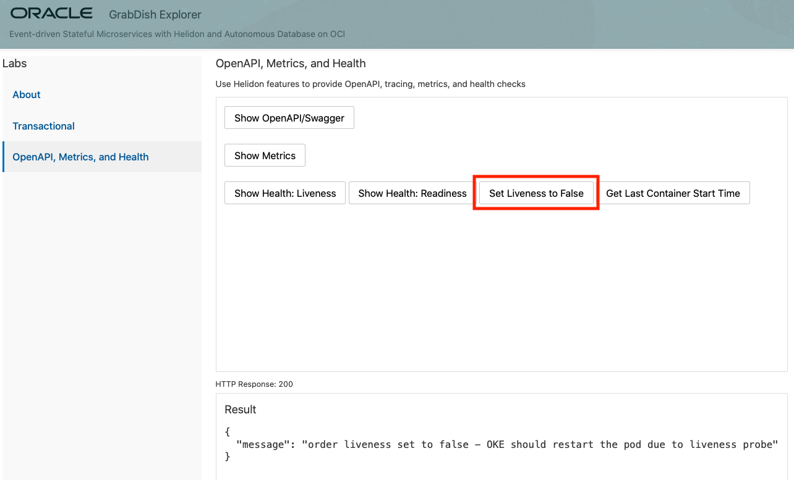

6. Click **Get Last Container Start Time**.
   It will take a minute or two for the probe to notice the failed state and conduct the restart and as it does you may see a connection refused exception.

   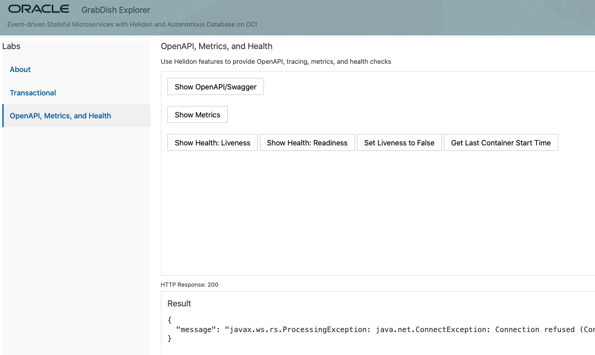

   Eventually you will see the container restart and note the new/later container startup time reflecting that the pod was restarted.

   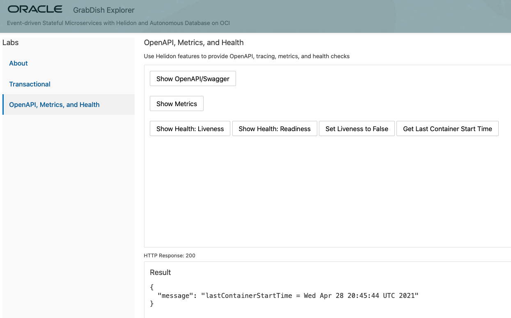

## Task 8: Understand Passing Database Credentials to a Microservice (Study)

To connect to an  'Oracle Autonomous Transaction Processing database you need the following four pieces of information:
   - Database user name
   - Database user password
   - Database Wallet
   - Connect alias, string or URL

Let’s analyze the Kubernetes deployment YAML file: `order-helidon-deployment.yaml` to see how this is done.

   ```
   <copy>cat $GRABDISH_HOME/order-helidon/order-helidon-deployment.yaml</copy>
   ```

1. The **database user name** is passed as an environment variable:

    ```
    - name: oracle.ucp.jdbc.PoolDataSource.orderpdb.user
      value: "ORDERUSER"
    ```

2. The **database user password** is passed as an environment variable with the value coming from a kubernetes secret:

    ```
    - name: dbpassword
      valueFrom:
        secretKeyRef:
          name: dbuser
          key:  dbpassword
    ```

   Note, code has also been implemented to accept the password from a vault, however, this is not implemented in the workshop at this time.

   The secret itself was created during the setup using the password that you entered.  See `utils/main-setup.sh` for more details.

    ```
    <copy>
    kubectl describe secret dbuser -n msdataworkshop
    </copy>
    ```

   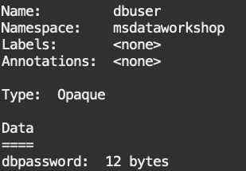

3. The **database wallet** is defined as a volume with the contents coming from a kubernetes secret:

    ```
    volumes:
      - name: creds
        secret:
          secretName: db-wallet-secret
    ```

   The volume is mounted as a filesystem:

    ```
    volumeMounts:
      - name: creds
        mountPath: /msdataworkshop/creds
    ```

   And finally, when connecting the TNS_ADMIN is pointed to the mounted filesystem:

    ```
    - name: oracle.ucp.jdbc.PoolDataSource.orderpdb.URL
      value: "jdbc:oracle:thin:@%ORDER_PDB_NAME%_tp?TNS_ADMIN=/msdataworkshop/creds"
    ```

   Setup had previeously downloaded a regional database wallet and created the db-wallet-secret secret containing the wallet files.  See `utils/db-setup.sh` for more details.

    ```
    <copy>
    kubectl describe secret db-wallet-secret -n msdataworkshop
    </copy>
    ```

   

4. The database connection URL is passed in as an environment variable.  

    ```
    - name: oracle.ucp.jdbc.PoolDataSource.orderpdb.URL
      value: "jdbc:oracle:thin:@%ORDER_PDB_NAME%_tp?TNS_ADMIN=/msdataworkshop/creds"
    ```

   The URL references a TNS alias that is defined in the tnsnames.ora file that is contained within the wallet.

## Task 9: Understand How Database Credentials are Used by a Helidon Microservice (Study)

Let’s analyze the `microprofile-config.properties` file.

```
<copy>cat $GRABDISH_HOME/order-helidon/src/main/resources/META-INF/microprofile-config.properties</copy>
```

This file defines the `microprofile` standard. It also has the definition of the data sources that will be injected. The universal connection pool takes the JDBC URL and DB credentials to connect and inject the datasource. The file has default values which will be overwritten by the environment variables that are passed in.  

The `dbpassword` environment variable is read and set as the password unless and vault OCID is provided.  

Let’s also look at the microservice source file `OrderResource.java`.

```
<copy>cat $GRABDISH_HOME/order-helidon/src/main/java/io/helidon/data/examples/OrderResource.java</copy>
```

Look for the inject portion. The `@Inject` has the data source under `@Named` as “orderpdb” which was mentioned in the `microprofile-config.properties` file.

```
@Inject
@Named("orderpdb")
PoolDataSource atpOrderPdb;
```

## Task 10: Understand shortcut commands and development process (Study)

A number of shortcut commands are provided to analyze and debug the workshop kubernetes environment including the following:

`msdataworkshop` - Lists all of the kubernetes resources (deployments, pods, services, secrets) involved in the workshop

`describepod` - Gives information on a given pod and can use abbreviated names for arguments, such as `describepod inventory` or `describepod order`

`logpod` - Provides the logs for a given pod/container and can use abbreviated names for arguments, such as `logpod inventory` or `logpod order`

`deletepod` - Deletes a given pod/container and can use abbreviated names for arguments, such as `deletepod inventory` or `deletepod order`

As the deployments in the workshop are configured with `imagePullPolicy: Always` , once you have finished the workshop, you can develop and test changes to a microservice using the following sequence...

1. Modify microservice source
2. Run `./build.sh` to build and push the newly modified microservice image to the repository
3. Run `deletepod` (for example `deletepod order`) to delete the old pod and start a new pod with the new image
4. Verify changes

If changes have been made to the deployment yaml then re-run `./deploy.sh` in the appropriate microservice's directory.

## Task 10: Develop, build, deploy, etc. in your own environment, outside Cloud Shell  (Study)

The Cloud Shell is extremely convenient for development as it has various software pre-installed as well as software installed by the workshop, however it is certainly possible to do development outside the Cloud Shell.
The following are the major considerations in doing so...

- Building microservices will of course require the software required for a particular service to be installed. For example maven, GraalVM, etc.

- Pushing microservices to the OCI repository will require logging into the repos via docker and for this you will need an authtoken. 
You can re-use the auth token created in the workshop or easily create a new one (see setup lab doc). 
Using the auth token you can then login to docker using the following format (replacing values as appropriate)...

  ```
  <copy>docker login -u yourtenancyname/oracleidentitycloudservice/youraccountuser@email.com us-ashburn-1.ocir.io</copy>
  ```
   You should then set the DOCKER_REGISTRY value in your environment like this...

   ```
   <copy>export DOCKER_REGISTRY=us-ashburn-1.ocir.io/yourtenancyname/yourcompartmentname</copy>
   ```
- Deploying microservices to your Kubernetes cluster will require you to install the OCI CLI and kubectl, and run the command found in the OCI console to create the kubeconfig file tha will give you access to the cluster.
This can be found under `Developer Services->Kubernetes Clusters` where you will select your cluster and see the following page where you can copy the necessary command...

   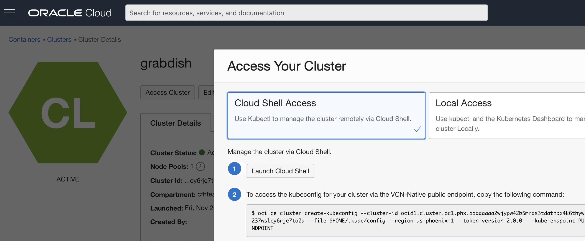
   You should then set the ORDER_PDB_NAME and INVENTORY_PDB_NAME values in your environment like this (note the value does not include the suffix of the service type, only the db name)...

   ```
   <copy>export ORDER_PDB_NAME=grabdisho</copy>
   ```

   ```
   <copy>export INVENTORY_PDB_NAME=grabdishi</copy>
   ```


## Acknowledgements
* **Author** - Paul Parkinson, Architect and Developer Evangelist; Richard Exley, Consulting Member of Technical Staff, Oracle MAA and Exadata
* **Adapted for Cloud by** - Nenad Jovicic, Enterprise Strategist, North America Technology Enterprise Architect Solution Engineering Team
* **Documentation** - Lisa Jamen, User Assistance Developer - Helidon
* **Contributors** - Jaden McElvey, Technical Lead - Oracle LiveLabs Intern
* **Last Updated By/Date** - Richard Exley, April 2021
