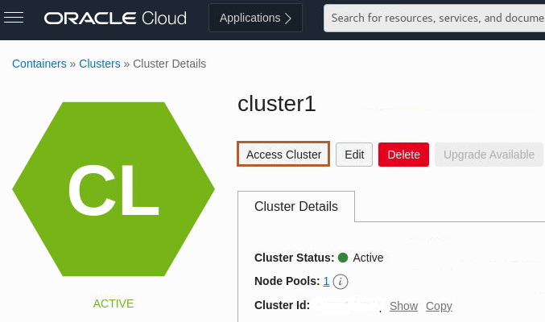
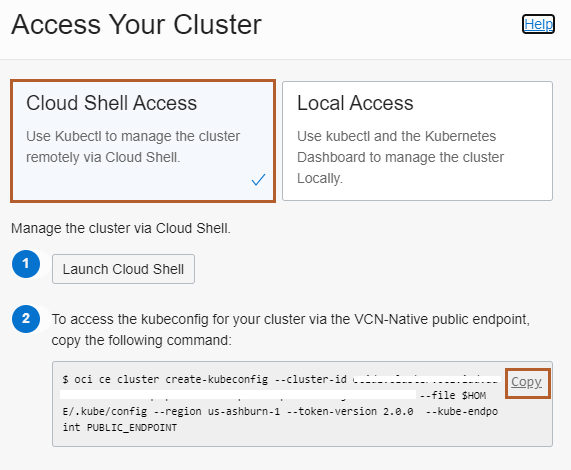
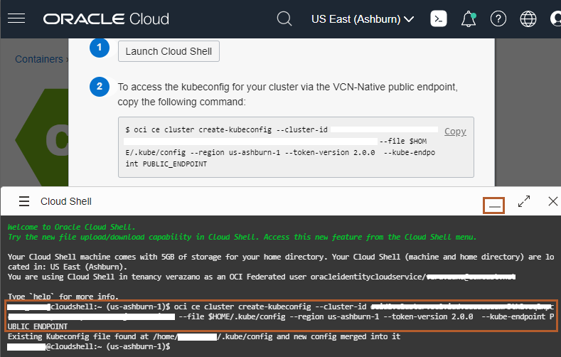
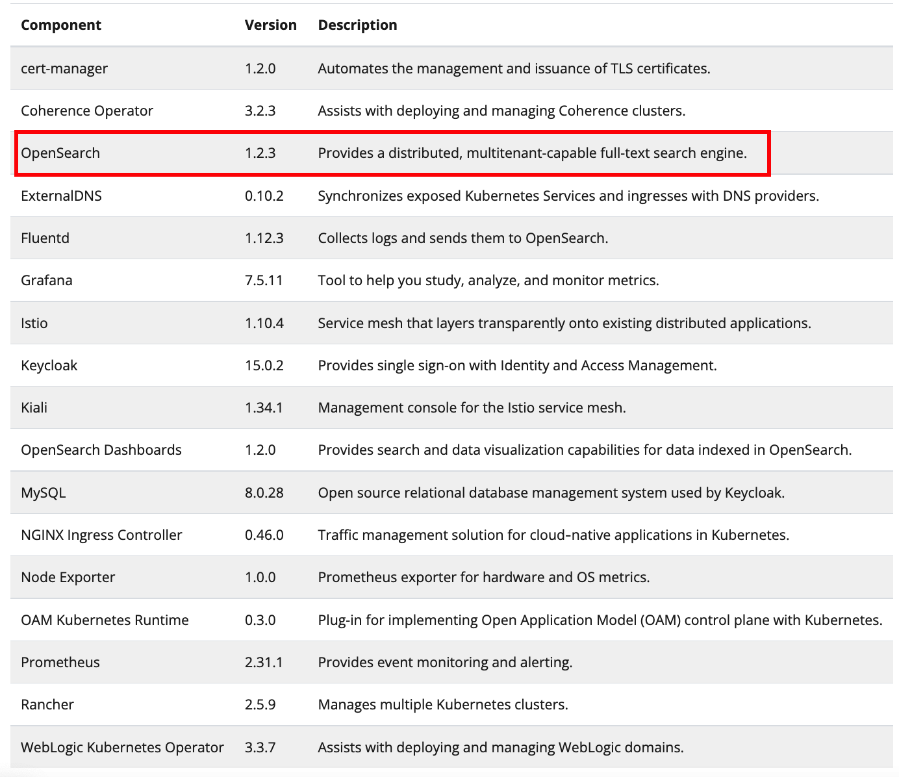

# Install Verrazzano on a Kubernetes Cluster in the Oracle Cloud Infrastructure (OCI)

## Introduction

This lab walks you through the steps to install Verrazzano on a Kubernetes cluster in the Oracle Cloud Infrastructure.

### About Product/Technology

Verrazzano is an end-to-end enterprise container platform for deploying cloud-native and traditional applications in multicloud and hybrid environments. It is made up of a curated set of open source components – many that you may already use and trust, and some that were written specifically to pull together all of the pieces that make Verrazzano a cohesive and easy to use platform.

Verrazzano includes the following capabilities:

* Hybrid and multicluster workload management
* Special handling for WebLogic, Coherence, and Helidon applications
* Multicluster infrastructure management
* Integrated and pre-wired application monitoring
* Integrated security
* DevOps and GitOps enablement

### Objectives

In this lab, you will:

* Setup `kubectl` to use the Oracle Kubernetes Engine cluster
* Install the Verrazzano platform operator.
* Install the development (`dev`) profile of Verrazzano.

### Prerequisites

Verrazzano requires the following:

* A Kubernetes cluster and a compatible `kubectl`.
* At least 2 CPUs, 100GB disk storage, and 16GB RAM available on the Kubernetes worker nodes. This is sufficient to install the development profile of Verrazzano. Depending on the resource requirements of the applications you deploy, this may or may not be sufficient for deploying your applications.
* In Lab 1, you created a Kubernetes cluster on the Oracle Cloud Infrastructure. You will use that Kubernetes cluster, *cluster1*, for installing the development profile of Verrazzano.

## Task 1: Configure `kubectl` (Kubernetes Cluster CLI)


We will use `kubectl` to manage the cluster remotely using the Cloud Shell. It needs a `kubeconfig` file. This will be generated using the OCI CLI which is pre-authenticated, so there’s no setup to do before you can start using it.

1. Click **Access Cluster** on your cluster detail page.

    > If you moved away from that page, then open the navigation menu and under **Developer Services**, select **Kubernetes Clusters (OKE)**. Select your cluster and go the detail page.

    

    > A dialog is displayed from which you can open the Cloud Shell and contains the customized OCI command that you need to run, to create a Kubernetes configuration file.

2. Accept the default **Cloud Shell Access** and click **Copy** copy the `oci ce...` command and paste it into the Cloud Shell and run the command.

    

    For example, the command looks like the following:

    ```bash
    oci ce cluster create-kubeconfig --cluster-id ocid1.cluster.oc1.phx.aaaaaaaaaezwen..................zjwgm2tqnjvgc2dey3emnsd --file $HOME/.kube/config --region us-phoenix-1 --token-version 2.0.0
    ```

    

5. Verify that the `kubectl` is working by using the `get node` command. <br>
You may need to run this command several times until you see the output similar to the following.

    ```bash
    <copy>kubectl get node</copy>
    ```

    ```bash
    $ kubectl get node
    NAME          STATUS   ROLES   AGE    VERSION
    10.0.10.112   Ready    node    4m32s   v1.21.5
    10.0.10.200   Ready    node    4m32s   v1.21.5
    10.0.10.36    Ready    node    4m28s   v1.21.5
    ```

    > If you see the node's information, then the configuration was successful.

## Task 2: Install the Verrazzano Platform Operator

Verrazzano provides a platform [operator](https://kubernetes.io/docs/concepts/extend-kubernetes/operator/) to manage the life cycle of Verrazzano installations. You can install, uninstall, and update Verrazzano installations by updating the [Verrazzano custom resource](https://verrazzano.io/docs/reference/api/verrazzano/verrazzano/).

Before installing Verrazzano, we need to install the Verrazzano Platform Operator.

1. Copy the following command and paste it in the *Cloud Shell* to run it.

  ```bash
  <copy>kubectl apply -f https://github.com/verrazzano/verrazzano/releases/download/v1.2.0/operator.yaml</copy>
  ```
    The output should be similar to the following:
  ```bash
  $ kubectl apply -f https://github.com/verrazzano/verrazzano/releases/download/v1.2.0/operator.yaml
  customresourcedefinition.apiextensions.k8s.io/verrazzanomanagedclusters.clusters.verrazzano.io created
  customresourcedefinition.apiextensions.k8s.io/verrazzanos.install.verrazzano.io created
  namespace/verrazzano-install created
  serviceaccount/verrazzano-platform-operator created
  clusterrole.rbac.authorization.k8s.io/verrazzano-managed-cluster created
  clusterrolebinding.rbac.authorization.k8s.io/verrazzano-platform-operator created
  service/verrazzano-platform-operator created
  deployment.apps/verrazzano-platform-operator created
  validatingwebhookconfiguration.admissionregistration.k8s.io/verrazzano-platform-operator created
  $
  ```

  > This `operator.yaml` file contains information about the operator and the service accounts and custom resource definitions. By running this *kubectl apply* command, we are specifying whatever is in the `operator.yaml` file.
  > All deployments in Kubernetes happen in a namespace. When we deploy the Verrazzano Platform Operator, it happens in the namespace called "verrazzano-install".

2. To find out the deployment status for the Verrazzano Platform Operator, copy the following command and paste it in the *Cloud Shell*.

```bash
<copy>kubectl -n verrazzano-install rollout status deployment/verrazzano-platform-operator</copy>
```

  The output should be similar to the following:

```bash
$ kubectl -n verrazzano-install rollout status deployment/verrazzano-platform-operator
  deployment "verrazzano-platform-operator" successfully rolled out
$
```

  > Confirm that the operator pod associated with the Verrazzano Platform Operator is correctly defined and running. A Pod is a unit which runs containers / images and Pods belong to nodes.

3. To find out the pod status, copy and paste the following command in the *Cloud Shell*.

    ```bash
    <copy>kubectl -n verrazzano-install get pods</copy>
    ```

    The output should be similar to the following:
    ```bash
    $ kubectl -n verrazzano-install get pods
      NAME                                            READY   STATUS    RESTARTS   AGE
      verrazzano-platform-operator-6d9c9cf89c-knzlt   1/1     Running   0          3m25s
    $
    ```

## Task 3: Install the Verrazzano Development Profile

An installation profile is a well-known configuration of Verrazzano settings that can be referenced by name, which can then be customized as needed.

Verrazzano supports the following installation profiles: development (`dev`), production (`prod`), and managed cluster (`managed-cluster`).

* The production profile, which is the default, provides a 3-node Elasticsearch and persistent storage for the Verrazzano Monitoring Instance (VMI).
* The development profile provides a single node Elasticsearch and no persistent storage for the VMI.
* The managed-cluster profile installs only managed cluster components of Verrazzano. To take full advantage of multicluster features, the managed cluster should be registered with an admin cluster.

To change profiles in any of the following commands, set the *VZ_PROFILE* environment variable to the name of the profile you want to install.

For a complete description of Verrazzano configuration options, see the [Verrazzano Custom Resource Definition](https://verrazzano.io/docs/reference/api/verrazzano/verrazzano/).

In this lab, we are going to install the *development profile of Verrazzano*, which has the following characteristics:

* It has a lightweight installation.
* It is for evaluation purposes.
* No persistence.
* Single-node OpenSearch cluster topology.

The following image describes the Verrazzano components that are installed with each profile.



According to our DNS choice, we can use nip.io (wildcard DNS) or [Oracle OCI DNS](https://docs.cloud.oracle.com/en-us/iaas/Content/DNS/Concepts/dnszonemanagement.htm). In this lab, we are going to install using nip.io (wildcard DNS).

>An ingress controller is something that helps provide access to Docker containers to the outside world (by providing an IP address). The ingress routes the IP address to different clusters.

1. Install using the nip.io DNS Method. Copy the following command and paste it in the *Cloud Shell* to install Verrazzano.

    ```bash
    <copy>kubectl apply -f - <<EOF
    apiVersion: install.verrazzano.io/v1alpha1
    kind: Verrazzano
    metadata:
      name: example-verrazzano
    spec:
      profile: dev
    EOF
    </copy>
    ```

    The output should be similar to the following:
    ```bash
    $ kubectl apply -f - <<EOF
    apiVersion: install.verrazzano.io/v1alpha1
    kind: Verrazzano
    metadata:
      name: example-verrazzano
    spec:
      profile: dev
    EOF
    verrazzano.install.verrazzano.io/example-verrazzano created
    $
    ```

    > It takes around 10 to 15 minutes to complete the installation. To view the installation logs, go to the next commands.

2. The Verrazzano operator launches a Kubernetes job to install Verrazzano. You can view the installation logs from that job with the following command:

````bash
<copy>kubectl logs -n verrazzano-install \
 -f $(kubectl get pod \
 -n verrazzano-install \
 -l app=verrazzano-platform-operator \
 -o jsonpath="{.items[0].metadata.name}") | grep '^{.*}$' \
 | jq -r '."@timestamp" as $timestamp | "\($timestamp) \(.level) \(.message)"'</copy>
````

The output should be similar to the following:
    
````bash
  $ kubectl logs -n verrazzano-install \
>     -f $(kubectl get pod \
>     -n verrazzano-install \
>     -l app=verrazzano-platform-operator \
>     -o jsonpath="{.items[0].metadata.name}") | grep '^{.*}$' \
>     | jq -r '."@timestamp" as $timestamp | "\($timestamp) \(.level) \(.message)"'
      2022-03-15T12:24:11.756Z info Starting Verrazzano Platform Operator
      2022-03-15T12:24:13.340Z info metrics server is starting to listen
      2022-03-15T12:24:13.341Z info skip registering a mutating webhook, admission.Defaulter interface is not implemented
      2022-03-15T12:24:13.341Z info Registering a validating webhook
      2022-03-15T12:24:13.341Z info registering webhook
      2022-03-15T12:24:13.341Z info skip registering a mutating webhook, admission.Defaulter interface is not implemented
      2022-03-15T12:24:13.341Z info Registering a validating webhook
      2022-03-15T12:24:13.341Z info registering webhook
      2022-03-15T12:24:13.341Z info Starting controller-runtime manager
      2022-03-15T12:24:13.342Z info starting metrics server
      2022-03-15T12:24:13.342Z info starting webhook server
      2022-03-15T12:24:13.342Z info Starting EventSource
      2022-03-15T12:24:13.342Z info Starting EventSource
      2022-03-15T12:24:13.342Z info Updated current TLS certificate
      2022-03-15T12:24:13.343Z info Starting certificate watcher
      2022-03-15T12:24:13.343Z info serving webhook server
      2022-03-15T12:24:13.742Z info Starting Controller
      2022-03-15T12:24:13.843Z info Starting workers
    $
````
    

3. Leave the *Cloud Shell* open and let the installation running. Please continue with the next lab.

## Acknowledgements

* **Author** -  Ankit Pandey
* **Contributors** - Maciej Gruszka, Peter Nagy
* **Last Updated By/Date** - Ankit Pandey, March 2022