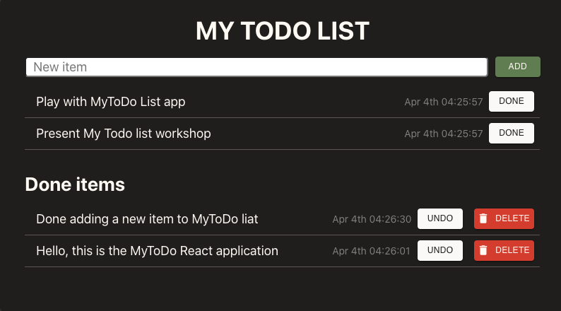
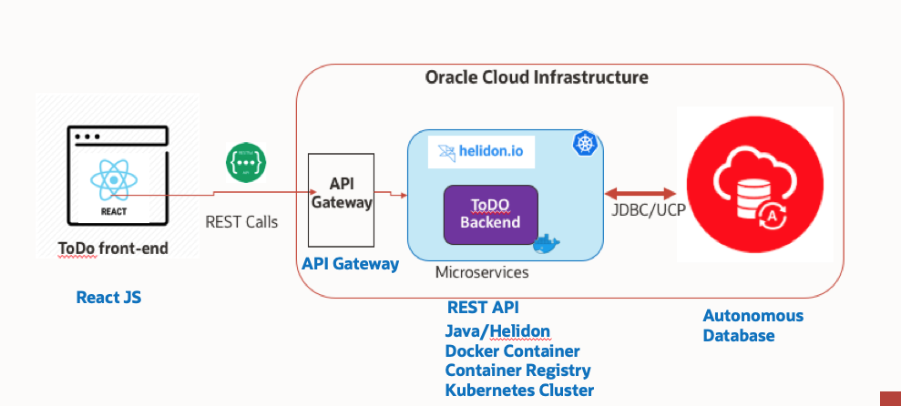

# Introduction

## About this Workshop

In this workshop, you will learn how to build and deploy a simple Cloud native application using the most commonly-used frameworks and the Oracle Cloud Infrastructure (OCI) services.

Estimated Time: 80 minutes

### About Product/Technology

Learn how to use the Autonomous Database, the Oracle Container Registry (OCR), the Kubernetes Cluster (OKE) , Helidon, and the API Gateway managed services of OCI through the deployment of a simple MyToDo List React JS application.

### Objectives

In this 3 parts workshop, you will:

* Provision a Kubernetes cluster, an Oracle Autonomous Database instance, a Container Registry, and an API Gateway
* Understand, build, and deploy a Java tier implementing the REST APIs, using the Helidon framework Docker, the OCI Container Registry, and a Kubernetes service
* Understand, build, and deploy a ReactJS frontend/UI making REST calls to the Helidon service implementing the REST APIs; then redeploy the ReactJS frontend over an OCI Object storage bucket

### Prerequisites

* An Oracle Free Tier or Paid Cloud Account

You may now **proceed to the next lab**.

## Acknowledgements

* **Author** - Kuassi Mensah, Dir. Product Management, Java Database Access
* **Contributors** - Jean de Lavarene, Sr. Director of Development, JDBC/UCP
* **Last Updated By Date** - Arabella Yao, Database Product Manager, October 2021