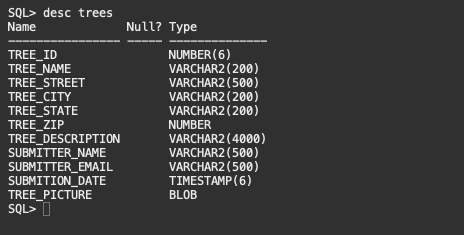
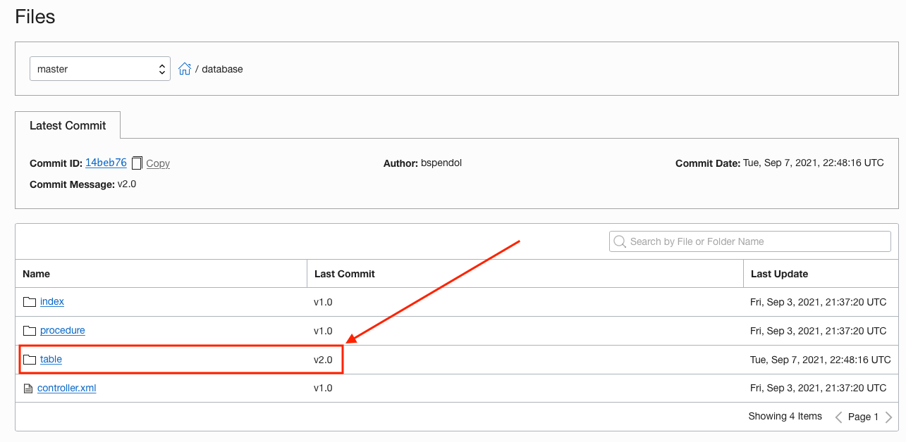

# Oracle Database CI/CD for Developers - Lab 3: Apply Database Changes with SQLcl

## Introduction

XXXXXX

Estimated Lab Time: 30-45 minutes

### Objectives

- Apply a database change to the dbuser schema
- Review the changelog tables
- Merge the branches and commit our change to the main branch

### Prerequisites

- You have completed the [Setups](../setups/setups.md).
- You have completed [Lab 1](../sqlcl/sqlcl.md).
- You have completed [Lab 2](../branch/branch.md).

## Task 1: Apply the database change to the dbuser schema

We have our table change in the developerBranch code branch and it is committed to our OCI code repository. It is now time to apply this change into our dbuser schema simulating how we would apply it to other databases in our enterprise or how a CICD pipeline would apply it to a test environment.

1. To start, we need to ensure we are in the database directory in the cicdRepository directory. Start by ensuring you are in cicdRepository/database directory. If you remember, its located at

   ```
   /home/USER_NAME/livelabs/cicdRepository/database
   ```

   To get there, you can issue a **cd /home/USER_NAME/livelabs/cicdRepository/database** but remember to **replace USER_NAME with your username**.

   ````
   <copy>
   cd /home/USER_NAME/livelabs/cicdRepository/database
   </copy>
   ````
   

2. Let's check to see what branch we are using in git so that we are pulling from the developerBranch where our change is and not the master branch. Issue a **git status** at the Cloud Shell prompt.
   ````
   <copy>
   git status
   </copy>
   ````
   
   
   and you should see that you are on the developerBranch branch.

2. Now, use **SQLcl** to log into our Autonomous Database.

   ````
   <copy>
   sql /nolog
   </copy>
   ````
   

3. Tell SQLcl where to look for the Autonomous Database wallet as we have done a few times before. Remember, we downloaded it in our home directory and we can use the following command to set its location. Just remember to **replace USER_NAME with your username**. You can look at the previous lab to find the exact location if needed.

      ### **Jeff's Tips** SQLcl remembers the commands you ran! Use the up arrow on your keyboard to find the command that you previously used to set the wallet location.

      ````
      <copy>
      set cloudconfig /home/USER_NAME/Wallet_LABADB.zip
      </copy>
      ````
      

4. Use the following command to **log into the database** as the dbuser.

   ````
   <copy>
   conn dbuser@LABADB_high
   </copy>
   ```` 
   

   And then provide the password we used to create the user at the password prompt.

   ````
   <copy>
   PAssw0rd11##11
   </copy>
   ```` 
   

5. At the SQLcl prompt, lets look at the TREES table. Issue a **desc trees** at the SQLcl prompt.
   ````
   <copy>
   desc trees
   </copy>
   ```` 
   

   This command will show us the columns in the TREES table
   ```   
   SQL> desc trees
      Name             Null? Type           
      ---------------- ----- -------------- 
      TREE_ID                NUMBER(6)      
      TREE_NAME              VARCHAR2(200)  
      TREE_STREET            VARCHAR2(500)  
      TREE_CITY              VARCHAR2(200)  
      TREE_STATE             VARCHAR2(200)  
      TREE_ZIP               NUMBER         
      TREE_DESCRIPTION       VARCHAR2(4000) 
      SUBMITTER_NAME         VARCHAR2(500)  
      SUBMITTER_EMAIL        VARCHAR2(500)  
      SUBMITION_DATE         TIMESTAMP(6) 
   ```
   And we can see that the new column we created TREE_PICTURE **is not** present.

6. To **apply this change and track it** via SQLcl and Liquibase, we can issue the following command at the SQLcl prompt
   ````
   <copy>
   lb update -changelog controller.xml
   </copy>
   ```` 

   

7. At the SQLcl prompt, lets look at the TREES table again to see if we have the new column. Issue a **desc trees** at the SQLcl prompt.
   ````
   <copy>
   desc trees
   </copy>
   ```` 

   

   This command will show us the columns in the TREES table
   ```   
   SQL> desc trees
      Name             Null? Type           
      ---------------- ----- -------------- 
      TREE_ID                NUMBER(6)      
      TREE_NAME              VARCHAR2(200)  
      TREE_STREET            VARCHAR2(500)  
      TREE_CITY              VARCHAR2(200)  
      TREE_STATE             VARCHAR2(200)  
      TREE_ZIP               NUMBER         
      TREE_DESCRIPTION       VARCHAR2(4000) 
      SUBMITTER_NAME         VARCHAR2(500)  
      SUBMITTER_EMAIL        VARCHAR2(500)  
      SUBMITION_DATE         TIMESTAMP(6)
      TREE_PICTURE           BLOB
   ```
   And we can see that the new column we created TREE_PICTURE **is** present.

8. Let's now take a look at the DATABASECHANGELOG_ACTIONS table to see what exactly happened here. Issue the following SQL at the SQLcl prompt.

   ````
   <copy>
   select id, sql from DATABASECHANGELOG_ACTIONS;
   </copy>
   ````

   

   ```  
   SQL> select id, sql from DATABASECHANGELOG_ACTIONS;

                                          ID                                                                                 SQL 
   ___________________________________________ ___________________________________________________________________________________ 
   44c07f52821c21ab608d547db432d9668ab63b53    CREATE TABLE "TREES"
                                                (    "TREE_ID" NUMBER(6,0),
                                                   "TREE_NAME" VARCHAR2(200) COLL    
   55e1505accad35790ef4d506170551b1b98575cf    CREATE OR REPLACE EDITIONABLE PROCEDURE "ADMIN_EMAIL_SET" 
                                                IS
                                                BEGIN
                                                      update    
   ca96dfab3d41fb76367f4f3c21d04ff74064b759    CREATE UNIQUE INDEX "TREE_ID_PK" ON "TREES" ("TREE_ID")
                                                PCTFREE 10 INITRANS 20    
   55e1505accad35790ef4d506170551b1b98575cf    --skipped                                                                           
   ca96dfab3d41fb76367f4f3c21d04ff74064b759    --skipped                                                                           
   c2061de0bf0b92cb094a4103fd0c072707579bad    ALTER TABLE "TREES" ADD ("TREE_PICTURE" BLOB)
                                                LOB ("TREE_PICTURE") STORE AS SEC    

   6 rows selected. 
   ```  

   We can see when we initial created the objects in the schema with the first 3 rows. What is of note is the last row. We see that SQLcl and Liquibase saw that the table already existed but that a new column was present. So instead of dropping and recreating the table, it was smart enough to just issue an alter table to add the new column.

9. **Exit out of SQLcl** by issuing an exit at the SQLcl prompt.

   ````
   <copy>
   exit
   </copy>
   ````
   

## Task 2: Merge the code

Now that we have a working developer branch, its time to merge this change with the main or master branch.

1. Start by going to the top level directory of our repository in Cloud Shell. The path is similar to the following

   ```
   /home/YOUR_USER_NAME/livelabs/cicdRepository/
   ```

   To get there, you can issue a **cd /home/USER_NAME/livelabs/cicdRepository/** but remember to **replace USER_NAME with your username**.

   ````
   <copy>
   cd /home/USER_NAME/livelabs/cicdRepository/
   </copy>
   ````
   

2. Issue a git status at the Cloud Shell prompt to see what branch we are on. We should be on the developerBranch branch.
   ````
   <copy>
   git status
   </copy>
   ````
   

3. To merge our code into the master branch, we need to switch or checkout the branch. Issue a **git checkout master** at the Cloud Shell prompt.
   ````
   <copy>
   git checkout master
   </copy>
   ````
   

4. We now issue a **git merge** at the Cloud Shell prompt indicating we want to merge the developerBranch branch into Master.
   ````
   <copy>
   git merge developerBranch
   </copy>
   ````
   

5. Finally, let's **push the code** back up to our OCI Code Repository
   ````
   <copy>
   git push
   </copy>
   ````
   Upon pressing return, we need to again provide our **username and password (auth token)** as we did when we cloned the environment in the setup step, in Lab 1 when we pushed the code to the repository as well as in Lab 2 when we pushed up the new branch.

7. Using the **OCI Web Console and the DevOps Code Repository details page**, if we drill into our master branch we can see that the table directory is at **version 2.0** 

   

   and contains the new column in the trees_table.xml file

   


## Acknowledgements

- **Authors** - Jeff Smith, Distinguished Product Manager and Brian Spendolini, Trainee Product Manager
- **Last Updated By/Date** - Brian Spendolini, August 2021