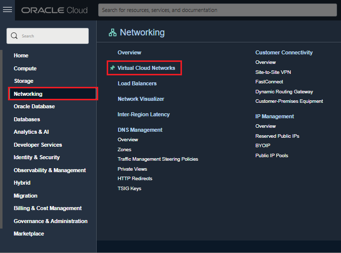
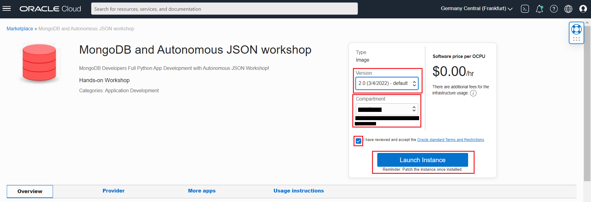
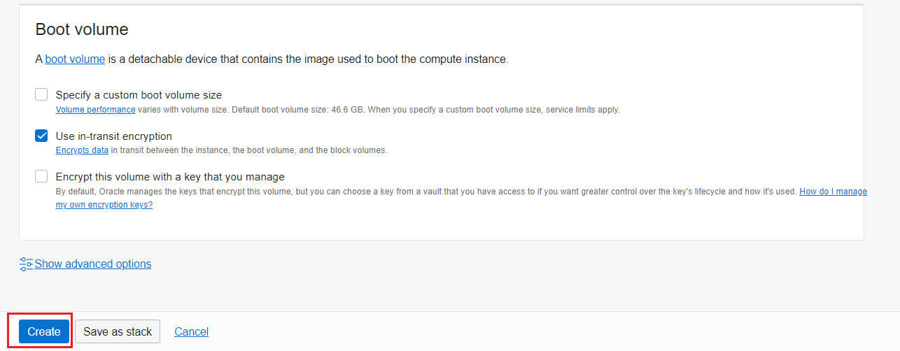
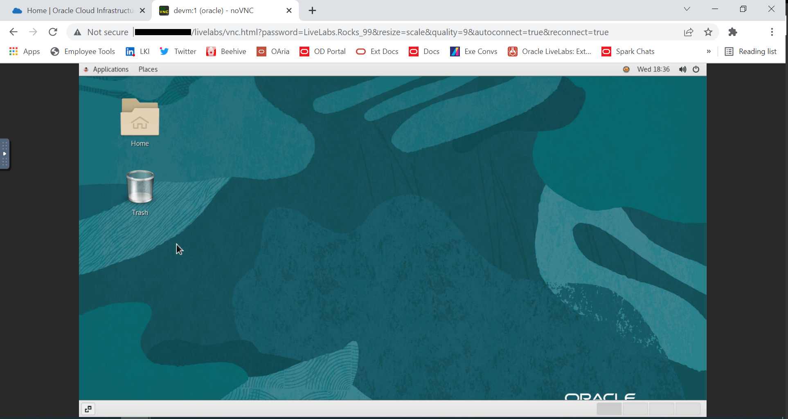
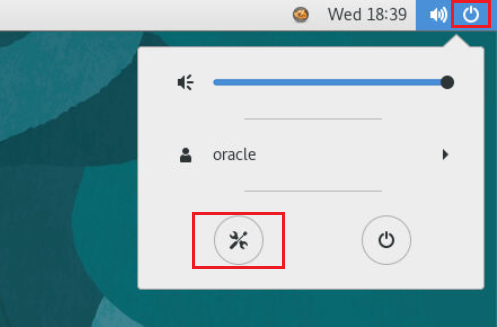
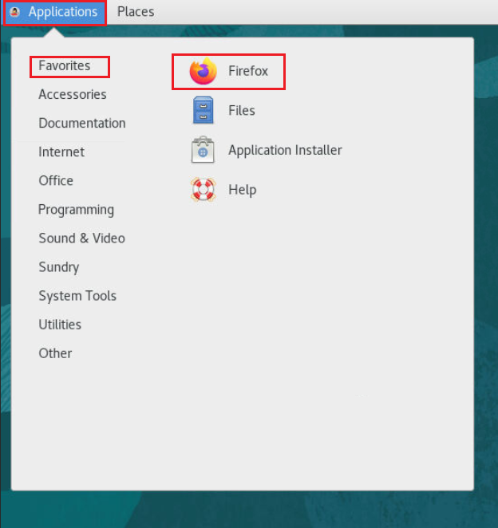
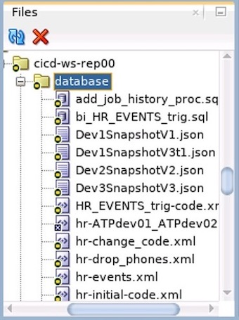

# Capture Oracle Database Changes Introduction

## Introduction

Before we can start capturing any changes, we need an Oracle Database and a development environment to work on. The fastest way to get an Oracle Database up and running is to provision an Oracle Autonomous Database on Oracle Cloud Infrastructure. In the same way, the easiest way to put your hands on a sandbox with all the development tools necessary for this project, is to provision a Compute Instance using Oracle Cloud Developer Image.

{{ param }}

Estimated Lab Time: 60 minutes

### Objectives
In this lab, you will:
* Verify cloud network configuration
* Create compute resources on Oracle Cloud
* Prepare cloud infrastructure for development
* Provision Oracle Autonomous Database
* Update Git client and create a new GutHub repository
* Install Liquibase on compute node

### Prerequisites
* GitHub account
* Strong experience with SQLcl (or any SQL command line interface like SQL*Plus), and/or SQL Developer

## Task 1: Verify Virtual Cloud Network (VCN)

1. Login to Oracle cloud console using the Workshop Details received:

    - Login URL 	
    - Tenancy name
    - Region
    - User name
    - Initial password
    - Compartment 

2. Click on main menu ≡, then Networking > **Virtual Cloud Networks**. Select the Region and Compartment assigned in Workshop Details.

     

3. Click the name of the Virtual Cloud Network (VCN).

4. Under Subnets, click the name of the public subnet.

5. Under Security Lists, click the name of the existing security list. 

6. Review the Ingress Rules and Egress Rules defined in this security list.


## Task 2: Provision Compute node for development

1. Click on the following link to access to the customer image from [Oracle marketplace](https://bit.ly/3CxvsxA).

    

2. Click **Get App**.

    

3. Select **Commercial Market** and click **Sign in**.

    

4. In the next screen be dure that you have the correct information:

    - Region: Be sure you have the correct Region selected in the page header.
    - Version: 2.0 (3/4/2022) - default
    - Compartment: Be sure you have selected the correct one for this workshop purpose.
    - **Accept** the Oracle standard Terms and Restrictions
    - **Launch Instance**

    

5. Provide the following information:

    - Name: [Your Initials]-ClientVM (e.g. VLT-ClientVM)
    - Comparment: [Your Compartment]
    - Image and shape: default values, or ask instructor what shape is available.
    - Networking: default values.
    - Add SSH keys: save both Private Key and Public Key to your computer, in order to have SSH access.

    

    - Click **Create**

    
       
6. Wait for Compute Instance to finish provisioning, and have status Available (click browser Refresh button). 
On the Instance Details page, copy Public IP Address in your notes.

> Note: On the Instance Details page, copy **Public IP Address** in your notes.

7. Use your laptop web browser to open the URL returned by the script, replacing **[ClientVM public-ip address]** with the actual values. (If the URL doesn't work, give it a couple of minutes to start the graphical user interface).

    http://[ClientVM public-ip address]/livelabs/vnc.html?password=LiveLabs.Rocks_99&resize=scale&quality=9&autoconnect=true&reconnect=true

    

8. Check if your keyboard works. If you need to select another keyboard layout, click the **On-Off** button in the upper right corner, and **Settings** button. You will find the options under **Region & Language**.

    
    

9. Click Applications > Favorites > Firefox to launch the web browser on the ClientVM Compute Node remote desktop.

    
    
10. Navigate to **cloud.oracle.com**, and **login** to Oracle cloud console using your Cloud Account Name, User Name, and Password.

11. Open another Firefox tab and navigate to the lab guide at **bit.ly/CICDsql**. Use the lab guide on the ClientVM remote desktop to perform the following steps.


## Task 4: Provision Oracle Autonomous Database (ATP)

1. Click on main menu ≡, then Oracle Database > **Autonomous Transaction Processing**. Select the Region and Compartment provided in the Workshop Reservation page. Click **Create Autonomous Database**.

    - Select a compartment: [Your Compartment]
    - Display name: [Your Initials]Dev01 (e.g. VLTDev01)
    - Database name: [Your Initials]Dev01 (e.g. VLTDev01)
    - Choose a workload type: Transaction Processing
    - Choose a deployment type: Shared Infrastructure
    - Choose database version: 19c
    - OCPU count: 1
    - Storage (TB): 1
    - Auto scaling: disabled

2. Under Create administrator credentials:

    - Password: DBlearnPTS#21_

3. Under Choose network access:

    - Access Type: Allow secure access from everywhere

4. Choose a license type: Bring Your Own License (BYOL).

5. Click **Create Autonomous Database**. Wait for Lifecycle State to become Available.


## Task 5: Connect to your Autonomous Database

1. Click **DB Connection**, and download Instance Wallet using **Download Wallet** button.

    

2. Provide a password (use the same as for RD connection - DBlearnPTS#21_), and **Save File**.

3. Click **Applications** > **System Tools** > **Terminal** on the ClientVM Compute Node remote desktop. 

    

4. Open **Applications** > **Accessories** > **Text Editor**. Use this editor to replace **[Your Initials]** in the next commands with your initials, before running.

5. Wallet file was downloaded in folder `/home/oracle/Downloads/`. Create a new folder to place wallet files. Use **Shift+Ctrl+V** to paste commands in Terminal, and press **Enter** after them.

    ````
    <copy>
    mkdir /home/oracle/Wallet_[Your Initials]Dev01
    unzip /home/oracle/Downloads/Wallet_[Your Initials]Dev01.zip -d /home/oracle/Wallet_[Your Initials]Dev01/
    </copy>
    ````

6. Edit **sqlnet.ora** file in **Wallet_[Your Initials]Dev01** folder, and set the value of `DIRECTORY` to `${TNS_ADMIN}`.

    ````
    <copy>
    gedit Wallet_[Your Initials]Dev01/sqlnet.ora
    </copy>
    
    WALLET_LOCATION = (SOURCE = (METHOD = file) (METHOD_DATA = (DIRECTORY="${TNS_ADMIN}")))
    SSL_SERVER_DN_MATCH=yes
    ````

7. Click **Save** and close only the sqlnet.ora tab in Text Editor. Always leave the first tab with your notes open.

    

8. Set the `TNS_ADMIN` environment variable to the directory where the unzipped credentials files.

    ````
    <copy>
    export TNS_ADMIN=/home/oracle/Wallet_[Your Initials]Dev01
    </copy>
    ````

9. Get service names for your instance from **tnsnames.ora** file.

    ````
    <copy>
    cat /home/oracle/Wallet_[Your Initials]Dev01/tnsnames.ora
    </copy>
    ````

10. Verify the connectivity using SQL*Plus, using the TP service. If the connection works, exit. Replace `[Your Initials]` with your initials. Use **Shift+Ctrl+V** to paste commands in Terminal, and press **Enter** after them. If the connection is successful, you can continue with the next task.

    ````
    <copy>
    sqlplus admin/DBlearnPTS#21_@[Your Initials]dev01_tp
    exit
    </copy>
    ````


## Task 6: Install HR Sample Schema

For this simple CICD example, we will capture database changes from the HR sample schema.

1. Download Oracle Sample Schemas installation package from GitHub.

    ````
    <copy>
    wget https://github.com/oracle/db-sample-schemas/archive/v19c.zip
    </copy>
    ````

2. Unzip the archive.

    ````
    <copy>
    unzip v19c.zip
    </copy>
    ````

3. Open the unzipped folder.

    ````
    <copy>
    cd db-sample-schemas-19c
    </copy>
    ````

4. Run this Perl command to replace `__SUB__CWD__` tag in all scripts with your current working directory, so all embedded paths to match your working directory path.

    ````
    <copy>
    perl -p -i.bak -e 's#__SUB__CWD__#'$(pwd)'#g' *.sql */*.sql */*.dat
    </copy>
    ````

5. Go back to the parent folder (this should be `/home/oracle`).

    ````
    <copy>
    cd ..
    </copy>
    ````

6. Create a new folder for logs.

    ````
    <copy>
    mkdir logs
    </copy>
    ````

7. Connect to the **ATPdev01** ATP service as **admin**. Replace `[Your Initials]` with your initials.

    ````
    <copy>
    sqlplus admin/DBlearnPTS#21_@[Your Initials]dev01_tp
    </copy>
    ````

8. Run the HR schema installation script. For more information about [Oracle Database Sample Schemas](https://github.com/oracle/db-sample-schemas) installation process, please follow the link. Replace `[Your Initials]` with your initials.

    ````
    <copy>
    @db-sample-schemas-19c/human_resources/hr_main.sql DBlearnPTS#21_ DATA TEMP DBlearnPTS#21_ /home/oracle/logs/ [Your Initials]dev01_high
    </copy>
    ````

9. When finished, exit SQL*Plus.


## Task 7: Connect to your ATP using SQL Developer

1. Create a new connection in SQL Developer to Dev01 ATP. You can find SQL Developer on the Compute Node under **Applications** > **Programming** main menu.

    - Name: hr@Dev01ATP
    - Username: hr
    - Password: DBlearnPTS#21_
    - Save Password: enabled
    - Connection Type: Cloud Wallet
    - Configuration File: click Browse and select Wallet_[Your Initials]Dev01.zip in Downloads folder.
    - Service: [Your Initials]dev01_tp

2. Click Test, make sure it returns 'Success', and Save.

3. Click Connect.

4. Verify HR schema objects. Copy and paste the following query in SQL Developer Worksheet, and click Run Statement .

    ````
    <copy>
    select object_name, object_type from user_objects order by 2,1;
    </copy>
    ````

5. Click **View** on SQL Developer main menu, and click **Files**. This dialog will be used to see your project files during development.

    

6. If files are modified outside SQL Developer, you need to click the `database` folder and **Refresh** icon  to show those changes.


## Task 8: Update Git Client

GitHub uses Git version control systems (VCS) to handle the collaboration workflow. This allows developers to create a local copy of the project, makes changes, and merge them back into the central repository.

1. Existing Git client is old, we need to update to a newer version (e.g. 2.28.1). Use Terminal to run these commands.

    ````
    <copy>
    sudo yum -y install curl-devel expat-devel gettext-devel openssl-devel zlib-devel gcc perl-ExtUtils-MakeMaker
    </copy>
    ````

2. Remove old Git client.

    ````
    <copy>
    sudo yum -y remove git
    </copy>
    ````

3. Download and unpack new Git client files.

    ````
    <copy>
    cd /usr/src
    
    sudo wget --no-check-certificate https://mirrors.edge.kernel.org/pub/software/scm/git/git-2.28.1.tar.gz
    
    sudo tar xzf git-2.28.1.tar.gz 
    </copy>
    ````

4. Perform new Git client installation.

    ````
    <copy>
    cd git-2.28.1
    
    sudo make prefix=/usr/local/git all
    
    sudo make prefix=/usr/local/git install
    </copy>
    ````

5. Add Git client path to `/etc/profile`.

    ````
    <copy>
    sudo sh -c 'printf "\nexport PATH=\$PATH:/usr/local/git/bin\n" >> /etc/profile'
    </copy>
    ````

6. Confirm Git client was updated.

    ````
    <copy>
    cd ~
    export PATH=$PATH:/usr/local/git/bin
    git --version
    </copy>
    git version 2.28.1
    ````


7. Use the Terminal on the Remote Desktop connection as **oracle** user to configure Git client to save your Git user name and email address. Replace `[GitHub username]` with your GutHub user name and `[GitHub email]` with your GitHub email address.

    ````
    <copy>
    git config --global user.name "[GitHub username]"
    git config --global user.email [GitHub email]
    </copy>
    ````

8. Configure Git client to save credentials for 8 hours.

    ````
    <copy>
    git config --global credential.helper 'cache --timeout 28800'
    </copy>
    ````

9. Create a new GitHub repository **cicd-ws-rep00**, and clone it on your compute node.

    ````
    <copy>
    cd ~
    git clone https://github.com/[GitHub username]/cicd-ws-rep00.git
    </copy>
    ````


## Task 9: Install Liquibase

1. Access the website, and find the URL for the latest stable Liquibase release for Linux x64. 

2. Download and unzip Liquibase in oracle's home folder on the development machine.

    ````
    <copy>
    wget https://github.com/liquibase/liquibase/releases/download/v4.3.2/liquibase-4.3.2.tar.gz
    </copy>
    ````

3. Create a new folder and unpack Liquibase files.

    ````
    <copy>
    mkdir liquibase4.3.2
    tar -xvf liquibase-4.3.2.tar.gz -C liquibase4.3.2/
    </copy>
    ````

4. Add a symbolic link to Liquibase executable command to oracle's binary files.

    ````
    <copy>
    mkdir /home/oracle/.local/bin
    ln -s /home/oracle/liquibase4.3.2/liquibase /home/oracle/.local/bin/liquibase
    ln -s /usr/local/git/bin/git /home/oracle/.local/bin/git
    </copy>
    ````

5. Check if Liquibase is running and get version.

    ````
    <copy>
    liquibase --version
    </copy>
    ````

6. Create a properties file in your GitHub repository folder.

    ````
    <copy>
    cd ~/cicd-ws-rep00
    gedit liquibase.properties
    </copy>
    ````

7. Use the following properties for Liquibase. Replace `[Your Initials]` with your initials. 

    ````
    <copy>
    driver : oracle.jdbc.OracleDriver
    classpath : /usr/lib/oracle/19.13/client64/lib/ojdbc8.jar
    url : jdbc:oracle:thin:@[Your Initials]dev01_high?TNS_ADMIN=/home/oracle/Wallet_[Your Initials]Dev01
    username : hr
    password : DBlearnPTS#21_
    changeLogFile : database/hr-master.xml
    </copy>
    ````

    > **Note** : This file contains:
    > - driver - driver class name
    > - classpath - path for your database driver
    > - url - Oracle JDBC connect string
    > - username - database user
    > - password - database password
    > - changeLogFile - relative path to your Liquibase master changelog

8. Edit `ojdbc.properties` file to set connection properties. 

    ````
    <copy>
    cd ~
    gedit Wallet_[Your Initials]Dev01/ojdbc.properties
    </copy>
    ````

9. We have to make 3 changes:
    - Comment out the `oracle.net.wallet_location` line. 
    - Use `TNS_ADMIN` environment variable value in `javax.net.ssl.trustStore` and `javax.net.ssl.keyStore`. 
    - Set `javax.net.ssl.trustStorePassword` and `javax.net.ssl.keyStorePassword` to the wallet password.
    - You can add all `javax.net.ssl` lines at the end of the file.

    ````
    #oracle.net.wallet_location=(SOURCE=(METHOD=FILE)(METHOD_DATA=(DIRECTORY=${TNS_ADMIN})))
    javax.net.ssl.trustStore=${TNS_ADMIN}/truststore.jks
    javax.net.ssl.trustStorePassword=DBlearnPTS#21_
    javax.net.ssl.keyStore=${TNS_ADMIN}/keystore.jks
    javax.net.ssl.keyStorePassword=DBlearnPTS#21_
    ````


## Acknowledgements
* **Author** - Valentin Leonard Tabacaru, PTS
* **Last Updated By/Date** -  Valentin Leonard Tabacaru, May 2021

## Need Help?
Please submit feedback or ask for help using our [LiveLabs Support Forum](https://community.oracle.com/tech/developers/categories/livelabsdiscussions). Please click the **Log In** button and login using your Oracle Account. Click the **Ask A Question** button to the left to start a *New Discussion* or *Ask a Question*.  Please include your workshop name and lab name.  You can also include screenshots and attach files.  Engage directly with the author of the workshop.

If you do not have an Oracle Account, click [here](https://profile.oracle.com/myprofile/account/create-account.jspx) to create one.
