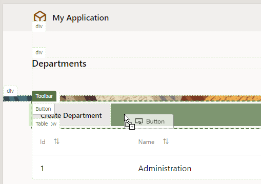
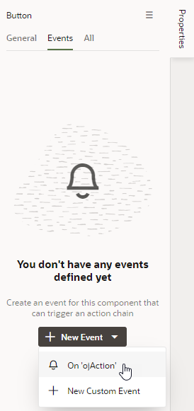
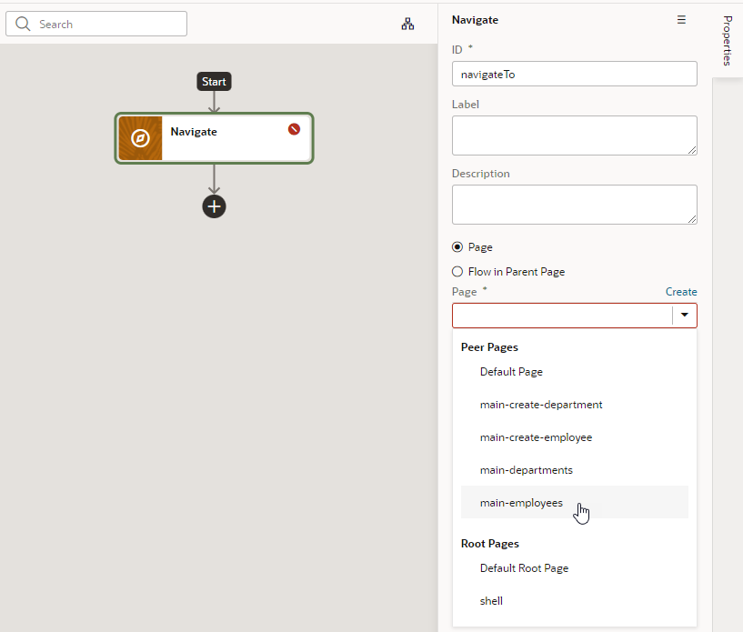
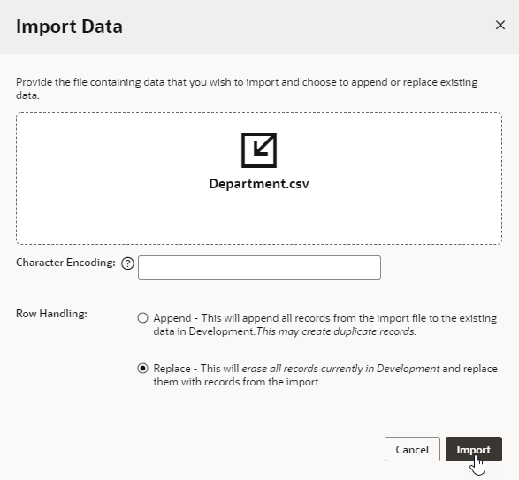
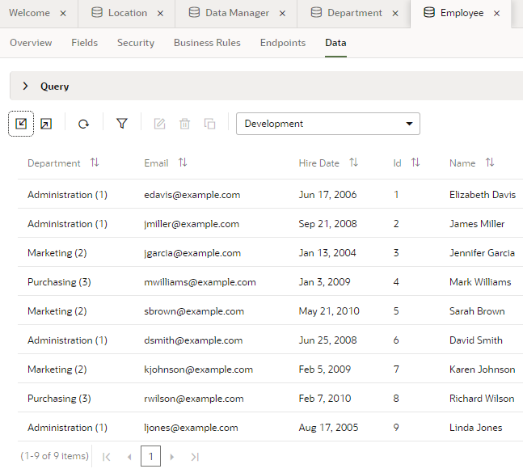

# Add Navigation and Data to Your Web App

## Introduction

This lab shows you how to how to set up navigation between pages in a web app. It also demonstrates other ways of adding data to your app.

Estimated Time: 10 minutes

### About this lab

Now that you've created the Department and Employee pages, you'll need to make sure users can navigate between these pages in your web app. You can do this by adding buttons that perform specific *actions* when you click them. In Visual Builder, this sequence of actions is known as an *action chain*. You can use and customize predefined actions or define your own. In this lab, you'll add buttons that take you from the Departments page to the Employees pages and back again. Each button is associated with an event that sets off a navigation action chain.

You'll also populate your app's business objects by importing data from a file. You did this for the Location business object in a previous lab; you'll do the same for the Department and Employee business objects in this lab.

## Task 1: Create an action chain to navigate from the Departments page to the Employees page

1.  Click the **Web Applications**  tab in the Navigator, and click **main-departments** under the **hrwebapp** and **main** nodes.
2.  Click the **Components** palette, then drag a **Button** under **Common** to the **Toolbar**, to the right of the **Create Department** button.

    

3.  Click **Properties** to open the Properties pane (if necessary), then in the **General** tab, change the **Text** field to `Display Employees`.
4.  Click the **Events** tab for the button, then click the **\+ New Event** button. From the menu, select **On 'ojAction'**, the default action suggested for a button click.

    

    An empty action chain with the ID **ButtonActionChain** is created.

5.  From the **Navigation** section of the Actions palette, drag the **Navigate** action to the **+** sign pointed to by the **Start** arrow.

6.  In the Navigate action's Properties pane, select **main-employees** from the **Page** drop-down list.

    

    The action now has the label `Navigate main-employees`.

7.  Click **Preview**  in the header to see how the pages will appear to the user.

8. When the application opens in a new browser tab, click **Create Department** and add another department (`IT` on `Floor 2`, for example), then click **Save**. A success message is displayed briefly.

9.  Click **Display Employees**, then click **Create Employee**. Add another employee, specifying the new department, and click **Save**.

  You'll notice there's no way to get back to the main-departments page from the main-employees page, something we'll fix in the next task. Close the browser tab.

## Task 2: Create an action chain to navigate from the Employees page to the Departments page

1.  In the Web Apps pane, click **main-employees** under the **hrwebapp** and **main** nodes. If necessary, click **Reload page**  to display the new employee you created.

2.  Drag a **Button** component from the Components palette into the **Toolbar**, to the right of the **Create Employee** button.
3.  In the Button's Properties pane, change the **Text** field to `Display Departments`.
4.  Click the **Events** tab for the button, then click the **+ New Event** button and select **On 'ojAction'**.

    Another empty action chain with the ID **ButtonActionChain** is created. Because this action chain is for a different page, it doesn't matter that it has the same name as the one for the main-departments page.

5.  Drag the **Navigate** action from the **Navigation** section of the Actions palette to the **+** sign pointed to by the **Start** arrow.

6.  In the Navigate action's Properties pane, select **main-departments** from the **Page** drop-down list.

    The action now has the label `Navigate main-departments`.

7.  Click **Preview**  to test the pages and navigation. When the application opens in another browser tab, make sure you can get to the Departments page from the Employees page. Then close the browser tab.

8. In the Web Apps pane, click **main**, then **Diagram** to view the application's modified page flow. With the main-departments page selected, you'll see two navigation icons ( ) appear on the main-employees page, indicating that you can now navigate from main-departments to main-employees and back.

    

## Task 3: Import Data for the Business Objects

Let's now add data for the Department and Employee business objects. Instead of using the Data Manager to import data, this time you'll use each business object's **Data** tab to do the same thing.

1.  Click [this link](https://objectstorage.us-ashburn-1.oraclecloud.com/p/1Mz1ckG1ORhQmDHfpV7bZofGoCI3zOieZfUeYVcqkVFFifJO6muyWFTaz-4xQ7kH/n/c4u03/b/oci-library/o/WMS4121Department.csv) to download the `Department.csv` file containing six departments.
2.  Click [this link](https://objectstorage.us-ashburn-1.oraclecloud.com/p/CuAsioap8QTLRdQviVqKgkH-D5kFa0q3X45vTu1R0sMw9IPsKFzyXQz5T4d919vS/n/c4u03/b/oci-library/o/WMS4121Employee.csv) to download the `Employee.csv` containing nine employees.
3.  In the Navigator, click the **Business Objects**  tab, then click the **Objects** tab.

4.  Click **Department**, then click the **Data** tab. The departments you created are displayed.

5.  Click **Import from File** .

6.  In the Import Data dialog box, select the **Replace** option for **Row Handling** if it's not already selected. Then click the upload box, browse to select the `Department.csv` file, and click **Import**.

    

  (If you run into an error, delete the new department and the new employee you created in the previous task, then try the import again.)

  Click **Close** after the file has been successfully imported. Six departments are displayed in the table.
    

7.  Click **Employee** under Business Objects, then click the **Data** tab.

8.  Click **Import from File** .

9.  In the Import Data dialog box, select the **Replace** option for **Row Handling** if it's not already selected. Then click the upload box, browse to select the `Employee.csv` file, and click **Import**.

  Click **Close** after the file has been successfully imported. Nine employees are displayed in the table.

    

## Acknowledgements

* **Author** - Sheryl Manoharan, Visual Builder User Assistance
* **Last Updated By** - February 2022
