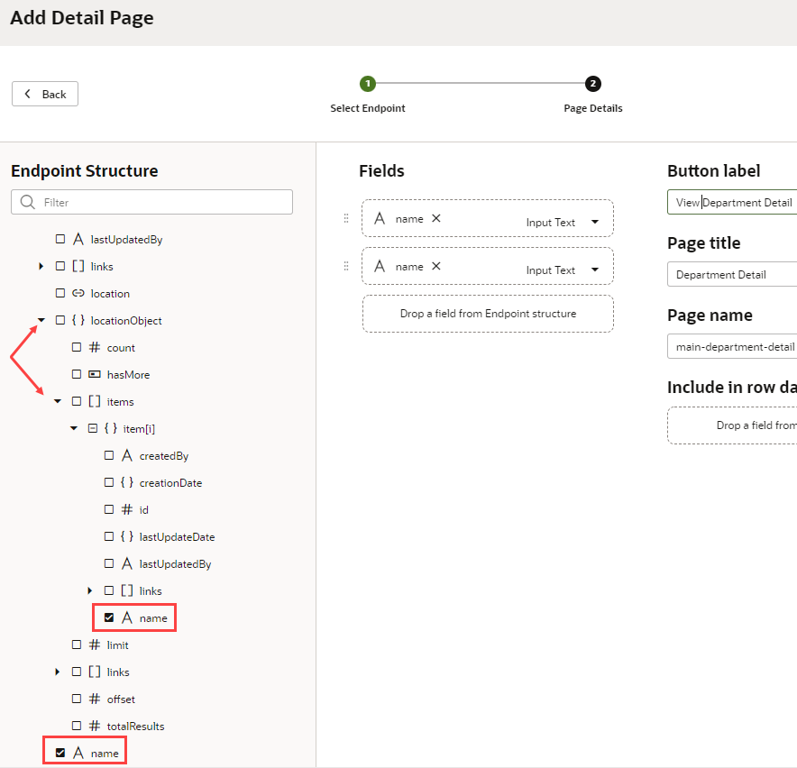
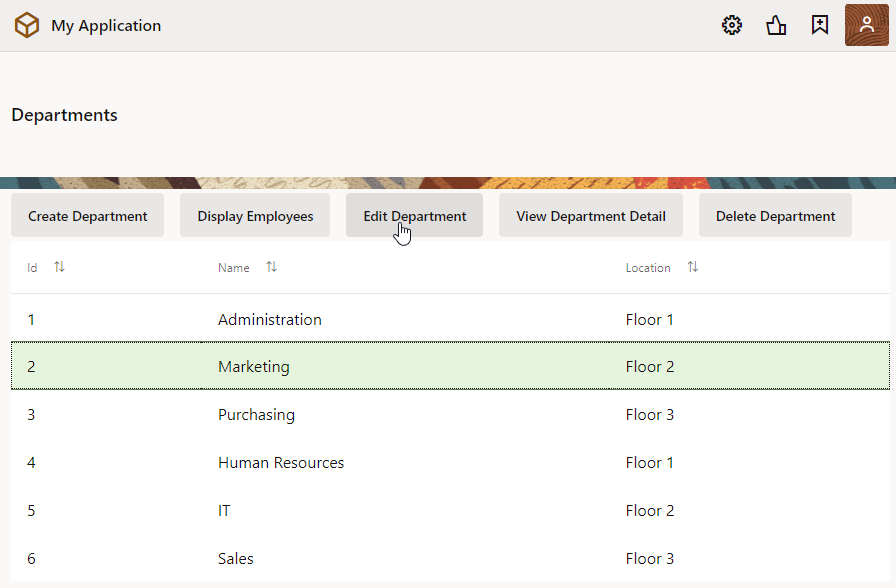
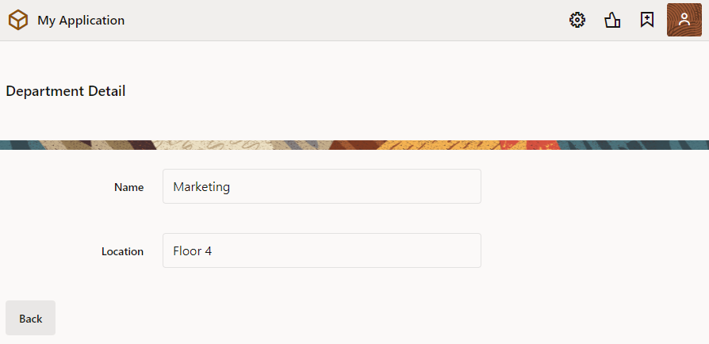
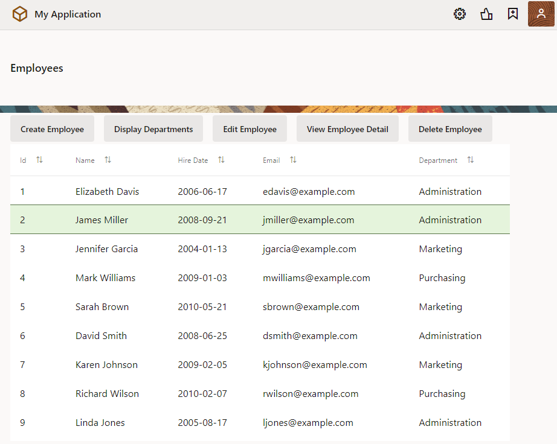

# Add Pages for Working with Data

## Introduction

This lab shows how you can create pages and buttons that allow you to edit data, view details of data, and delete data in a table.

Estimated Time:  15 minutes

### About this lab

In a previous lab, you used a couple of Quick Starts to create pages that let your users add departments and employees. In this lab, you'll use the rest of them to add pages for users to edit and delete departments and employees. You'll also get a chance to test your web pages as they will appear to the user.

## Task 1: Add a page to edit a department's details

An Edit page lets you edit a row in your table. In this task, you'll add an edit page that lets users change a department's Name and Location.

1.  Click the **Web Applications**  tab, then select the **main-departments** page. Click the **Page Designer** tab, then select the **Table** component on the page. If necessary, click **Reload page**  to view the new departments.
2.  In the Table's Properties pane, click the **Quick Start** tab to display the Quick Start menu, then click **Add Edit Page**.

    

3.  On the Select Read Endpoint page, select **Department** under Business Objects (if necessary) and click **Next**.

4.  On the Select Update Endpoint page, select **Department** under Business Objects (if necessary)  and click **Next**.

5.  On the Page Details page, select **location** (**name** is already selected) and click **Finish**.

    An **Edit Department** button is displayed in the toolbar on the main-departments page. The button is inactive.

## Task 2: Add a page to view a department's details

A Detail page lets you view additional details of a row in your table. In this task, you'll add a detail page for users to see more information about each of your departments.

1.  In the Quick Start menu, click **Add Detail Page**.

2.  On the Select Endpoint page, select **Department** under Business Objects (if necessary) and click **Next**.

3.  On the Page Details page, select **name**. Expand the **locationObject** and **items** nodes (**item\[i\]** is expanded automatically) and select **name**. With this selection, both the department's name and location will show as additional details for the user. Change the Button label field to View Department Detail. Click **Finish**.  

  

    A **View Department Detail** button is displayed in the toolbar on the main-departments page. The button is inactive.

4.  Click **Live**, select a row, then click the **View Department Detail** button to open the main-department-detail page.

5.  Click **Design** to return to Design view.

6.  Click the **Input Text** field for the second **Name** label to open the Input Text's Properties pane. In the **General** tab, change the **Label Hint** value to `Location`.

## Task 3: Add a button to delete a department

A Delete button lets you delete a selected row in your table. In this task, you'll add a delete button to remove a department if you wanted.

1.  Return to the **main-departments** page. Click the **Quick Start** tab if necessary, and click **Add Delete Action**.

2.  On the Select Endpoint page (the only page of the Quick Start), select **Department** under Business Objects (if necessary) and click **Finish**.

    A **Delete Department** button is displayed in the toolbar on the main-departments page. The button is inactive.

## Task 4: Test your new Department pages

Now, let's test your web pages.

1.  Click **Preview**  to test the new pages.

    The application opens in another browser tab. The three buttons you created are inactive.

2.  Select a row. All the buttons are now active.

3.  Click **Edit Department**.

    

4.  On the Edit Department page, change the **Location** field to `Floor 4` and click **Save**. A success message appears briefly, and you are returned to the Departments page.
5.  Select the row again and click **View Department Detail** to display the data.

    

6.  Click **Back**.

7.  Click **Create Department** and specify the name and location of a new department, then click **Save**. A success message appears. The new department is displayed in the table.

8.  Select the new department and click **Delete Department**. A success message appears. The department is no longer displayed.

9.  Close the browser tab.

## Task 5: Add a page to edit an employee's details

Now that we've added options to let users manage departments, we'll do the same for employees. In this task, you'll add an Edit page to update details of your employees.

1.  Go to the **main-employees** page, click the **Page Designer** tab and select the **Table** component. If necessary, click **Reload page**  to view the list of new employees.
2.  In the Properties pane, click **Quick Start** to display the Quick Start menu, then click **Add Edit Page**.

3.  On the Select Read Endpoint page, select **Employee** under Business Objects (if necessary) and click **Next**.

4.  On the Select Update Endpoint page, select **Employee** under Business Objects (if necessary) and click **Next**.
5.  On the Page Details page, select **hireDate**, **email**, and **department** (**name** is already selected). Click **Finish**.

    An **Edit Employee** button is displayed in the toolbar on the main-employees page. The button is inactive.

6.  Click **Live**, select a row, and click the **Edit Employee** button to open the main-edit-employee page.

7.  Click **Design** to go to Design view.

8.  Click within the form on the page but outside of a component (that is, in the **Form Layout** component on the page). In the **General** tab of the Properties pane, set the **Max Columns** value to **2**. The fields now appear in two columns.

## Task 6: Add a page to view an employee's details and a button to delete an employee

1.  Go to the **main-employees** page. If necessary, click the table, then click the **Quick Start** tab.
2.  In the Quick Start menu, click **Add Detail Page**.
3.  On the Select Endpoint page, select **Employee** under Business Objects (if necessary) and click **Next**.
4.  On the Page Details page, select **name**, **hireDate**, and **email**. Expand the **departmentObject** and **items** nodes (**item\[i\]** is expanded automatically) and select **name**. Change the Button label field to View Employee Detail, then click **Finish**.

    A **View Employee Detail** button is displayed in the toolbar on the main-employees page. The button is inactive.

5.  Now click **Add Delete Action** in the Quick Start menu.

6.  On the Select Endpoint page, select **Employee** under Business Objects (if necessary) and click **Finish**.

    A **Delete Employee** button is displayed in the toolbar on the main-employees page. The button is inactive.

7.  Click **Live**, select a row, and click the **View Employee Detail** button to open the main-employee-detail page.

8.  Click the **Design** button.

9.  Click the **Input Text** component for the second **Name** label to open the Input Text's Properties pane. Change the **Label Hint** value to `Department`.

10.  Click within the form on the page but outside of a component (that is, in the **Form Layout** component on the page). In the **General** tab of the Properties pane, set the **Max Columns** value to **2**.

## Task 7: Test your Employee pages

1.  Click **Preview** .

    The application opens in another browser tab, displaying the Departments page.

2.  Click **Display Employees**.

    The three buttons you created are inactive.

3.  Select a row. All the buttons are now active.

    

4.  Click the **Edit Employee** button.

5.  On the Edit Employee page, change the **Department** field to `IT` and click **Save**. A success message appears, and you are returned to the Employees page.

6.  Select the row again and click **View Employee Detail** to display the data, then click **Back**.

7.  Click **Create** and specify the data for a new employee, then click **Save**. A success message appears, and the new employee is displayed in the table.

8.  Select the new employee and click **Delete Employee**. A success message appears. The employee is no longer displayed.

9.  Close the browser tab.

## Acknowledgements

* **Author** - Sheryl Manoharan, Visual Builder User Assistance
* **Last Updated By** - February 2022
