# Create a Web Application

## Introduction

This lab shows you how to use Visual Builder to create a basic web application and populate it with business objects.

Estimated Time:  15 minutes

### About this lab

Visual Builder, as the name suggests, is a *visual* development tool for web and mobile applications. It provides a rich graphical user interface that lets you design and develop applications by dragging and dropping _components_ on a page. Each component depends on a _business object_ for its data. A business object is just a resource—like a purchase order or invoice—that has fields to hold your application's data. It is similar to a database table, as it provides the structure for your data; in fact, business objects are stored in a database. Your application accesses the data in these business objects through  REST endpoints that Visual Builder generates for you.

In this lab, you'll create the Employee, Department, and Location business objects to build a simple Human Resources application. Each business object has its own set of fields as shown here:

Once you have your business objects, you'll use them to build the HR web app in which every employee belongs to a department, and every department has a location. Your goal is to allow your users to add employee names and their departments to the database, and to change that data when necessary.

> **Note:** Although this workshop uses business objects to build a web application, you can also build Visual Builder applications based on REST services that expose other data sources. The basic principles of creating applications are the same, no matter what form your data takes.

## Task 1: Create a web app

The first thing we'll do is create the web application itself. Later, we'll construct the business objects we need so we can populate the app with data.

1.  In the web browser, log in to Visual Builder.
    -   If you don't have any applications, the landing page appears. Click **+ New Application**.

        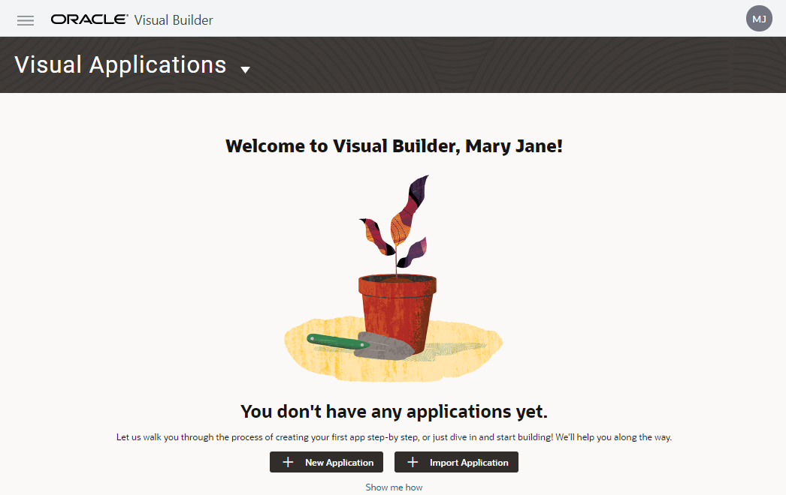

    -   If you have one or more current applications, the Visual Applications page shows you a list of them. Click **New**.

        

2.  In the Create Application dialog box, enter:

    -   **Application Name**: `HR Application`
    -   **Description**: `Tutorial application`

    The **Application ID** text field is automatically populated as you type, based on the Application Name. The **Application Template** field is set to Empty Application.

3.  Click **Finish**.

    The application is created and opens on the Welcome page.

    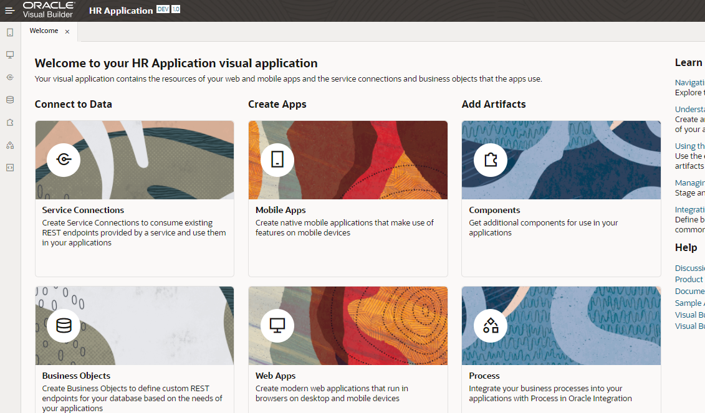

    The Welcome page contains sets of tiles in three groups: Connect to Data, Create Apps, and Add Artifacts. On the far left are icons representing Mobile Applications, Web Applications, Services, Business Objects, Components, Processes, and Source. This vertical toolbar is the Navigator.

    Now take note of the header elements:
    

    The `DEV` and `1.0` tags next to the application name on the left indicate the application status (DEV for development) and version. Elements on the right let you perform various actions. For example, you can undo your most recent change, redo a change after clicking Undo, or search for a file. This workshop primarily demonstrates the options to preview your app and publish changes.

4.  We want to create a web app, so under **Create Apps**, click **Web Apps**.

    The Navigator opens in the Web Apps pane.

5.  Click **+ Web Application** (or the **+** sign at the top of the pane).

    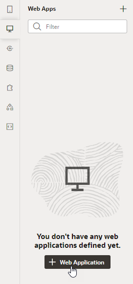

6.  In the Create Web Application dialog box, enter `hrwebapp` in the **Application Name** field under General Information. (You can specify uppercase as well as lowercase characters in the application name, but the name is converted to lowercase.) Leave the **Navigation Style** set to the default, **None**, and click **Create**.

    The application opens on the main-start page, which is automatically created for you. This is also the default name assigned to your application's home page. By convention, a page name has its flow name as a prefix. This simple application uses only the **main** flow. More complex applications can have more than one flow.

    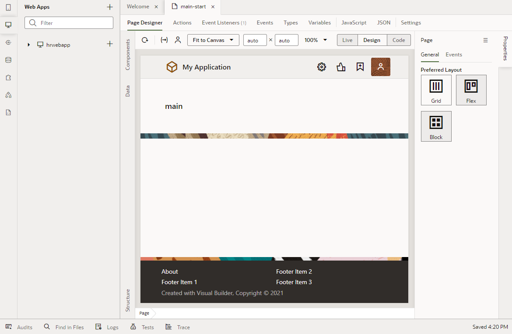

    What you see under the **main-start** tab is your application's work area. Just under **main-start** are several horizontal tabs: Page Designer, Actions, Event Listeners, and so on. By default, the page opens in the Page Designer, showing the Components, Data, and Structure tabs on the left. To design your pages, you'll drag components from the Components palette to the canvas. Once you add components, the structure of your components will show in the Structure view.

    On the far right is the Properties pane, which lets you view or edit a component's properties. When the entire page is selected (as it is now), the Properties pane shows the Page view, where you can choose a preferred page layout. Click **Properties** (the vertical tab located along the right-most edge of your browser) to hide the Properties pane and expand your work area.

    You can also move different panes to customize your work area. For example, right-click **Structure** at the bottom of your work area, then select **Move to Top Left** to move the Structure view right under **Components** and **Data**.

    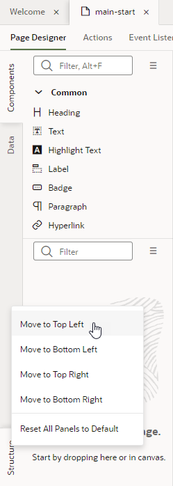

    Lastly, expand the **hrwebapp** and **main** nodes in the Web Apps pane to get a tree view of your web application.

## Task 2: Create a Location business object and import data

Let's create your first business object and add data to it by importing a CSV file. Every business object needs data associated with it, and there are many ways to do that, as you'll see.

1.  Click the **Business Objects**  tab in the Navigator.
2.  Click the **\+ Business Object** button.
3.  In the New Business Object dialog box, enter `Location` in the **Label** field. `Location` is also filled in automatically as the **Name** value. Click **Create**
4.  Click the **Fields** tab.

    Every business object you create has five default fields: an ID, plus fields that provide information on who created and updated the object and when.

    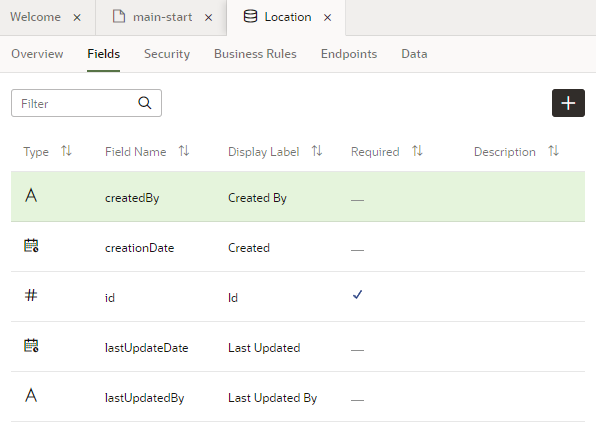

5.  Click **\+** and select **Field** to add a field specific to this business object. This is a very simple business object, so we'll add only one new field.
6.  In the pop-up box, enter:

    -   **Label**: `Name`
    -   **Field Name**: `name` (automatically populated)
    -   **Type**: **String**  (selected by default)

    Click **Create Field**.

    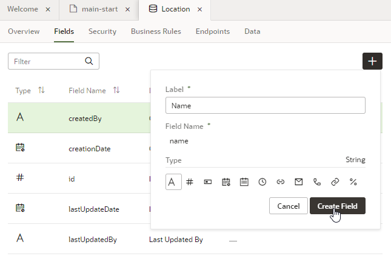

7.  If necessary, click the **Properties** tab on the right to view the **Name** field's properties, then select the **Required** check box under **Constraints**.

    

    You can see that there's now a check mark in the **Required** column for the **Name** field.

8.  Click [this link](https://objectstorage.us-ashburn-1.oraclecloud.com/p/CSv7IOyvydHG3smC6R5EGtI3gc1vA3t-68MnKgq99ivKAbwNf8BVnXVQ2V3H2ZnM/n/c4u04/b/livelabsfiles/o/solutions-library/Location.csv) to download the `Location.csv` file. This file contains four locations and  provides the data for the Location business object.

9.  In the Navigator's Business Object pane, click **Menu**  and select **Data Manager**. The Data Manager is what you use to import data from a variety of sources.

    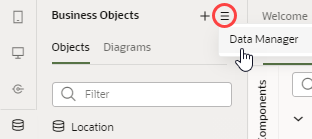

10.  Click **Import from File**.

    

11.  In the Import Data dialog box,  click the upload box, browse to select `Location.csv`, and click **Import**.

    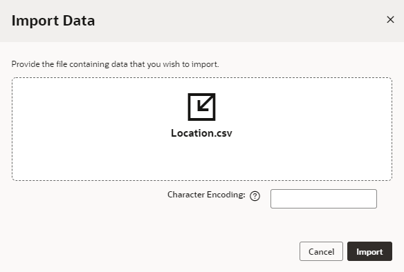

    When the import succeeds, click **Close**.

12.  In the Business Objects pane, click **Location**, then click the **Data** tab to view the locations.  

    

    In the next task, we'll associate these locations with departments.

## Task 3: Create a Department business object

Create the Department business object, which will have fields to show a department's name and location. In this task, you'll set up the department's Location field to pull in data from the Location business object you created in the previous task, but you won't actually add data to the Department business object just yet.

1.  In the Business Objects pane, click the **+** sign, then select **Business Object**.

    

2.  In the New Business Object dialog box, enter `Department` in the **Label** field and click **Create**. `Department` is also filled in automatically as the **Name** value.
3.  Click the **Fields** tab, then **\+** and select **Field**.
4.  In the pop-up box, enter:

    -   **Label**: `Name`
    -   **Field Name**: `name` (automatically populated)
    -   **Type**: **String**  (selected by default)

    Click **Create Field**.

5.  In the **Name** field's properties, select the **Required** check box under **Constraints**.

    A check mark is displayed in the **Required** column for the **Name** field.

6.  Click **\+** and select **Field** again, then enter or select:

    -   **Label**: `Location`
    -   **Field Name**: `location` (automatically populated)
    -   **Type**: **Reference** 
    -   **Referenced Business Object**: `Location`
    -   **Display Field**: **Name** (automatically populated)

    The default for a **Referenced Business Object** is always the current business object (in this case, Department), so make sure you select **Location** from the drop-down.

    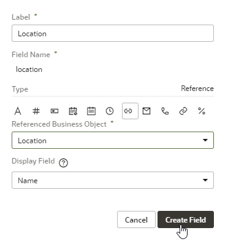

    Click **Create Field**.

    A Reference field is like a foreign key in a database table: it's a field that refers to the key (the Id field) of another business object to link the two business objects together. When you create a department, you'll specify its Location (one of the floors). The Display Field indicates that the Name field will be displayed, not the Id.

## Task 4: Create an Employee business object

In this task, we'll create the last business object we need, the Employee object, containing the employee's name and identifying data. In this case, the Employee has a Reference type field to  refer to the Department business object.

1.  In the Business Objects pane, click the **+** sign, then select **Business Object**.

2.  In the New Business Object dialog box, enter `Employee` in the **Label** field and click **Create**. `Employee` is also filled in automatically as the **Name** value.
3.  Click the **Fields** tab, then click **\+** and select **Field**.
4.  In the pop-up box, enter:

    -   **Label**: `Name`
    -   **Field Name**: `name` (automatically populated)
    -   **Type**: **String**  (selected by default)

    Click **Create Field**.

5.  In the **Name** field's properties, select the **Required** check box under **Constraints**.
6.  Click **\+** and select **Field** again, then enter or select:

    -   **Label**: `Department`
    -   **Field Name**: `department` (automatically populated)
    -   **Type**: **Reference** 
    -   **Referenced Business Object**: `Department`
    -   **Display Field**: **Name** (automatically populated)

    Click **Create Field**.

7.  Click **\+** and select **Field** again, then enter or select:

    -   **Label**: `Hire Date`
    -   **Field Name**: `hireDate` (automatically populated)
    -   **Type**: **Date** 

    Click **Create Field**.

8.  Click **\+** and select **Field** again, then enter or select:

    -   **Label**: `Email`
    -   **Field Name**: `email` (automatically populated)
    -   **Type**: **Email** 

    Click **Create Field**.

9.  Now that we've created the fields we need, click the **Endpoints** tab to view the Resource APIs and REST endpoints created for the Employee business object. Because Employee refers to Department, you'll  see endpoints for both objects if you expand the **departmentObject** node.   

    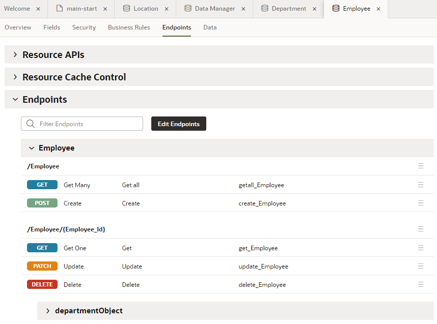

    If you click an endpoint, **getall_Employee** for example, an endpoint viewer allows you to perform operations on the endpoints. For example, you can test requests and view responses with specified parameter values:

    

    Click  Endpoints to return to the main Endpoints page.

    Expand the **Resource APIs** node to see the URLs for accessing the metadata and data for the business object, then collapse it again.

## Task 5: Create a business object diagram

Now that we have our business objects, let's create a diagram that provides a visual representation of business objects and their relationships.

1.  In the Business Objects pane of the Navigator, click the **Diagrams** tab, then click the **\+ Business Object Diagram** button.

    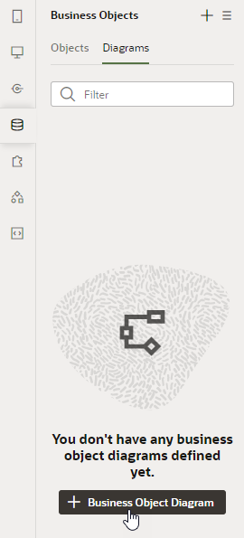

2.  In the Create Business Object Diagram dialog box, enter `HRDiagram` in the **Diagram name** field and click **Create**.

3.  In the Properties pane, click **Select All** next to Business Objects to see the three business objects you created and their relationships.

    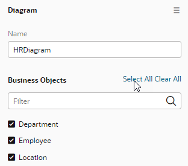

    The diagram looks just like the graphic in the Before You Begin section.

## Acknowledgements

* **Author** - Sheryl Manoharan, Visual Builder User Assistance
* **Last Updated By** - February 2022
