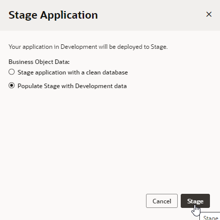
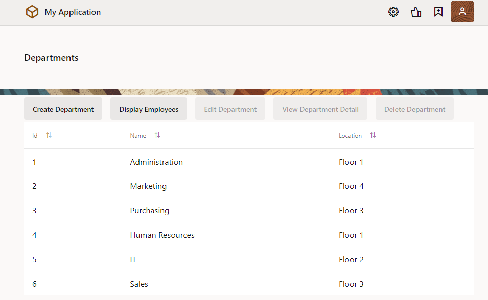
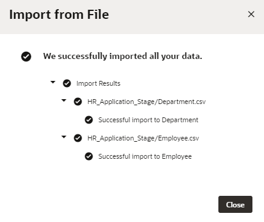
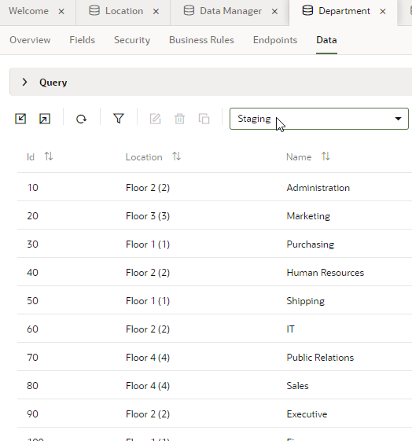
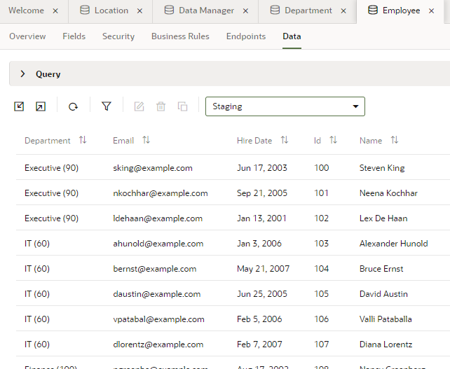
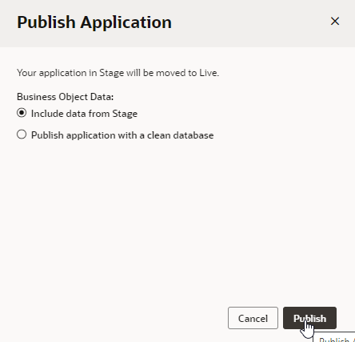

# Stage and Publish an Oracle Visual Builder Web Application

## Introduction

This lab shows you how to stage and publish your web app.

Estimated Lab Time:  10 minutes

### Background

So far in this workshop, you've built the HR web application to show employees, their departments, and locations. Now that your work designing the app is more or less complete, you can stage it to allow team members to test it thoroughly. After testing is complete, you can publish the application and make it available to users.

Visual Builder provides different databases for the development, staging, and live phases of an application. You can use an empty database for the staging or live phase, you can transfer data from one to another, or you can import specific data for each.

This lab shows you how to stage, publish, and access those apps within the Designer. You can also perform these operations from the application's Options menu on the Visual Applications page.

## Task 1: Stage the Application

Stage the application so that other users can test its behavior.

1.  Click the **Menu**  icon in the header and select **Stage**.

    

2.  In the Stage Application dialog box, select the **Populate Stage with Development data** option and click **Stage**.

    

    The application is staged, and its status as shown in the header changes from `DEV` to `STAGE`.

3.  From the header **Menu** , click **Open Staged Application**.

    

    The staged application opens in a new browser tab. The tables are populated with the data from Development.

    

4.  Make a note of the application's URL to share with your team.

    When you have finished using the application, close the browser tab to return to the application in the Designer.

## Task 2: Import Data Into the Application

To add more records to your data in the staging database, let's import data for the Department and Employee business objects from a zip file.

1.  Click [this link](https://objectstorage.us-ashburn-1.oraclecloud.com/p/kcwuO0EddkCHQQnigbOXMoxJDD4xNLT6azZzK_dRbejWKG5XHRVra7DUO6K2dF2V/n/c4u04/b/solutions-library/o/HR_Application_Stage.zip) and save the `HR_Application_Stage.zip` file. The zip file contains CSV files of the Department and Employee business objects of the HR Application schema, with more records and data.
3.  In the Navigator, click the **Business Objects**  tab, then click **Menu**  and select **Data Manager**.

    

4.  From the drop-down list in the upper right corner, select **Staging** to import the data into the staging database.  

    

5.  Click **Import from File**.
6.  In the Import Data dialog box, click the import box, select `HR_Application_Stage.zip`, and click **Import**. When the import succeeds, click **Close**.

    

7.  In the Business Objects pane, click **Department**.
8.  Click the **Data** tab if necessary, then select **Staging** from the drop-down list to view the new departments.

    

9.  Click **Employee**, then click the **Data** tab and select **Staging** to view the new employees.

    

## Task 3: Publish the Application

After you have successfully tested the staged application, you can publish it and make the application live. The live application is visible to users with proper credentials.

1.  Click the **Menu**  icon in the header and select **Publish**.
2.  In the Publish Application dialog box, select the **Include data from Stage** option and click **Publish**.  

    

    The application is now live. Notice the status change in the header next to the application name.

3.  From the header **Menu** , click **Open Published Application**.

    

    The application opens in a new browser tab. The schema and the data from the staging database are copied to the live database.

    To open your live app from the Visual Builder Home page, click **ORACLE Visual Builder** in the header to go to the Visual Applications page. Locate the HR Application, click **Live** in the Status column, then select **hrwebapp** to open the app.

    

4.  Make a note of your application's URL. You can now share this URL with public users. Remember to close the browser tab when you're done using the application.

    After your application is published, you will no longer be able to make changes to it. To do that, you'll need to create a new version from the application's Options menu on the Visual Applications page. This creates a development version of the app for you to work on while the published version stays live. Once you are ready to go live with your updates, you'll need to re-stage and re-publish the new version.

    That's it for this workshop! If you want, click the user menu in the top-right corner and select Sign Out from the menu.

## Acknowledgements
* **Author** - Sheryl Manoharan, Visual Builder User Assistance
* **Last Updated By** - November 2021
