# Register an Oracle Database with External Database Service 

## Introduction

You can manage and monitor Oracle Databases that are located outside of Oracle Cloud Infrastructure (OCI) using OCI's External Database service. External Database allows you to use cloud-based tools such as Database Management with your external databases. External Database can be used with both single-instance Oracle Databases and Oracle RAC instances.

Follow **Task 1** to manually register the databases with External Database Service or **Task 2** to register the databases with External Database Service using Terraform and Resource Manager.

Estimated Time: 30 minutes

### Objectives

-   Manually register the Container Databases (CDBs) and Pluggable Databases (PDBs) with External Database Service.
-   Register the Container Databases (CDBs) and Pluggable Databases (PDBs) with External Database Service using Terraform and Resource Manager.
-   After registering databases enable Database Management service. 

### Prerequisites

This lab assumes you have already completed the following:
- Lab: Generate SSH Key (FreeTier and Paid accounts)
- Lab: Environment Setup or Verify Setup
- Lab: Setup pluggable databases and workload
- Lab: Prerequisite: Create a dynamic group and policies for agent communication
- Lab: Download and Install the Management Agent Software


[external-db.zip](https://objectstorage.us-ashburn-1.oraclecloud.com/p/_j5vXRKIH_lA41DLVe2QbSkRv18caPSAW3B7rYfX7aQBZVX_7Lnl1Q706tEHxXXa/n/orasenatdpltintegration01/b/database-management-lab/o/external_database.zip) - Packaged terraform database registration script.


## Task 1: Register External Databases

1.  Log in to the Oracle Cloud Console, click the **Navigation Menu** in the upper left, navigate to **Oracle Database**, and select **External Database**.

	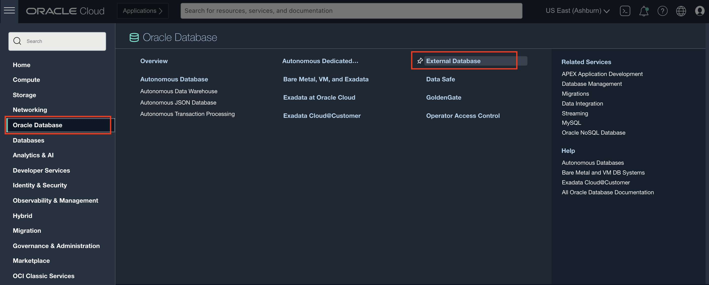

2.  On the left panel click **Container Databases** and then click **Register External Container Database**.

	

3.  Select the **Compartment**. Enter ORCL for **Container database display name:**. Click **Register**.

	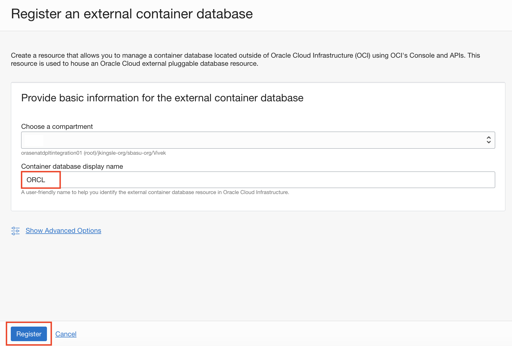

4.  This will take you to **External Container Database Details** page. Click **Connect to External Container Database**.

	

5.  On the **Connect to an external container database** page enter following:

     **Connector display name:** CDB-CON

     **Connector agent ID:** Select **dbm_demo**
     
     **DNS hostname or SCAN name:** workshop.subnet1.labvcn.oraclevcn.com
     
     **Port:** 1521
     
     **Service:** ORCL
     
     **Username:** SYSTEM
     
     **Password:** Ora_DB4U
     
     **Credential name prefix:** orcl
     
     **Role:** Select **Default**

     Click **Connect to External Container Database**.

	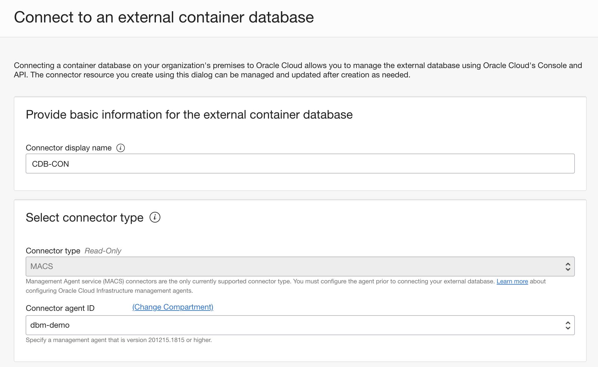
	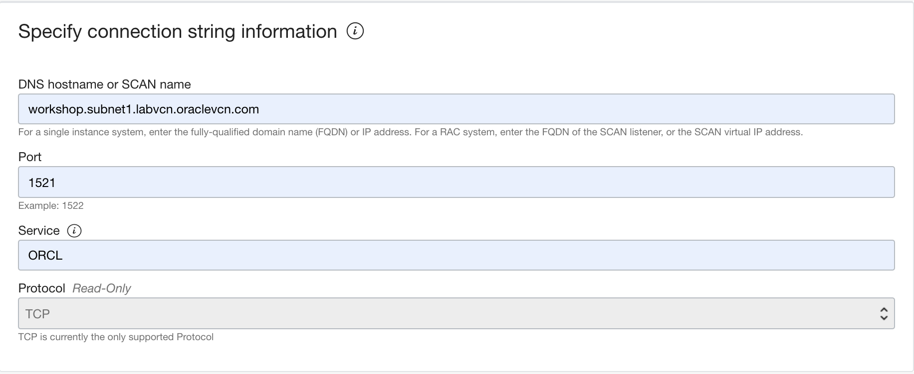     
	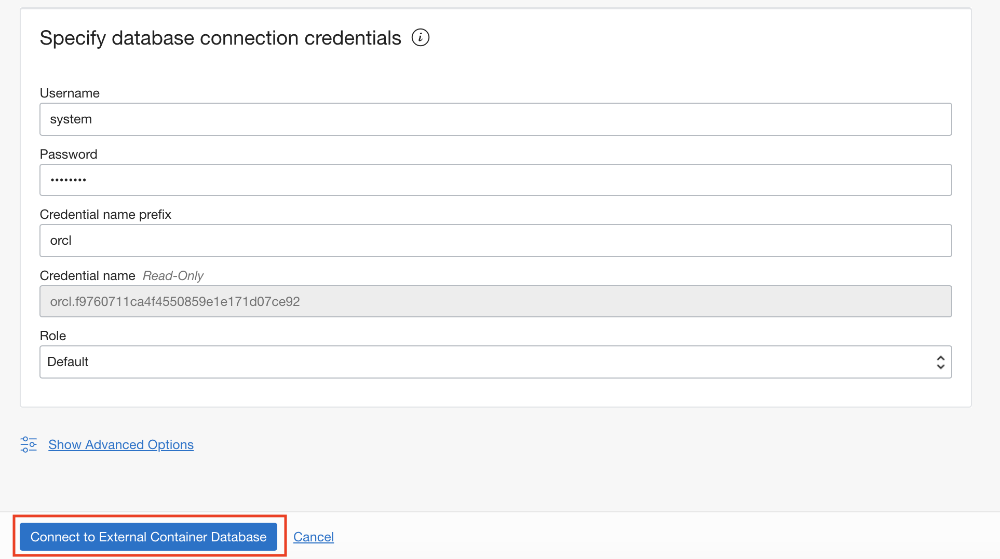

     This will take a few minutes to register your Container Database as External Container Database.

6.  Go to **External Container Database Details** page and confirm that the External Container Database is **AVAILABLE**.

	

7.  On the **External Container Database Details** page, scroll down and on the left panel under **Resources** click **External Pluggable Databases** and then click **Register External Pluggable Database**.

	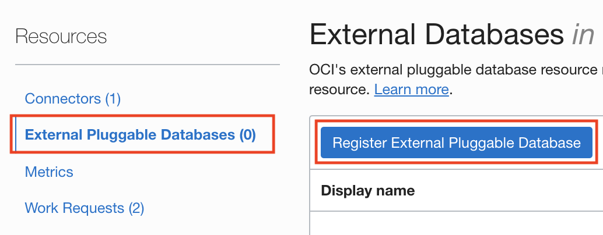

8.  On the **Register an external pluggable database** page, select the compartment name. Enter **MFG** for **Database display name** and click **Register**.

	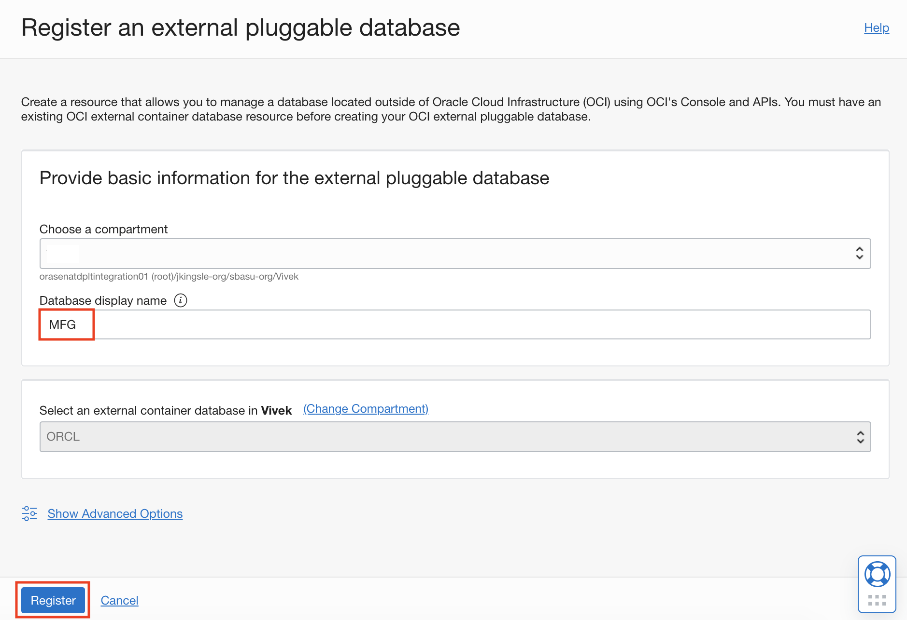

9.  This will take you to **External Pluggable Database Details** page. Click **Connect to External Pluggable Database**.

	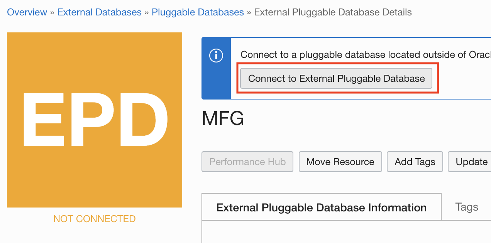

10.  On the **Connect to an external pluggable database** page, enter following:

     **Connector display name:** MFG

     **Connector agent ID:** Select **dbm_demo**
     
     **DNS hostname or SCAN name:** workshop.subnet1.labvcn.oraclevcn.com
     
     **Port:** 1521
     
     **Service:** MFG
     
     **Username:** SYSTEM
     
     **Password:** Ora_DB4U
     
     **Credential name prefix:** mfg
     
     **Role:** Select **Default**

	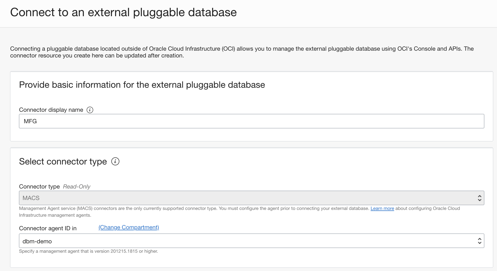
	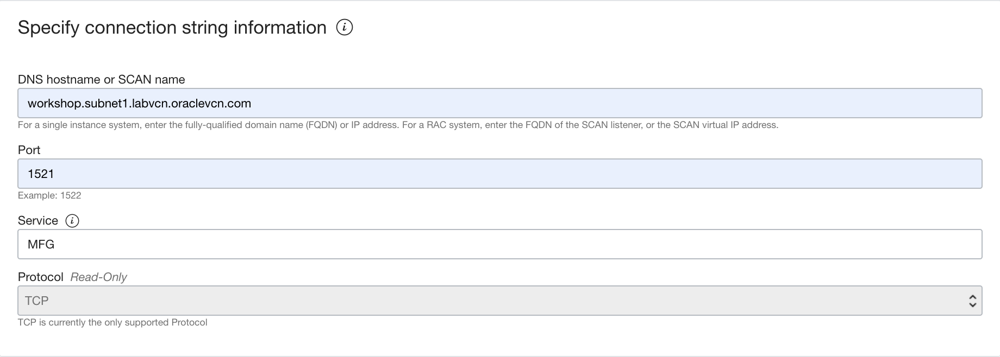
	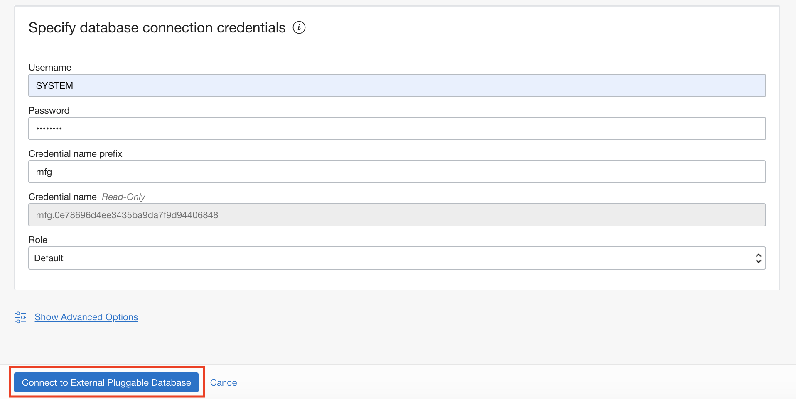

     Click **Connect to External Pluggable Database**.

     This will take a few minutes to register your Pluggable Database as External Pluggable Database.

11.  Go to **External Pluggable Database Details** page and confirm that the External Pluggable Database is **AVAILABLE**.

	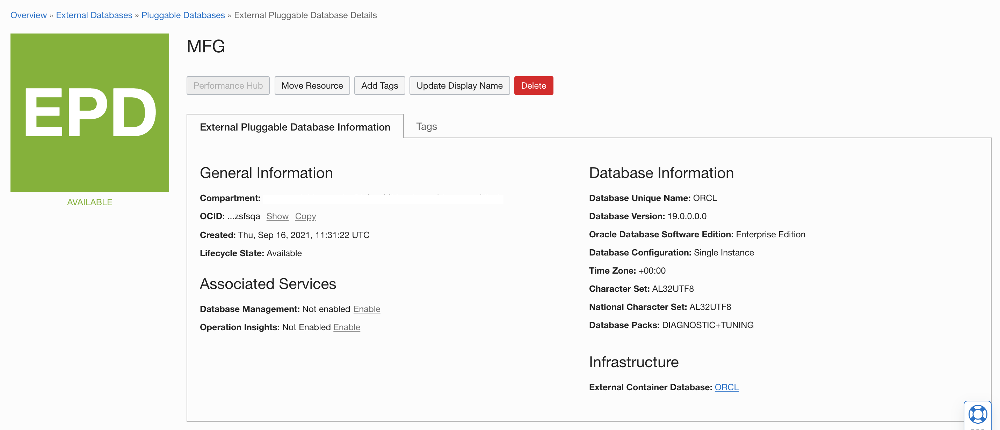

12.  Perform steps 7 to 11 to add other pluggable databases with these service names - **FINANCE**, **SALES**, **HRSTAGE** and **HRUAT**.

13.  On Oracle Cloud Console, click the **Navigation Menu** in the upper left, navigate to **Oracle Database** and click **External Database**. Verify all pluggable databases are registered under External pluggable databases.

     

     Congratulations, your databases are registered ! 

     There is no need to perform Task 2 to 4 after registering your databases manually.
     Directly go to **Task 5: Enable Database Management**

## Task 2: Register External Databases (Using Terraform)

1. Log in to the Oracle Cloud Console, click the **Navigation Menu** in the upper left, navigate to **Developer Services**, and select **Stacks**. 

	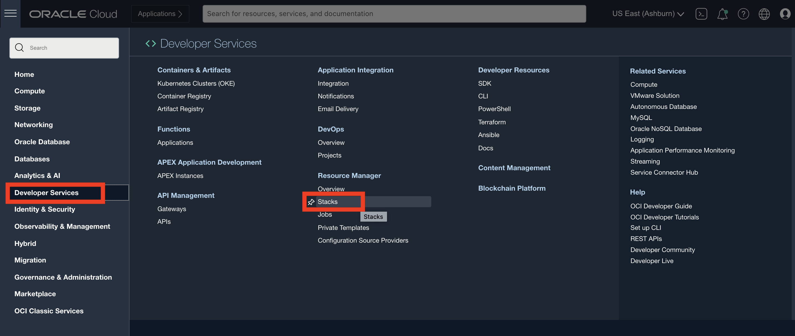

     

2. Check the **.zip file**, Click the **Browse** link and select the external database setup zip file (`external-db.zip`) that you downloaded. Click **Open** to upload the zip file.

     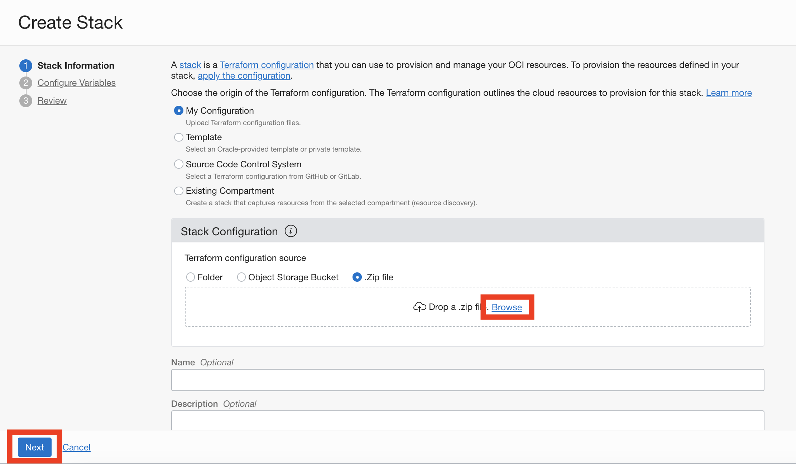

     Accept defaults and click **Next**.

3. Use the below details to fill up the variables,  and click **Next**. Verify management\_agent\_display\_name is set to Management Agent installed ealier. Hostname is the name of the compute instance provisioned ealier.

    ```
    <copy>
    management_agent_display_name = dbm_demo
    container_database_name = ORCL
    connector_credential_name = orcl.cred
    connector_username = SYSTEM
    connector_password = Ora_DB4U
    connector_role = NORMAL
    connector_hostname = workshop.subnet1.labvcn.oraclevcn.com
    connector_port = 1521
    connector_protocol = TCP
    connector_service = ORCL
    connector_name  = CDB-CON
    license_model = BYOL 
    </copy>
    ```
For pluggable\_databases array, copy the below values and paste under pluggable_databases field

    ```
    <copy>
    {
    "FINANCE" = {
      create_connector = true
      hostname = "workshop.subnet1.labvcn.oraclevcn.com"
      port = 1521
      protocol = "TCP"
      service = "FINANCE"
      credential_name = "fin.cred"
      username = "system"
      password = "Ora_DB4U"
      role = "NORMAL"
      connector_name = "fin"
    }

    "SALES" = {
      create_connector = true
      hostname = "workshop.subnet1.labvcn.oraclevcn.com"
      port = 1521
      protocol = "TCP"
      service = "SALES"
      credential_name = "sales.cred"
      username = "system"
      password = "Ora_DB4U"
      role = "NORMAL"
      connector_name = "sales"
    }

    "HRUAT" = {
      create_connector = true
      hostname = "workshop.subnet1.labvcn.oraclevcn.com"
      port = 1521
      protocol = "TCP"
      service = "HRUAT"
      credential_name = "hruat.cred"
      username = "system"
      password = "Ora_DB4U"
      role = "NORMAL"
      connector_name = "hruat"
    }

     "HRSTAGE" = {
      create_connector = true
      hostname = "workshop.subnet1.labvcn.oraclevcn.com"
      port = 1521
      protocol = "TCP"
      service = "HRSTAGE"
      credential_name = "hrstage.cred"
      username = "system"
      password = "Ora_DB4U"
      role = "NORMAL"
      connector_name = "hrstage"
    }
 
     "MFG" = {
      create_connector = true
      hostname = "workshop.subnet1.labvcn.oraclevcn.com"
      port = 1521
      protocol = "TCP"
      service = "MFG"
      credential_name = "mfg.cred"
      username = "system"
      password = "Ora_DB4U"
      role = "NORMAL"
      connector_name = "mfg"
    }
}
    </copy>
    ```

 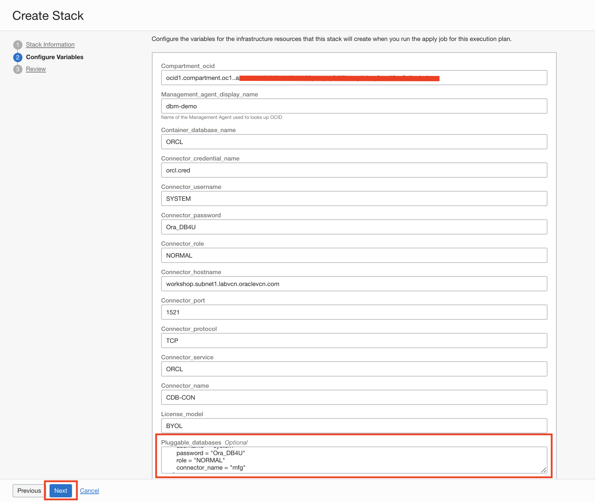

5. Click **Next**, review the data and click **Create**

     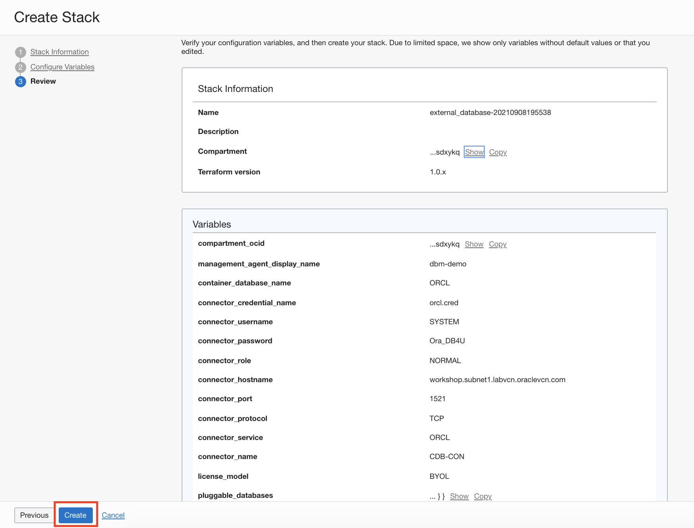

5. Your stack has now been created! Now you can create your environment. 
     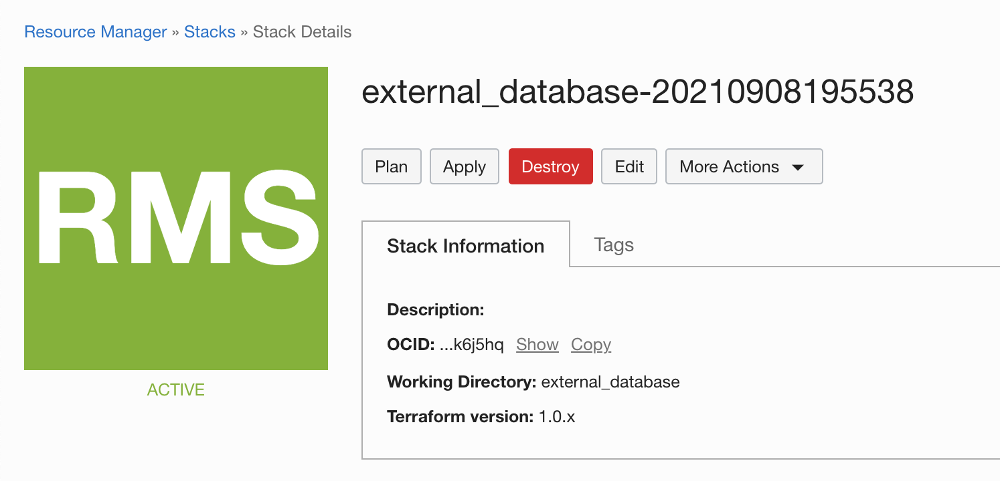

## Task 3: Terraform Plan (OPTIONAL)

When using Resource Manager to deploy an environment, execute a terraform **Plan** to verify the configuration. This is an optional step in this lab.

1.  [OPTIONAL] Click **Plan** to validate your configuration. This takes about a minute, please be patient.

     

     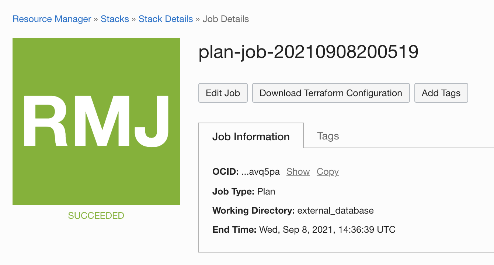

## Task 4: Terraform Apply

When using Resource Manager to deploy an environment, execute a terraform **Apply**. Let's do that now.

1.  At the top of your page, click **Stack Details**.  Click the button, **Apply**. This will register your Container and Pluggable Databases under External Database. This takes about 10 minutes, please be patient.

     

     

2.  Once this job succeeds, you will get an apply complete notification from Terraform. Congratulations, your databases are registered ! 

## Task 5: Enable Database Management

1.  Log in to the Oracle Cloud Console, click the **Navigation Menu** in the upper left, navigate to **Oracle Database**, and select **External Database**. Click **Pluggable Databases** and verify all pluggable databases are registered under External pluggable databases.

     

2.  Click the database registered under External pluggable databases to display **External Pluggable Database** Details.

     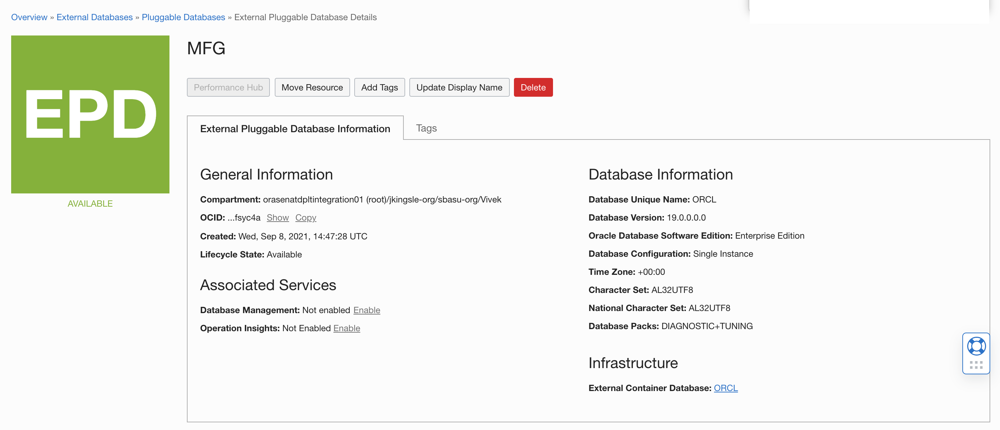 

3.  Click on **Enable** against Database Management.

     

4.  Select an external database connector  and click **Enable**.

     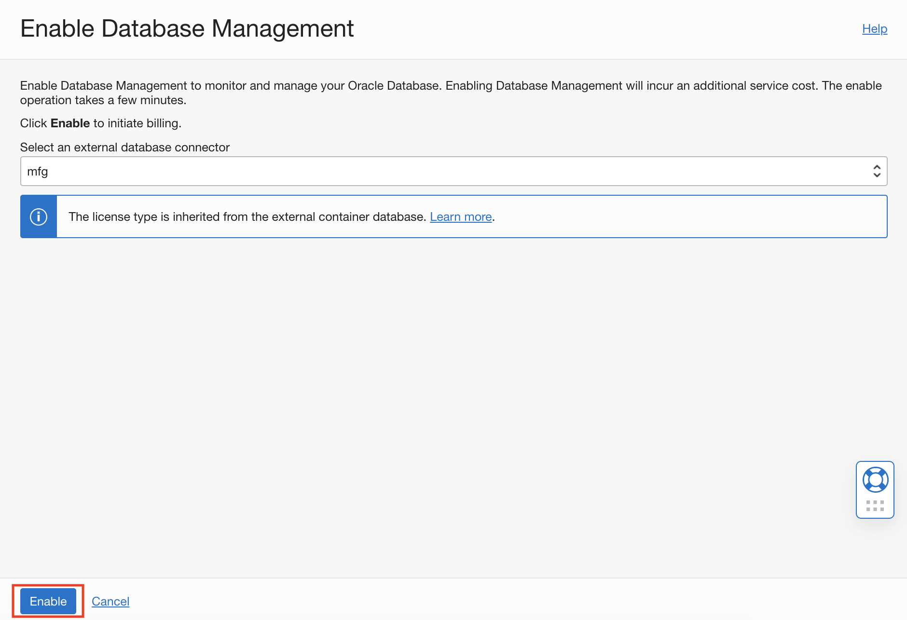

5.  Perform steps 4-6 for all pluggable databases registered under External pluggable databases.

6.  Under **External Databases**, click on **Container Databases** and verify container database is registered under External Container Databases.

     

7.  Click on the database registered under External Container Databases to display External Container Database Details.

     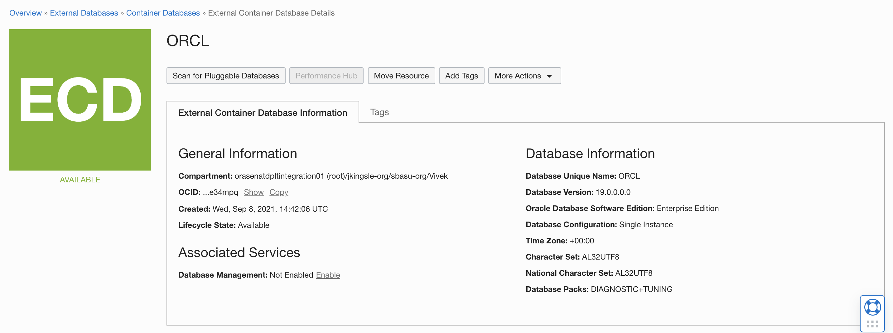

8. Click on **Enable** against Database Management.

     

9. Select **external database connector** and **choose a license type** - **Bring Your Own License (BYOL)**. Click **Enable**.

     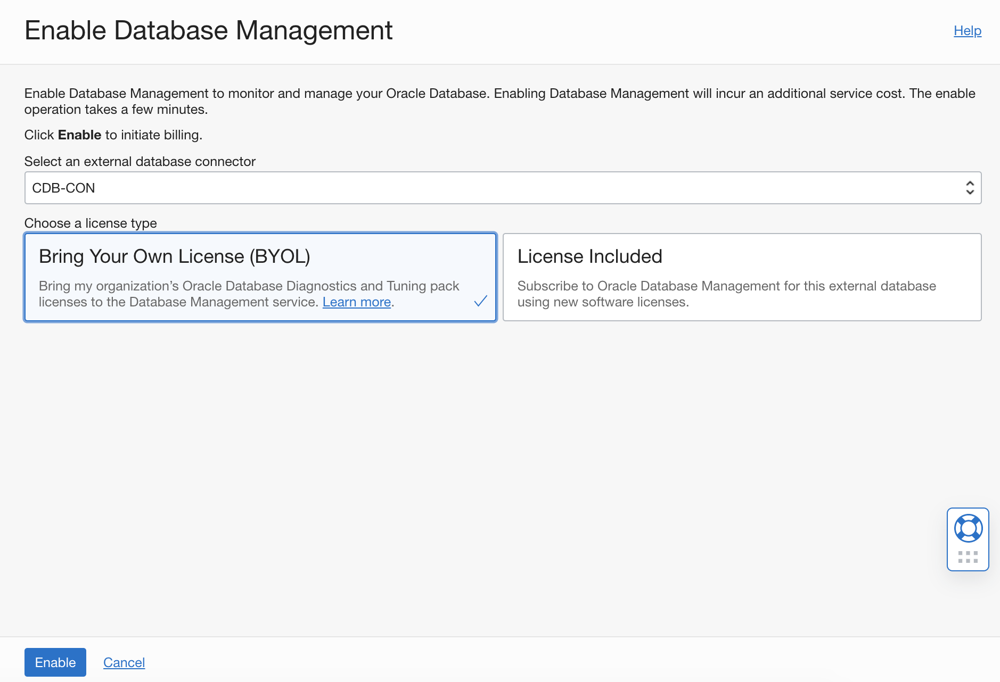

10. Now that we have some databases defined and the service configured, from the Cloud Console go back to the navigation menu and select the **Database Management** selection to monitor and manage the databases.

     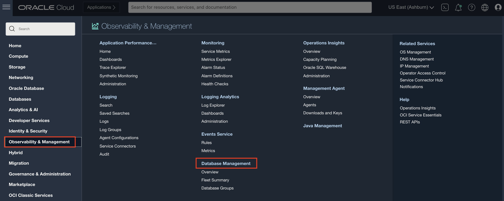

     


You may now proceed to the next lab.

## Acknowledgements

- **Author** - Vivek Verma, Principal Cloud Architect, North America Cloud Engineering
- **Contributors** - Vivek Verma, Sriram Vrinda, Pratima Chennupati
- **Last Updated By/Date** - Vivek Verma, September 2021
