# Configuring Auto Scaling

## Introduction

In this lab, we will build a load-balanced web application that can automatically scale out/in based on CPU utilization.  

We will create load balancer, compute instance, instance configuration, and then configure auto scaling. We will then verify auto scaling feature as configured threshold on CPU is crossed.

Autoscaling enables you to automatically adjust the number of compute instances in an instance pool based on performance metrics, such as CPU utilization. This helps you provide consistent performance for your end users during periods of high demand, and helps you reduce your costs during periods of low demand.

You select a performance metric to monitor, and set thresholds that the performance metric must reach to trigger an autoscaling event. When system usage meets a threshold, autoscaling dynamically allocates resources in near-real time. As load increases, instances are automatically provisioned: the instance pool scales out. As load decreases, instances are automatically removed: the instance pool scales in.

Autoscaling relies on performance metrics that are collected by the Monitoring service. These performance metrics are aggregated into one-minute time periods and then averaged across the instance pool. When three consecutive values (that is, the average metrics for three consecutive minutes) meet the threshold, an autoscaling event is triggered.

A cooldown period between autoscaling events lets the system stabilize at the updated level. The cooldown period starts when the instance pool reaches a steady state. Autoscaling continues to evaluate performance metrics during the cooldown period. When the cooldown period ends, autoscaling adjusts the instance pool's size again if needed.

*Note: OCI user interface is being updated, thus some screenshots in the instructions may be different than the actual UI*

## Task 1: Create VCN

1. Sign in using your tenant name, user name, and password. Use the login option under **Oracle Cloud Infrastructure**.
    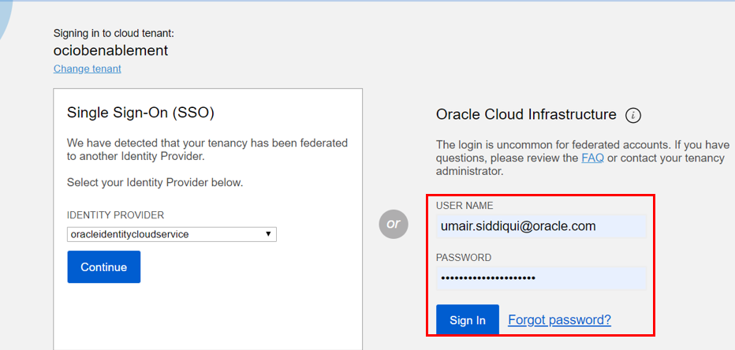

2. From the OCI Services menu, under **Networking**, click **Virtual Cloud Networks**. Select the compartment assigned to you from drop down menu on left part of the screen. Click **Start VCN Wizard**.

    *NOTE: Ensure the correct Compartment is selected under COMPARTMENT list.*

3. Click **VCN with Internet Connectivity** and click **Start VCN Wizard**.

4. Fill out the dialog box:

      - **VCN NAME**: Provide a name
      - **COMPARTMENT**: Ensure your compartment is selected
      - **VCN CIDR BLOCK**: Provide a CIDR block (10.0.0.0/16)
      - **PUBLIC SUBNET CIDR BLOCK**: Provide a CIDR block (10.0.1.0/24)
      - **PRIVATE SUBNET CIDR BLOCK**: Provide a CIDR block (10.0.2.0/24)
      - Click **Next**

5. Verify all the information and  Click **Create**.

6. This will create a VCN with the following components:

    *VCN, Public subnet, Private subnet, Internet gateway (IG), NAT gateway (NAT), Service gateway (SG)*

7. Click **View Virtual Cloud Network** to display your VCN details.

## Task 2: Create Load Balancer and Update Security List

*When you create a load balancer, you choose its shape (size) and specify subnets from different Availability Domains. This ensures that the load balancer is highly available.*

1. From OCI Services menu, under **Networking**, click **Load Balancers**.

2. Click **Create Load Balancer**. Fill out the dialog box;

    **Under Add Details**

    - **LOAD BALANCER NAME**: Enter a name for your load balancer.
    - **CHOOSE VISIBILITY TYPE**: Public
    - **CHOOSE THE MAXIMUM TOTAL BANDWIDTH**: Select **SMALL** 100Mbps. (This specifies the bandwidth of the load balancer.)

    ***NOTE:*** Shape cannot be changed later.

    - **VIRTUAL CLOUD NETWORK**: Choose your Virtual Cloud Network
    - **SUBNET**: Choose the **Public Subnet**

    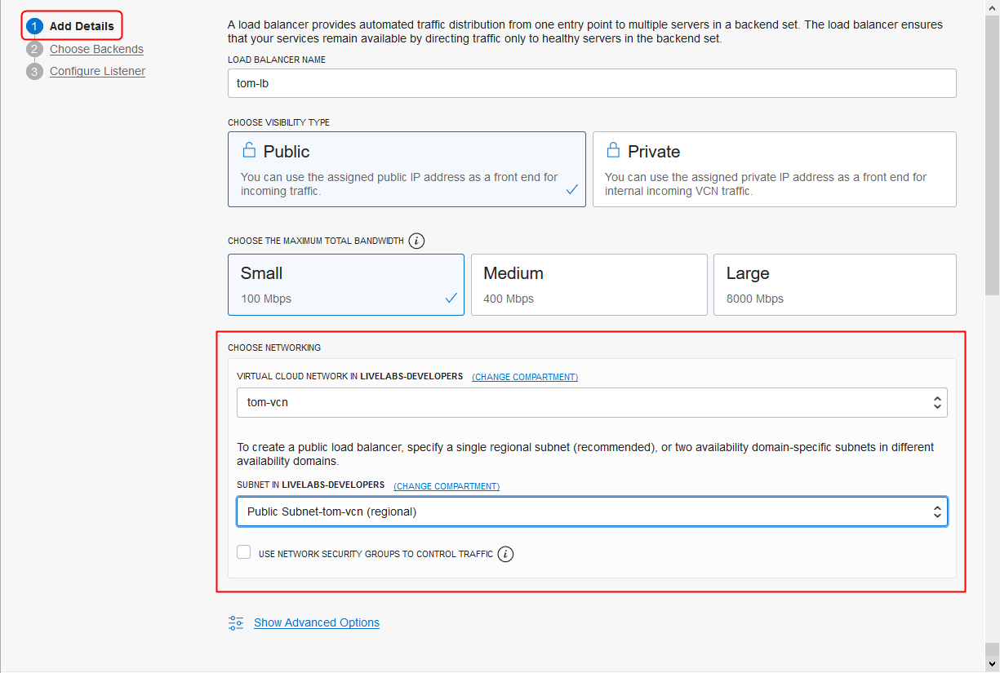

    Click **Next**.

    **Under Choose Backends:**

    - **SPECIFY A LOAD BALANCING POLICY**: Weighted Round Robin
    - **Add Backends**: Don't add any backend. This will be managed by the instance pool.

    **Under SPECIFY HEALTH CHECK POLICY**

    - **PROTOCOL**: HTTP
    - **Port**: 80
    - **URL PATH (URI)**: /

        *Leave other options as default*

    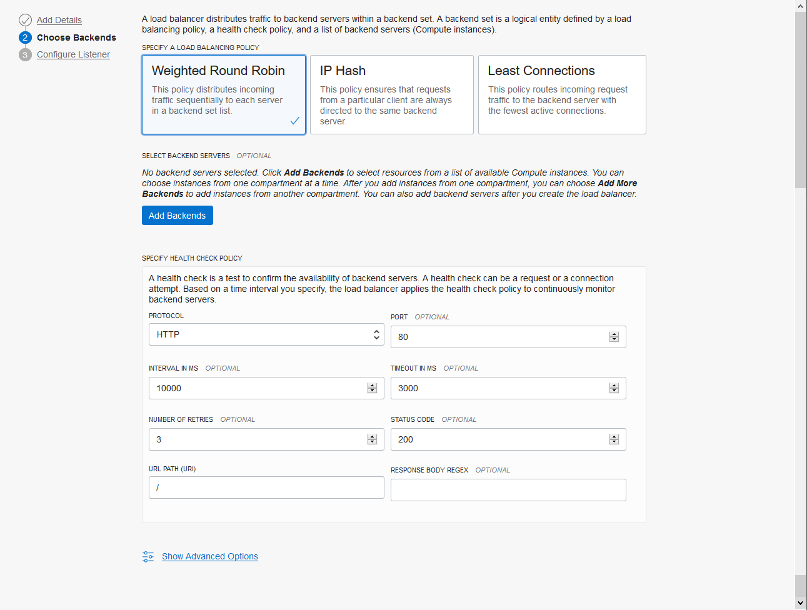

        Click **Next**.

    **Under Configure Listener**

    - **SPECIFY THE TYPE OF TRAFFIC YOUR LISTENER HANDLES**: HTTP
    - **SPECIFY THE PORT YOUR LISTENER MONITORS FOR INGRESS TRAFFIC**: 80

        *Leave other options as default*

    

3. Click **Submit** .

4. Wait for the load balancer to become active and then note down it’s public IP address.

5. From OCI Services menu, under **Networking**, click **Virtual Cloud Networks** . Locate the VCN you created earlier.

6. Click VCN name to display VCN Details page.

7. Click **Security Lists**, and locate the Default Security List.

8. Click **Default Security List for Your\_VCN**, click **Add Ingress Rules**.
Enter the following ingress rule:

      - Ensure to leave STATELESS flag un-checked
      - Source Type: CIDR
      - Source CIDR: Enter 0.0.0.0/0
      - IP Protocol: Select TCP
      - Source Port Range: All
      - Destination Port Range: Enter 80 (the listener port)

  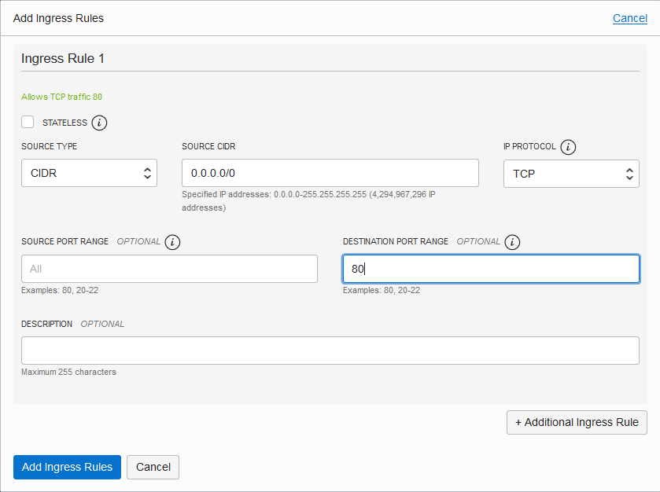

9. Click **Add Ingress Rules**.

## Task 3: Configure instance pool and auto scaling

1. Go to the OCI console. From OCI services menu, under **Compute**, click **Instances**.

2. Click **Create Instance**. Fill out the dialog box:

      - **Name your instance**: Enter a name
      - **Create in Compartment**: Choose the same compartment you used to create the VCN
      - **Choose an operating system or image source**: For the image, we recommend using the Latest Oracle Linux available.

3. Click **Show Shape, Network and Storage Options**:

      - **Availability Domain**: Select an availability domain (the default AD 1 is fine)
      - **Shape**: Click Change Shape

      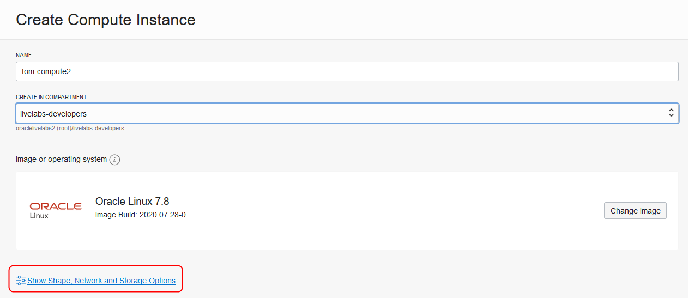

4. In the **Browse All Shapes** dialog:

      - **Instance Type**: Select Virtual Machine
      - **Shape Series**: Intel Lake
      - **Instance Shape**: Select VM.Standard2.1

      Click **Select Shape**.

      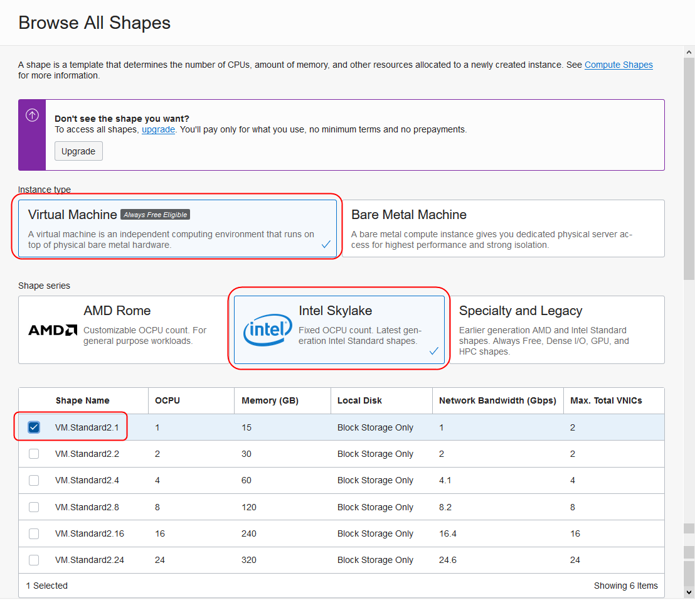

5. Under Configure Networking:

      - **Virtual cloud network compartment**: Select your compartment
      - **Virtual cloud network**: Choose the VCN you created in Step 1
      - **Subnet Compartment:** Choose your compartment.
      - **Subnet:** Choose the Public Subnet under **Public Subnets**
      - **Use network security groups to control traffic** : Leave un-checked
      - **Assign a public IP address**: Check this option

      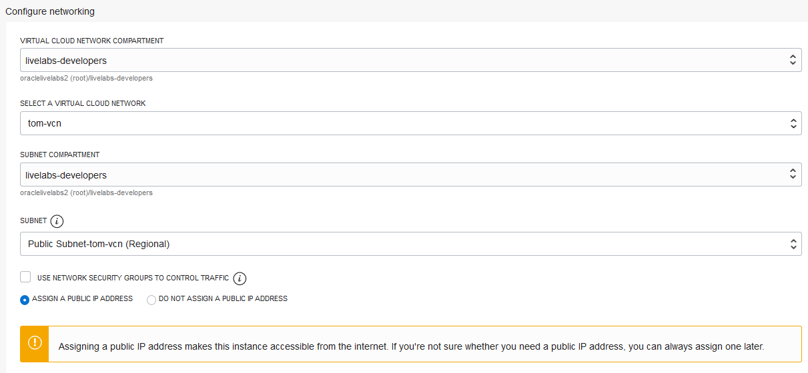

6. Boot Volume and Add SSH Keys     

      - **Boot Volume:** Leave the default, uncheck values
      - **Add SSH Keys:** Choose 'Paste SSH Keys' and paste the Public Key saved in Lab 1.

      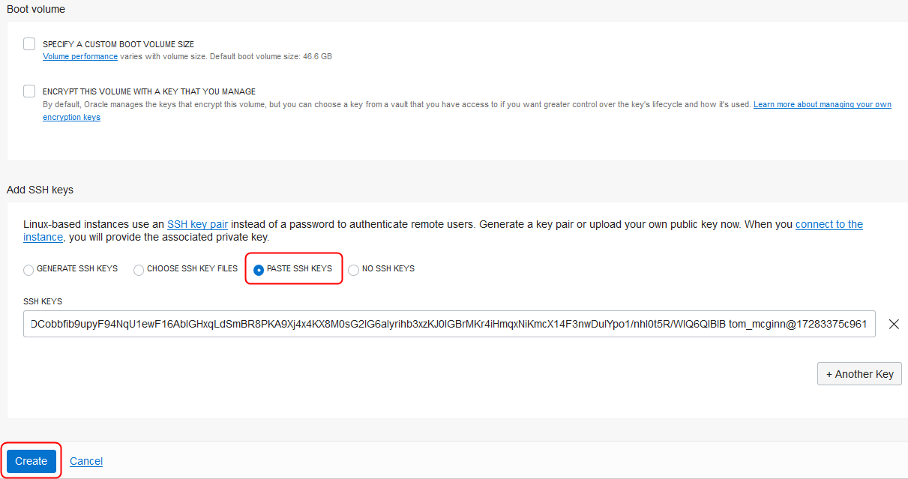

7. Click  **Show Advanced Options**.

    ***Under Management***

    - **Initialization Script**: Choose **Paste cloud-init script** and paste the below script. Cloud-init script will be executed at the first boot only to configure the instance.

    ```
    <copy>
    #cloud-config
    packages:
    - httpd
    - stress

    runcmd:
    - [sh, -c, echo "<html>Web Server IP `hostname --ip-address`</html>" > /var/www/html/index.html]
    - [firewall-offline-cmd, --add-port=80/tcp]
    - [systemctl, start, httpd]
    - [systemctl, restart, firewalld]
    </copy>
    ```

    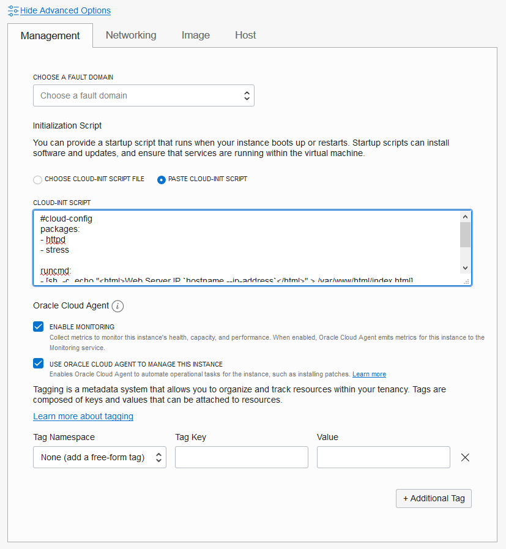

8.  Click **Create**.

    *NOTE: If 'Service limit' error is displayed, choose a different shape, such as VM.Standard.E2.2 OR VM.Standard2.2 OR choose a different AD.*

9.  Wait for Instance to be in **Running** state. You can scroll down to *Work Requests* to check the process of provisioning.

10.  Click Instance name. Click **More Actions**, then select **Create Instance Configuration**.  
Fill out the dialog box:

    

    **CREATE IN COMPARTMENT**: Choose your compartment

    **INSTANCE CONFIGURATION NAME** : Provide a name

11.  Click **Create Instance Configuration**.

12.  In the Instance Configuration page, Click **Create Instance Pool**.

    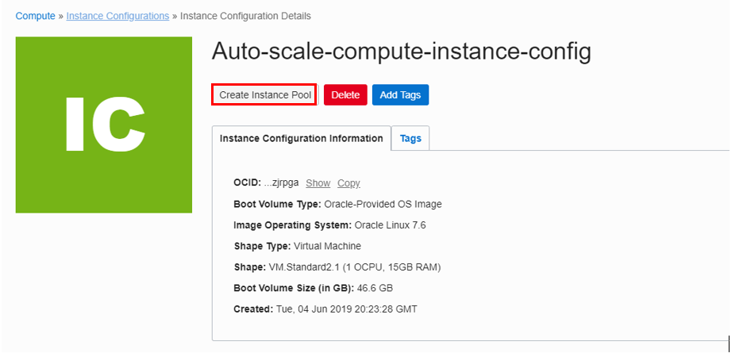

13.   A new dialog box will appear. This is used to create initial configuration of the instance pool, such as how many compute instance to create initially, VCN, and Availability domain the instance pool should be created in. Fill out the dialog box:

    - **CREATE IN COMPARTMENT**: Choose your compartment
    - **INSTANCE POOL NAME**: Provide a suitable name
    - **NUMBER OF INSTANCES**: 0

    (This is the number of computes that should be launched when the pool is created. We will start with no compute)

    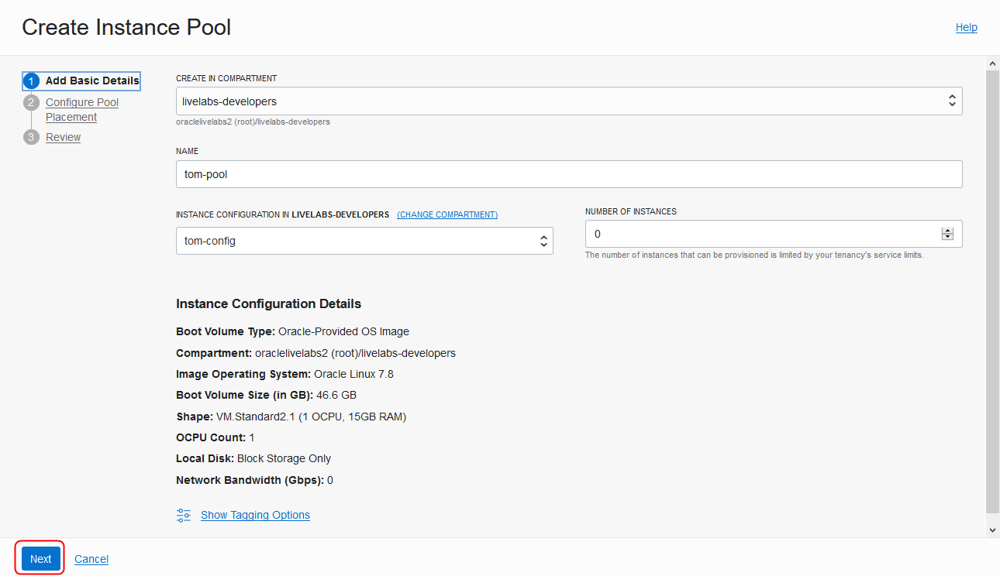

    Click **Next**.

14. On the **Configure Pool Placement** page:

    - **AVAILABILITY DOMAIN**: Choose the AD where you want to place instances (you can choose the **AD 1** if in Multi AD region)
    - **VIRTUAL CLOUD NETWORK COMPARTMENT**: Choose VCN's compartment
    - **VIRTUAL CLOUD NETWORK**: Choose your VCN
    - **SUBNET COMPARTMENT**: Choose your compartment
    - **SUBNET**: Choose the Public Subnet  
    - **ATTACH A LOAD BALANCER**: Select this option.
    - **LOAD BALANCER COMPARTMENT**: Choose your compartment
    - **LOAD BALANCER**: Choose the Load Balancer created earlier
    - **BACKEND SET**: Choose the first backend set
    - **PORT**: 80
    - **VNIC**: Leave the default

    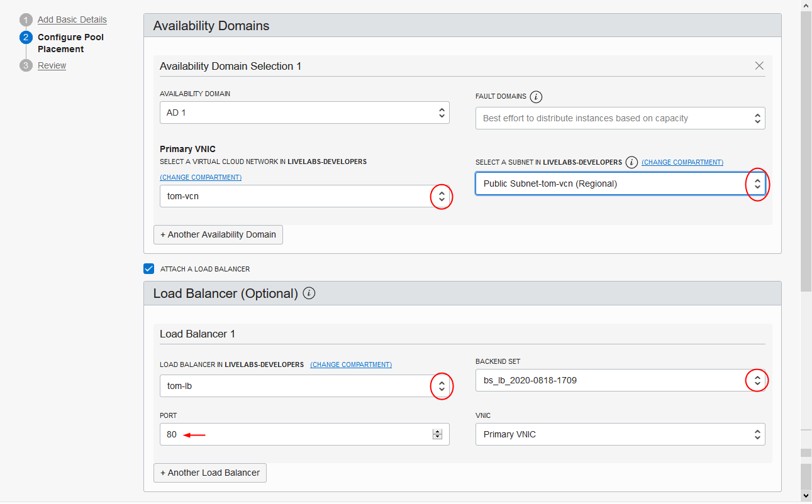

15. Click **Next** and then **Create**. Wait for Instance Pool to be in **RUNNING** state (turns green).

16. From the Instance Pool Details page, click **More Actions** and choose **Create Autoscaling Configuration**.
    

17. On the **Add Basic Details** page:

    - **COMPARTMENT**: Choose your compartment
    - **AUTOSCALING CONFIGURATION NAME** : Provide a name
    - **INSTANCE POOL** : This should show your instance pool name created earlier

    *Note: If the instance pool name is blank, try refreshing the browser and trying again.*

    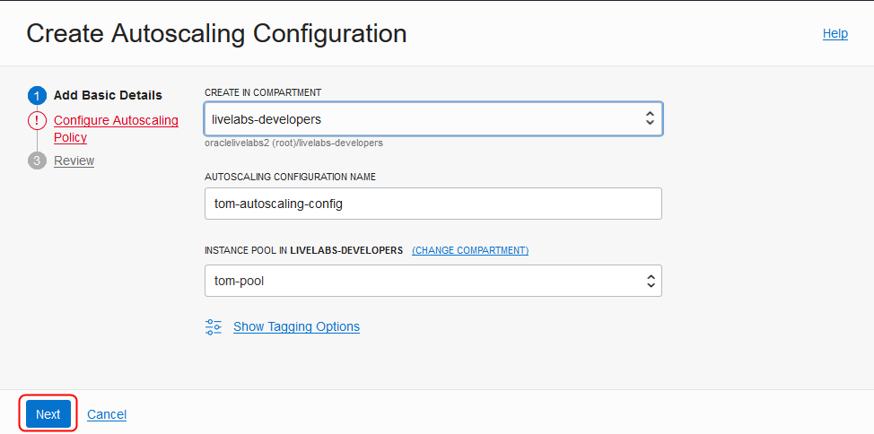

    Click **Next**.

18. On the **Configure Autoscaling Policy** page:

    - Make sure that **Metric-based Autoscaling** is selected.
    - **AUTOSCALING POLICY NAME** : Provide a name
    - **COOLDOWN IN SECONDS** : 300 (This is he minimum period of time between scaling actions.)
    - **PERFORMANCE METRIC** : CPU utilization (This is the Metric to use for triggering scaling actions.)
    - **SCALE-OUT OPERATOR** : Greater than (>)
    - **THRESHOLD PERCENTAGE** : 10
    - **NUMBER OF INSTANCES TO ADD** : 1
    - **SCALE-IN OPERATOR** : Less than (<)
    - **THRESHOLD PERCENTAGE** : 5
    - **NUMBER OF INSTANCES TO REMOVE**  : 1
    - **MINIMUM NUMBER OF INSTANCES** : 1 (this is the minimum number of instances that the pool will always have)
    - **MAXIMUM NUMBER OF INSTANCES** : 2 (this is the maximum number of instances that the pool will always have)
    - **INITIAL NUMBER OF INSTANCES** : 1 (this is how many instances will be created in the instance pool initially)

    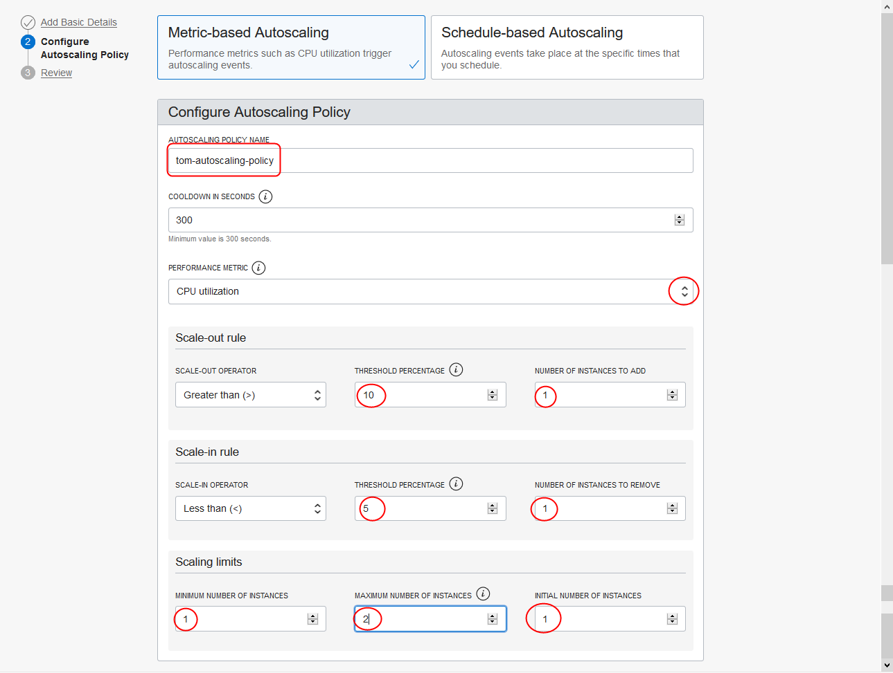

    Click **Next**.

19. Click **Create**.

    We have now created an autoscaling policy that will start with creating 1 compute instance in the designated pool. Once the CPU utilization is determined to be above 10% for at least 300 seconds, another compute instance will be launched automatically. Once the CPU utilization is determined to be less than 5% for 300 seconds, one compute instance will be removed. At all times, there will be at least 1 compute instance in the pool.

    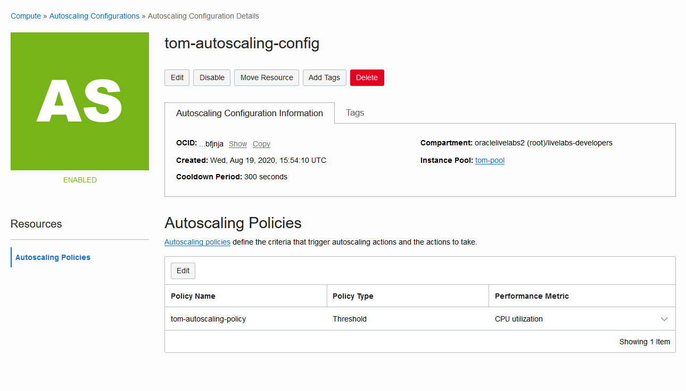

## Task 4: Test the setup

1. Wait until your Instance Pool change from *Scaling* to *Running* state. Under **Compute**, click **Instance Pools**, and then your pool name. Click **Created Instances**, you should see a compute instance created. Click the Compute Instance name.
    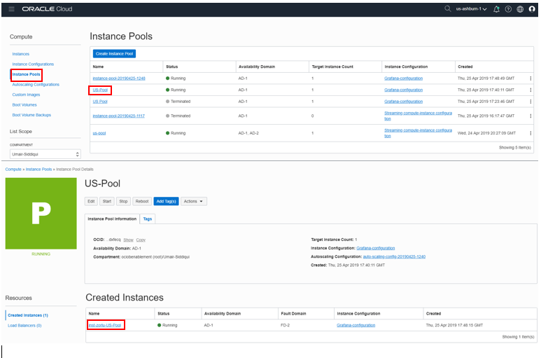

2. Note down the Public and Private IP of compute instance from the details page (Under **Primary VNIC Information** section).

3. Open a web browser and enter instance's public IP address. You should see the message: `Web Server IP: <instance private IP>`

4. In the Cloud shell, switch to the .ssh directory:

    ```
    <copy>cd ~/.ssh</copy>
    ```

6. Enter **ls** and find your private key:

    ```
    <copy>ls</copy>
    ```

    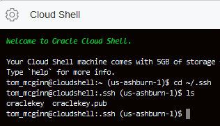

7. Enter command:
    ```
    <copy>
    ssh -i <private_key> opc@<PUBLIC_IP_OF_COMPUTE>
    </copy>
    ```

    **HINT:** If 'Permission denied error' is seen, ensure you are using '-i' in the ssh command

8. Enter 'Yes' when prompted for security message
    

9. Now start CPU stress, Enter command:

    ```
    <copy>
    sudo stress --cpu 4 --timeout 350
    </copy>
    ```

    *Spawn 4 workers spinning on sqrt() with a timeout of 350 seconds.*

10. Switch back to OCI console and navigate to Instance Pool Details page. Click your instance name and scroll down to **Metric** screen, you should see CPU spiking up after a minute or so.
    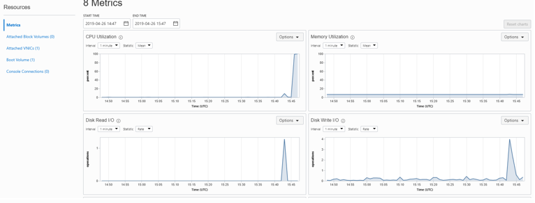

11. Navigate to your Instance Pool details page. In about 3-4 minutes (time configured when we created auto scale configuration), status of Pool should change to **Scaling** and a second compute instance should launch.
    

    *This is since our criteria of CPU utilization > 10 was met.*

12. When the second instance is up and running and the instance pool status is 'Running', switch to the web browser and refresh the page multiple times and observe the load balancer balancing traffic between the two web servers.

13. Switch back to git bash window and if the stress tool is still running, click Ctrl + C to stop the script.

14. Switch back to OCI console window and navigate to your compute instance details page. Verify CPU utilization goes down after a minute.

15. Navigate to Instance pool details page and after 3-4 minute Instance pool status will change to **Scaling** . Additional compute instance will be deleted.

    *This is because our criteria of CPU utilization < 5 is met.*

## Task 5: Delete the resources

1. Switch to  OCI console window.

2. If your Compute instance is not displayed, From OCI services menu Click **Instances** under **Compute**.

3. Locate first compute instance, Click Action icon and then **Terminate**.
    

4. Make sure Permanently delete the attached Boot Volume is checked, Click Terminate Instance. Wait for instance to fully Terminate.
    

5. In OCI console window from Instance Pool Details page, Click **Terminate** under **Action**. Provide Instance Pool name in the pop up dialog box and Click **Terminate**. This will delete the pool along with the compute instance and auto scale configuration.
    

6. Navigate to **Instance Configurations** Under **Compute**. For your Instance Configuration, Click **Delete** under the three Vertical dots.
    

7. Navigate to **AutoScaling Configurations** Under **Compute**. For your Instance Configuration, click **Delete**.

8. From OCI services menu Click **Load Balancers** under Networking, locate your Load Balancer and click **Terminate** under the three Vertical dots.

9. From OCI services menu Click **Virtual Cloud Networks** under Networking, Locate your VCN , click the Action icon and then **Terminate**. Click **Delete All** in the Confirmation window. Click **Close** once VCN is deleted.
    


## Acknowledgements
*Congratulations! You have successfully completed the lab.*

- **Author** - Flavio Pereira, Larry Beausoleil
- **Adapted by** -  Yaisah Granillo, Cloud Solution Engineer
- **Last Updated By/Date** - Tom McGinn, August 2020

