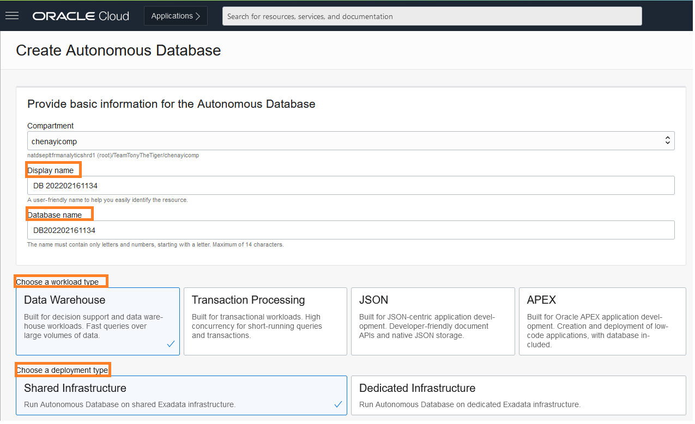
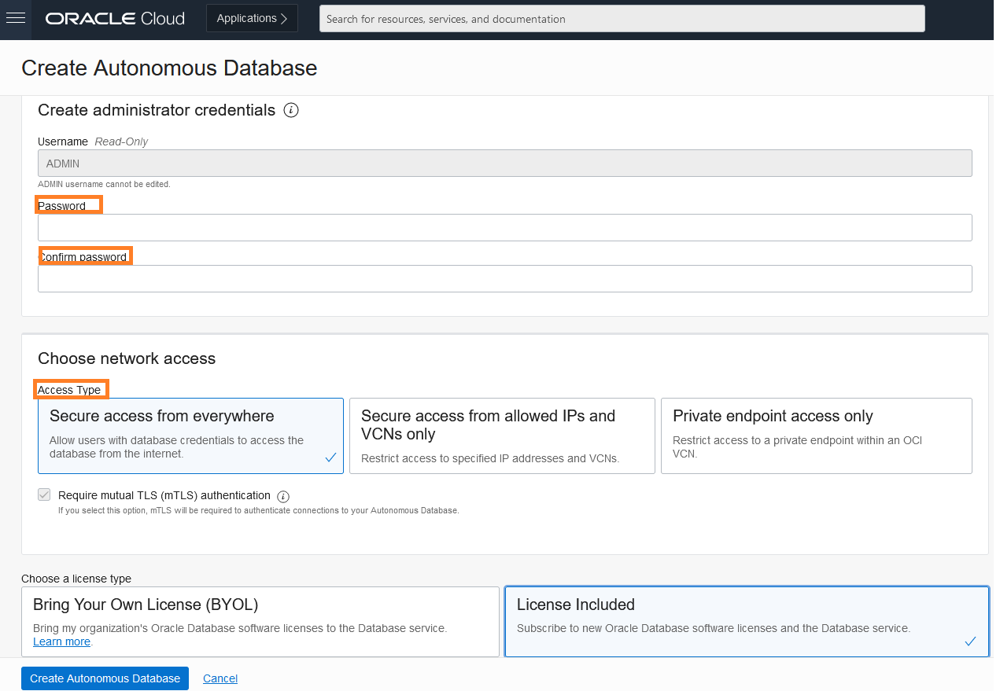
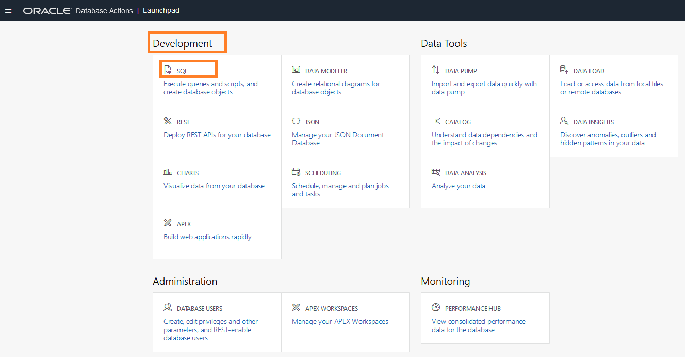

# Prepare Data Sources

## Introduction

This lab walks you through the steps to prepare the sample data that will be used to perform sentiment analysis, in this case a set of hotel reviews.We will also create the buckets and databases to save the processed data.

Estimated Time: 60 minutes

### Objectives

In this lab, you will:
* Create Object Storage Bucket
* Download and Upload Sample Data
* Prepare Target Database
* Create Tables to Store Output Data

### Prerequisites

This lab assumes you have:
* An Oracle account
* All previous labs successfully completed

## **Task 1**: Create Object Storage Bucket

In this task we'll create 2 buckets one for storing source file with reviews and the other for staging. The staging bucket is a 'location' that OCI Data Integration needs to dump intermediate files before publishing data to a data warehouse

1.	In the Oracle Cloud Infrastructure Console navigation menu, go to **Storage**, and then select **Buckets**.

   

2.	**Create a bucket** and name it “source-bucket”

3.	Click **create** accepting all defaults.

4.	Repeat steps **1** to **3** and name the bucket “data-staging”

   

## **Task 2**: Download and Upload Sample Data

For this exercise, we will assume that you have a set of customer reviews for a set of hotels.

1. 	Download this [Dataset](./files/hotel.csv) to your local machine. This file contents hotel reviews for a handful of hotels, and we will use that as our data-source. We will perform sentiment 		 analysis using Data Integration and AI Services.

2.	In the Oracle Cloud Infrastructure Console navigation menu, go to **Storage**, and then select **Buckets**.

3.	Select the 'source-bucket' you created on **Task 1**.

4.	On the bucket details page, under **Objects**, click **Upload**.

   

5.	In the Upload Objects panel, drag and drop the **data.csv** to the drop zone, or click **select files** to locate it on your machine.

6.	Click **Upload**, and then click **Close**.

## **Task 3**: Prepare Target Database

In this task we'll create and configure your target Autonomous Data Warehouse database to add a schema and a table.

1.	In the Oracle Cloud Infrastructure Console navigation menu, go to **Oracle Database**, and then select **Autonomous Data Warehouse**.

   

2.	Select your compartment and **Create Autonomous Database**.

3.	On the options, set a **Display Name** and **Database Name**

   

4.	Workload type: **Data warehouse**.

5.	Remember your password (**labDatabase01**)

6.	Access type **Secure access from allowed IPs and VCNs only**

7.	Click **Create Autonomous Database** (Wait for your dataset to provision which may take up to 15mins)

   

8.	On your database details page, click **Database Actions**.

   

9.	Under **Development**, click **SQL**.

   

11. Create a Contributor user. Autonomous Databases come with a predefined database role named **DWROLE**. This role provides the common privileges for a database developer or data scientist to perform real-time analytics. Depending on the usage requirements you may also need to grant individual privileges to users.

	Run the following script as shown in the image below:

	    <copy>CREATE USER USER1 IDENTIFIED BY "<enter user1 password here>";GRANT DWROLE TO USER1;ALTER USER USER1 QUOTA 200M ON DATA;</copy>

   

## **Task 4**: Create Tables to Store Output Data

Whilst we are in the Database Actions dashboard, we will create 2 Tables

1.	A table to store the extracted aspects and related entities
2.	A table to store the raw reviews
Follow the scripts below:

  **Create Raw Reviews Table**

			<copy>CREATE TABLE USER1.REVIEWS
			("RECORD_ID" INT,
			"HOTEL_ID" VARCHAR2(200 BYTE),
			"HOTEL_NAME" VARCHAR2(200 BYTE),
			"REVIEW_DATE" DATE,
			"REVIEW_RATING" INT,
			"REVIEW" VARCHAR2(2000 BYTE),
			"REVIEW_TITLE" VARCHAR2(200 BYTE)
			)SEGMENT CREATION IMMEDIATE
			PCTFREE 10 PCTUSED 40 INITRANS 1 MAXTRANS 255
			NOCOMPRESS LOGGING
			STORAGE(INITIAL 65536 NEXT 1048576 MINEXTENTS 1 MAXEXTENTS 2147483645
				PCTINCREASE 0 FREELISTS 1 FREELIST GROUPS 1
				BUFFER_POOL DEFAULT FLASH_CACHE DEFAULT CELL_FLASH_CACHE DEFAULT)
				TABLESPACE "LANGUAGE";</copy>

  **Create Sentiment Table**

		  <copy>CREATE TABLE USER1.SENTIMENT
	 	  ("RECORD_ID" INT,
		  "HOTEL_NAME" VARCHAR2(200 BYTE),
		  "ASPECT" VARCHAR2(200 BYTE),
		  "SENTIMENT" VARCHAR2(200 BYTE),
		  "OFFSET" INT,
		  "LENGTH" INT
		  ) SEGMENT CREATION IMMEDIATE
		  PCTFREE 10 PCTUSED 40 INITRANS 1 MAXTRANS 255
 		  NOCOMPRESS LOGGING
		  STORAGE(INITIAL 65536 NEXT 1048576 MINEXTENTS 1 MAXEXTENTS 2147483645
			  PCTINCREASE 0 FREELISTS 1 FREELIST GROUPS 1
			  BUFFER_POOL DEFAULT FLASH_CACHE DEFAULT CELL_FLASH_CACHE DEFAULT)
			  TABLESPACE "LANGUAGE";<copy>

This concludes this lab. You may now **proceed to the next lab**.

## Learn More

## Acknowledgements
* **Author** - Chenai Jarimani, Cloud Architect, Cloud Engineering, Luis Cabrera-Cordon, Senior Director, AI Services
* **Contributors** -  Paridhi Mathur, Cloud Engineering
* **Last Updated By/Date** - <Name, Month Year>
