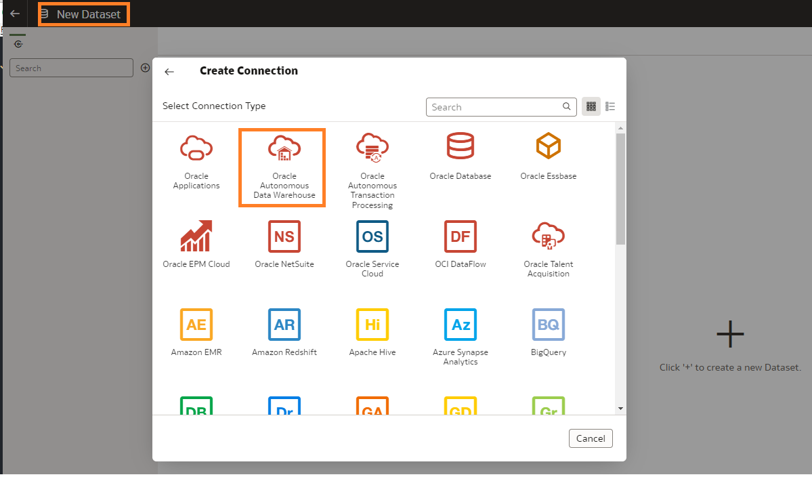
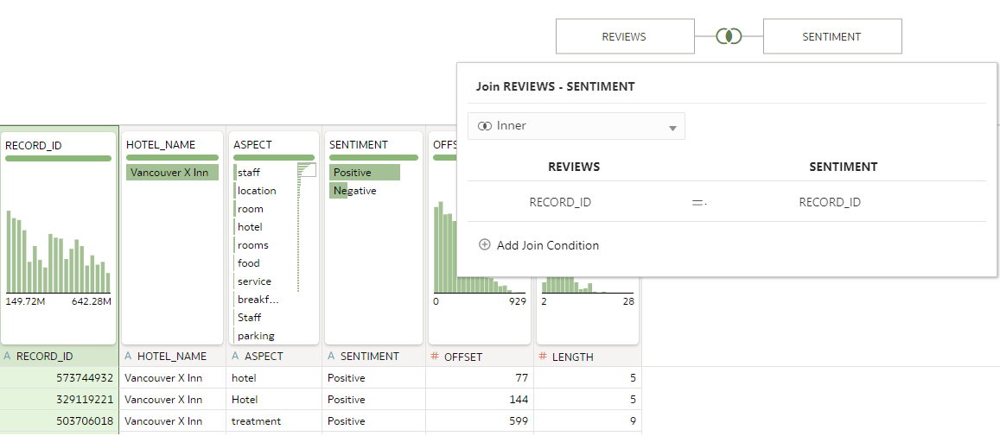

# Visualize the Data in OAC

## Introduction

This lab walks you through the steps to visualize and analyze the extracted data of the reviews using Oracle Analytics Cloud.

Estimated Time: 90 minutes

### Objectives

In this lab, you will:
* Create a Connection to Autonomous Data warehouse
* Create a new Dataset
* Create a Workbook/Project

### Prerequisites

This lab assumes you have:
* An Oracle account
* All previous labs successfully completed

## **Task 1**: Create a Connection to Autonomous Data warehouse

1.	Sign into Oracle Analytics Cloud.

2.	Click the **Create** icon.

3.	Select **Create Connection**, and select **Oracle Autonomous Data Warehouse**

  

4.	Enter the credentials to the data warehouse (target database) you created in **Lab 3**. If you need a reminder on how to get the wallet, See [Download a Wallet](https://docs.oracle.com/en-us/iaas/Content/Database/Tasks/adbconnecting.htm#access)

## **Task 2**: Create a new Dataset

1.	Navigate to **Homepage** > **Create** > **Dataset**

2.	Select the data warehouse you just created.

3.	Drag the 3 tables from the USER1 data base that you just populated into the canvas: REVIEWS, SENTIMENT and ENTITIES

4.	Drag them on top of each other. This will automatically create some JOINS.

5.	Modify the JOINS so that they join on **RECORD_ID**.
     You may get a warning that doing so will treat record-id as an attribute (instead of a numeric value) – that’s ok. That’s what we want.

  

6.	Save your dataset.

## **Task 3**: Create the Visualization

In this task we'll create workbook to visualize the insights from our sentiment data.

1.	1.	Click **Create > Workbook** . This will take you to a wizard that will ask you to select a dataset.

2.	Add the dataset you just created. Click **Add to Workbook**.

3.	Navigate to **Visualize** tab, and drag  a stacked bar visualization into the canvas.

4.	Navigate to the **Data** tab.

5.	Open the contextual menu (Right click) on the **My Calculations** table and select **Add Calculation**
    - For **Name** select COUNT OF SENTIMENT
    - For the **Function** enter COUNT(SENTIMENT)
    - Click **Validate** and **Save**

6.	Drag COUNT OF SENTIMENT into the Value (Y-Axis) of the visualization.

7.	For the Category X-Axis, select REVIEWS: REVIEW DATE: Quarter
     Right click on the REVIEW_DATE field in Category (X-Axis) and select Show by… Quarter.

8.	For the **Color**, select **Sentiment**.

9.	Right Click on the bars show, and click **Color > Manage Assignments**

10.	Set Negative to Orange, and Positive to Green.

11.	Follow the same pattern and customize your canvas to meet your needs. You can try different visualizations.
     - For our example below, we used a combination of a stacked graph with word cloud visualizations to visualize the aspects being mentioned.
     - By highlighting the quarters in 2018 the word cloud highlights the aspects/areas of interest by the reviewers.
     - You can see that what most customers liked was the Location and Rooms.
     - Customers did not enjoy Breakfast and neither did they like the Parking Policy
     - By clicking on each aspect say Parking you can drill to the next page for a more detailed view of the reviews about Parking in a Table. This is useful to further investigate what aspects of Parking policy needs attention to help management formulate strategies that'll improve this area of concern.
     - You can use also use Top N to filter the top reviews, statistics such as trendlines to view average review rating over a period of time.
     - Lastly if you're not sure where to get started with building visualizations OAC had a new feature **Auto Insights** that you can leverage.

This concludes this **workshop**

## Learn More

## Acknowledgements
* **Author** - Chenai Jarimani, Cloud Architect, Cloud Engineering, Luis Cabrera-Cordon, Senior Director, AI Services
* **Contributors** -  Paridhi Mathur, Cloud Engineering
* **Last Updated By/Date** - <Name, Month Year>
